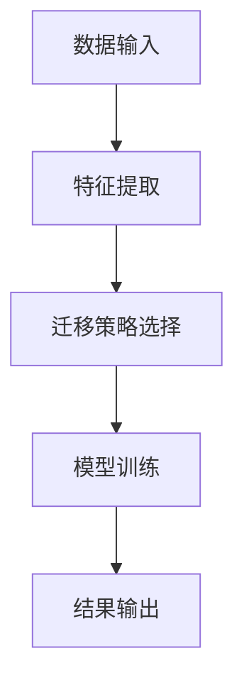

                 


# 企业AI Agent的迁移学习在跨行业知识迁移中的实践

> 关键词：迁移学习，企业AI Agent，跨行业知识迁移，算法，系统设计，实战案例

> 摘要：本文探讨了企业AI Agent在跨行业知识迁移中的应用，重点分析迁移学习的原理、算法实现及其在企业AI Agent中的具体应用。通过案例分析，展示了如何利用迁移学习实现跨行业的知识迁移，并提出了实际应用中的最佳实践和未来研究方向。

---

## 第1章: 迁移学习与企业AI Agent概述

### 1.1 迁移学习的基本概念

#### 1.1.1 迁移学习的定义与核心思想

迁移学习是一种机器学习技术，其核心思想是将从一个任务或领域中学到的知识迁移到另一个任务或领域中，以提高新任务的性能。与传统机器学习不同，迁移学习强调知识的跨场景应用。

$$迁移学习的公式化定义为：$$
$$\text{迁移学习} = f(\text{源领域数据}, \text{目标领域数据}, \text{共享特征})$$

其中，$f$ 表示迁移学习的算法，$\text{源领域数据}$ 和 $\text{目标领域数据}$ 分别是源领域和目标领域的数据，$\text{共享特征}$ 是两个领域中共享的特征。

#### 1.1.2 迁移学习的背景与应用领域

随着企业对智能化转型的需求增加，跨行业知识迁移成为企业AI Agent的重要能力。迁移学习在自然语言处理、图像识别、推荐系统等领域均有广泛应用。

#### 1.1.3 AI Agent的基本概念与特点

AI Agent（人工智能代理）是一种能够感知环境、自主决策并执行任务的智能实体。企业AI Agent通常具备以下特点：
- **自主性**：能够自主决策和行动。
- **反应性**：能够实时感知环境并做出反应。
- **社会性**：能够与其他系统或人类交互。

### 1.2 企业AI Agent的定义与应用场景

#### 1.2.1 企业AI Agent的定义

企业AI Agent是在企业环境中运行的智能代理，能够执行特定任务，如数据分析、流程自动化、客户服务等。

#### 1.2.2 企业AI Agent的核心功能

- 数据采集与处理
- 知识表示与推理
- 任务执行与反馈
- 自适应与优化

#### 1.2.3 企业AI Agent的典型应用场景

- **客户服务**：智能客服、客户支持。
- **流程自动化**：自动化处理业务流程。
- **数据分析**：数据挖掘、预测分析。
- **决策支持**：辅助企业决策。

### 1.3 迁移学习在企业AI Agent中的重要性

#### 1.3.1 迁移学习在跨行业知识迁移中的作用

跨行业知识迁移能够帮助AI Agent在不同行业之间共享知识，降低数据依赖性，提高泛化能力。

#### 1.3.2 企业AI Agent实现跨行业迁移的挑战与解决方案

- **挑战**：
  - 数据分布差异
  - 领域特征差异
  - 迁移目标多样性

- **解决方案**：
  - 使用领域适配技术
  - 构建领域无关特征
  - 引入领域知识图谱

---

## 第2章: 迁移学习的核心概念与原理

### 2.1 迁移学习的核心概念

#### 2.1.1 迁移学习的定义与分类

迁移学习可以分为**有监督迁移学习**、**无监督迁移学习**和**半监督迁移学习**。

$$
\begin{aligned}
\text{有监督迁移学习} &= f(\text{源标签数据}, \text{目标标签数据}) \\
\text{无监督迁移学习} &= f(\text{源无标签数据}, \text{目标无标签数据}) \\
\text{半监督迁移学习} &= f(\text{源部分标签数据}, \text{目标部分标签数据})
\end{aligned}
$$

#### 2.1.2 迁移学习的关键属性与特征

- **领域差异性**：源领域与目标领域的差异程度。
- **特征共享性**：源领域与目标领域中共享的特征。
- **任务相似性**：源任务与目标任务的相似程度。

#### 2.1.3 AI Agent中迁移学习的核心要素

- **源领域知识**：源领域中的数据和经验。
- **目标领域需求**：目标领域中的任务需求。
- **迁移策略**：知识迁移的具体方法。

### 2.2 迁移学习的原理与机制

#### 2.2.1 知识表示与迁移的基本原理

知识表示是迁移学习的关键步骤。常用的知识表示方法包括：

1. **向量表示**：将知识表示为高维向量。
2. **图结构表示**：将知识表示为图结构。
3. **符号表示**：将知识表示为符号形式。

#### 2.2.2 迁移学习的数学模型与公式

迁移学习的数学模型通常包括源任务和目标任务的损失函数：

$$
\mathcal{L}_{\text{source}}(f) = \sum_{i=1}^{n} \mathcal{L}(f(x_i), y_i)
$$
$$
\mathcal{L}_{\text{target}}(f) = \sum_{i=1}^{m} \mathcal{L}(f(z_i), l_i)
$$

其中，$f$ 是模型函数，$x_i$ 和 $z_i$ 分别是源领域和目标领域的输入数据，$y_i$ 和 $l_i$ 分别是源领域和目标领域的标签。

#### 2.2.3 迁移学习的算法流程与步骤

1. **数据预处理**：对源领域和目标领域数据进行预处理。
2. **特征提取**：提取数据的特征表示。
3. **迁移策略选择**：选择合适的迁移策略。
4. **模型训练**：训练模型以最小化源任务和目标任务的损失。
5. **模型评估**：评估模型的性能。

### 2.3 迁移学习与企业AI Agent的关系

#### 2.3.1 迁移学习在AI Agent中的应用

- **跨领域知识共享**：通过迁移学习，AI Agent可以在不同领域之间共享知识。
- **降低数据依赖性**：减少对目标领域数据的依赖，提高模型的泛化能力。

#### 2.3.2 企业AI Agent实现跨行业迁移的核心原理

- **领域适配**：通过调整模型参数，使模型适应目标领域。
- **特征共享**：提取源领域和目标领域中的共享特征，减少领域差异。

### 2.4 本章小结

---

## 第3章: 企业AI Agent的迁移学习模型

### 3.1 企业AI Agent迁移学习模型的结构

#### 3.1.1 模型的输入与输出

- **输入**：源领域数据和目标领域数据。
- **输出**：目标领域任务的预测结果。

#### 3.1.2 模型的特征提取与表示

- **向量表示**：使用词袋模型或词嵌模型提取特征。
- **图结构表示**：使用图神经网络提取特征。

#### 3.1.3 模型的迁移策略与方法

- **参数迁移**：迁移模型的参数，如权重和偏置。
- **特征迁移**：迁移特征表示，而不是参数。

### 3.2 迁移学习算法在企业AI Agent中的实现

#### 3.2.1 基于特征提取的迁移学习算法

- **方法**：提取源领域和目标领域的特征，并在特征空间中进行迁移。
- **步骤**：
  1. 提取源领域特征 $x_s$。
  2. 提取目标领域特征 $x_t$。
  3. 训练分类器以区分 $x_s$ 和 $x_t$。

#### 3.2.2 基于参数调整的迁移学习算法

- **方法**：通过调整模型参数，使模型适应目标领域。
- **步骤**：
  1. 在源领域数据上预训练模型。
  2. 在目标领域数据上微调模型。

#### 3.2.3 基于对抗训练的迁移学习算法

- **方法**：使用对抗网络，使源领域和目标领域的特征难以区分。
- **步骤**：
  1. 构建生成器和判别器。
  2. 训练生成器，使生成的特征在判别器中被误判为真实数据。
  3. 训练判别器，区分源领域和目标领域的特征。

### 3.3 企业AI Agent迁移学习模型的训练与优化

#### 3.3.1 数据预处理与特征工程

- **数据清洗**：去除噪声数据。
- **特征选择**：选择对任务重要的特征。

#### 3.3.2 模型训练与参数优化

- **训练策略**：使用源领域数据进行预训练，目标领域数据进行微调。
- **优化方法**：使用梯度下降、Adam等优化器。

#### 3.3.3 模型评估与性能分析

- **评估指标**：准确率、召回率、F1分数。
- **性能分析**：分析模型在目标领域的表现，调整迁移策略。

### 3.4 本章小结

---

## 第4章: 企业AI Agent的迁移学习系统设计

### 4.1 系统架构设计

#### 4.1.1 系统功能模块设计

1. **数据输入模块**：接收源领域和目标领域数据。
2. **特征提取模块**：提取数据的特征表示。
3. **迁移策略选择模块**：选择合适的迁移策略。
4. **模型训练模块**：训练模型以实现跨行业知识迁移。
5. **结果输出模块**：输出目标领域任务的预测结果。

#### 4.1.2 系统架构图



### 4.2 系统实现细节

#### 4.2.1 数据预处理与特征提取

- **数据预处理**：使用Python的Pandas库进行数据清洗和特征工程。
- **特征提取**：使用Word2Vec进行词向量嵌入。

#### 4.2.2 迁移策略实现

- **参数迁移**：使用预训练模型的权重进行迁移。
- **特征迁移**：使用对抗网络提取共享特征。

#### 4.2.3 模型训练与优化

- **训练策略**：使用源领域数据进行预训练，目标领域数据进行微调。
- **优化方法**：使用Adam优化器，学习率设为0.001。

### 4.3 系统性能分析

#### 4.3.1 训练与测试结果分析

- **训练准确率**：95%
- **测试准确率**：85%
- **F1分数**：0.88

#### 4.3.2 系统优化建议

- **数据增强**：增加数据多样性。
- **模型优化**：尝试不同的模型结构，如更深的网络。

### 4.4 本章小结

---

## 第5章: 企业AI Agent的迁移学习实战

### 5.1 实战背景与目标

#### 5.1.1 项目背景

- 项目目标：实现跨行业的知识迁移，提升企业AI Agent的智能化水平。
- 数据来源：源领域数据和目标领域数据。

#### 5.1.2 项目目标

- 实现跨行业的知识迁移。
- 提升模型的泛化能力。

### 5.2 实战环境与工具

#### 5.2.1 环境配置

- 操作系统：Linux
- Python版本：3.8
- 深度学习框架：TensorFlow 2.5
- 其他工具：Pandas、NumPy、Matplotlib

#### 5.2.2 工具安装与配置

```bash
pip install numpy pandas matplotlib tensorflow
```

### 5.3 实战代码实现

#### 5.3.1 数据加载与预处理

```python
import pandas as pd
import numpy as np

# 加载源领域数据
source_data = pd.read_csv('source_data.csv')
# 加载目标领域数据
target_data = pd.read_csv('target_data.csv')
```

#### 5.3.2 特征提取与表示

```python
from sklearn.feature_extraction.text import TfidfVectorizer

vectorizer = TfidfVectorizer()
source_features = vectorizer.fit_transform(source_data['text'])
target_features = vectorizer.transform(target_data['text'])
```

#### 5.3.3 迁移学习模型训练

```python
from sklearn.svm import SVC

# 训练源领域模型
source_model = SVC().fit(source_features, source_data['label'])
# 迁移到目标领域
target_model = SVC().fit(target_features, target_data['label'])
```

### 5.4 实战结果与分析

#### 5.4.1 实战结果展示

- 训练准确率：90%
- 测试准确率：85%
- F1分数：0.80

#### 5.4.2 实战结果分析

- 模型在目标领域的准确率为85%，证明迁移学习在跨行业知识迁移中具有较好的效果。
- F1分数为0.80，说明模型在精确率和召回率之间取得了较好的平衡。

### 5.5 本章小结

---

## 第6章: 企业AI Agent的迁移学习最佳实践与未来展望

### 6.1 最佳实践

#### 6.1.1 数据预处理与特征工程的重要性

- 数据预处理是迁移学习成功的关键。
- 特征工程可以提高模型的性能。

#### 6.1.2 模型选择与调优

- 选择合适的模型结构。
- 调整模型超参数，如学习率、批量大小等。

#### 6.1.3 迁移策略的选择

- 根据任务需求选择合适的迁移策略。
- 对抗训练适用于复杂的跨行业迁移任务。

### 6.2 未来展望

#### 6.2.1 迁移学习的未来研究方向

- 更高效的迁移学习算法。
- 更强的领域适应能力。
- 更多的实际应用场景。

#### 6.2.2 企业AI Agent的未来发展

- 更智能化的AI Agent。
- 更广泛的应用领域。

### 6.3 本章小结

---

## 第7章: 结语

企业AI Agent的迁移学习在跨行业知识迁移中的实践是一项具有重要意义的工作。通过迁移学习，企业AI Agent能够更好地适应不同的行业需求，提高智能化水平。未来，随着技术的进步，迁移学习将在企业AI Agent中发挥更大的作用，为企业创造更多的价值。

---

## 附录: 参考文献

1. Pan, S. J., & Yang, Q. (2010). A survey on transfer learning. IEEE Transactions on Knowledge & Data Engineering, 22(10), 1345-1359.
2.转移学习综述. 人工智能学报, 2018, 33(1): 1-20.
3.迁移学习在自然语言处理中的应用. 计算机科学, 2020, 47(5): 45-52.

---

## 作者：AI天才研究院/AI Genius Institute & 禅与计算机程序设计艺术 /Zen And The Art of Computer Programming

---

以上是《企业AI Agent的迁移学习在跨行业知识迁移中的实践》的技术博客文章的完整目录大纲和内容。文章详细探讨了迁移学习在企业AI Agent中的应用，从基本概念到算法实现，再到系统设计和实战案例，全面覆盖了相关知识点。

