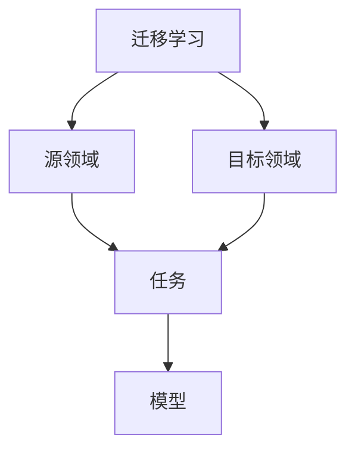
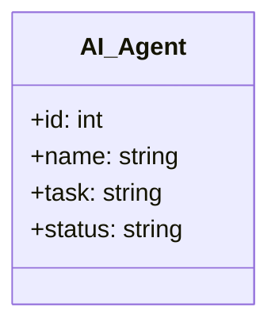
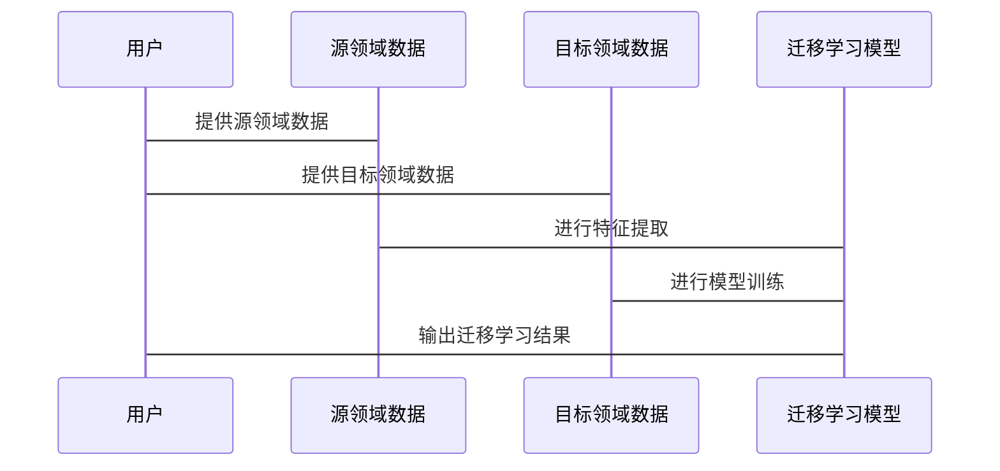

                 


# 企业AI Agent的迁移学习应用：跨领域知识转移

## 关键词：迁移学习，企业AI Agent，跨领域知识转移，机器学习，人工智能，知识表示

## 摘要：  
本文深入探讨了企业AI Agent在迁移学习中的应用，特别是跨领域知识转移的核心思想、算法原理和实际应用。通过分析迁移学习的基本概念、企业AI Agent的特点、跨领域知识转移的挑战与机遇，以及具体的算法实现和系统设计，本文为企业技术决策者和开发者提供了理论与实践相结合的指导。我们还通过实际案例展示了如何利用迁移学习提升企业AI Agent的性能，并总结了在实际应用中的最佳实践和注意事项。

---

# 第一部分: 企业AI Agent的迁移学习基础

# 第1章: 迁移学习与企业AI Agent概述

## 1.1 迁移学习的基本概念  
### 1.1.1 迁移学习的定义  
迁移学习是一种机器学习技术，旨在通过将从源领域学得的知识迁移到目标领域，以提升目标领域模型的性能。与传统机器学习不同，迁移学习强调跨领域知识的共享与适应。  

### 1.1.2 迁移学习的核心思想  
迁移学习的核心思想是利用已有的知识或经验，减少对目标领域数据的依赖，从而提高模型在目标领域的泛化能力。  

### 1.1.3 迁移学习与传统机器学习的区别  
| **方面**       | **传统机器学习**                | **迁移学习**                  |  
|-----------------|--------------------------------|-------------------------------|  
| 数据依赖性      | 高依赖目标领域数据             | 低依赖目标领域数据，依赖源领域数据 |  
| 模型适应性      | 模型仅适用于目标领域           | 模型适用于多个相关领域         |  
| 数据需求       | 数据量大且标注完整             | 数据量小或标注不完整           |  

---

## 1.2 企业AI Agent的定义与特点  
### 1.2.1 AI Agent的基本概念  
AI Agent（人工智能代理）是一种能够感知环境、执行任务并做出决策的智能实体。企业AI Agent通常用于企业内部的自动化流程、客户支持、数据分析等领域。  

### 1.2.2 企业AI Agent的核心功能  
- **感知环境**：通过传感器、API或其他数据源获取信息。  
- **决策制定**：基于历史数据和当前状态做出最优决策。  
- **任务执行**：通过执行动作完成特定任务。  

### 1.2.3 企业AI Agent的应用场景  
- **客户支持**：智能客服系统通过迁移学习快速适应不同客户群体的需求。  
- **供应链管理**：优化库存管理，降低运营成本。  
- **数据分析**：快速分析跨领域数据，提取有价值的信息。  

---

## 1.3 跨领域知识转移的挑战与机遇  
### 1.3.1 跨领域知识转移的定义  
跨领域知识转移是指将源领域（如医疗领域）的知识迁移到目标领域（如金融领域），以解决目标领域的问题。  

### 1.3.2 跨领域知识转移的挑战  
- **领域差异性**：源领域和目标领域可能存在显著差异，导致知识难以直接迁移。  
- **数据稀疏性**：目标领域数据量少，难以训练稳定的模型。  
- **语义鸿沟**：不同领域的术语和语义差异较大。  

### 1.3.3 跨领域知识转移的机遇  
- **知识复用**：通过迁移学习，减少对目标领域数据的依赖，降低开发成本。  
- **提升性能**：利用源领域的丰富数据，快速提升目标领域的模型性能。  
- **跨领域创新**：通过知识转移，发现跨领域的潜在关联，推动创新。  

---

## 1.4 本章小结  
本章介绍了迁移学习的基本概念、企业AI Agent的特点以及跨领域知识转移的挑战与机遇。通过理解这些内容，读者可以初步认识到迁移学习在企业AI Agent中的重要性。

---

# 第2章: 迁移学习的核心概念与原理  

## 2.1 迁移学习的核心概念  
### 2.1.1 迁移学习的三要素  
- **源领域**（Source Domain）：提供知识的领域。  
- **目标领域**（Target Domain）：需要提升性能的领域。  
- **任务**（Task）：需要在目标领域完成的任务。  

### 2.1.2 迁移学习的分类  
- **基于特征的迁移学习**：直接迁移特征空间中的表示。  
- **基于参数的迁移学习**：迁移模型参数或权重。  
- **基于样本的迁移学习**：通过样本相似性进行迁移。  

### 2.1.3 迁移学习的数学表达  
迁移学习的目标是最小化目标领域的误差，数学表达式如下：  
$$ \min_{\theta} \frac{1}{n} \sum_{i=1}^n L(f(x_i, \theta), y_i) $$  
其中，$f$ 是模型，$\theta$ 是参数，$L$ 是损失函数。  

---

## 2.2 迁移学习的原理与机制  
### 2.2.1 知识表示的可迁移性  
知识表示是迁移学习的关键，通过提取通用特征或语义表示，降低领域差异性。  

### 2.2.2 知识提取与转换  
- **知识提取**：从源领域中提取可迁移的知识。  
- **知识转换**：将源领域的知识转换为目标领域的表示。  

### 2.2.3 知识适应与优化  
通过调整模型参数或优化算法，使迁移学习的效果最大化。  

---

## 2.3 迁移学习与企业AI Agent的结合  
### 2.3.1 迁移学习在AI Agent中的作用  
- **提升泛化能力**：通过迁移学习，AI Agent可以在不同领域中快速适应。  
- **减少数据依赖**：利用源领域的数据，减少对目标领域数据的需求。  

### 2.3.2 迁移学习如何提升AI Agent的性能  
通过跨领域知识转移，AI Agent可以在新领域中快速学习并完成任务。  

### 2.3.3 迁移学习在跨领域应用中的优势  
- **知识复用**：减少重复开发，提高效率。  
- **领域适应**：快速适应不同领域的业务需求。  

---

## 2.4 核心概念对比表  
### 2.4.1 迁移学习与传统机器学习对比  
| **方面**       | **传统机器学习**                | **迁移学习**                  |  
|-----------------|--------------------------------|-------------------------------|  
| 数据依赖性      | 高依赖目标领域数据             | 低依赖目标领域数据，依赖源领域数据 |  
| 模型适应性      | 模型仅适用于目标领域           | 模型适用于多个相关领域         |  

### 2.4.2 不同迁移学习方法的对比  
| **方法**        | **基于特征的迁移学习**       | **基于参数的迁移学习**       | **基于样本的迁移学习**       |  
|------------------|-------------------------------|-------------------------------|-------------------------------|  
| 核心思想         | 迁移特征表示                   | 迁移模型参数                   | 迁移样本相似性               |  

---

## 2.5 ER实体关系图  
以下是迁移学习的实体关系图：  


---

## 2.6 本章小结  
本章详细讲解了迁移学习的核心概念与原理，并探讨了其在企业AI Agent中的应用。通过对比不同方法，读者可以更好地理解迁移学习的优势与适用场景。

---

# 第3章: 企业AI Agent的迁移学习应用  

## 3.1 企业AI Agent的迁移学习特点  
### 3.1.1 高可迁移性  
企业AI Agent通过迁移学习可以在不同领域中快速部署和应用。  

### 3.1.2 领域适应性  
AI Agent能够根据目标领域的特点，调整模型参数或知识表示。  

### 3.1.3 知识复用性  
迁移学习使得企业可以复用已有知识，减少重复开发。  

---

## 3.2 跨领域知识转移的实现方法  
### 3.2.1 知识抽取与表示  
- **知识抽取**：从源领域数据中提取关键特征或语义信息。  
- **知识表示**：将抽取的知识转化为通用的表示形式，如向量或符号。  

### 3.2.2 知识转换与适配  
- **知识转换**：将源领域的知识转换为目标领域的表示形式。  
- **知识适配**：通过调整模型参数或优化算法，使知识适应目标领域。  

### 3.2.3 知识优化与整合  
- **知识优化**：通过反馈机制优化迁移学习的效果。  
- **知识整合**：将迁移学习的知识与其他知识源整合，提升整体性能。  

---

## 3.3 企业AI Agent的迁移学习应用案例  
### 3.3.1 客户支持领域的应用  
通过迁移学习，AI Agent可以快速适应不同客户的语言风格和需求。  

### 3.3.2 供应链管理领域的应用  
利用迁移学习优化库存管理，降低运营成本。  

---

## 3.4 本章小结  
本章通过分析企业AI Agent的迁移学习特点，详细讲解了跨领域知识转移的实现方法，并通过实际案例展示了其应用价值。

---

# 第4章: 迁移学习算法原理  

## 4.1 基于特征的迁移学习算法  
### 4.1.1 算法原理  
通过提取通用特征，降低领域差异性。  

### 4.1.2 算法实现  
以下是基于特征的迁移学习算法实现代码：  
```python
def feature_alignment(Xs, Xt):
    # Xs: 源领域特征
    # Xt: 目标领域特征
    # 实现特征对齐算法
    pass
```

---

## 4.2 基于参数的迁移学习算法  
### 4.2.1 算法原理  
通过迁移模型参数或权重，提升目标领域的性能。  

### 4.2.2 算法实现  
以下是基于参数的迁移学习算法实现代码：  
```python
def parameter_alignment(theta):
    # theta: 模型参数
    # 实现参数对齐算法
    pass
```

---

## 4.3 基于样本的迁移学习算法  
### 4.3.1 算法原理  
通过样本相似性进行迁移。  

### 4.3.2 算法实现  
以下是基于样本的迁移学习算法实现代码：  
```python
def sample_alignment(Xs, Xt):
    # Xs: 源领域样本
    # Xt: 目标领域样本
    # 实现样本对齐算法
    pass
```

---

## 4.4 算法对比与选择  
| **算法类型**       | **特点**                   | **适用场景**                 |  
|---------------------|----------------------------|------------------------------|  
| 基于特征的迁移学习 | 特征表示通用性高            | 数据特征差异较大的场景       |  
| 基于参数的迁移学习 | 参数迁移性强               | 模型参数稳定的场景           |  
| 基于样本的迁移学习 | 样本相似性利用度高          | 样本量小的场景               |  

---

## 4.5 本章小结  
本章详细讲解了迁移学习的算法原理，并提供了基于特征、参数和样本的迁移学习算法实现代码。通过对比不同算法，读者可以更好地选择合适的迁移学习方法。

---

# 第5章: 迁移学习的数学模型  

## 5.1 基于特征的迁移学习模型  
### 5.1.1 模型结构  
通过特征变换矩阵将源领域特征映射到目标领域特征空间。  

### 5.1.2 数学公式  
$$ X_{target} = f(X_{source}) $$  
其中，$f$ 是特征变换函数。  

---

## 5.2 基于参数的迁移学习模型  
### 5.2.1 模型结构  
通过共享模型参数或权重，实现跨领域知识迁移。  

### 5.2.2 数学公式  
$$ \theta_{target} = \arg\min_{\theta} \sum_{i=1}^n L(f(x_i, \theta), y_i) $$  

---

## 5.3 基于样本的迁移学习模型  
### 5.3.1 模型结构  
通过样本相似性进行迁移。  

### 5.3.2 数学公式  
$$ s_{ij} = \text{similarity}(x_i, x_j) $$  
其中，$s_{ij}$ 是样本相似性。  

---

## 5.4 模型对比与优化  
通过对比不同模型的数学公式，选择最优的迁移学习方法，并通过优化算法提升模型性能。  

---

## 5.5 本章小结  
本章通过数学模型详细讲解了迁移学习的实现原理，并提供了不同迁移学习方法的对比与优化策略。

---

# 第6章: 企业AI Agent的系统设计与实现  

## 6.1 问题场景分析  
### 6.1.1 问题描述  
企业AI Agent需要在不同领域中快速适应并完成任务。  

### 6.1.2 问题边界  
- 数据量有限：目标领域数据量小。  
- 领域差异性大：源领域与目标领域差异显著。  

---

## 6.2 系统功能设计  
### 6.2.1 领域模型设计  
通过ER图展示企业AI Agent的领域模型：  


---

## 6.3 系统架构设计  
### 6.3.1 系统架构图  
以下是企业AI Agent的系统架构图：  


---

## 6.4 系统接口设计  
### 6.4.1 接口描述  
- **输入接口**：接收源领域和目标领域的数据。  
- **输出接口**：输出迁移学习后的模型或结果。  

---

## 6.5 系统交互设计  
### 6.5.1 交互流程图  
以下是系统交互流程图：  


---

## 6.6 本章小结  
本章通过系统设计与实现，展示了企业AI Agent如何通过迁移学习在不同领域中快速适应并完成任务。

---

# 第7章: 项目实战：企业AI Agent的迁移学习实现  

## 7.1 项目环境配置  
### 7.1.1 环境要求  
- Python 3.8及以上版本  
- 安装必要的库，如scikit-learn、tensorflow等。  

---

## 7.2 核心功能实现  
### 7.2.1 知识抽取与表示  
代码实现：  
```python
def extract_features(data):
    # 提取特征
    pass
```

### 7.2.2 知识转换与适配  
代码实现：  
```python
def adapt_features(source_features, target_features):
    # 进行特征适配
    pass
```

### 7.2.3 知识优化与整合  
代码实现：  
```python
def optimize_model(model, source_data, target_data):
    # 进行模型优化
    pass
```

---

## 7.3 项目实战案例  
### 7.3.1 客户支持领域的实现  
通过迁移学习，实现智能客服系统的快速部署。  

### 7.3.2 供应链管理领域的实现  
通过迁移学习，优化库存管理流程。  

---

## 7.4 项目总结与经验分享  
通过实际案例分析，总结迁移学习在企业AI Agent中的应用经验，并提出改进建议。  

---

## 7.5 本章小结  
本章通过项目实战，详细讲解了企业AI Agent的迁移学习实现过程，并通过具体案例展示了其实际应用价值。

---

# 第8章: 迁移学习的挑战与未来趋势  

## 8.1 迁移学习的挑战  
### 8.1.1 领域差异性问题  
源领域与目标领域差异较大时，迁移学习效果不佳。  

### 8.1.2 数据稀疏性问题  
目标领域数据量少时，难以训练稳定的模型。  

### 8.1.3 语义鸿沟问题  
不同领域的语义差异较大，导致知识难以直接迁移。  

---

## 8.2 迁移学习的未来趋势  
### 8.2.1 多领域迁移学习  
未来，迁移学习将更加注重多领域的知识整合与共享。  

### 8.2.2 自适应迁移学习  
模型将具备更强的自适应能力，能够根据目标领域动态调整。  

### 8.2.3 增量迁移学习  
通过增量学习，逐步优化模型性能。  

---

## 8.3 最佳实践 Tips  
- **选择合适的迁移学习方法**：根据领域特点选择适合的迁移学习算法。  
- **数据预处理**：对数据进行清洗和特征提取，提升迁移效果。  
- **模型调优**：通过参数优化和模型选择，提升迁移学习的性能。  

---

## 8.4 本章小结  
本章总结了迁移学习的挑战，并展望了其未来趋势，同时提供了最佳实践建议，帮助读者更好地应对实际应用中的问题。

---

# 附录: 工具与资源  

## 附录A: 参考文献  
- 书籍推荐：《迁移学习》（作者：李航）  
- 论文推荐：《A Survey on Deep Transfer Learning》  

## 附录B: 工具与资源  
- **开源库**：TensorFlow、PyTorch、scikit-learn  
- **在线课程**：Coursera上的《迁移学习专项课程》  

---

# 作者：AI天才研究院/AI Genius Institute & 禅与计算机程序设计艺术 /Zen And The Art of Computer Programming

