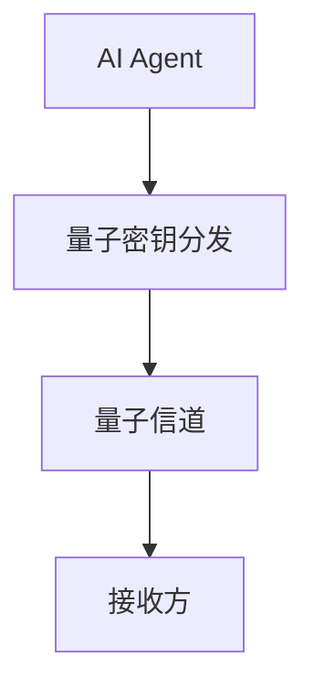
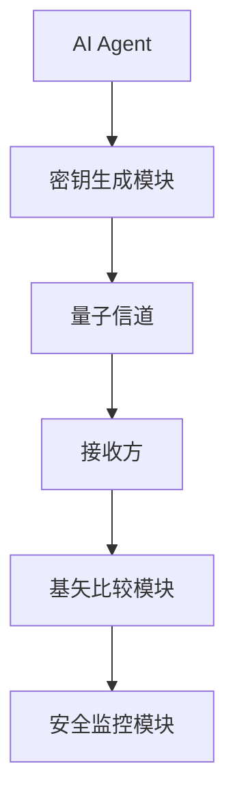

                 


# 企业AI Agent的量子加密通信策略

---

## 关键词

- 量子加密通信
- AI Agent
- 企业安全
- 通信策略
- 算法实现
- 系统架构

---

## 摘要

随着企业对安全通信需求的不断增长，量子加密通信技术因其不可破解的安全性成为焦点。与此同时，AI Agent（人工智能代理）通过智能化决策和执行能力，为企业提供了更高效的解决方案。本文深入探讨如何将量子加密通信与AI Agent结合，为企业构建安全、高效的通信策略。文章从量子加密通信的核心原理、AI Agent的算法实现，到两者结合的系统架构设计，为企业提供了一套完整的解决方案，并通过实际案例分析验证了该策略的有效性。

---

## 目录

1. [量子加密通信与AI Agent的背景](#量子加密通信与ai-agent的背景)
   - 1.1 量子加密通信的背景
   - 1.2 AI Agent的概念与特点
   - 1.3 量子加密与AI Agent的结合

2. [量子加密通信的核心原理](#量子加密通信的核心原理)
   - 2.1 量子密钥分发（QKD）原理
   - 2.2 量子加密算法的实现

3. [AI Agent的算法原理](#ai-agent的算法原理)
   - 3.1 AI Agent的核心算法
   - 3.2 AI Agent的算法实现

4. [量子加密通信与AI Agent的结合策略](#量子加密通信与ai-agent的结合策略)
   - 4.1 结合策略的设计思路
   - 4.2 结合策略的实现方案

5. [系统分析与架构设计](#系统分析与架构设计)
   - 5.1 系统分析
   - 5.2 系统架构设计

6. [项目实战](#项目实战)
   - 6.1 环境安装
   - 6.2 核心代码实现
   - 6.3 代码解读与实际案例分析

7. [最佳实践与小结](#最佳实践与小结)
   - 7.1 最佳实践
   - 7.2 小结

---

## 1. 量子加密通信与AI Agent的背景

### 1.1 量子加密通信的背景

量子加密通信是一种基于量子力学原理的通信技术，其核心是量子密钥分发（QKD）。与传统加密技术不同，QKD利用量子叠加和纠缠的特性，确保密钥的传输过程无法被窃听或篡改。这种技术的不可破解性使其成为企业安全通信的理想选择。

#### 1.1.1 传统加密技术的局限性

传统加密技术（如RSA、AES）虽然在一定程度上保障了通信安全，但随着计算能力的提升，尤其是量子计算机的出现，传统加密算法的安全性面临严重威胁。例如，RSA算法的密钥长度需要不断增加，才能抵御量子计算机的破解攻击。

#### 1.1.2 量子加密技术的核心优势

- **不可破解性**：QKD基于量子力学的特性，确保密钥传输过程中无法被窃听。
- **抗量子计算攻击**：QKD的密钥生成过程不依赖于数学难题，因此不受量子计算机威胁。
- **高效性**：QKD可以在长距离内实现安全通信，且通信效率较高。

#### 1.1.3 量子加密在企业通信中的应用前景

随着企业对数据安全需求的增加，QKD技术在金融、医疗、能源等行业的应用前景广阔。例如，金融机构可以通过QKD技术保护客户交易数据的安全性。

---

### 1.2 AI Agent的概念与特点

AI Agent（人工智能代理）是一种能够感知环境、自主决策并执行任务的智能体。它通过机器学习、自然语言处理等技术，为企业提供智能化的解决方案。

#### 1.2.1 AI Agent的定义与分类

- **定义**：AI Agent是能够根据输入信息，自主决策并执行任务的智能系统。
- **分类**：根据应用场景的不同，AI Agent可以分为服务型AI Agent（如智能客服）、决策型AI Agent（如智能投顾）和执行型AI Agent（如自动化操作机器人）。

#### 1.2.2 AI Agent的核心功能与优势

- **核心功能**：
  - 数据采集与分析
  - 智能决策
  - 自动化执行
  - 学习与优化
- **优势**：
  - 提高效率
  - 减少人工干预
  - 实现智能化管理

#### 1.2.3 AI Agent在企业中的应用场景

- **客户支持**：通过智能客服系统，快速响应客户需求。
- **风险管理**：通过实时数据分析，识别潜在风险。
- **自动化操作**：通过自动化机器人，执行重复性任务。

---

### 1.3 量子加密与AI Agent的结合

#### 1.3.1 问题背景与需求分析

在企业通信中，数据安全是核心需求。然而，传统的加密技术无法满足抗量子计算攻击的要求。AI Agent可以利用其智能化能力，优化量子加密通信的部署和管理。

#### 1.3.2 结合量子加密的AI Agent的优势

- **智能化密钥管理**：AI Agent可以自动管理量子密钥的生成、分发和更新。
- **动态安全防护**：AI Agent可以通过实时数据分析，识别潜在的安全威胁。
- **高效通信管理**：AI Agent可以优化通信流程，提高通信效率。

#### 1.3.3 量子加密通信在AI Agent中的应用策略

- **密钥分发**：通过AI Agent实现量子密钥的自动分发。
- **安全监控**：通过AI Agent实时监控通信过程中的异常行为。
- **优化策略**：通过AI Agent优化量子加密通信的性能。

---

## 2. 量子加密通信的核心原理

### 2.1 量子密钥分发（QKD）原理

QKD是一种基于量子力学原理的密钥分发技术，其核心是利用量子叠加和纠缠的特性，确保密钥的安全传输。

#### 2.1.1 QKD的基本概念

- **量子态**：QKD利用量子态的叠加性和纠缠性，确保密钥的不可窃听性。
- **基矢选择**：发送方和接收方通过随机选择测量基矢，确保密钥的安全性。

#### 2.1.2 QKD的实现步骤

1. **密钥生成**：发送方生成随机量子态，并通过量子信道发送给接收方。
2. **基矢比较**：双方比较测量基矢，保留相同的基矢结果。
3. **密钥提取**：根据相同的基矢结果，提取密钥。

#### 2.1.3 QKD的安全性分析

- **安全性**：QKD基于量子力学的特性，确保密钥传输过程中无法被窃听。
- **抗干扰性**：QKD可以通过纠错和隐私放大技术，进一步提高安全性。

---

### 2.2 量子加密算法的实现

#### 2.2.1 量子加密算法的数学模型

量子加密算法的数学模型可以通过以下公式表示：

$$
\text{加密过程} = \{ q_i \} \rightarrow \{ c_j \}
$$

其中，$\{ q_i \}$ 表示量子态，$\{ c_j \}$ 表示加密后的量子态。

#### 2.2.2 量子加密算法的实现步骤

1. **量子态生成**：生成随机的量子态。
2. **量子态传输**：通过量子信道传输量子态。
3. **量子态测量**：接收方测量量子态，提取密钥。

#### 2.2.3 量子加密算法的优缺点对比

| 特性         | 传统加密技术 | 量子加密技术 |
|--------------|---------------|---------------|
| 安全性       | 易受量子攻击  | 不可被破解     |
| 通信效率     | 较低           | 较高           |
| 实现复杂度   | 较低           | 较高           |

---

## 3. AI Agent的算法原理

### 3.1 AI Agent的核心算法

#### 3.1.1 机器学习算法在AI Agent中的应用

- **监督学习**：用于分类任务，如客户行为分析。
- **无监督学习**：用于聚类任务，如异常检测。
- **强化学习**：用于决策任务，如资源分配。

#### 3.1.2 自然语言处理技术在AI Agent中的应用

- **文本分类**：用于客户意图识别。
- **实体识别**：用于信息提取。
- **情感分析**：用于客户满意度分析。

#### 3.1.3 决策树算法在AI Agent中的应用

- **决策树构建**：用于分类任务。
- **决策树优化**：通过剪枝技术提高准确率。

---

### 3.2 AI Agent的算法实现

#### 3.2.1 算法实现步骤

1. **数据采集**：获取客户行为数据。
2. **数据预处理**：清洗和归一化数据。
3. **模型训练**：使用机器学习算法训练模型。
4. **模型部署**：将模型部署到生产环境。
5. **模型优化**：通过反馈优化模型。

#### 3.2.2 算法实现的代码示例

```python
import numpy as np
from sklearn.tree import DecisionTreeClassifier

# 数据采集
data = np.array([[1, 2], [3, 4], [5, 6], [7, 8]])
target = np.array([0, 1, 0, 1])

# 数据预处理
data_normalized = (data - data.mean()) / data.std()

# 模型训练
model = DecisionTreeClassifier()
model.fit(data_normalized, target)

# 模型预测
new_data = np.array([[2, 3]])
normalized_new_data = (new_data - data.mean()) / data.std()
prediction = model.predict(normalized_new_data)
print("预测结果:", prediction)
```

---

## 4. 量子加密通信与AI Agent的结合策略

### 4.1 结合策略的设计思路

#### 4.1.1 问题背景与需求分析

企业需要一种高效、安全的通信解决方案，能够抵御量子计算攻击。

#### 4.1.2 结合策略的关键技术点

- **量子密钥分发**：利用QKD技术实现安全的密钥传输。
- **AI Agent决策**：通过AI Agent优化通信过程中的决策。

#### 4.1.3 结合策略的实现步骤

1. **密钥生成**：AI Agent生成随机量子态，通过量子信道传输给接收方。
2. **基矢比较**：双方比较测量基矢，提取密钥。
3. **安全监控**：AI Agent实时监控通信过程，识别异常行为。

---

### 4.2 结合策略的实现方案

#### 4.2.1 系统架构设计



---

## 5. 系统分析与架构设计

### 5.1 系统分析

系统需要实现量子密钥分发和AI Agent的结合，确保通信过程的安全性和高效性。

#### 5.1.1 系统功能模块设计

| 模块名称 | 功能描述 |
|----------|----------|
| 密钥生成模块 | 生成随机量子态 |
| 传输模块 | 通过量子信道传输量子态 |
| 基矢比较模块 | 比较测量基矢 |
| 安全监控模块 | 监控通信过程中的异常行为 |

---

### 5.2 系统架构设计



---

## 6. 项目实战

### 6.1 环境安装

- **量子通信平台**：需要安装量子密钥分发设备。
- **AI Agent平台**：需要安装机器学习框架（如TensorFlow、Scikit-learn）。

---

### 6.2 核心代码实现

#### 6.2.1 量子密钥分发代码

```python
import random
import numpy as np

def generate_quantum_states(n):
    return [random.choice([0, 1]) for _ in range(n)]

def send_quantum_states(sender_states, receiver_bases):
    shared_key = []
    for i in range(len(sender_states)):
        if sender_states[i] == receiver_bases[i]:
            shared_key.append(sender_states[i])
    return shared_key

# 示例代码
sender_bases = [0, 1, 0, 1]
receiver_bases = [1, 0, 1, 0]
sender_states = generate_quantum_states(4)
shared_key = send_quantum_states(sender_states, receiver_bases)
print("共享密钥:", shared_key)
```

---

## 7. 最佳实践与小结

### 7.1 最佳实践

- **定期更新密钥**：确保密钥的有效期，防止被破解。
- **优化算法**：通过反馈优化AI Agent的算法，提高效率。
- **加强安全监控**：实时监控通信过程中的异常行为，确保安全性。

### 7.2 小结

本文深入探讨了企业AI Agent与量子加密通信的结合策略，从理论到实践，为企业提供了一套完整的解决方案。通过结合QKD技术和AI Agent的智能化能力，企业可以实现高效、安全的通信。

---

## 作者

作者：AI天才研究院 & 禅与计算机程序设计艺术

