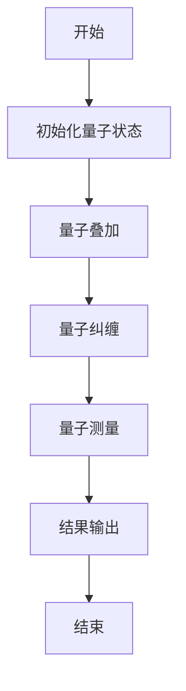
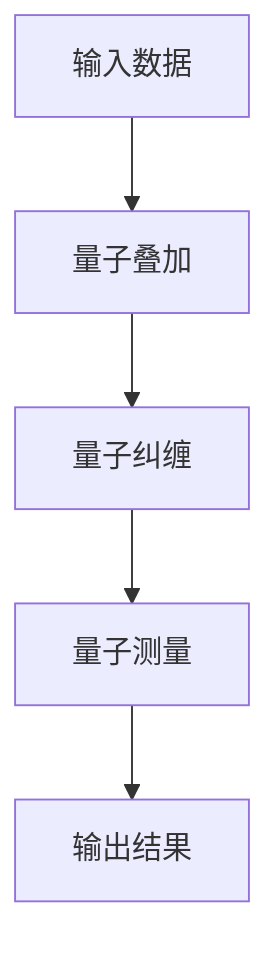
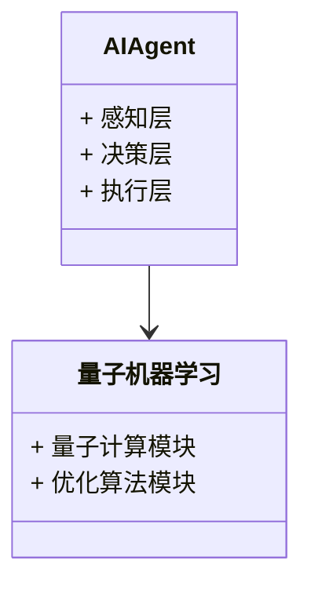
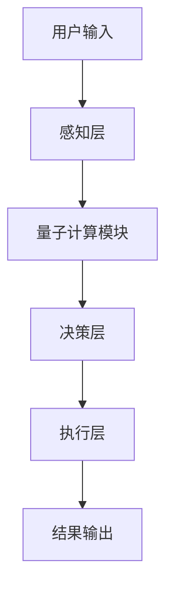
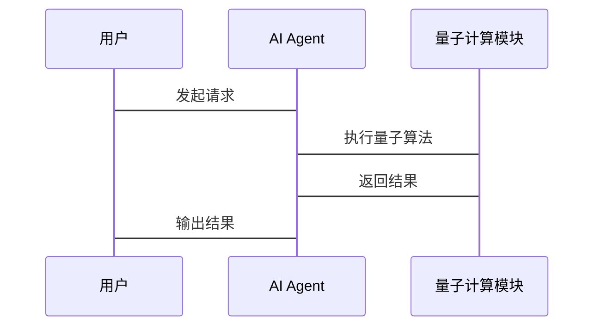

                 


# 《企业AI Agent的量子机器学习应用》

> 关键词：量子机器学习、AI Agent、企业应用、算法原理、系统架构、项目实战、最佳实践

> 摘要：本文探讨了量子机器学习在企业AI Agent中的应用，分析了量子计算的核心原理及其与AI Agent的结合方式，详细讲解了量子机器学习算法的数学模型和实现步骤，并通过实际案例展示了如何将量子机器学习应用于企业AI Agent系统中，最后总结了实践中的关键点和未来发展方向。

---

# 第一部分: 企业AI Agent的量子机器学习应用概述

## 第1章: 问题背景与核心概念

### 1.1 问题背景
- **传统AI Agent的局限性**：计算能力不足、数据处理效率低下、难以处理复杂问题。
- **量子计算的兴起**：量子计算机的并行计算能力为AI Agent带来了新的可能性。
- **企业智能化转型的需求**：企业需要更高效的决策支持系统和自动化解决方案。

### 1.2 问题描述
- **AI Agent的功能需求**：信息处理、决策制定、任务执行。
- **量子机器学习的优势**：并行计算能力、处理复杂问题、提高准确性。
- **结合点**：利用量子机器学习提升AI Agent的性能和效率。

### 1.3 问题解决
- **量子机器学习提升AI Agent的核心竞争力**：通过量子算法优化决策过程。
- **量子AI Agent的构建路径**：从经典到量子的过渡策略。
- **实际应用案例**：金融领域的量子风险管理、物流优化中的量子路径规划。

### 1.4 边界与外延
- **量子机器学习的适用范围**：复杂优化问题、大数据处理。
- **AI Agent的量子化边界**：仅部分功能采用量子算法。
- **与经典机器学习的区别**：计算方式、处理速度、问题复杂度。

### 1.5 概念结构与核心要素
- **量子机器学习的核心概念**：量子叠加、量子纠缠。
- **AI Agent的组成要素**：感知层、决策层、执行层。
- **两者的关系**：量子机器学习作为AI Agent的决策引擎。

---

# 第二部分: 核心概念与联系

## 第2章: 核心概念原理

### 2.1 量子机器学习的基本原理
- **量子叠加**：量子态可以同时处于多个状态，提升计算效率。
- **量子纠缠**：多个量子态之间的强关联，提高计算的并行性。
- **量子测量**：通过测量获得结果，应用于AI Agent的决策过程。

### 2.2 AI Agent的核心机制
- **感知**：数据采集与处理。
- **决策**：基于量子算法的优化决策。
- **执行**：任务自动化执行。

### 2.3 量子计算在AI Agent中的应用
- **优化问题**：路径规划、资源分配。
- **模式识别**：图像识别、语音识别。
- **预测模型**：股票预测、市场趋势分析。

## 第3章: 核心概念对比与联系

### 3.1 属性特征对比
| 属性 | 量子机器学习 | AI Agent |
|------|--------------|-----------|
| 计算方式 | 量子并行 | 经典串行 |
| 处理速度 | 高 | 低 |
| 问题复杂度 | 高 | 中 |

### 3.2 ER实体关系图
```mermaid
er
    entity 量子机器学习 {
        id
        属性
    }
    entity AI Agent {
        id
        功能
    }
    relation 关联关系 {
        量子机器学习 -> AI Agent
    }
```

### 3.3 算法流程图


---

# 第三部分: 量子机器学习算法原理

## 第4章: 量子叠加与量子纠缠

### 4.1 量子叠加原理
- **数学模型**：$$|\psi\rangle = a|0\rangle + b|1\rangle$$
- **应用**：在AI Agent中实现多目标优化。

### 4.2 量子纠缠原理
- **数学模型**：$$|\psi\rangle = \frac{1}{\sqrt{2}}(|01\rangle + |10\rangle)$$
- **应用**：提高计算的并行性。

## 第5章: 量子机器学习算法实现

### 5.1 量子算法流程


### 5.2 代码实现
```python
import numpy as np
from qiskit import QuantumCircuit, Aer, execute

def quantum_algorithm(input_data):
    qc = QuantumCircuit(2, 2)
    qc.h(0)
    qc.cx(0, 1)
    qc.measure(0, 0)
    qc.measure(1, 1)
    simulator = Aer.get_backend('qasm_simulator')
    job = execute(qc, simulator, shots=1000)
    result = job.result()
    return result.get_counts(qc)
```

---

# 第四部分: 系统分析与架构设计

## 第6章: 系统功能设计

### 6.1 领域模型


### 6.2 系统架构设计


## 第7章: 系统接口与交互设计

### 7.1 接口设计
- **输入接口**：用户输入数据。
- **输出接口**：系统输出结果。
- **交互接口**：用户与AI Agent的交互界面。

### 7.2 交互序列图


---

# 第五部分: 项目实战

## 第8章: 量子机器学习在企业AI Agent中的应用

### 8.1 环境安装
- **量子计算框架**：Qiskit、Cirq。
- **AI Agent框架**：TensorFlow、Keras。

### 8.2 核心代码实现
```python
def optimize_with_quantum():
    # 初始化量子电路
    qc = QuantumCircuit(2, 2)
    qc.h(0)
    qc.cx(0, 1)
    qc.measure(0, 0)
    qc.measure(1, 1)
    # 执行量子计算
    simulator = Aer.get_backend('qasm_simulator')
    job = execute(qc, simulator, shots=1000)
    result = job.result()
    return result.get_counts(qc)
```

### 8.3 案例分析
- **案例1**：量子路径规划在物流中的应用。
- **案例2**：量子风险管理在金融中的应用。

## 第9章: 项目总结与优化

### 9.1 项目小结
- **项目成果**：成功实现量子机器学习在AI Agent中的应用。
- **优化建议**：进一步优化量子算法、提升系统性能。

---

# 第六部分: 最佳实践与未来展望

## 第10章: 最佳实践

### 10.1 实践总结
- **关键点**：量子算法的选择、系统架构设计、数据处理效率。
- **注意事项**：量子计算的局限性、系统的可扩展性。

### 10.2 未来展望
- **量子AI Agent的发展方向**：更高效的算法、更广泛的应用场景。
- **技术趋势**：量子计算与AI的深度融合。

---

# 作者：AI天才研究院 & 禅与计算机程序设计艺术

