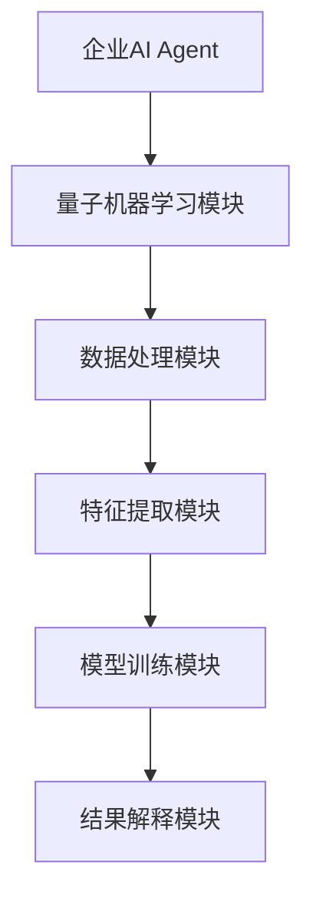

                 


# 企业AI Agent的量子机器学习应用策略

> 关键词：企业AI Agent，量子机器学习，应用策略，系统架构，项目实战

> 摘要：本文深入探讨了企业AI Agent与量子机器学习的结合，分析了量子机器学习的核心算法及其在企业AI Agent中的应用策略。通过系统架构设计和项目实战，展示了如何将量子机器学习应用于企业AI Agent，以提升其智能化水平和决策能力。

---

## 第一章：企业AI Agent概述

### 1.1 AI Agent的基本概念

AI Agent（智能体）是指能够感知环境并采取行动以实现目标的实体。企业AI Agent则是专门为企业场景设计的智能体，用于自动化决策、优化业务流程等。

**企业AI Agent的特点：**
- **自主性**：能够自主决策，无需人工干预。
- **反应性**：能够实时感知环境变化并做出反应。
- **目标导向**：所有行动都以实现特定目标为导向。
- **可扩展性**：能够根据需求扩展功能和能力。

### 1.2 量子机器学习的基本概念

量子机器学习是利用量子计算的特性来提升机器学习算法性能的一种新兴领域。其核心优势在于处理高维度数据和复杂优化问题时的高效性。

**量子机器学习的核心优势：**
- **计算速度**：量子计算机在某些特定问题上比经典计算机快得多。
- **并行计算**：量子叠加特性使得多个状态可以同时处理。
- **优化能力**：量子算法在优化问题上表现优异，如旅行商问题。

### 1.3 企业AI Agent与量子机器学习的结合

企业AI Agent与量子机器学习的结合，旨在利用量子计算的优势，提升企业AI Agent的决策能力和效率。

**结合的意义：**
- **提升决策效率**：通过量子算法优化决策过程。
- **增强数据处理能力**：量子计算能够处理海量数据，提升AI Agent的分析能力。
- **推动业务创新**：量子机器学习的应用为企业AI Agent带来新的可能性。

---

## 第二章：量子机器学习算法概述

### 2.1 量子计算的基本原理

量子计算的核心在于量子位（qubit）的状态和运算方式。

**量子位的特性：**
- **叠加态**：qubit可以同时处于多个状态的叠加。
- **纠缠态**：多个qubit之间可以形成纠缠，使得状态相互依赖。

### 2.2 量子机器学习的核心算法

量子机器学习算法包括量子支持向量机、量子聚类算法等。

**量子支持向量机：**
- **工作原理**：利用量子叠加特性，将数据映射到高维空间，找到最优超平面。
- **优势**：在处理非线性分类问题时表现优异。

### 2.3 量子机器学习的数学模型

**量子叠加的数学表达：**
$$
\psi = \alpha|0\rangle + \beta|1\rangle
$$
其中，α和β是复数系数，满足$$|\alpha|^2 + |\beta|^2 = 1$$。

---

## 第三章：企业AI Agent的量子机器学习应用策略

### 3.1 企业AI Agent的设计与实现

**设计原则：**
- **模块化**：将功能分解为独立模块，便于维护和扩展。
- **可扩展性**：设计时考虑未来可能的功能扩展。
- **高可用性**：确保系统在部分模块故障时仍能正常运行。

### 3.2 量子机器学习在企业AI Agent中的应用

**数据处理与特征提取：**
- 利用量子叠加特性，将数据映射到高维空间，提取特征。

**模型训练与优化：**
- 使用量子算法优化模型参数，提升训练效率。

**结果解释与反馈机制：**
- 将量子计算的结果转换为可解释的形式，提供反馈。

---

## 第四章：系统架构与项目实战

### 4.1 系统架构设计

**系统架构图：**



### 4.2 项目实战

**环境安装与配置：**
- 安装量子计算开发环境，如Qiskit。
- 安装量子机器学习框架，如QML。

**核心代码实现：**

```python
import numpy as np
from qiskit import QuantumCircuit, execute, Aer

# 定义量子电路
qc = QuantumCircuit(2, 2)

# 定义量子门
qc.h(0)
qc.ccx(0, 1, 1)
qc.measure(0, 0)
qc.measure(1, 1)

# 执行量子计算
backend = Aer.get_backend('qasm_simulator')
job = execute(qc, backend)
result = job.result()
```

---

## 第五章：总结与展望

### 5.1 总结

企业AI Agent与量子机器学习的结合，为企业智能化转型提供了新的思路。量子机器学习的优势在于处理复杂问题时的高效性，这使得企业AI Agent在决策效率和数据处理能力上有了显著提升。

### 5.2 展望

未来，随着量子计算技术的成熟，企业AI Agent将更加智能化和高效化。量子机器学习的应用将扩展到更多领域，如金融、医疗等。

---

## 作者信息

作者：AI天才研究院/AI Genius Institute & 禅与计算机程序设计艺术 /Zen And The Art of Computer Programming

---

通过本文的详细讲解，读者可以全面了解企业AI Agent与量子机器学习的结合，掌握其应用策略和实现方法。希望本文能为相关领域的研究和实践提供有价值的参考。

