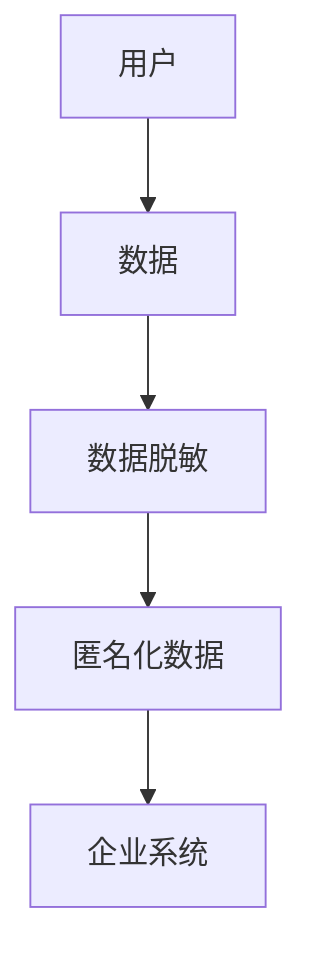
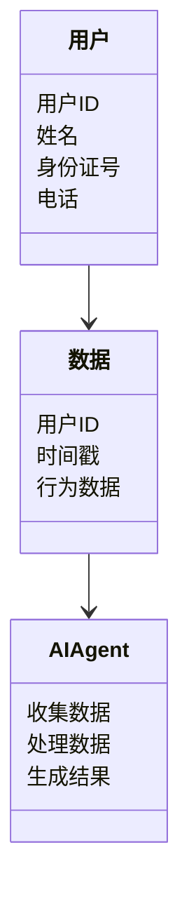
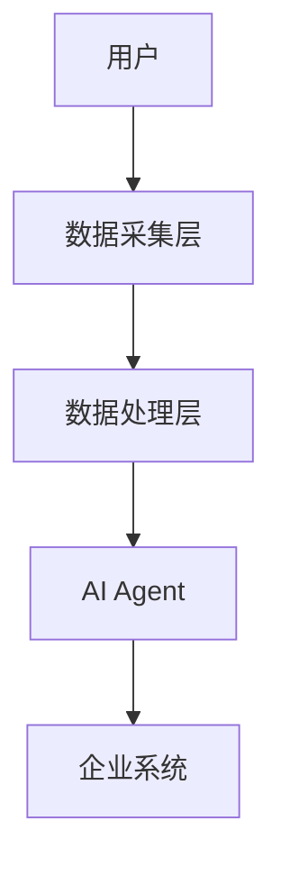
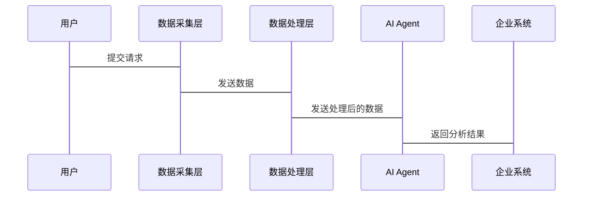

                 


---

# 企业AI Agent的隐私保护机制

> **关键词**: 企业AI Agent，隐私保护，数据加密，匿名化处理，隐私泄露，AI算法，数据安全

> **摘要**: 随着人工智能技术的快速发展，企业AI Agent在各个领域的应用越来越广泛。然而，AI Agent在处理和存储数据时，也带来了隐私保护的挑战。本文从企业AI Agent的定义和应用场景出发，详细探讨了隐私保护的核心机制，包括数据加密、匿名化处理、差分隐私等技术。通过分析这些技术的原理和实现，本文进一步提出了企业AI Agent隐私保护的系统架构设计，并结合实际案例，给出了隐私保护的最佳实践。最后，本文总结了当前技术的不足，并展望了未来的发展方向。

---

# 第一部分: 企业AI Agent的隐私保护机制概述

---

# 第1章: 企业AI Agent与隐私保护概述

## 1.1 企业AI Agent的定义与特点

### 1.1.1 AI Agent的基本概念

AI Agent（人工智能代理）是一种能够感知环境、自主决策并执行任务的智能实体。它通过传感器获取信息，利用算法进行分析和推理，最终做出决策并执行操作。AI Agent可以是软件程序、机器人或其他智能设备。

在企业环境中，AI Agent通常用于自动化业务流程、优化资源分配、提升客户体验等场景。例如，企业AI Agent可以用于客服系统中，自动响应客户咨询；或者用于供应链管理中，实时监控库存并优化物流路径。

### 1.1.2 企业AI Agent的核心特点

- **自主性**：AI Agent能够在没有人工干预的情况下独立运行。
- **反应性**：能够实时感知环境变化并做出相应的反应。
- **学习能力**：通过机器学习算法不断优化自身的决策能力。
- **可扩展性**：能够处理大规模数据和复杂任务。

### 1.1.3 企业AI Agent的应用场景

- **客户关系管理（CRM）**：通过分析客户行为数据，提供个性化的服务推荐。
- **供应链管理**：实时监控库存、物流和订单状态，优化供应链效率。
- **智能客服**：通过自然语言处理技术，自动响应客户咨询。
- **风险管理**：通过分析企业内外部数据，识别潜在风险并提出应对策略。

## 1.2 隐私保护的重要性

### 1.2.1 隐私保护的基本概念

隐私保护是指保护个人或组织的敏感信息不被未经授权的第三方访问或滥用。在企业环境中，隐私保护不仅是合规要求，更是企业信誉和客户信任的重要保障。

### 1.2.2 企业AI Agent中隐私保护的必要性

随着企业AI Agent的广泛应用，数据的收集和处理量急剧增加。企业AI Agent通常需要处理大量的敏感数据，如客户信息、交易记录等。这些数据如果被未经授权的第三方获取，可能导致严重的隐私泄露问题。

### 1.2.3 隐私泄露的潜在风险

- **身份盗窃**：攻击者可以通过窃取客户信息进行身份盗窃，导致客户财产损失。
- **数据滥用**：企业内部员工或外部合作伙伴可能滥用数据，进行非法活动。
- **合规风险**：企业如果未能有效保护客户隐私，可能面临法律诉讼和巨额罚款。

## 1.3 企业AI Agent隐私保护的挑战

### 1.3.1 数据收集与处理的隐私风险

企业AI Agent需要从各种渠道收集数据，包括客户行为数据、设备传感器数据等。这些数据中可能包含大量敏感信息，如果处理不当，可能导致隐私泄露。

### 1.3.2 AI模型训练中的隐私问题

企业AI Agent通常需要通过机器学习算法进行训练，训练数据可能包含客户的敏感信息。如何在保证模型性能的同时，保护训练数据的隐私，是一个重要的挑战。

### 1.3.3 第三方服务的隐私威胁

企业AI Agent可能需要依赖第三方服务，如云服务提供商、数据分析公司等。这些第三方服务可能因为自身安全漏洞或内部管理不善，导致客户数据泄露。

## 1.4 本章小结

本章介绍了企业AI Agent的定义、特点和应用场景，并重点分析了隐私保护的重要性及面临的挑战。通过本章的介绍，读者可以理解为什么隐私保护在企业AI Agent中如此重要，以及企业需要采取哪些措施来应对隐私保护的挑战。

---

# 第二部分: 企业AI Agent隐私保护的核心机制

---

# 第2章: 隐私保护的核心概念与联系

## 2.1 隐私保护机制的原理

### 2.1.1 数据加密的基本原理

数据加密是通过将数据转换为不可读的形式，防止未经授权的第三方访问。常见的加密方法包括对称加密和非对称加密。

- **对称加密**：加密和解密使用相同的密钥，速度快，适合大量数据加密。
- **非对称加密**：加密和解密使用不同的密钥，安全性高，适合安全通信。

### 2.1.2 数据匿名化的实现方法

数据匿名化是指通过技术手段将数据中的个人身份信息去除或模糊化处理，使得数据无法被关联到具体个人。常见的匿名化技术包括数据脱敏、数据扰乱和数据聚集。

### 2.1.3 数据脱敏技术的原理

数据脱敏是指通过修改数据，使其在不改变数据结构和使用价值的前提下，降低数据的敏感性。例如，将客户的真实姓名替换为随机生成的标识符。

### 2.1.4 数据加密与数据匿名化的对比分析

| **技术**       | **优点**                                      | **缺点**                                      |
|-----------------|----------------------------------------------|----------------------------------------------|
| 数据加密        | 高效，保护数据 confidentiality                  | 不适用于匿名化处理                              |
| 数据匿名化      | 保护数据匿名性，适用于大规模数据处理        | 无法保证数据的完整性                          |

### 2.1.5 数据脱敏与数据匿名化的ER实体关系图



---

## 2.2 本章小结

本章详细介绍了隐私保护的核心概念，包括数据加密、数据匿名化和数据脱敏的原理及实现方法。通过对这些技术的对比分析和ER实体关系图的展示，读者可以清晰地理解隐私保护机制的核心要素及其相互关系。

---

# 第3章: 隐私保护的算法原理与实现

## 3.1 同态加密算法

### 3.1.1 同态加密的基本原理

同态加密是一种特殊的加密方法，允许在密文上进行计算，而不需要解密。这种技术可以用于保护数据隐私，同时支持数据的计算和分析。

### 3.1.2 同态加密的数学模型

同态加密的数学模型如下：

$$ f(x) = x^2 \mod p $$

其中，$x$ 是明文，$p$ 是模数，$f(x)$ 是加密后的密文。

### 3.1.3 同态加密的实现步骤

1. **密钥生成**：生成加密密钥和解密密钥。
2. **加密**：将明文加密为密文。
3. **计算**：在密文上进行计算。
4. **解密**：将计算结果解密为明文。

### 3.1.4 同态加密的应用场景

同态加密适用于需要在加密数据上进行计算的场景，如隐私保护下的数据分析和机器学习。

### 3.1.5 同态加密的Python代码实现

```python
import numpy as np

# 生成密钥
def generate_keys(p):
    private_key = np.random.randint(2, p)
    public_key = (private_key * 2) % p
    return public_key, private_key

# 加密
def encrypt(plaintext, public_key):
    return (plaintext * public_key) % p

# 解密
def decrypt(ciphertext, private_key):
    return (ciphertext // private_key) % p
```

---

## 3.2 差分隐私技术

### 3.2.1 差分隐私的基本原理

差分隐私是一种通过在数据中添加噪声，保护个体隐私的技术。它确保了在查询数据时，结果的变化不会暴露出个体的敏感信息。

### 3.2.2 差分隐私的数学模型

差分隐私的数学模型如下：

$$ P(\text{output} \mid \text{data}) \geq P(\text{output} \mid \text{data'}) \times \exp(\epsilon) $$

其中，$\epsilon$ 是隐私参数，控制隐私保护的强度。

### 3.2.3 差分隐私的实现步骤

1. **数据预处理**：对数据进行匿名化处理。
2. **添加噪声**：根据隐私参数 $\epsilon$，向数据中添加噪声。
3. **数据发布**：发布加噪后的数据。

### 3.2.4 差分隐私的应用场景

差分隐私适用于需要在保护隐私的前提下，发布数据统计结果的场景，如人口普查数据发布。

### 3.2.5 差分隐私的Python代码实现

```python
import numpy as np

# 添加噪声
def add_noise(data, epsilon):
    noise = np.random.laplace(0, 1/epsilon, data.shape)
    return data + noise

# 应用差分隐私
def differential_privacy(data, epsilon):
    noisy_data = add_noise(data, epsilon)
    return noisy_data
```

---

## 3.3 本章小结

本章详细介绍了两种隐私保护的核心算法：同态加密和差分隐私。通过对这两种算法的原理、数学模型和实现代码的讲解，读者可以理解这些算法如何在企业AI Agent中实现数据的隐私保护。

---

# 第三部分: 企业AI Agent隐私保护的系统架构设计

---

# 第4章: 系统分析与架构设计

## 4.1 问题场景介绍

企业AI Agent需要在保护客户隐私的前提下，高效地处理和分析数据。然而，数据的收集、存储和处理过程中的隐私保护是一个复杂的系统工程。

## 4.2 系统功能设计

### 4.2.1 领域模型设计



### 4.2.2 系统架构设计



## 4.3 接口设计

### 4.3.1 系统接口设计

- **数据采集接口**：从各种数据源采集数据。
- **数据处理接口**：对数据进行清洗、转换和匿名化处理。
- **AI Agent接口**：接收数据并生成分析结果。

### 4.3.2 交互流程图



---

# 第五部分: 项目实战与案例分析

---

# 第5章: 项目实战

## 5.1 项目介绍

本节将通过一个具体的案例，展示如何在企业AI Agent中实现隐私保护。案例背景是一个企业级的隐私保护系统，旨在保护客户数据的安全。

## 5.2 环境配置

### 5.2.1 系统环境

- **操作系统**：Linux
- **编程语言**：Python
- **开发工具**：Jupyter Notebook
- **依赖库**：numpy、scipy

## 5.3 核心代码实现

### 5.3.1 数据加密模块

```python
import numpy as np

def generate_keys(p):
    private_key = np.random.randint(2, p)
    public_key = (private_key * 2) % p
    return public_key, private_key

def encrypt(plaintext, public_key):
    return (plaintext * public_key) % p

def decrypt(ciphertext, private_key):
    return (ciphertext // private_key) % p
```

### 5.3.2 数据脱敏模块

```python
import pandas as pd

def anonymize_data(dataframe, columns):
    for col in columns:
        dataframe[col] = dataframe[col].apply(lambda x: str(x)[::-1])
    return dataframe
```

## 5.4 代码应用解读

- **数据加密模块**：通过生成公钥和私钥，实现数据的加密和解密。
- **数据脱敏模块**：通过对指定列的数据进行反转处理，实现数据的匿名化。

## 5.5 项目小结

通过本节的实战，读者可以了解如何在企业AI Agent中实现数据的隐私保护。通过具体的代码实现，读者可以掌握数据加密和数据脱敏的基本方法。

---

# 第六部分: 总结与展望

---

# 第6章: 总结与展望

## 6.1 本章总结

本文从企业AI Agent的定义和应用场景出发，详细探讨了隐私保护的核心机制，包括数据加密、匿名化处理、差分隐私等技术。通过分析这些技术的原理和实现，本文进一步提出了企业AI Agent隐私保护的系统架构设计，并结合实际案例，给出了隐私保护的最佳实践。

## 6.2 未来展望

尽管当前的隐私保护技术已经取得了一定的进展，但仍面临诸多挑战。未来的研究方向包括：

1. **轻量化隐私保护技术**：如何在资源受限的环境中，实现高效的隐私保护。
2. **动态隐私保护机制**：如何在数据动态变化的场景下，实现自适应的隐私保护。
3. **多模态隐私保护**：如何在处理多种数据类型时，实现统一的隐私保护。

## 6.3 最佳实践 tips

- **数据最小化原则**：仅收集和处理必要的数据。
- **加密技术的选择**：根据场景选择合适的加密算法。
- **隐私保护的合规性**：确保隐私保护措施符合相关法律法规。

---

# 结语

企业AI Agent的隐私保护是一个复杂而重要的系统工程。通过本文的探讨，我们希望能够为企业在AI Agent的隐私保护方面提供一些理论和实践上的指导。未来，随着技术的不断发展，隐私保护将变得更加重要，我们期待更多的创新和突破。

---

**作者：AI天才研究院/AI Genius Institute & 禅与计算机程序设计艺术/Zen And The Art of Computer Programming**

