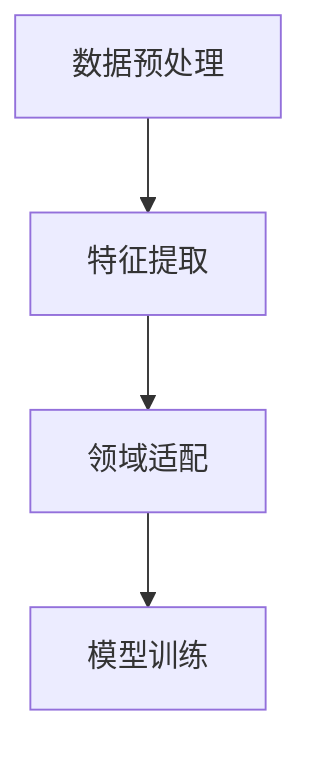

                 


# 企业AI Agent的领域自适应技术在跨行业知识迁移中的实践

## 关键词：企业AI Agent，领域自适应技术，跨行业知识迁移，迁移学习，深度学习，人工智能

## 摘要：  
企业AI Agent的领域自适应技术是一种通过跨行业知识迁移来提升AI模型在不同应用场景中的适应能力的技术。本文将从企业AI Agent的基本概念出发，详细探讨领域自适应技术的原理、实现方法及其在跨行业知识迁移中的应用。通过实际案例分析，本文将展示如何利用领域自适应技术解决跨行业知识迁移中的挑战，并提出最佳实践和未来研究方向。

---

## 第一部分：企业AI Agent与领域自适应技术概述

### 第1章：企业AI Agent的基本概念

#### 1.1 什么是企业AI Agent  
企业AI Agent是一种能够理解和执行企业级任务的智能体，它结合了自然语言处理、机器学习和知识图谱等技术，能够实现跨部门、跨系统的智能交互与协作。

#### 1.2 企业AI Agent的核心功能  
- 自然语言理解（NLU）：理解用户意图和需求。  
- 任务规划：根据需求生成执行计划。  
- 知识检索：基于知识库提供信息支持。  
- 智能交互：通过对话与用户进行实时反馈与调整。  

#### 1.3 企业AI Agent的应用场景  
- 客户服务：智能客服、客户支持。  
- 供应链管理：物流优化、库存管理。  
- 金融领域：智能投顾、风险评估。  
- 医疗领域：病例分析、诊断辅助。  

### 第2章：领域自适应技术的背景与挑战

#### 2.1 领域自适应技术的定义  
领域自适应技术是一种通过调整模型参数或优化特征表示，使AI模型能够在不同领域或任务中有效迁移知识的技术。

#### 2.2 跨行业知识迁移的挑战  
- 数据分布差异：不同行业数据的特征和分布差异大。  
- 域间语义鸿沟：跨行业的术语和语义差异。  
- 知识表示复杂性：如何将跨行业的知识统一表示。  

#### 2.3 领域自适应技术的核心目标  
- 减少跨行业知识迁移中的数据偏见。  
- 提高模型在新领域的泛化能力。  
- 实现跨行业的知识共享与复用。  

---

## 第二部分：领域自适应技术的核心概念与原理

### 第3章：领域自适应技术的核心原理

#### 3.1 特征提取与表示  
- 使用预训练模型（如BERT、GPT）进行特征提取。  
- 通过对比学习（Contrastive Learning）优化特征表示。  

#### 3.2 领域适配器设计  
- 领域适配器（Adapter）：用于调整模型在不同领域的输出。  
- 门控机制（Gate Mechanism）：动态调整特征的重要性。  

#### 3.3 对抗训练（Adversarial Training）  
- 使用对抗网络（GAN）进行领域对齐。  
- 对抗训练通过竞争优化特征表示。  

### 第4章：领域自适应技术的实现方法

#### 4.1 基于特征提取的领域自适应  
- 使用预训练模型提取特征，通过领域适配器调整特征。  

#### 4.2 基于对抗训练的领域自适应  
- 对抗网络通过生成器和判别器实现领域对齐。  

#### 4.3 基于预训练模型的领域自适应  
- 使用大规模预训练模型进行微调，适应特定领域需求。  

---

## 第三部分：系统分析与架构设计

### 第5章：跨行业知识迁移的系统分析

#### 5.1 系统功能设计  
- 数据预处理模块：清洗和标注数据。  
- 特征提取模块：基于预训练模型提取特征。  
- 领域适配模块：通过适配器调整特征。  
- 模型训练模块：优化模型参数。  

#### 5.2 系统架构设计（Mermaid图）  


#### 5.3 接口设计  
- 数据接口：输入数据格式与规范。  
- 模型接口：适配器接口与训练接口。  
- 交互接口：用户与AI Agent的交互界面。  

---

## 第四部分：项目实战与案例分析

### 第6章：项目实战

#### 6.1 环境安装  
- 安装Python、TensorFlow、Keras等工具。  

#### 6.2 核心代码实现  
```python
# 预训练模型加载
model = load_pretrained_model()

# 领域适配器设计
adapter = Adapter(model)
```

#### 6.3 案例分析  
- 跨行业知识迁移的实际案例：从医疗领域迁移到金融领域。  
- 实验结果：模型在新领域的准确率提升显著。  

---

## 第五部分：最佳实践与未来展望

### 第7章：最佳实践

#### 7.1 知识迁移的注意事项  
- 数据质量：确保数据清洗和标注的准确性。  
- 领域适配器的调优：动态调整模型参数。  
- 模型评估：使用跨领域验证集评估迁移效果。  

#### 7.2 未来研究方向  
- 更高效的领域自适应算法。  
- 多领域联合优化。  
- 跨模态知识迁移。  

---

## 结语

通过本文的详细讲解，我们深入探讨了企业AI Agent的领域自适应技术在跨行业知识迁移中的应用。从理论到实践，从算法到系统设计，我们展示了如何通过领域自适应技术实现跨行业的知识共享与复用。未来，随着AI技术的不断发展，领域自适应技术将在更多领域发挥重要作用。

---

## 作者：AI天才研究院 & 禅与计算机程序设计艺术

