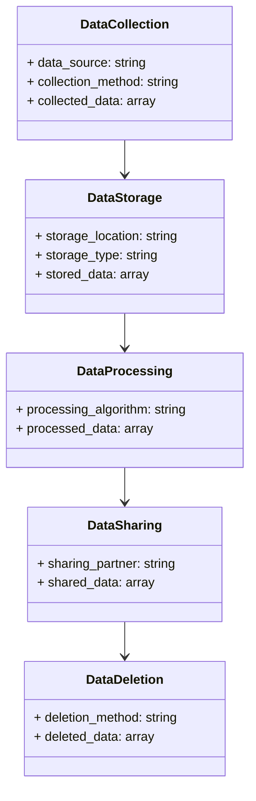

                 


# 企业AI数据安全：从收集到销毁的全生命周期管理

> 关键词：企业AI数据安全，数据生命周期管理，数据收集，数据存储，数据处理，数据共享，数据销毁

> 摘要：本文详细探讨了企业AI数据安全的全生命周期管理，从数据的收集、存储、处理、共享到销毁的各个阶段，分析了每个阶段的安全挑战和管理要点。结合实际案例和最佳实践，本文为企业的AI数据安全提供了系统化的解决方案。

---

## 第1章: 企业AI数据安全的背景与挑战

### 1.1 数据安全的重要性

#### 1.1.1 数据在企业中的核心地位
数据是企业的核心资产，尤其是在AI时代，数据的质量和数量直接决定了企业的竞争力。数据不仅包含企业的商业机密，还涉及用户的隐私信息。

#### 1.1.2 AI技术对企业数据的影响
AI技术的应用依赖于大量数据的收集、处理和分析。然而，AI算法的复杂性和数据的敏感性也带来了更高的安全风险。数据泄露可能导致企业损失巨额资金，甚至危及用户信任。

#### 1.1.3 数据安全对企业AI应用的保障作用
数据安全是企业AI应用的基石。只有确保数据在全生命周期中的安全性，才能充分发挥AI技术的潜力，同时避免法律风险和声誉损失。

---

### 1.2 数据生命周期管理的必要性

#### 1.2.1 数据从收集到销毁的全生命周期
数据的生命周期包括收集、存储、处理、共享和销毁五个阶段。每个阶段都伴随着不同的安全挑战。

#### 1.2.2 数据生命周期中的安全风险
- 数据收集阶段：隐私泄露风险。
- 数据存储阶段：未经授权的访问风险。
- 数据处理阶段：算法漏洞导致的数据泄露风险。
- 数据共享阶段：数据滥用风险。
- 数据销毁阶段：数据恢复风险。

#### 1.2.3 企业AI数据安全的边界与外延
企业AI数据安全不仅包括内部数据的安全管理，还涉及与外部合作伙伴的数据共享安全。此外，还需要考虑数据的跨境传输和合规性问题。

---

## 第2章: 数据生命周期的各个阶段

### 2.1 数据收集阶段的安全管理

#### 2.1.1 数据收集的常见方式
- **直接收集**：通过表单、传感器等设备直接获取数据。
- **间接收集**：通过日志分析、网络爬虫等方式间接获取数据。

#### 2.1.2 数据收集中的隐私保护
- **匿名化处理**：通过数据脱敏技术，去除个人隐私信息。
- **最小化原则**：只收集必要的数据，避免过度收集。

#### 2.1.3 数据收集的合规性要求
- 遵守GDPR（通用数据保护条例）等法律法规。
- 明确数据收集的目的和使用范围。

---

### 2.2 数据存储阶段的安全管理

#### 2.2.1 数据存储的物理安全
- **物理设备保护**：确保存储设备的物理安全，防止盗窃或损坏。
- **冗余备份**：通过冗余备份技术，防止数据丢失。

#### 2.2.2 数据存储的加密保护
- **加密存储**：使用AES（高级加密标准）对敏感数据进行加密存储。
- **密钥管理**：确保加密密钥的安全存储和分发。

#### 2.2.3 数据存储的访问控制
- **权限管理**：基于角色的访问控制（RBAC）。
- **审计日志**：记录数据访问日志，便于安全审计。

---

### 2.3 数据处理阶段的安全管理

#### 2.3.1 数据处理中的隐私保护
- **数据脱敏**：在数据处理过程中，实时脱敏敏感信息。
- **数据加密处理**：在数据处理过程中，确保数据始终以加密形式存储。

#### 2.3.2 数据处理的合规性要求
- 遵守数据保护法律法规。
- 确保数据处理过程的透明性和可追溯性。

#### 2.3.3 数据处理的安全审计
- **安全审计**：定期对数据处理过程进行安全审计。
- **漏洞修复**：及时修复数据处理过程中的安全漏洞。

---

### 2.4 数据共享阶段的安全管理

#### 2.4.1 数据共享的隐私保护
- **数据共享协议**：明确数据共享的目的、范围和责任。
- **数据加密共享**：使用加密技术进行数据共享，防止数据在传输过程中被窃取。

#### 2.4.2 数据共享的访问控制
- **访问权限控制**：确保只有授权方能够访问共享数据。
- **共享数据的生命周期管理**：明确数据共享的期限和终止条件。

#### 2.4.3 数据共享的合规性要求
- 遵守数据共享相关的法律法规。
- 确保数据共享过程中的可追溯性。

---

### 2.5 数据销毁阶段的安全管理

#### 2.5.1 数据销毁的常见方式
- **物理销毁**：通过焚毁、粉碎等方式销毁存储介质。
- **数据擦除**：通过软件方式彻底擦除数据。

#### 2.5.2 数据销毁的合规性要求
- 遵守数据销毁相关的法律法规。
- 确保数据销毁过程的可追溯性。

#### 2.5.3 数据销毁的安全审计
- **销毁记录**：记录数据销毁的过程和结果。
- **第三方验证**：通过第三方机构验证数据销毁的彻底性。

---

## 第3章: 数据安全的核心概念与联系

### 3.1 数据安全

#### 3.1.1 数据安全的核心概念
- 数据完整性：确保数据在存储和传输过程中不被篡改。
- 数据机密性：确保数据不被未经授权的人员访问。
- 数据可用性：确保数据在需要时可以被合法用户访问。

#### 3.1.2 数据安全与隐私保护
- 数据隐私：数据主体对其数据的控制权和使用权。
- 数据匿名化：通过技术手段去除数据中的个人隐私信息。

#### 3.1.3 数据安全与合规性
- 数据保护法规：如GDPR、CCPA等。
- 行业标准：如ISO 27001信息安全管理体系。

---

### 3.2 数据安全与AI技术的结合

#### 3.2.1 AI在数据安全中的应用
- **异常检测**：利用AI技术检测数据中的异常行为。
- **威胁情报**：利用AI技术分析威胁情报，预防数据安全事件。

#### 3.2.2 数据安全对AI的影响
- **数据隐私保护**：确保AI算法的训练数据不泄露个人隐私。
- **数据质量管理**：通过数据安全措施，提高数据质量，提升AI算法的性能。

---

## 第4章: 数据安全算法原理

### 4.1 数据脱敏技术

#### 4.1.1 数据脱敏算法原理
- **随机替换**：将敏感字段的值替换为随机值。
- **噪声注入**：在数据中添加随机噪声，降低数据的可识别性。

#### 4.1.2 数据脱敏的实现步骤
1. 确定需要脱敏的字段。
2. 选择合适的脱敏算法。
3. 对数据进行脱敏处理。
4. 验证脱敏后的数据是否满足业务需求。

#### 4.1.3 数据脱敏的Python实现
```python
import random

def data_anonymization(data, sensitive_fields):
    anonymized_data = data.copy()
    for field in sensitive_fields:
        if data[field] is not None:
            anonymized_data[field] = random.choice([1, 2, 3, 4, 5])
    return anonymized_data
```

---

### 4.2 数据加密算法

#### 4.2.1 数据加密算法原理
- **对称加密**：如AES算法，加密和解密使用相同的密钥。
- **非对称加密**：如RSA算法，加密和解密使用不同的密钥对。

#### 4.2.2 数据加密的实现步骤
1. 选择合适的加密算法。
2. 生成加密密钥。
3. 对数据进行加密处理。
4. 存储加密后的数据和密钥。

#### 4.2.3 数据加密的Python实现
```python
from cryptography.hazmat.primitives import padding
from cryptography.hazmat.primitives.ciphers import Cipher, algorithms, modes
from cryptography.hazmat.primitives.asymmetric import padding as asym_padding
from cryptography.hazmat.primitives.asymmetric.rsa import RSAParameters

# 对称加密示例
def symmetric_encrypt(plaintext, key):
    iv = bytes([0] * 16)
    cipher = Cipher(algorithms.AES(key), modes.CBC(iv))
    encryptor = cipher.encryptor()
    padder = padding.PKCS7(128).padder()
    padded_data = padder.update(plaintext) + padder.finalize()
    ciphertext = encryptor.update(padded_data) + encryptor.finalize()
    return ciphertext, iv

# 非对称加密示例
def asymmetric_encrypt(plaintext, public_key):
    cipher = Cipher(algorithms.RSA, RSAParameters())
    encryptor = cipher.encryptor(asym_padding.PKCS1v15())
    ciphertext = encryptor.update(plaintext) + encryptor.finalize()
    return ciphertext
```

---

## 第5章: 企业AI数据安全系统架构设计

### 5.1 系统功能设计

#### 5.1.1 领域模型设计


#### 5.1.2 系统架构设计
```mermaid
architecturalDiagram
    component DataCollection {
        interface DataCollection_API
    }
    component DataStorage {
        interface DataStorage_API
    }
    component DataProcessing {
        interface DataProcessing_API
    }
    component DataSharing {
        interface DataSharing_API
    }
    component DataDeletion {
        interface DataDeletion_API
    }
    DataCollection --<|>--> DataStorage
    DataStorage --<|>--> DataProcessing
    DataProcessing --<|>--> DataSharing
    DataSharing --<|>--> DataDeletion
```

---

### 5.2 系统接口设计

#### 5.2.1 数据收集接口
- **API接口**：`POST /api/data-collection`
- **请求参数**：`{ "data_source": "user_input", "collection_method": "form"}`
- **响应参数**：`{ "status": "success", "message": "数据收集成功" }`

#### 5.2.2 数据存储接口
- **API接口**：`POST /api/data-storage`
- **请求参数**：`{ "storage_location": "database", "data": { "name": "张三", "age": 30 } }`
- **响应参数**：`{ "status": "success", "message": "数据存储成功" }`

---

## 第6章: 项目实战

### 6.1 项目背景

#### 6.1.1 项目需求
- 开发一个医疗数据安全管理系统，确保医疗数据在收集、存储、处理、共享和销毁过程中的安全性。

---

### 6.2 系统实现

#### 6.2.1 环境安装
- **Python版本**：Python 3.8+
- **依赖库安装**：
  ```bash
  pip install flask cryptography pandas
  ```

#### 6.2.2 核心代码实现
```python
from flask import Flask, request, jsonify
from cryptography.hazmat.primitives import padding
from cryptography.hazmat.primitives.ciphers import Cipher, algorithms, modes

app = Flask(__name__)

@app.route('/api/data-storage', methods=['POST'])
def data_storage():
    data = request.json
    # 数据加密
    key = b' secreatesKey123456789 '
    iv = bytes([0] * 16)
    cipher = Cipher(algorithms.AES(key), modes.CBC(iv))
    encryptor = cipher.encryptor()
    padder = padding.PKCS7(128).padder()
    padded_data = padder.update(data['data']) + padder.finalize()
    ciphertext = encryptor.update(padded_data) + encryptor.finalize()
    return jsonify({"status": "success", "message": "数据存储成功", "encrypted_data": ciphertext})

if __name__ == '__main__':
    app.run(debug=True)
```

---

## 第7章: 最佳实践与总结

### 7.1 最佳实践

#### 7.1.1 数据分类与分级管理
- 根据数据的重要性进行分类，制定不同的安全策略。

#### 7.1.2 数据最小化原则
- 只收集和处理必要的数据，避免过度收集。

#### 7.1.3 数据访问控制
- 基于角色的访问控制（RBAC）。

#### 7.1.4 数据安全培训与意识提升
- 定期对员工进行数据安全培训，提升全员的安全意识。

#### 7.1.5 数据安全工具与技术
- 使用专业的数据加密、脱敏和审计工具。

---

### 7.2 未来展望

#### 7.2.1 AI技术的进步
- 更智能的数据安全算法，如基于机器学习的威胁检测。

#### 7.2.2 数据安全的新挑战
- 数据跨境传输的安全性。
- 数据隐私保护的法律不断完善。

---

## 结语

企业AI数据安全的全生命周期管理是一个复杂而重要的任务。通过本文的分析，我们了解了从数据收集到销毁的每个阶段的安全挑战，并结合实际案例和最佳实践，为企业的数据安全管理提供了系统的解决方案。未来，随着AI技术的不断发展，数据安全的挑战也将更加复杂，企业需要持续关注数据安全技术的创新，确保数据资产的安全与合规。

---

## 作者

作者：AI天才研究院/AI Genius Institute & 禅与计算机程序设计艺术 /Zen And The Art of Computer Programming

