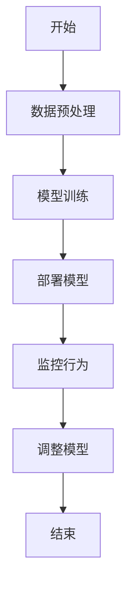
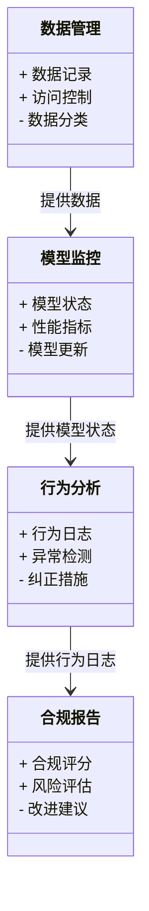
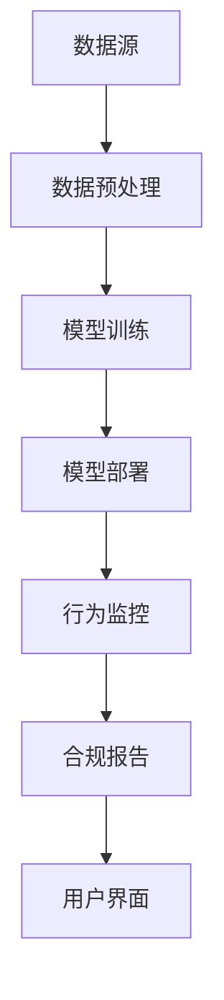

                 


# 企业AI治理框架：确保AI Agent的可控与合规

> 关键词：企业AI治理，AI Agent，可控性，合规性，数据安全，责任分配，伦理治理

> 摘要：随着AI技术的快速发展，企业在应用AI Agent时面临越来越多的挑战，包括数据安全、合规性、责任分配和伦理问题。本文详细探讨如何构建企业AI治理框架，确保AI Agent的可控与合规。通过分析核心概念、算法原理、系统架构和实际案例，提供一套完整的治理方案，帮助企业在AI时代保持竞争力和可持续发展。

---

## 目录

1. [企业AI治理框架的背景与概述](#企业ai治理框架的背景与概述)
2. [核心概念与联系](#核心概念与联系)
3. [算法原理讲解](#算法原理讲解)
4. [数学模型与公式](#数学模型与公式)
5. [系统分析与架构设计](#系统分析与架构设计)
6. [项目实战](#项目实战)
7. [最佳实践](#最佳实践)

---

## 1. 企业AI治理框架的背景与概述

### 1.1 AI治理的背景

随着人工智能技术的快速发展，AI Agent在企业中的应用越来越广泛。然而，这种广泛应用带来了诸多挑战，包括数据隐私、责任分配和伦理问题。企业需要建立有效的治理框架，确保AI Agent的行为可控且合规。

#### 1.1.1 AI技术的快速发展与企业应用

AI技术的进步推动了其在企业中的应用，如自动化决策、客户服务和供应链管理。然而，这种应用也带来了新的挑战，尤其是在数据安全和合规性方面。

#### 1.1.2 AI在企业中的广泛应用带来的挑战

企业使用AI Agent可能会面临数据泄露、算法偏见和责任不清等问题。这些问题不仅影响企业的声誉，还可能导致法律风险。

#### 1.1.3 企业AI治理的重要性与必要性

治理框架的建立是确保AI Agent可控和合规的关键。通过治理，企业可以减少风险，提高透明度和信任度。

### 1.2 问题背景

AI Agent的失控风险、数据隐私问题和责任分配的复杂性是企业治理中需要解决的主要问题。

#### 1.2.1 AI Agent失控的风险

AI Agent可能因算法错误或数据问题而做出不符合预期的行为，导致企业损失。

#### 1.2.2 数据隐私与合规性问题

数据隐私法规要求企业确保数据的合法使用和保护，而AI Agent的数据处理可能违反这些规定。

#### 1.2.3 伦理与责任分配的复杂性

AI Agent的行为涉及多方利益，明确责任和道德标准是确保其行为符合伦理的关键。

### 1.3 问题描述

企业需要解决的问题包括AI Agent的行为边界模糊、数据滥用风险和治理框架的缺失。

#### 1.3.1 AI Agent的行为边界模糊

AI Agent的决策可能超出预期范围，导致意外后果。

#### 1.3.2 数据滥用与泄露的风险

数据泄露可能导致严重的法律和财务后果，影响企业的信誉。

#### 1.3.3 企业内部治理框架的缺失

缺乏明确的治理框架使得企业难以有效管理和监督AI Agent的行为。

### 1.4 问题解决

通过建立治理框架，企业可以确保AI Agent的可控和合规，减少风险。

#### 1.4.1 建立AI治理框架的目标

目标包括确保可控性、合规性、透明度和责任分配。

#### 1.4.2 通过治理框架确保AI Agent的可控性

治理框架提供明确的规则和监督机制，确保AI Agent的行为在可接受范围内。

#### 1.4.3 通过框架实现合规性

框架确保企业遵守相关法规，减少法律风险。

### 1.5 边界与外延

明确治理框架的边界，确保其与其他治理框架协同工作，同时考虑扩展性。

#### 1.5.1 AI治理的边界

包括数据范围、应用场景和责任分配等方面。

#### 1.5.2 与其他企业治理框架的关系

AI治理框架与其他治理框架（如数据治理、风险管理）相互关联，协同工作。

#### 1.5.3 治理框架的外延与扩展

框架应具备扩展性，能够适应未来技术的发展和新的法规要求。

### 1.6 核心要素组成

治理框架的核心要素包括数据治理、模型治理和行为治理。

#### 1.6.1 数据治理

确保数据的合法、合规和安全使用，包括数据分类、访问控制和审计。

#### 1.6.2 模型治理

管理AI模型的开发、部署和监控，确保模型的透明性和可解释性。

#### 1.6.3 行为治理

监督AI Agent的行为，确保其符合企业的目标和价值观，包括行为监控、异常检测和纠正措施。

---

## 2. 核心概念与联系

### 2.1 核心概念原理

治理框架的核心概念包括治理原则、数据安全和责任分配。

#### 2.1.1 治理原则与框架设计

治理原则是框架设计的基础，包括透明性、可解释性和公平性。

#### 2.1.2 数据安全与隐私保护

数据安全是治理框架的重要组成部分，确保数据不被滥用和泄露。

#### 2.1.3 伦理与责任分配

明确责任分配和伦理标准，确保AI Agent的行为符合道德规范。

### 2.2 概念属性对比表格

表2-1：AI治理框架核心概念对比

| 概念       | 描述                                       | 属性1       | 属性2       | 属性3       |
|------------|------------------------------------------|-------------|-------------|-------------|
| 数据治理    | 管理数据的采集、存储和使用               | 合规性       | 安全性       | 可追溯性     |
| 模型治理    | 管理AI模型的开发和部署                   | 可解释性     | 透明性       | 容错性       |
| 行为治理    | 监督AI Agent的行为                       | 监控性       | 可控性       | 责任性       |

### 2.3 ER实体关系图

图2-1：AI治理框架的实体关系图

```mermaid
erDiagram
    actor 企业用户 {
        +string 用户ID
        +string 角色
        +string 权限
    }
    actor 数据提供者 {
        +string 数据来源
        +string 数据类型
        +string 数据使用权限
    }
    actor 模型开发者 {
        +string 模型ID
        +string 开发人员ID
        +string 模型描述
    }
    actor 治理员 {
        +string 治理ID
        +string 责任范围
        +string 治理策略
    }
    database 数据库 {
        +string 数据记录
        +string 模型参数
        +string 治理记录
    }
    数据提供者 --> 数据库 : 提供数据
    模型开发者 --> 数据库 : 训练模型
    治理员 --> 数据库 : 记录治理操作
    企业用户 --> 治理员 : 请求治理操作
```

---

## 3. 算法原理讲解

### 3.1 算法原理概述

治理框架的算法目标是确保AI Agent的可控和合规，核心步骤包括数据预处理、模型训练、监控和调整。

#### 3.1.1 治理框架的算法目标

目标是确保AI Agent的行为符合预期，同时遵守相关法规和伦理标准。

#### 3.1.2 算法的核心步骤

步骤包括数据预处理、模型训练、监控和调整。

### 3.2 算法流程图

图3-1：AI治理框架算法流程图



### 3.3 算法实现代码

代码3-1：AI治理框架的核心算法实现

```python
def governance_framework(data, model, threshold=0.95):
    # 数据预处理
    processed_data = preprocess(data)
    
    # 模型训练
    trained_model = train_model(processed_data)
    
    # 部署模型
    deployed_model = deploy_model(trained_model)
    
    # 监控行为
   监控结果 = monitor_behavior(deployed_model, threshold)
    
    # 调整模型
    adjusted_model = adjust_model(监控结果)
    
    return adjusted_model
```

### 3.4 数学模型与公式

公式3-1：风险评估模型

$$
风险评估 = \sum_{i=1}^{n} (概率_i \times 影响_i)
$$

公式3-2：合规性评分公式

$$
合规评分 = \frac{\sum_{i=1}^{m} (符合项_i)}{m}
$$

---

## 4. 数学模型与公式

### 4.1 治理框架的数学模型

公式4-1：风险评估模型

$$
风险评估 = \sum_{i=1}^{n} (概率_i \times 影响_i)
$$

公式4-2：合规性评分公式

$$
合规评分 = \frac{\sum_{i=1}^{m} (符合项_i)}{m}
$$

公式4-3：责任分配模型

$$
责任分配 = \frac{贡献_i}{总贡献}
$$

---

## 5. 系统分析与架构设计

### 5.1 问题场景介绍

在企业中，AI Agent的应用可能涉及多个部门和系统，需要一个统一的治理框架来协调和监督。

#### 5.1.1 项目介绍

本项目旨在构建一个企业级AI治理框架，确保AI Agent的可控和合规。

#### 5.1.2 系统功能设计

系统功能包括数据管理、模型监控、行为分析和合规报告。

#### 5.1.3 领域模型

图5-1：领域模型类图



#### 5.1.4 系统架构设计

图5-2：系统架构图



---

## 6. 项目实战

### 6.1 环境安装

安装必要的工具和库，如Python、TensorFlow和Pandas。

### 6.2 核心代码实现

实现数据预处理、模型训练和监控功能。

代码6-1：数据预处理

```python
import pandas as pd

def preprocess(data):
    # 数据清洗
    data_cleaned = data.dropna()
    # 数据转换
    data_encoded = pd.get_dummies(data_cleaned)
    return data_encoded
```

代码6-2：模型训练

```python
import tensorflow as tf

def train_model(data):
    model = tf.keras.Sequential([
        tf.keras.layers.Dense(64, activation='relu'),
        tf.keras.layers.Dense(1, activation='sigmoid')
    ])
    model.compile(optimizer='adam', loss='binary_crossentropy', metrics=['accuracy'])
    model.fit(data, labels, epochs=10, batch_size=32)
    return model
```

代码6-3：行为监控

```python
def monitor_behavior(model, threshold=0.95):
    predictions = model.predict(test_data)
    accuracy = accuracy_score(test_labels, predictions.round())
    if accuracy < threshold:
        send_alert()
```

### 6.3 代码解读与分析

详细解读代码，说明每部分的功能和实现细节。

### 6.4 实际案例分析

通过一个实际案例分析，展示治理框架的应用和效果。

---

## 7. 最佳实践

### 7.1 小结

总结治理框架的核心内容和实施步骤。

### 7.2 注意事项

提醒在实施过程中需要注意的事项，如数据隐私、模型可解释性等。

### 7.3 拓展阅读

推荐相关书籍和资源，供读者深入学习。

---

## 作者：AI天才研究院 & 禅与计算机程序设计艺术

---

通过以上结构和内容，文章详细探讨了企业AI治理框架的各个方面，结合理论和实践，为读者提供了全面的指导。

