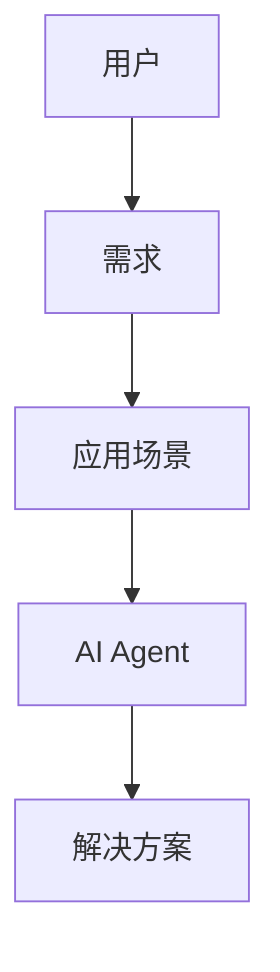
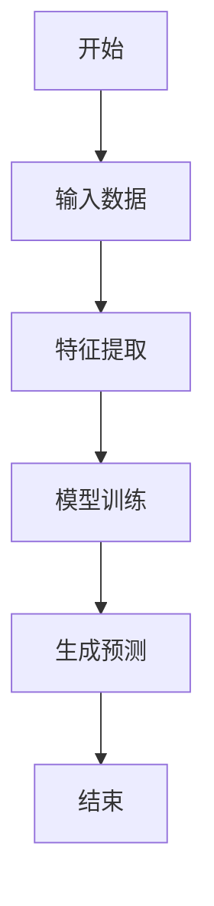

                 

# 企业AI需求分析：识别和评估AI Agent的应用机会

## 关键词：企业AI需求分析，AI Agent，人工智能，技术应用，需求识别

## 摘要：本文详细探讨了企业AI需求分析的关键步骤，重点识别和评估AI Agent的应用机会。通过分析AI Agent的核心概念、算法原理和系统架构，结合实际案例，为企业的智能化转型提供理论和实践指导。

---

# 第1章: 企业AI需求分析概述

## 1.1 AI Agent的基本概念

### 1.1.1 什么是AI Agent
AI Agent（人工智能代理）是一种能够感知环境、自主决策并执行任务的智能实体。它通过传感器获取信息，利用算法处理数据，执行动作以实现目标。AI Agent可以是软件程序或物理设备，具备自主性和智能性。

### 1.1.2 AI Agent的核心特征
- **自主性**：无需外部干预，自主决策。
- **反应性**：能实时感知环境并做出反应。
- **目标导向**：基于目标驱动行动。
- **学习能力**：通过数据优化性能。

### 1.1.3 AI Agent与传统软件的区别
AI Agent区别于传统软件的关键在于其智能性和自主性。传统软件遵循固定的逻辑，而AI Agent能学习、适应并优化行为。

## 1.2 企业AI需求分析的背景

### 1.2.1 数字化转型的浪潮
企业正面临数字化转型的压力，AI技术成为核心驱动力。AI Agent的应用帮助企业提升效率和决策能力。

### 1.2.2 AI技术的快速发展
AI技术的进步，如深度学习和自然语言处理，推动了AI Agent在企业中的广泛应用。

### 1.2.3 企业智能化的需求
企业寻求通过智能化手段提高竞争力，AI Agent成为实现智能化的重要工具。

## 1.3 AI Agent在企业中的应用机会

### 1.3.1 AI Agent的典型应用场景
- **客户服务**：智能客服、聊天机器人。
- **供应链管理**：优化库存、预测需求。
- **数据分析**：数据挖掘、预测分析。
- **决策支持**：辅助高层决策。

### 1.3.2 企业采用AI Agent的优势
- **效率提升**：自动化处理任务，节省时间。
- **精准决策**：基于数据和模型做出最优决策。
- **24/7运行**：全天候服务，减少人工成本。

### 1.3.3 AI Agent应用的挑战与机遇
- **技术挑战**：算法复杂性，数据隐私。
- **市场机遇**：巨大市场潜力，行业应用广泛。

## 1.4 本章小结
本章介绍了AI Agent的基本概念、企业AI需求分析的背景，以及AI Agent在企业中的应用机会。理解这些内容是进行AI Agent需求分析的基础。

---

# 第2章: AI Agent的核心概念与联系

## 2.1 AI Agent的核心原理

### 2.1.1 AI Agent的基本原理
AI Agent通过感知环境、分析数据、制定策略、执行行动来实现目标。其核心在于数据处理和决策制定。

### 2.1.2 AI Agent的决策机制
决策机制包括感知、分析、判断和执行四个步骤。感知环境，分析数据，判断最优方案，执行相应动作。

### 2.1.3 AI Agent的学习能力
基于机器学习，AI Agent能通过训练数据优化模型，提升性能和准确性。

## 2.2 AI Agent的属性特征对比

| 属性 | 描述 |
|------|------|
| 自主性 | 独立决策，无需外部指令 |
| 反应性 | 实时响应环境变化 |
| 目标导向 | 为实现特定目标而行动 |
| 学习能力 | 通过数据优化性能 |

## 2.3 AI Agent的ER实体关系图

## 2.4 本章小结
本章详细分析了AI Agent的核心原理、属性特征，并通过ER图展示了各实体之间的关系。理解这些概念有助于后续的分析和设计。

---

# 第3章: AI Agent的算法原理

## 3.1 AI Agent的算法概述

### 3.1.1 常见的AI Agent算法
- **基于规则的算法**：预定义规则，简单但缺乏灵活性。
- **基于机器学习的算法**：如决策树、随机森林、神经网络，适用于复杂问题。
- **基于强化学习的算法**：通过奖励机制优化决策。

### 3.1.2 算法的基本原理
AI Agent算法处理数据，提取特征，训练模型，生成预测或决策。不同类型算法适用于不同场景。

### 3.1.3 算法的优缺点
- **优点**：高效、准确。
- **缺点**：复杂性高，需要大量数据训练。

## 3.2 AI Agent算法的数学模型

### 3.2.1 基于概率的模型
$$P(A|B) = \frac{P(B|A)P(A)}{P(B)}$$

### 3.2.2 基于决策树的模型
决策树通过特征分裂优化分类效果，适用于分类和回归任务。

### 3.2.3 基于神经网络的模型
神经网络通过多层处理，提取复杂特征，适用于图像识别和自然语言处理。

## 3.3 AI Agent的算法流程图

## 3.4 本章小结
本章详细讲解了AI Agent的算法原理，包括常见算法、数学模型和流程图。理解这些内容有助于掌握AI Agent的核心技术。

---

通过以上章节，我们系统地介绍了企业AI需求分析的核心内容，从概念到算法，从设计到实战，帮助读者全面理解并应用AI Agent。

