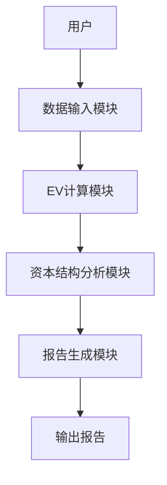

                 


# 企业价值倍数：全面考虑公司资本结构的估值

> 关键词：企业价值倍数，资本结构，估值模型，财务分析，投资决策

> 摘要：企业价值倍数（EV）是评估公司整体价值的重要指标，尤其在考虑资本结构时，其估值方法更为复杂和精确。本文将从EV的基本概念出发，分析其与资本结构的关系，探讨EV的行业应用、数学模型、系统架构设计以及实际案例，最终为读者提供全面考虑资本结构的企业估值方法。

---

## 第1章: 企业价值倍数的背景与概念

### 1.1 企业价值倍数的定义与作用

#### 1.1.1 什么是企业价值倍数（EV）
企业价值倍数（Enterprise Value Multiple，EV）是衡量公司整体价值的重要指标，反映了公司相对于其收益或现金流的估值水平。EV的计算公式为：

$$ EV = 债务 + 优先股 + 净债务 $$

EV不仅考虑了公司的股权价值，还包含了公司的债务和净债务，能够更全面地反映公司的整体价值。

#### 1.1.2 EV在企业估值中的作用
EV是投资者评估公司价值的重要工具，尤其是在企业并购、融资决策和投资分析中具有重要意义。通过EV，投资者可以更准确地评估公司的内在价值，从而做出更明智的投资决策。

#### 1.1.3 EV与其他估值指标的对比
与市盈率（P/E）和市净率（P/B）相比，EV的优势在于它能够更全面地考虑公司的资本结构，适用于不同行业的公司估值。

---

## 第2章: 企业价值倍数的核心公式与计算方法

### 2.1 EV的核心公式

#### 2.1.1 EV的基本公式
$$ EV = 债务 + 优先股 + 净债务 $$

其中，净债务 = 总债务 - 现金及现金等价物。

#### 2.1.2 EV与收益的关系
$$ EV/EBITDA = \frac{EV}{息税折旧及摊销前利润} $$

$$ EV/净利润 = \frac{EV}{净利润} $$

这两个指标分别衡量了公司相对于其收益的估值水平。

#### 2.1.3 EV与资本成本的关系
$$ EV = \frac{FCF}{WACC} $$

其中，FCF为自由现金流，WACC为加权平均资本成本。

### 2.2 EV与资本结构的关系

#### 2.2.1 杠杆效应的影响
资本结构中债务比例的增加会放大企业的杠杆效应，从而影响EV的计算。高杠杆的公司通常具有更高的EV/EBITDA倍数，但这也意味着更高的财务风险。

#### 2.2.2 不同资本结构下的EV差异
不同行业的公司资本结构差异较大，例如重资产行业（如制造业）通常具有较高的债务比例，而轻资产行业（如科技公司）则更倾向于股权融资。

---

## 第3章: EV的行业应用与案例分析

### 3.1 不同行业的EV倍数差异

#### 3.1.1 高科技行业的EV倍数特点
高科技行业通常具有较高的EV倍数，因为其高增长潜力和轻资产模式使其更适合使用股权融资。

#### 3.1.2 制造业的EV倍数特点
制造业公司通常具有较高的债务比例，因此EV倍数相对较低，但其稳定的现金流使其具有较高的投资价值。

#### 3.1.3 服务业的EV倍数特点
服务业公司通常具有较低的资本密集度，EV倍数较高，尤其是那些具有高增长潜力的公司。

### 3.2 EV倍数的行业基准与比较

#### 3.2.1 行业平均EV倍数的计算方法
$$ 行业平均EV倍数 = \frac{\sum EV_i}{\sum EBITDA_i} $$

其中，EV_i为行业内公司的EV值，EBITDA_i为行业内公司的息税折旧及摊销前利润。

#### 3.2.2 EV倍数与企业规模的关系
$$ EV倍数与企业规模呈正相关关系，但不同规模的企业EV倍数差异较大。 $$

#### 3.2.3 EV倍数与企业盈利能力的关系
$$ EV倍数与企业盈利能力呈正相关关系，但盈利能力较高的公司通常具有更高的EV倍数。 $$

---

## 第4章: EV的数学模型与公式推导

### 4.1 EV的基本公式推导

#### 4.1.1 EV与企业自由现金流的关系
$$ EV = \frac{企业自由现金流}{WACC} $$

其中，WACC为加权平均资本成本，计算公式为：

$$ WACC = \left( \frac{债务}{资本总额} \times 利率 \right) + \left( \frac{股权}{资本总额} \times 股权资本成本 \right) $$

#### 4.1.2 EV与资本结构优化的关系
$$ EV = 债务 + 优先股 + 净债务 $$

通过调整资本结构中的债务和股权比例，可以优化EV的值，从而提高公司整体价值。

### 4.2 EV的高级公式与应用

#### 4.2.1 EV与企业价值创造的关系
$$ EV = 现金流的现值 $$

#### 4.2.2 EV与企业并购的定价模型
在企业并购中，EV是确定公司估值的重要依据，通常用于计算收购价格。

#### 4.2.3 EV与杠杆收购的关系
杠杆收购中，EV的计算需要考虑目标公司债务的增加，从而影响整体估值。

---

## 第5章: EV的系统分析与架构设计

### 5.1 EV估值系统的功能设计

#### 5.1.1 系统目标
构建一个基于EV的企业估值系统，能够根据公司的财务数据和资本结构，计算出EV倍数，并提供估值建议。

#### 5.1.2 系统功能模块
- 数据输入模块：输入公司财务数据（如债务、股权、EBITDA等）。
- EV计算模块：根据输入数据计算EV倍数。
- 资本结构分析模块：分析公司的资本结构，并提供优化建议。
- 报告生成模块：生成详细的估值报告，包括EV倍数、资本结构分析等。

### 5.2 EV估值系统的架构设计

#### 5.2.1 系统架构图


#### 5.2.2 系统接口设计
- 数据输入接口：接收公司的财务数据。
- 计算接口：调用EV计算模块和资本结构分析模块进行计算。
- 报告生成接口：生成详细的估值报告。

---

## 第6章: 项目实战

### 6.1 EV估值系统的环境安装

#### 6.1.1 安装Python环境
使用Anaconda安装Python 3.8以上版本。

#### 6.1.2 安装相关库
安装numpy、pandas、matplotlib等库：

```bash
pip install numpy pandas matplotlib
```

### 6.2 EV估值系统的核心实现

#### 6.2.1 EV计算模块
```python
import numpy as np
import pandas as pd

def calculate_ev(ebitda, net_debt, total_debt, preferred_stock):
    ev = total_debt + preferred_stock + net_debt
    return ev

# 示例数据
ebitda = 100
net_debt = 50
total_debt = 100
preferred_stock = 20

ev = calculate_ev(ebitda, net_debt, total_debt, preferred_stock)
print("EV:", ev)
```

#### 6.2.2 资本结构分析模块
```python
def analyze_capital_structure(equity, debt, ebitda):
    wacc = (debt / (debt + equity)) * 0.05 + (equity / (debt + equity)) * 0.1
    ev = debt + equity + (debt - cash)
    return wacc, ev

# 示例数据
equity = 200
debt = 100
ebitda = 150
cash = 30

wacc, ev = analyze_capital_structure(equity, debt, ebitda)
print("WACC:", wacc)
print("EV:", ev)
```

### 6.3 案例分析

#### 6.3.1 案例背景
某公司财务数据如下：
- EBITDA：150万元
- 净债务：50万元
- 总债务：100万元
- 优先股：20万元
- 股权：200万元

#### 6.3.2 EV计算
```python
ev = 100 + 20 + (100 - 30) = 190万元
```

#### 6.3.3 资本结构分析
WACC = (100 / (100 + 200)) * 0.05 + (200 / (100 + 200)) * 0.1 = 0.05 + 0.1 = 0.15

---

## 第7章: 总结与展望

### 7.1 全文总结
本文详细介绍了企业价值倍数（EV）的定义、计算方法及其与资本结构的关系。通过实际案例分析和系统设计，展示了EV在企业估值中的广泛应用。

### 7.2 未来展望
未来的研究可以进一步探讨EV在不同行业中的应用，以及如何结合人工智能技术提高EV的计算精度。

---

**作者：AI天才研究院/AI Genius Institute & 禅与计算机程序设计艺术 /Zen And The Art of Computer Programming**

