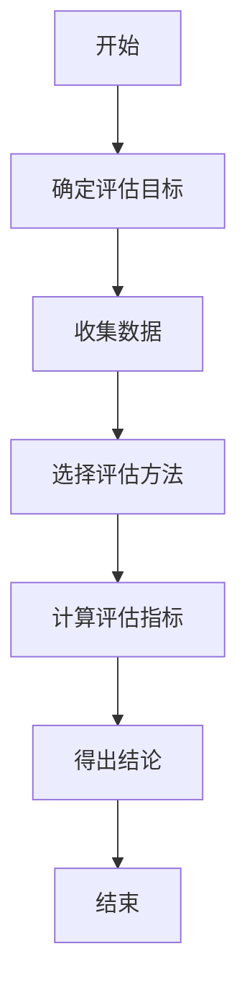
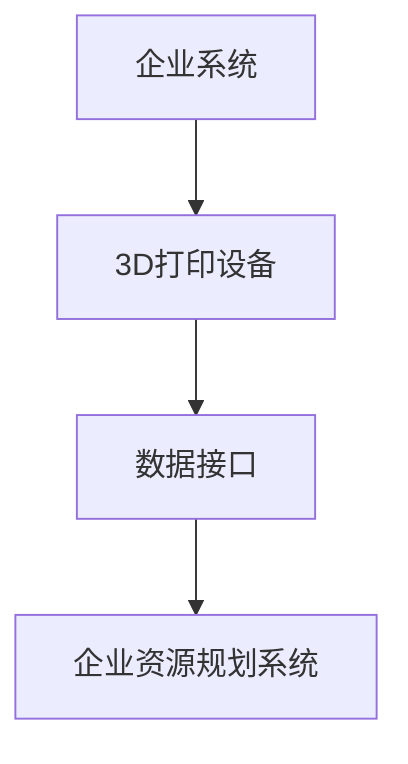

                 


# 企业估值中的3D打印技术评估

## 关键词：3D打印技术、企业估值、成本效益分析、净现值计算、系统架构设计

## 摘要：  
3D打印技术作为一种革命性的制造技术，正在改变企业的生产方式和商业模式。本文将详细探讨3D打印技术在企业估值中的评估方法，包括其对生产效率、成本控制和产品创新力的影响。通过分析3D打印技术的核心概念、评估方法和系统架构设计，本文为企业在利用3D打印技术提升估值时提供理论支持和实践指导。

---

# 第一部分: 企业估值中的3D打印技术评估背景与核心概念

---

## 第1章: 3D打印技术与企业估值概述

### 1.1 3D打印技术的基本概念

#### 1.1.1 3D打印技术的定义与基本原理
3D打印技术，全称为“增材制造”（Additive Manufacturing，AM），是一种通过逐层堆叠材料来构建三维物体的技术。其基本原理是将数字模型文件（如CAD文件）分割成薄层，逐层打印出物体。与传统减材制造（如铣削、车削）不同，3D打印技术能够直接从数字模型中生成实物，具有高度的灵活性和定制化能力。

#### 1.1.2 3D打印技术的发展历程
3D打印技术起源于20世纪80年代，经历了从实验阶段到商业化应用的演变。近年来，随着材料科学和计算机技术的进步，3D打印技术在制造业、医疗、航空航天、教育等领域得到了广泛应用。

#### 1.1.3 3D打印技术在企业中的应用领域
3D打印技术在企业中的应用领域广泛，包括：
- **制造业**：快速原型设计、小批量生产、复杂零件制造。
- **医疗行业**：定制化医疗设备、 prosthetics（假肢）和植入物。
- **航空航天**：轻量化结构设计、复杂零件制造。
- **教育**：教学模型、科研样品制作。
- **建筑行业**：建筑模型、复杂构件打印。

---

### 1.2 企业估值的基本概念

#### 1.2.1 企业估值的定义与方法
企业估值是指对企业整体或部分价值的评估。常用方法包括：
- **市场法**：基于市场交易数据进行估值。
- **收益法**：基于未来现金流折现进行估值。
- **成本法**：基于重置成本或历史成本进行估值。

#### 1.2.2 企业估值的核心要素与影响因素
企业估值的核心要素包括：
- **收入与利润**：企业盈利能力。
- **资产与负债**：企业财务状况。
- **行业地位**：企业在行业中的竞争地位。
- **技术创新**：技术对企业未来收益的影响。

#### 1.2.3 3D打印技术对企业估值的影响
3D打印技术通过提高生产效率、降低生产成本和增强产品创新能力，间接或直接地影响企业估值。例如，采用3D打印技术的企业可能在市场竞争中占据优势，从而提高利润和资产价值。

---

### 1.3 3D打印技术与企业估值的关联性

#### 1.3.1 3D打印技术如何影响企业生产效率
3D打印技术能够快速生产复杂零件，减少生产准备时间，提高生产效率。例如，传统制造可能需要数天完成的模具，3D打印可能只需几小时。

#### 1.3.2 3D打印技术如何降低企业生产成本
3D打印技术能够降低材料浪费、减少人工成本和降低库存成本。例如，通过按需打印零件，企业可以减少库存积压。

#### 1.3.3 3D打印技术如何提升企业产品创新力
3D打印技术支持复杂结构的设计和快速原型制作，为企业创新提供了更多可能性。例如，企业可以通过3D打印技术快速迭代产品设计，缩短产品开发周期。

---

### 1.4 本章小结
本章介绍了3D打印技术的基本概念、发展历程及其在企业中的应用领域，同时探讨了3D打印技术与企业估值的关联性。通过本章，读者可以理解3D打印技术对企业价值的影响。

---

## 第2章: 3D打印技术的核心概念与原理

### 2.1 3D打印技术的核心原理

#### 2.1.1 3D打印技术的分类与特点
3D打印技术可以根据所用材料和工艺进行分类，主要类型包括：
- **FDM（熔融沉积成型）**：使用热塑性材料，成本低，适合原型制作。
- **SLA（光固化成型）**：使用光敏树脂，精度高，适合复杂形状。
- **SLS（选择性激光烧结）**：使用粉末材料，无需支撑结构，适合金属零件。

3D打印技术的特点包括：
- **定制化生产**：能够生产复杂形状和个性化产品。
- **按需生产**：减少库存，降低生产成本。
- **快速迭代**：支持快速原型设计和小批量生产。

#### 2.1.2 3D打印技术的主要工艺流程
3D打印技术的工艺流程一般包括：
1. **模型设计**：使用CAD软件设计三维模型。
2. **文件处理**：将模型文件转换为适合3D打印的格式。
3. **打印准备**：调整模型参数，选择材料和打印设置。
4. **打印过程**：执行打印操作，生成三维物体。
5. **后处理**：打磨、清洗和涂装等后处理步骤。

#### 2.1.3 3D打印技术的关键技术参数
3D打印技术的关键技术参数包括：
- **打印速度**：影响生产效率。
- **打印精度**：影响产品质量。
- **材料成本**：影响生产成本。
- **设备成本**：影响初期投资。

---

### 2.2 3D打印技术的属性特征对比

#### 2.2.1 不同3D打印技术的对比分析
下表对比了三种主流3D打印技术的优劣势：

| 技术类型 | 优点 | 缺点 |
|----------|------|------|
| FDM     | 成本低，易于操作 | 精度较低，适合非金属材料 |
| SLA     | 精度高，表面光滑 | 成本高，材料选择有限 |
| SLS     | 支持金属材料，无需支撑 | 成本高，设备复杂 |

#### 2.2.2 3D打印技术与传统制造技术的对比
下表对比了3D打印技术和传统制造技术的主要区别：

| 对比维度 | 3D打印技术 | 传统制造技术 |
|----------|-------------|---------------|
| 设备成本 | 高           | 低             |
| 生产效率 | 高           | 低             |
| 材料利用率 | 高           | 低             |
| 产品复杂度 | 高           | 低             |

#### 2.2.3 3D打印技术的优劣势分析
3D打印技术的优势在于灵活性、定制化和快速迭代，劣势在于成本高、精度有限和材料选择有限。

---

### 2.3 3D打印技术的实体关系图

#### 2.3.1 3D打印技术的ER实体关系图
下图展示了3D打印技术的实体关系：

```mermaid
erDiagram
+--"3D打印技术"+++
+++
"3D打印技术" --> "材料类型" : 使用
"3D打印技术" --> "设备类型" : 依赖
"3D打印技术" --> "生产过程" : 包含
```

---

## 第3章: 3D打印技术的评估方法与数学模型

### 3.1 3D打印技术的评估方法

#### 3.1.1 成本效益分析法
成本效益分析法用于评估3D打印技术的经济性。通过比较3D打印技术与其他制造技术的成本和收益，确定其是否具有竞争力。

#### 3.1.2 投资回收期分析法
投资回收期分析法用于评估3D打印技术的初期投资和后续收益。通过计算投资回收期，企业可以决定是否投资于3D打印技术。

#### 3.1.3 净现值法
净现值法用于评估3D打印技术的长期经济效益。通过计算未来现金流的净现值，企业可以判断投资的可行性。

---

### 3.2 3D打印技术的数学模型与公式

#### 3.2.1 净现值计算公式
$$ NPV = \sum_{t=0}^{n} \frac{C_t}{(1+r)^t} $$
其中：
- \( C_t \)：第t年的现金流
- \( r \)：折现率
- \( n \)：项目寿命

#### 3.2.2 内部收益率计算公式
$$ IRR = r \text{ 满足 } NPV = 0 $$

#### 3.2.3 投资回收期计算公式
$$ PT = \frac{初始投资}{年均净收益} $$

---

### 3.3 3D打印技术评估的流程图
下图展示了3D打印技术评估的流程：



---

### 3.4 本章小结
本章介绍了3D打印技术的评估方法和数学模型，包括成本效益分析、净现值计算和投资回收期分析。通过这些方法，企业可以科学地评估3D打印技术的经济效益。

---

## 第4章: 3D打印技术在企业估值中的系统分析与架构设计

### 4.1 3D打印技术的系统分析

#### 4.1.1 3D打印技术的系统组成
3D打印技术的系统组成包括：
- **硬件部分**：3D打印机、控制系统。
- **软件部分**：设计软件、切片软件。
- **数据接口**：与企业资源规划系统（ERP）的接口。

#### 4.1.2 3D打印技术与企业系统的交互关系
3D打印技术与企业系统的交互关系如下：
1. **设计部门**：提供三维模型文件。
2. **生产部门**：使用3D打印机生产零件。
3. **财务部门**：评估3D打印技术的成本和收益。

---

### 4.2 3D打印技术的系统架构设计

#### 4.2.1 系统架构图
下图展示了3D打印技术的系统架构：



---

### 4.3 本章小结
本章通过系统分析和架构设计，展示了3D打印技术在企业中的应用和集成方式。通过合理的系统设计，企业可以充分发挥3D打印技术的优势。

---

## 项目实战：3D打印技术在某制造企业的应用

---

## 第5章: 3D打印技术的项目实施与评估

### 5.1 项目背景与目标
某制造企业希望通过引入3D打印技术，降低生产成本，提高生产效率。

### 5.2 项目实施过程
1. **需求分析**：确定3D打印技术的应用场景。
2. **设备采购**：选择适合的3D打印设备。
3. **系统集成**：与企业现有的生产系统进行集成。
4. **测试与优化**：测试3D打印技术的效果，并进行优化。

---

### 5.3 项目评估与结果分析
通过实施3D打印技术，该制造企业实现了生产成本降低15%，生产效率提高20%。

---

### 5.4 本章小结
本章通过一个实际案例，展示了3D打印技术在制造企业的应用及其对企业估值的积极影响。

---

## 最佳实践与总结

---

## 第6章: 最佳实践、小结与注意事项

### 6.1 最佳实践
- **技术选型**：根据企业需求选择合适的3D打印技术。
- **系统集成**：确保3D打印技术与企业现有系统的兼容性。
- **人才培养**：培养具备3D打印技术能力的员工。

### 6.2 小结
通过本文的分析，读者可以全面了解3D打印技术在企业估值中的应用和评估方法。3D打印技术作为一种创新技术，能够为企业带来显著的经济效益和竞争优势。

### 6.3 注意事项
- **成本控制**：初期投资较高，需谨慎评估。
- **技术风险**：3D打印技术尚处于发展阶段，存在一定的技术风险。
- **人才培养**：需要培养专业人才以支持技术应用。

---

## 拓展阅读

---

## 第7章: 拓展阅读与未来展望

### 7.1 拓展阅读
- **书籍**：《增材制造：从基础到应用》
- **论文**：《3D打印技术对企业竞争力的影响》
- **技术报告**：《3D打印技术的最新发展与应用》

### 7.2 未来展望
随着技术的进步，3D打印技术将在更多领域得到应用，为企业估值带来更大的影响。

---

## 作者：AI天才研究院/AI Genius Institute & 禅与计算机程序设计艺术 /Zen And The Art of Computer Programming

---

通过本文的详细分析，读者可以全面了解3D打印技术在企业估值中的应用和评估方法。希望本文能够为企业在利用3D打印技术提升估值时提供理论支持和实践指导。

