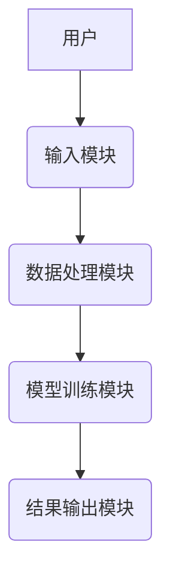

                 


# 企业估值中的5G应用场景评估

## 关键词：企业估值，5G技术，应用场景，评估模型，数学公式

## 摘要：本文深入探讨了5G技术在企业估值中的应用场景，分析了多种评估模型和算法原理，结合实际案例进行了详细解读，为企业在5G时代的估值提供了新的视角和方法。

---

## 第1章: 5G技术与企业估值的背景介绍

### 1.1 5G技术的基本概念

#### 1.1.1 5G技术的核心特点
5G技术相比4G，具有更高的传输速度、更低的延迟、更大的连接密度和更强的网络容量。其核心特点包括：
- **高带宽**：理论峰值速率可达10Gbps以上。
- **低延迟**：端到端时延可低至1毫秒。
- **大规模连接**：支持每平方公里百万级连接。
- **网络切片**：可根据需求定制网络性能。

#### 1.1.2 5G技术的演进历程
5G技术的发展经历了从概念提出、标准制定到实际部署的阶段。其演进历程可以分为以下几个阶段：
1. **需求提出阶段**：2010年代初，行业开始意识到4G技术的局限性。
2. **标准制定阶段**：3GPP等标准化组织开始制定5G技术标准。
3. **试验部署阶段**：各国开始建设5G试验网络。
4. **大规模商用阶段**：5G网络逐步覆盖全球。

#### 1.1.3 5G技术对企业估值的影响
5G技术通过提升企业的生产效率、优化业务流程和拓展新的市场机会，显著影响企业估值。具体表现在：
- 提升企业的运营效率。
- 降低企业的运营成本。
- 增强企业的市场竞争力。

### 1.2 企业估值的基本概念

#### 1.2.1 企业估值的定义与方法
企业估值是指对企业整体或其组成部分的价值进行评估的过程。常用的方法包括：
- **收益法**：基于未来现金流的折现值。
- **成本法**：基于重置成本或历史成本。
- **市场法**：基于可比企业的交易价格。

#### 1.2.2 企业估值的核心要素
企业估值的核心要素包括：
- **财务表现**：收入、利润、现金流等。
- **市场地位**：市场份额、品牌影响力。
- **技术创新**：技术储备和研发能力。
- **管理团队**：管理能力和发展战略。

#### 1.2.3 5G技术与企业估值的结合
5G技术通过提升企业的数字化能力，为企业估值提供了新的维度。具体包括：
- 提升企业的数据处理能力。
- 增强企业的智能化水平。
- 优化企业的业务流程。

### 1.3 5G应用场景的分类与特点

#### 1.3.1 智慧城市中的5G应用场景
智慧城市是5G技术的重要应用场景之一，主要包括：
- **智能交通**：实现车辆与道路的实时通信。
- **智能安防**：通过5G实现高清监控视频的实时传输。
- **智能能源**：优化电力分配和管理。

#### 1.3.2 工业互联网中的5G应用场景
工业互联网是5G技术的另一个重要应用场景，主要包括：
- **智能制造**：实现生产设备的智能化控制。
- **工业物联网**：通过5G实现设备间的实时通信。
- **供应链优化**：通过5G实现供应链的实时监控。

#### 1.3.3 智慧医疗中的5G应用场景
智慧医疗是5G技术在垂直行业的典型应用，主要包括：
- **远程诊疗**：实现医生与患者的远程诊疗。
- **医疗影像**：通过5G传输高清医学影像。
- **智能健康监测**：实时监测患者的健康状况。

---

## 第2章: 5G技术在企业估值中的核心概念

### 2.1 5G应用场景的评估指标

#### 2.1.1 技术可行性分析
技术可行性分析是评估5G应用场景的重要指标，主要包括：
- **网络覆盖**：是否满足应用场景的网络需求。
- **设备支持**：是否具备支持5G技术的硬件设备。
- **技术成熟度**：5G技术在应用场景中的成熟度。

#### 2.1.2 经济效益分析
经济效益分析是评估5G应用场景的重要指标，主要包括：
- **成本节约**：是否能够降低企业的运营成本。
- **收入增长**：是否能够为企业带来新的收入来源。
- **投资回报**：是否能够实现投资回报的最大化。

#### 2.1.3 市场潜力分析
市场潜力分析是评估5G应用场景的重要指标，主要包括：
- **市场规模**：目标市场的规模。
- **市场增长速度**：市场的增长潜力。
- **竞争格局**：市场竞争的激烈程度。

### 2.2 5G应用场景的评估模型

#### 2.2.1 层次分析法（AHP）
层次分析法是一种常用的多准则决策方法，适用于复杂问题的决策分析。其基本步骤如下：
1. **构建层次结构**：将问题分解为多个层次，包括目标层、准则层和方案层。
2. **构造判断矩阵**：根据专家意见构造判断矩阵，表示各准则之间的相对重要性。
3. **计算权重**：通过计算判断矩阵的最大特征值和特征向量，得到各准则的权重。
4. **进行排序**：根据各方案的得分，进行排序。

#### 2.2.2 专家评分法
专家评分法是一种基于专家意见的评估方法，适用于缺乏数据支持的情况。其基本步骤如下：
1. **确定评估指标**：根据应用场景的特点，确定评估指标。
2. **邀请专家评分**：邀请相关领域的专家对各指标进行评分。
3. **计算综合得分**：根据专家评分，计算各方案的综合得分。
4. **进行排序**：根据综合得分，进行排序。

#### 2.2.3 机器学习模型
机器学习模型是一种基于数据驱动的评估方法，适用于数据量较大的情况。常用的机器学习模型包括：
- **线性回归模型**：适用于线性关系的预测。
- **支持向量机（SVM）**：适用于分类问题。
- **神经网络模型**：适用于复杂非线性关系的预测。

---

## 第3章: 5G应用场景的评估算法原理

### 3.1 层次分析法（AHP）的原理与实现

#### 3.1.1 AHP的基本原理
层次分析法（AHP）是一种定性和定量相结合的决策分析方法。它通过构建层次结构，将复杂问题分解为多个子问题，并通过专家评分和数学计算，得到各子问题的权重。

#### 3.1.2 AHP的步骤与流程
AHP的步骤包括：
1. **构建层次结构**：将问题分解为目标层、准则层和方案层。
2. **构造判断矩阵**：根据专家意见，构造判断矩阵。
3. **计算权重**：通过计算判断矩阵的最大特征值和特征向量，得到各准则的权重。
4. **进行排序**：根据各方案的得分，进行排序。

#### 3.1.3 AHP的权重计算公式
层次分析法的权重计算公式如下：
$$
\lambda_{max} = \frac{\sum_{j} \lambda_{ij} \cdot a_{ij}}{\sum_{j} \lambda_{ij}}
$$
其中，$\lambda_{max}$为最大特征值，$\lambda_{ij}$为判断矩阵的元素，$a_{ij}$为判断矩阵的元素。

### 3.2 机器学习模型的原理与实现

#### 3.2.1 线性回归模型
线性回归模型是一种常用的预测模型，适用于线性关系的预测。其基本公式为：
$$
y = \beta_0 + \beta_1 x_1 + \beta_2 x_2 + \cdots + \beta_n x_n + \epsilon
$$
其中，$y$为因变量，$x_i$为自变量，$\beta_i$为回归系数，$\epsilon$为误差项。

#### 3.2.2 支持向量机（SVM）
支持向量机是一种常用的分类模型，适用于非线性可分的数据。其基本原理是通过映射函数将数据映射到高维空间，并在高维空间中寻找最优分类超平面。

#### 3.2.3 神经网络模型
神经网络模型是一种常用的预测模型，适用于复杂非线性关系的预测。其基本结构包括输入层、隐藏层和输出层，通过反向传播算法进行训练。

---

## 第4章: 5G应用场景的数学模型与公式

### 4.1 5G应用场景的评分标准

#### 4.1.1 技术可行性评分公式
$$
F_t = \frac{\sum_{i=1}^{n} w_i x_i}{\sum_{i=1}^{n} w_i}
$$
其中，$F_t$为技术可行性评分，$w_i$为各指标的权重，$x_i$为各指标的评分。

#### 4.1.2 经济效益评分公式
$$
F_e = \frac{\sum_{i=1}^{n} w_i x_i}{\sum_{i=1}^{n} w_i}
$$
其中，$F_e$为经济效益评分，$w_i$为各指标的权重，$x_i$为各指标的评分。

### 4.2 5G应用场景的综合评估模型

#### 4.2.1 综合评分公式
$$
F = \alpha F_t + (1-\alpha) F_e
$$
其中，$\alpha$为技术与经济的权重系数。

---

## 第5章: 5G应用场景的系统分析与架构设计

### 5.1 系统功能设计

#### 5.1.1 5G应用场景的识别模块
识别模块的主要功能包括：
1. **数据采集**：采集企业的5G应用场景数据。
2. **数据清洗**：对数据进行预处理，去除噪声数据。
3. **特征提取**：提取数据的特征，用于后续分析。

#### 5.1.2 5G应用场景的评估模块
评估模块的主要功能包括：
1. **模型训练**：训练机器学习模型，用于预测企业估值。
2. **模型预测**：根据输入数据，预测企业的估值。
3. **结果输出**：输出预测结果，供企业决策参考。

#### 5.1.3 5G应用场景的优化模块
优化模块的主要功能包括：
1. **模型优化**：优化机器学习模型的参数，提高预测精度。
2. **策略制定**：根据预测结果，制定优化策略。
3. **实施优化**：实施优化策略，提升企业的估值。

### 5.2 系统架构设计

#### 5.2.1 系统架构图


#### 5.2.2 系统接口设计
系统接口设计包括：
1. **输入接口**：接收用户的输入数据。
2. **输出接口**：输出模型的预测结果。
3. **数据库接口**：与数据库进行交互，存储和检索数据。

#### 5.2.3 系统交互设计
系统交互设计包括：
1. **用户交互**：用户输入数据，系统进行处理。
2. **系统反馈**：系统输出预测结果，供用户参考。
3. **数据存储**：系统将数据存储到数据库中，供后续分析使用。

---

## 第6章: 5G应用场景的项目实战

### 6.1 项目环境

#### 6.1.1 系统环境
- 操作系统：Linux
- 开发工具：PyCharm
- 数据库：MySQL

#### 6.1.2 依赖安装
安装所需的Python库：
```bash
pip install numpy
pip install scikit-learn
pip install matplotlib
```

### 6.2 系统核心实现源代码

#### 6.2.1 数据预处理代码
```python
import numpy as np
import pandas as pd

# 读取数据
data = pd.read_csv('data.csv')

# 数据清洗
data.dropna(inplace=True)

# 特征提取
X = data.iloc[:, :-1].values
y = data.iloc[:, -1].values
```

#### 6.2.2 机器学习模型实现代码
```python
from sklearn.model import LinearRegression

# 训练模型
model = LinearRegression()
model.fit(X, y)

# 预测结果
y_pred = model.predict(X)
```

### 6.3 代码应用解读与分析

#### 6.3.1 数据预处理
数据预处理是机器学习模型实现的基础，主要包括数据清洗和特征提取。通过数据清洗，可以去除噪声数据，提高模型的预测精度。通过特征提取，可以提取数据的特征，为后续的模型训练提供数据支持。

#### 6.3.2 机器学习模型实现
机器学习模型的实现是系统的核心部分，主要包括模型训练和模型预测。通过模型训练，可以得到最优的模型参数。通过模型预测，可以对输入数据进行预测，得到企业的估值。

### 6.4 实际案例分析

#### 6.4.1 案例背景
某智能制造企业希望利用5G技术优化其生产流程，提高生产效率。

#### 6.4.2 案例分析
通过机器学习模型的实现，可以预测企业的估值，为企业决策提供参考。

#### 6.4.3 案例总结
通过5G技术的应用，企业的生产效率和市场竞争力得到了显著提升，企业估值也得到了提高。

---

## 第7章: 最佳实践与小结

### 7.1 最佳实践

#### 7.1.1 选择合适的模型
根据企业的具体需求和数据特点，选择合适的机器学习模型。例如，对于线性关系的预测，可以选择线性回归模型；对于分类问题，可以选择支持向量机模型。

#### 7.1.2 数据处理
数据是机器学习模型的基础，因此在数据处理过程中，需要确保数据的准确性和完整性。通过数据清洗和特征提取，可以提高模型的预测精度。

### 7.2 小结
本文深入探讨了5G技术在企业估值中的应用场景，分析了多种评估模型和算法原理，结合实际案例进行了详细解读，为企业在5G时代的估值提供了新的视角和方法。未来，随着5G技术的不断发展，其在企业估值中的应用将更加广泛和深入。

---

## 作者：AI天才研究院/AI Genius Institute & 禅与计算机程序设计艺术 /Zen And The Art of Computer Programming

