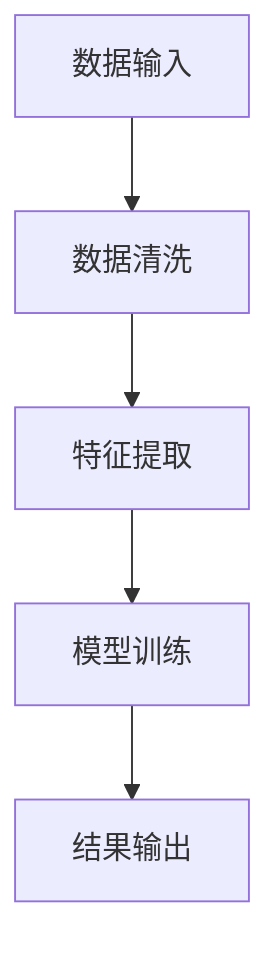
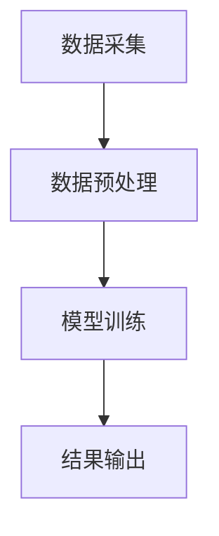
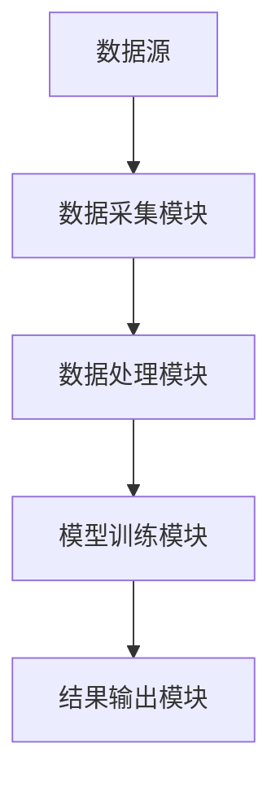

                 


# 《企业估值中的AI辅助诊断系统评估》

> **关键词**：企业估值、人工智能、辅助诊断系统、算法原理、系统架构

> **摘要**：本文深入探讨了AI辅助诊断系统在企业估值中的应用，分析了传统估值方法的局限性，详细介绍了AI辅助诊断系统的核心概念、算法原理、系统架构，以及实际项目中的实现与应用。通过具体的案例分析和系统设计，展示了AI技术如何提升企业估值的准确性和效率。

---

## 第一部分: 企业估值中的AI辅助诊断系统概述

### 第1章: 企业估值与AI辅助诊断系统概述

#### 1.1 企业估值的基本概念

##### 1.1.1 企业估值的定义与作用
企业估值是指对企业整体价值的评估，通常用于投资决策、并购重组、融资等活动。传统的企业估值方法主要包括财务指标分析、市场比较法和DCF模型等，但这些方法存在数据依赖性强、主观性高、难以捕捉市场动态等问题。

##### 1.1.2 传统企业估值方法的局限性
传统估值方法依赖于历史数据和假设条件，难以实时反映企业的动态变化。此外，人工分析的主观性和复杂性可能导致结果偏差。

##### 1.1.3 AI技术在企业估值中的应用前景
AI技术能够通过大数据分析和机器学习算法，实时捕捉市场动态和企业经营状况，为估值提供更准确和及时的支持。

#### 1.2 AI辅助诊断系统的基本概念

##### 1.2.1 AI辅助诊断系统的定义
AI辅助诊断系统是指利用人工智能技术，通过分析企业的财务数据、市场表现和经营环境等多维度信息，提供企业估值支持的智能化系统。

##### 1.2.2 AI辅助诊断系统的特点
- **数据驱动**：基于大量数据进行分析和预测。
- **实时性**：能够实时更新数据，捕捉市场变化。
- **准确性**：通过算法优化，提高估值的准确性。

##### 1.2.3 AI辅助诊断系统与传统诊断方法的区别
AI辅助诊断系统通过自动化和智能化的方式，克服了传统方法的主观性和局限性，能够提供更全面和精准的诊断结果。

#### 1.3 企业估值中的AI辅助诊断系统需求

##### 1.3.1 企业估值中的关键问题
- 数据的多样性和复杂性。
- 市场动态变化对企业估值的影响。
- 如何快速响应市场变化。

##### 1.3.2 AI辅助诊断系统在企业估值中的需求
- 实时数据采集与处理能力。
- 高效的算法模型。
- 用户友好的交互界面。

##### 1.3.3 企业估值中的AI辅助诊断系统的边界与外延
AI辅助诊断系统仅提供估值支持，不直接参与企业决策，其边界包括数据输入、模型计算和结果输出。

---

### 第2章: 企业估值中的AI辅助诊断系统核心概念

#### 2.1 企业估值中的关键要素

##### 2.1.1 企业财务数据
包括收入、利润、资产负债表等财务指标。

##### 2.1.2 企业市场表现
包括股价波动、市场占有率等。

##### 2.1.3 企业经营环境
包括行业趋势、政策变化等。

#### 2.2 AI辅助诊断系统的核心模块

##### 2.2.1 数据采集模块
负责收集企业的财务数据、市场数据和经营环境数据。

##### 2.2.2 数据预处理模块
对数据进行清洗、标准化和特征提取。

##### 2.2.3 模型训练与评估模块
基于机器学习算法训练模型，并对模型进行评估和优化。

##### 2.2.4 结果分析与诊断模块
对模型输出的结果进行分析，并提供诊断建议。

#### 2.3 企业估值与AI辅助诊断系统的概念结构

##### 2.3.1 企业估值的流程图


##### 2.3.2 AI辅助诊断系统的模块化结构


##### 2.3.3 企业估值与AI辅助诊断系统的交互关系


---

## 第二部分: 企业估值中的AI辅助诊断系统核心要素

### 第3章: 企业估值中的AI辅助诊断系统核心要素

#### 3.1 数据采集与处理

##### 3.1.1 数据采集方法
通过API接口、爬虫技术等获取企业数据。

##### 3.1.2 数据预处理步骤
包括数据清洗、缺失值处理和特征提取。

##### 3.1.3 数据存储与管理
使用数据库或大数据平台存储数据。

#### 3.2 AI辅助诊断系统的算法选择

##### 3.2.1 选择算法的原则
根据数据类型和业务需求选择合适的算法。

##### 3.2.2 常用算法介绍
包括线性回归、随机森林和神经网络等。

##### 3.2.3 算法优缺点对比
| 算法 | 优点 | 缺点 |
|------|------|------|
| 线性回归 | 简单易懂 | 无法处理非线性关系 |
| 随机森林 | 高准确性 | 计算复杂 |
| 神经网络 | 强大学习能力 | 需要大量数据 |

#### 3.3 系统功能设计

##### 3.3.1 功能模块划分
包括数据输入、模型训练、结果输出等模块。

##### 3.3.2 功能实现步骤
1. 数据输入与清洗。
2. 模型训练与优化。
3. 结果输出与诊断。

##### 3.3.3 功能实现示意图


---

## 第三部分: 企业估值中的AI辅助诊断系统算法原理

### 第4章: 企业估值中的AI辅助诊断系统算法原理

#### 4.1 算法选择与实现

##### 4.1.1 算法选择的依据
根据数据类型和业务需求选择合适的算法。

##### 4.1.2 算法实现步骤
1. 数据预处理。
2. 模型训练。
3. 模型评估。

##### 4.1.3 算法实现示例
```python
import pandas as pd
from sklearn.linear_model import LinearRegression

# 数据加载
data = pd.read_csv('企业数据.csv')

# 特征提取
X = data[['收入', '利润']]
y = data['估值']

# 模型训练
model = LinearRegression()
model.fit(X, y)

# 模型预测
predictions = model.predict(X)
```

#### 4.2 算法原理与数学模型

##### 4.2.1 线性回归模型
$$ y = \beta_0 + \beta_1 x_1 + \beta_2 x_2 + ... + \beta_n x_n $$

##### 4.2.2 神经网络模型
$$ y = f(Wx + b) $$

##### 4.2.3 算法优缺点分析
| 算法 | 优点 | 缺点 |
|------|------|------|
| 线性回归 | 简单易懂 | 无法处理非线性关系 |
| 神经网络 | 强大学习能力 | 需要大量数据 |

#### 4.3 算法实现与优化

##### 4.3.1 算法实现步骤
1. 数据预处理。
2. 模型训练。
3. 模型评估。
4. 模型优化。

##### 4.3.2 算法优化方法
包括参数调优、模型集成和降维技术等。

---

## 第四部分: 企业估值中的AI辅助诊断系统系统架构

### 第5章: 企业估值中的AI辅助诊断系统系统架构

#### 5.1 系统功能设计

##### 5.1.1 系统功能模块
包括数据采集、数据处理、模型训练和结果输出等模块。

##### 5.1.2 系统功能流程
1. 数据采集。
2. 数据预处理。
3. 模型训练。
4. 结果输出。

##### 5.1.3 系统功能设计示意图


#### 5.2 系统架构设计

##### 5.2.1 系统架构图


##### 5.2.2 系统组件交互
1. 数据采集模块与数据处理模块交互。
2. 数据处理模块与模型训练模块交互。
3. 模型训练模块与结果输出模块交互。

##### 5.2.3 系统架构设计优缺点
- 优点：模块化设计，便于扩展和维护。
- 缺点：组件之间依赖性强，可能影响性能。

---

## 第五部分: 企业估值中的AI辅助诊断系统项目实战

### 第6章: 企业估值中的AI辅助诊断系统项目实战

#### 6.1 环境安装与配置

##### 6.1.1 环境配置步骤
1. 安装Python。
2. 安装必要的库（如Pandas、Scikit-learn）。

##### 6.1.2 环境配置示例
```bash
pip install pandas scikit-learn
```

#### 6.2 系统核心实现

##### 6.2.1 核心代码实现
```python
import pandas as pd
from sklearn.linear_model import LinearRegression

# 数据加载
data = pd.read_csv('企业数据.csv')

# 特征提取
X = data[['收入', '利润']]
y = data['估值']

# 模型训练
model = LinearRegression()
model.fit(X, y)

# 模型预测
predictions = model.predict(X)
```

##### 6.2.2 代码实现解读
1. 数据加载与特征提取。
2. 模型训练与预测。

#### 6.3 实际案例分析

##### 6.3.1 案例背景
某企业财务数据和市场表现。

##### 6.3.2 数据分析与模型训练
通过模型训练得到企业估值。

##### 6.3.3 结果分析
模型输出结果并进行分析。

#### 6.4 项目小结

##### 6.4.1 项目总结
项目实现了AI辅助诊断系统在企业估值中的应用。

##### 6.4.2 经验与教训
数据质量对模型性能的影响。

---

## 第六部分: 企业估值中的AI辅助诊断系统最佳实践

### 第7章: 企业估值中的AI辅助诊断系统最佳实践

#### 7.1 最佳实践 tips

##### 7.1.1 数据质量的重要性
数据清洗和特征提取是关键。

##### 7.1.2 模型调优的必要性
通过交叉验证优化模型性能。

##### 7.1.3 系统维护与更新
定期更新数据和模型。

#### 7.2 小结与展望

##### 7.2.1 小结
本文详细介绍了AI辅助诊断系统在企业估值中的应用。

##### 7.2.2 未来展望
随着AI技术的发展，企业估值将更加智能化和精准化。

---

## 作者：AI天才研究院/AI Genius Institute & 禅与计算机程序设计艺术 /Zen And The Art of Computer Programming

---

**注意**：由于篇幅限制，上述内容为文章的框架和部分章节内容。完整文章需要根据上述框架和要求，逐步补充每部分的具体内容，确保每章每节内容详细具体，并严格按照格式和逻辑要求进行撰写。

