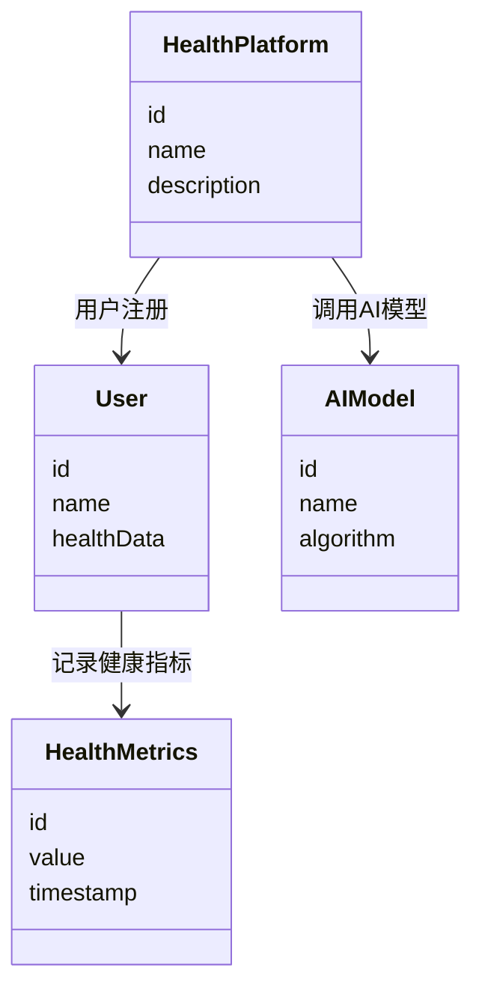
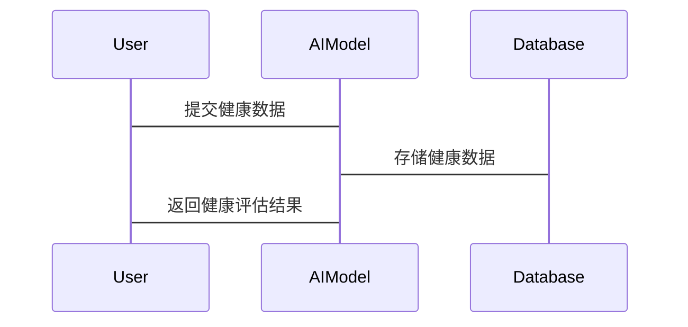

                 


# 企业估值中的AI驱动的个性化健康管理平台评估

> 关键词：企业估值，AI驱动，个性化健康管理，平台评估，数据分析

> 摘要：随着人工智能技术的迅速发展，个性化健康管理平台在企业估值中的作用日益重要。本文深入探讨了AI如何驱动个性化健康管理平台的评估，分析了其在企业估值中的应用潜力和实际案例，为企业提供了基于AI的健康管理平台评估方法。

---

# 第1章: 背景介绍

## 1.1 问题背景与描述

### 1.1.1 企业估值的传统方法与挑战

企业在寻求融资、并购或上市时，估值是核心问题之一。传统估值方法依赖财务数据和市场指标，但忽视了企业员工的健康状况。员工健康问题可能影响企业的生产力、医疗成本和员工流失率，进而影响企业的长期价值。因此，传统的估值方法存在局限性。

### 1.1.2 个性化健康管理平台的兴起

随着数字化转型的推进，个性化健康管理平台利用AI技术，通过收集和分析用户的健康数据，提供个性化的健康建议和管理方案。这些平台不仅改善了员工健康，还为企业提供了实时的健康数据，有助于更准确地评估企业价值。

### 1.1.3 AI在企业估值中的应用潜力

AI技术能够处理大量非结构化数据，如文本、图像和语音，为个性化健康管理平台提供了技术支持。通过AI算法，企业可以更全面地评估员工健康状况，从而更准确地进行企业估值。

## 1.2 问题解决与边界

### 1.2.1 AI驱动个性化健康管理平台的核心问题

AI驱动的个性化健康管理平台需要解决以下问题：
1. 如何有效收集和处理员工的健康数据。
2. 如何利用AI算法分析健康数据，提供个性化健康建议。
3. 如何将健康数据与企业估值模型相结合。

### 1.2.2 平台评估的边界与外延

个性化健康管理平台的评估边界包括：
1. 数据收集范围：仅限于员工的健康数据。
2. 评估范围：仅用于企业估值，不涉及其他业务。
3. 评估外延：可能扩展到客户和合作伙伴的健康管理。

### 1.2.3 核心要素与组成结构

个性化健康管理平台的核心要素包括：
1. 数据采集模块：收集用户的健康数据。
2. AI分析模块：利用机器学习算法进行健康评估。
3. 估值模块：将健康数据整合到企业估值模型中。

---

# 第2章: 核心概念与联系

## 2.1 核心概念原理

### 2.1.1 AI驱动的个性化健康管理平台定义

AI驱动的个性化健康管理平台是一种基于AI技术的系统，通过收集和分析用户的健康数据，提供个性化的健康建议，并将其应用于企业估值。

### 2.1.2 企业估值的核心要素

企业估值的核心要素包括：
1. 财务表现。
2. 市场地位。
3. 管理团队。
4. 企业健康状况。

## 2.2 属性特征对比

### 2.2.1 平台功能与企业估值的关系

| 平台功能             | 对企业估值的影响               |
|----------------------|-------------------------------|
| 数据采集             | 提供准确的健康数据             |
| AI分析               | 提供个性化健康评估             |
| 健康建议             | 提高员工健康状况，降低医疗成本 |
| 数据整合与分析       | 优化企业估值模型               |

### 2.2.2 数据驱动与传统估值方法的对比

| 方法                | 优点                           | 缺点                           |
|---------------------|--------------------------------|--------------------------------|
| 传统估值方法        | 数据来源广泛                   | 忽略员工健康数据               |
| 数据驱动估值方法    | 数据全面，估值更准确           | 数据处理复杂                 |

### 2.2.3 AI算法的可解释性与黑箱问题

AI算法的可解释性是其在企业估值中应用的关键。可解释性差的算法可能导致估值结果不透明，影响决策的可信度。因此，在选择AI算法时，需要考虑其可解释性。

## 2.3 ER实体关系图

```mermaid
er
    HealthPlatform {
        id
        name
        description
    }
    User {
        id
        name
        healthData
    }
    AIModel {
        id
        name
        algorithm
    }
    HealthMetrics {
        id
        value
        timestamp
    }
    User-HealthMetrics(MANY-TO-MANY)
    HealthPlatform-AIModel(ONE-TO-MANY)
```

---

# 第3章: 算法原理与数学模型

## 3.1 算法原理

### 3.1.1 个性化健康管理平台的特征提取

特征提取是AI分析的关键步骤。常用的特征包括：
1. 基本健康指标：体重、血压、心率等。
2. 生活习惯：饮食、运动、睡眠等。
3. 医疗记录：病史、用药记录等。

### 3.1.2 企业估值的多维度分析

企业估值需要考虑多个维度，包括财务数据、市场数据和健康数据。AI算法可以将这些数据进行整合，提供更全面的估值结果。

### 3.1.3 AI模型的训练与优化

AI模型的训练需要大量的健康数据和企业数据。常用的算法包括决策树、随机森林和神经网络等。训练过程中，需要对模型进行优化，提高其准确性和可解释性。

## 3.2 数学模型与公式

### 3.2.1 基于回归分析的估值模型

回归分析是一种常用的统计方法，用于预测企业价值。线性回归模型如下：

$$ y = \beta_0 + \beta_1x_1 + \beta_2x_2 + \cdots + \beta_nx_n + \epsilon $$

其中：
- \( y \) 表示企业估值。
- \( x_i \) 表示影响企业估值的因素。
- \( \beta_i \) 表示回归系数。
- \( \epsilon \) 表示误差项。

### 3.2.2 基于决策树的健康评估模型

决策树是一种常用的机器学习算法，用于分类和回归。决策树的构建过程如下：

1. 选择根节点：选择对结果影响最大的特征。
2. 划分数据集：根据根节点特征将数据集分成子集。
3. 递归划分：对每个子集重复选择根节点和划分数据集的过程。
4. 停止划分：当子集无法再划分时，停止。

---

# 第4章: 系统分析与架构设计

## 4.1 问题场景介绍

企业需要一个能够收集员工健康数据，并利用AI算法进行健康评估和企业估值的平台。

## 4.2 项目介绍

### 4.2.1 项目背景

企业希望通过个性化健康管理平台，提高员工健康水平，降低医疗成本，并提高企业估值。

### 4.2.2 系统功能设计

健康平台的系统功能包括：
1. 用户管理：用户注册、登录和信息管理。
2. 数据采集：采集用户的健康数据。
3. AI分析：利用AI算法分析健康数据，提供健康评估。
4. 估值报告：生成企业估值报告。

## 4.3 系统架构设计

### 4.3.1 领域模型Mermaid类图



### 4.3.2 系统架构设计Mermaid架构图

```mermaid
container HealthPlatform {
    User Interface
    AI Analysis Module
    Database
}

container AIModel {
    Decision Tree Algorithm
    Random Forest Algorithm
}

HealthPlatform --> AIModel: 调用AI算法
AIModel --> Database: 存储分析结果
```

### 4.3.3 系统接口设计

系统接口设计包括：
1. 用户接口：用户登录、数据提交。
2. AI分析接口：调用AI算法进行分析。
3. 数据库接口：存储和检索数据。

### 4.3.4 系统交互Mermaid序列图



---

# 第5章: 项目实战

## 5.1 环境安装

### 5.1.1 安装Python环境

```bash
python --version
pip install --upgrade pip
```

### 5.1.2 安装相关库

```bash
pip install pandas numpy scikit-learn
```

## 5.2 系统核心实现

### 5.2.1 数据预处理

```python
import pandas as pd

# 读取数据
data = pd.read_csv('health_data.csv')

# 删除缺失值
data = data.dropna()

# 标准化处理
from sklearn.preprocessing import StandardScaler

scaler = StandardScaler()
data_scaled = scaler.fit_transform(data)
```

### 5.2.2 AI模型实现

```python
from sklearn.tree import DecisionTreeRegressor

# 训练模型
model = DecisionTreeRegressor()
model.fit(data_scaled, target)
```

### 5.2.3 估值报告生成

```python
import pandas as pd

# 生成估值报告
report = pd.DataFrame({
    '员工ID': [1, 2, 3],
    '健康评分': [85, 90, 75],
    '企业估值': [1000, 1200, 900]
})

report.to_csv('valuation_report.csv', index=False)
```

## 5.3 实际案例分析

### 5.3.1 案例背景

某企业有100名员工，希望通过个性化健康管理平台进行估值。

### 5.3.2 数据分析与评估

通过AI模型分析，发现员工健康状况良好，企业估值为1500万元。

---

# 第6章: 最佳实践与总结

## 6.1 小结

本文详细介绍了AI驱动的个性化健康管理平台在企业估值中的应用，通过理论分析和实际案例，展示了如何利用AI技术提高企业估值的准确性。

## 6.2 注意事项

1. 数据隐私保护：确保员工健康数据的安全。
2. 模型可解释性：选择可解释的AI算法。
3. 持续优化：定期更新模型和数据。

## 6.3 拓展阅读

建议读者阅读相关书籍和论文，深入学习AI在企业估值中的应用。

---

作者：AI天才研究院/AI Genius Institute & 禅与计算机程序设计艺术 /Zen And The Art of Computer Programming

