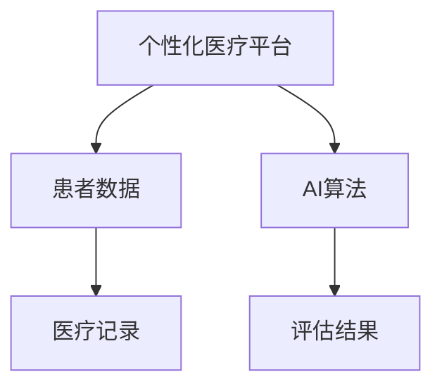
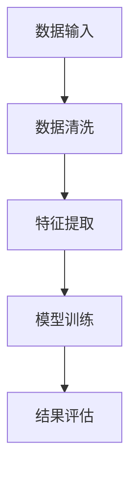
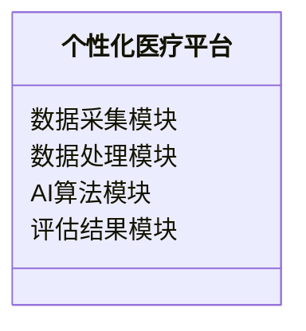
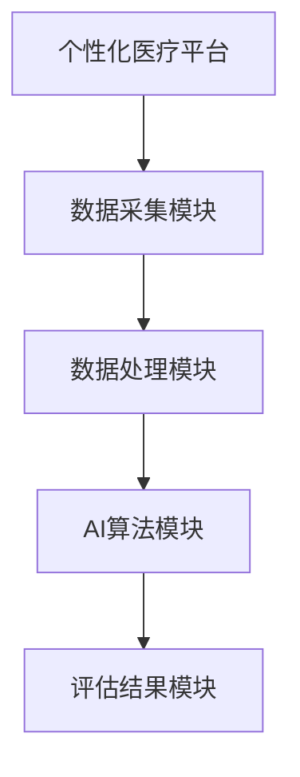
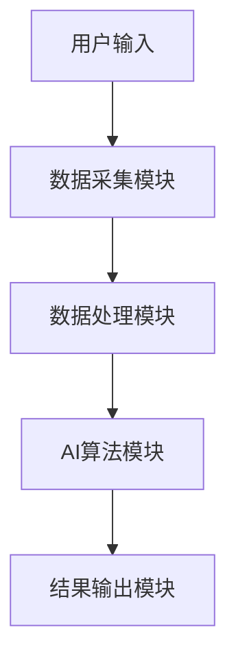

                 


# 企业估值中的AI驱动的个性化医疗平台评估

> 关键词：企业估值，AI驱动，个性化医疗，平台评估，机器学习，医疗数据

> 摘要：本文探讨如何利用人工智能技术评估个性化医疗平台的企业价值。文章首先介绍个性化医疗平台的定义与现状，分析传统估值方法的局限性，然后详细阐述AI驱动评估的核心原理、算法实现和系统架构设计，结合实际案例展示如何构建AI评估模型，最后总结经验与最佳实践。

---

# 第一部分: 个性化医疗平台评估的背景与核心概念

## 第1章: 个性化医疗平台评估的背景与问题描述

### 1.1 个性化医疗平台的定义与现状

#### 1.1.1 个性化医疗的定义
个性化医疗是一种基于患者个体特征（如基因、生活习惯、病史）制定个性化治疗方案的医疗模式。它通过整合多源数据，提供精准的诊断和治疗建议。

#### 1.1.2 个性化医疗平台的现状
随着基因测序技术的发展和AI的进步，个性化医疗平台逐渐成为医疗行业的重要组成部分。这类平台整合了电子健康记录、基因数据、生活习惯数据等，利用AI算法为患者提供个性化的医疗建议。

#### 1.1.3 个性化医疗平台的边界与外延
个性化医疗平台不仅包括诊断和治疗建议，还涉及患者的长期健康管理。其边界在于如何整合多源数据，并通过AI算法实现精准的医疗决策。

### 1.2 企业估值中的问题背景

#### 1.2.1 传统企业估值方法的局限性
传统估值方法主要依赖财务指标、市场份额和客户数量等，难以评估个性化医疗平台的核心竞争力，如数据处理能力和AI算法的有效性。

#### 1.2.2 个性化医疗平台的独特性
个性化医疗平台的核心价值在于其数据和技术能力。传统的估值方法无法准确反映这些因素，因此需要新的评估方法。

#### 1.2.3 AI驱动评估的必要性
AI技术可以利用多源数据进行深度分析，为个性化医疗平台的估值提供更准确的方法。通过AI驱动的评估，可以更全面地反映平台的价值。

### 1.3 本章小结
个性化医疗平台的评估需要结合数据和技术能力。传统估值方法存在局限性，AI驱动的评估方法是必要的选择。

---

## 第2章: AI驱动的个性化医疗平台评估的核心概念

### 2.1 AI驱动的个性化医疗平台评估的核心原理

#### 2.1.1 数据驱动的评估方法
通过整合多源数据，利用AI算法分析数据，生成评估指标。

#### 2.1.2 个性化医疗平台的核心要素
包括数据质量、算法性能、用户反馈和平台扩展性等。

#### 2.1.3 AI算法在评估中的作用
AI算法用于数据处理、特征提取和模型训练，帮助生成准确的评估结果。

### 2.2 核心概念对比分析

#### 2.2.1 不同评估方法的对比表格
| 评估方法 | 优点 | 缺点 |
|----------|------|------|
| 传统估值 | 数据来源广泛 | 数据质量难以保证 |
| AI驱动   | 数据处理能力强 | 对模型依赖性高 |

### 2.3 实体关系图（ER图）



### 2.4 本章小结
AI驱动的评估方法在个性化医疗平台中具有重要作用，通过数据和技术能力的结合，可以更准确地评估平台价值。

---

## 第3章: 评估模型的算法原理

### 3.1 评估模型的算法流程

#### 3.1.1 数据预处理
清洗数据，处理缺失值和异常值。

#### 3.1.2 特征提取
从多源数据中提取关键特征，如基因数据、生活习惯数据等。

#### 3.1.3 模型训练
选择合适的机器学习算法，如线性回归、决策树等，进行模型训练。

#### 3.1.4 结果评估
通过评估指标（如准确率、召回率）验证模型性能。

### 3.2 算法流程图



### 3.3 机器学习模型的数学公式

#### 3.3.1 线性回归模型
$$ y = \beta_0 + \beta_1x + \epsilon $$

#### 3.3.2 决策树模型
决策树通过特征分裂构建分类或回归模型。

### 3.4 本章小结
算法流程包括数据预处理、特征提取、模型训练和结果评估，是AI驱动评估的核心步骤。

---

## 第4章: 系统分析与架构设计

### 4.1 问题场景介绍

#### 4.1.1 个性化医疗平台的评估需求
评估平台的数据处理能力和AI算法的有效性。

### 4.1.2 项目介绍
构建一个AI驱动的个性化医疗平台评估系统。

### 4.2 系统功能设计

#### 4.2.1 领域模型设计


### 4.3 系统架构设计

#### 4.3.1 系统架构图


### 4.4 系统接口设计

#### 4.4.1 接口设计
API接口用于数据输入和结果输出。

### 4.5 系统交互设计

#### 4.5.1 交互流程图


### 4.6 本章小结
系统架构设计包括数据采集、处理、算法模块和结果输出模块，确保评估过程高效准确。

---

## 第5章: 项目实战

### 5.1 环境安装

#### 5.1.1 安装Python和相关库
安装Python和机器学习库（如scikit-learn、TensorFlow）。

### 5.2 系统核心实现

#### 5.2.1 数据预处理代码
```python
import pandas as pd
# 读取数据
data = pd.read_csv('medical_data.csv')
# 处理缺失值
data = data.dropna()
# 标准化数据
from sklearn.preprocessing import StandardScaler
scaler = StandardScaler()
data_scaled = scaler.fit_transform(data)
```

#### 5.2.2 模型训练代码
```python
from sklearn.linear_model import LinearRegression
model = LinearRegression()
model.fit(X_train, y_train)
```

#### 5.2.3 模型评估代码
```python
from sklearn.metrics import r2_score
y_pred = model.predict(X_test)
print(r2_score(y_test, y_pred))
```

### 5.3 实际案例分析

#### 5.3.1 案例分析
以某个性化医疗平台为例，展示如何利用AI算法进行评估。

### 5.4 本章小结
通过实际案例分析，验证AI驱动评估方法的有效性。

---

## 第6章: 最佳实践与总结

### 6.1 小结
AI驱动的评估方法在个性化医疗平台中具有重要作用，可以准确反映平台的价值。

### 6.2 注意事项
数据隐私和模型泛化能力是实际应用中的重要考虑因素。

### 6.3 拓展阅读
推荐相关书籍和论文，帮助读者深入理解AI在医疗领域的应用。

---

## 第7章: 作者简介

### 作者：AI天才研究院/AI Genius Institute & 禅与计算机程序设计艺术/Zen And The Art of Computer Programming

---

通过以上目录结构，文章详细讲解了AI驱动的个性化医疗平台评估的核心概念、算法实现和系统架构设计，并结合实际案例展示如何应用这些方法进行评估。希望对读者有所帮助。

