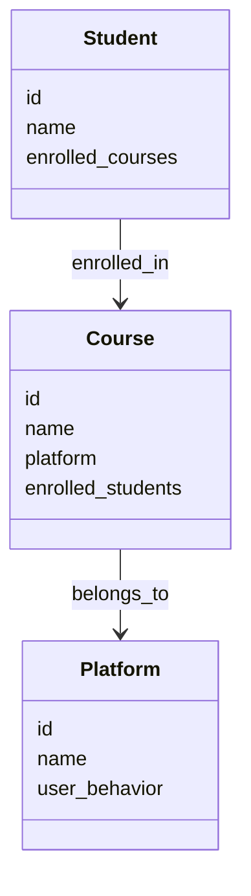
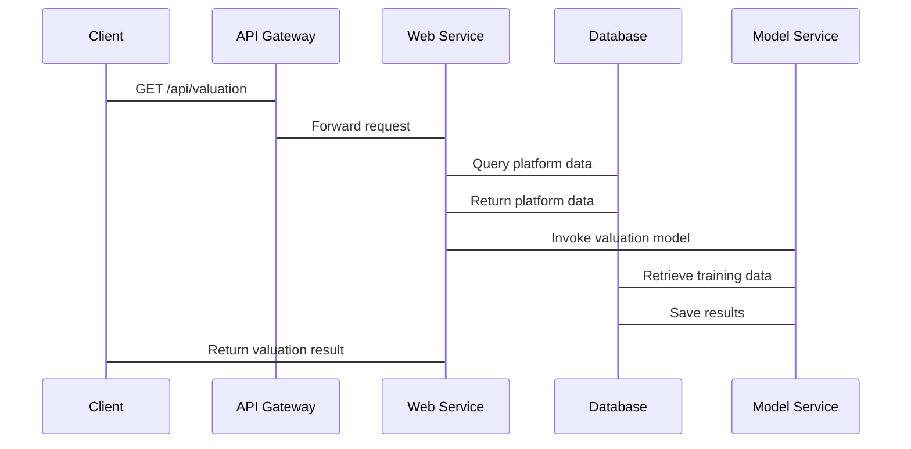

                 


```markdown
# 企业估值中的AI驱动的个性化学习平台评估

> 关键词：企业估值，AI驱动，个性化学习平台，评估模型，数据驱动，机器学习

> 摘要：本文深入探讨了在企业估值过程中，如何利用AI技术对个性化学习平台进行评估。通过分析学习平台的核心数据特征，构建基于机器学习的评估模型，本文提出了一种创新的评估方法，能够更精准地评估企业价值，为企业决策提供有力支持。

---

## 第一部分: 企业估值中的AI驱动个性化学习平台评估背景介绍

### 第1章: 问题背景与问题描述

#### 1.1 问题背景
- 1.1.1 企业估值的传统方法与局限性
  - 传统估值方法（如DCF模型、EV/EBITDA等）的局限性
  - 数据依赖性高，难以捕捉非财务因素
  - 难以应对个性化学习平台的动态变化

- 1.1.2 个性化学习平台的兴起与发展
  - 个性化学习的需求增长
  - 数字化教育的趋势
  - 平台经济对企业估值的影响

- 1.1.3 AI技术在企业估值中的应用潜力
  - AI在数据分析中的优势
  - 个性化学习平台的动态评估需求

#### 1.2 问题描述
- 1.2.1 个性化学习平台对企业价值的影响
  - 用户行为数据与企业价值的关系
  - 平台粘性与企业估值的关联

- 1.2.2 传统估值方法在个性化学习平台中的不足
  - 数据稀疏性问题
  - 非线性关系的处理难点
  - 动态变化的捕捉不足

- 1.2.3 AI驱动的个性化学习平台评估的核心问题
  - 数据特征的选择与提取
  - 机器学习模型的构建与优化
  - 评估结果的可解释性与实用性

### 第2章: 问题解决与边界定义

#### 2.1 问题解决方法
- 2.1.1 AI驱动的个性化学习平台评估框架
  - 数据采集与预处理
  - 特征工程
  - 模型训练与优化
  - 结果解释与应用

- 2.1.2 数据驱动的评估方法
  - 数据特征的选择
  - 数据清洗与标准化
  - 数据的时序分析

- 2.1.3 综合评估模型的设计与实现
  - 多模型融合
  - 动态评估机制
  - 结果的可解释性设计

#### 2.2 边界与外延
- 2.2.1 个性化学习平台评估的边界条件
  - 数据范围的界定
  - 评估时间窗口的设定
  - 评估的颗粒度（如平台、课程、用户群体等）

- 2.2.2 企业估值中的相关因素
  - 财务指标
  - 用户行为数据
  - 市场竞争状况

- 2.2.3 与AI技术的其他应用场景的区分
  - 与个性化推荐系统的区别
  - 与企业绩效预测的差异

### 第3章: 核心概念与联系

#### 3.1 核心概念原理
- 3.1.1 AI驱动的个性化学习平台评估模型
  - 模型的目标函数与损失函数
  - 模型的输入与输出
  - 模型的训练与调优

- 3.1.2 数据特征与模型训练的关系
  - 特征的重要性排序
  - 特征的交互作用
  - 特征的动态变化

- 3.1.3 评估结果对企业估值的影响
  - 评估结果对估值的加成作用
  - 评估结果的敏感性分析
  - 评估结果的反馈机制

#### 3.2 概念属性特征对比表
| 概念 | 属性 | 特征 |
|------|------|------|
| AI驱动 | 数据依赖性 | 高 |
| 个性化学习平台 | 用户行为多样性 | 高 |
| 企业估值 | 财务与非财务指标 | 综合性 |

#### 3.3 ER实体关系图
```mermaid
erDiagram
    student --> enrolled_courses : 每个学生 enrolled_in 的课程
    enrolled_courses --> course : 每个课程 enrolled_by 的学生数量
    course --> platform : 每个课程属于的平台
    platform --> user_behavior : 平台上的用户行为数据
    user_behavior --> financialMetrics : 财务指标
```

---

## 第二部分: 算法原理讲解

### 第4章: 算法原理

#### 4.1 算法选择与原理
- 4.1.1 机器学习算法的选择
  - 回归分析
  - 支持向量机
  - 随机森林
  - 神经网络

- 4.1.2 算法原理
  - 线性回归模型
  - 随机森林的特征重要性分析
  - 神经网络的非线性拟合能力

#### 4.2 算法实现步骤
- 4.2.1 数据预处理
  - 数据清洗
  - 特征标准化
  - 数据分割（训练集、验证集、测试集）

- 4.2.2 模型训练
  - 模型参数调优
  - 模型训练与验证
  - 模型评估（准确率、召回率、F1分数）

- 4.2.3 模型部署
  - 模型封装
  - API接口设计
  - 模型监控与维护

#### 4.3 算法优化与改进
- 4.3.1 超参数优化
  - 网格搜索
  - 随机搜索
  - 贝叶斯优化

- 4.3.2 模型融合
  - 品质融合
  - 概率融合
  - 爱森豪威尔融合

- 4.3.3 模型解释性增强
  - SHAP值
  - LIME解释
  - 特征重要性排序

---

## 第三部分: 系统分析与架构设计方案

### 第5章: 系统分析与架构设计

#### 5.1 问题场景介绍
- 个性化学习平台的典型应用场景
- 企业估值的关键数据来源
- AI驱动评估系统的功能需求

#### 5.2 系统功能设计
- 5.2.1 领域模型


- 5.2.2 功能模块划分
  - 数据采集模块
  - 数据处理模块
  - 模型训练模块
  - 结果展示模块

- 5.2.3 功能流程
  - 数据采集→数据处理→模型训练→结果展示

#### 5.3 系统架构设计
- 5.3.1 系统架构图


- 5.3.2 模块交互设计
  - 客户端与API网关的交互
  - Web服务与数据库的交互
  - 模型服务与结果缓存的交互

- 5.3.3 数据流设计
  - 用户行为数据流
  - 模型训练数据流
  - 评估结果数据流

#### 5.4 系统接口设计
- 5.4.1 API接口定义
  - GET /api/valuation?platform_id=123
  - POST /api/train_model
  - PUT /api/cache_results

- 5.4.2 接口协议与实现
  - RESTful API
  - JSON格式
  - HTTP状态码

#### 5.5 系统交互序列图


---

## 第四部分: 项目实战

### 第6章: 项目实战

#### 6.1 环境安装与配置
- 安装Python环境（如Anaconda）
- 安装依赖库（如scikit-learn、xgboost、pandas、numpy）
- 安装可视化工具（如Matplotlib、Seaborn）
- 安装数据库（如PostgreSQL、MongoDB）

#### 6.2 系统核心实现源代码
- 数据预处理代码
```python
import pandas as pd
import numpy as np

# 加载数据
df = pd.read_csv('platform_data.csv')

# 数据清洗
df.dropna(inplace=True)
df = df[~df.duplicated()]
```

- 特征工程代码
```python
from sklearn.preprocessing import StandardScaler

# 标准化处理
scaler = StandardScaler()
X = scaler.fit_transform(df[['feature1', 'feature2', 'feature3']])
```

- 模型训练代码
```python
from sklearn.ensemble import RandomForestRegressor
from sklearn.metrics import mean_absolute_error

# 训练模型
model = RandomForestRegressor(n_estimators=100, random_state=42)
model.fit(X, y)

# 预测与评估
y_pred = model.predict(X_test)
print(mean_absolute_error(y_test, y_pred))
```

#### 6.3 代码解读与分析
- 数据预处理部分：说明数据清洗和特征选择的具体步骤
- 特征工程部分：解释标准化处理的必要性和方法
- 模型训练部分：分析随机森林模型的参数选择与调优

#### 6.4 案例分析与实际应用
- 选择一个具体的学习平台案例
- 数据采集与分析
- 模型训练与评估
- 结果解读与应用建议

#### 6.5 项目小结
- 项目实现的关键点总结
- 经验与教训
- 对后续优化的建议

---

## 第五部分: 最佳实践

### 第7章: 小结与展望

#### 7.1 小结
- 本文的核心观点总结
- 关键技术的总结与反思
- 项目实施中的经验与教训

#### 7.2 注意事项
- 数据质量的重要性
- 模型的可解释性问题
- 系统的可扩展性与维护成本

#### 7.3 拓展阅读
- 推荐相关领域的书籍和论文
- 提供进一步学习的资源和方向
- 展望未来的研究和应用趋势

---

## 作者

作者：AI天才研究院/AI Genius Institute & 禅与计算机程序设计艺术 /Zen And The Art of Computer Programming

---

**注：以上为目录大纲，具体内容将根据实际需求进行详细撰写。**
</think>

```markdown
# 企业估值中的AI驱动个性化学习平台评估

> 关键词：企业估值，AI驱动，个性化学习平台，评估模型，数据驱动，机器学习

> 摘要：本文深入探讨了在企业估值过程中，如何利用AI技术对个性化学习平台进行评估。通过分析学习平台的核心数据特征，构建基于机器学习的评估模型，本文提出了一种创新的评估方法，能够更精准地评估企业价值，为企业决策提供有力支持。

---

## 第一部分: 企业估值中的AI驱动个性化学习平台评估背景介绍

### 第1章: 问题背景与问题描述

#### 1.1 问题背景
- 1.1.1 企业估值的传统方法与局限性
  - 传统估值方法（如DCF模型、EV/EBITDA等）的局限性
  - 数据依赖性高，难以捕捉非财务因素
  - 难以应对个性化学习平台的动态变化

- 1.1.2 个性化学习平台的兴起与发展
  - 个性化学习的需求增长
  - 数字化教育的趋势
  - 平台经济对企业估值的影响

- 1.1.3 AI技术在企业估值中的应用潜力
  - AI在数据分析中的优势
  - 个性化学习平台的动态评估需求

#### 1.2 问题描述
- 1.2.1 个性化学习平台对企业价值的影响
  - 用户行为数据与企业价值的关系
  - 平台粘性与企业估值的关联

- 1.2.2 传统估值方法在个性化学习平台中的不足
  - 数据稀疏性问题
  - 非线性关系的处理难点
  - 动态变化的捕捉不足

- 1.2.3 AI驱动的个性化学习平台评估的核心问题
  - 数据特征的选择与提取
  - 机器学习模型的构建与优化
  - 评估结果的可解释性与实用性

### 第2章: 问题解决与边界定义

#### 2.1 问题解决方法
- 2.1.1 AI驱动的个性化学习平台评估框架
  - 数据采集与预处理
  - 特征工程
  - 模型训练与优化
  - 结果解释与应用

- 2.1.2 数据驱动的评估方法
  - 数据特征的选择
  - 数据清洗与标准化
  - 数据的时序分析

- 2.1.3 综合评估模型的设计与实现
  - 多模型融合
  - 动态评估机制
  - 结果的可解释性设计

#### 2.2 边界与外延
- 2.2.1 个性化学习平台评估的边界条件
  - 数据范围的界定
  - 评估时间窗口的设定
  - 评估的颗粒度（如平台、课程、用户群体等）

- 2.2.2 企业估值中的相关因素
  - 财务指标
  - 用户行为数据
  - 市场竞争状况

- 2.2.3 与AI技术的其他应用场景的区分
  - 与个性化推荐系统的区别
  - 与企业绩效预测的差异

### 第3章: 核心概念与联系

#### 3.1 核心概念原理
- 3.1.1 AI驱动的个性化学习平台评估模型
  - 模型的目标函数与损失函数
  - 模型的输入与输出
  - 模型的训练与调优

- 3.1.2 数据特征与模型训练的关系
  - 特征的重要性排序
  - 特征的交互作用
  - 特征的动态变化

- 3.1.3 评估结果对企业估值的影响
  - 评估结果对估值的加成作用
  - 评估结果的敏感性分析
  - 评估结果的反馈机制

#### 3.2 概念属性特征对比表
| 概念 | 属性 | 特征 |
|------|------|------|
| AI驱动 | 数据依赖性 | 高 |
| 个性化学习平台 | 用户行为多样性 | 高 |
| 企业估值 | 财务与非财务指标 | 综合性 |

#### 3.3 ER实体关系图
```mermaid
erDiagram
    student --> enrolled_courses : 每个学生 enrolled_in 的课程
    enrolled_courses --> course : 每个课程 enrolled_by 的学生数量
    course --> platform : 每个课程属于的平台
    platform --> user_behavior : 平台上的用户行为数据
```

---

## 第二部分: 算法原理讲解

### 第4章: 算法原理

#### 4.1 算法选择与原理
- 4.1.1 机器学习算法的选择
  - 回归分析
  - 支持向量机
  - 随机森林
  - 神经网络

- 4.1.2 算法原理
  - 线性回归模型
  - 随机森林的特征重要性分析
  - 神经网络的非线性拟合能力

#### 4.2 算法实现步骤
- 4.2.1 数据预处理
  - 数据清洗
  - 特征标准化
  - 数据分割（训练集、验证集、测试集）

- 4.2.2 模型训练
  - 模型参数调优
  - 模型训练与验证
  - 模型评估（准确率、召回率、F1分数）

- 4.2.3 模型部署
  - 模型封装
  - API接口设计
  - 模型监控与维护

#### 4.3 算法优化与改进
- 4.3.1 超参数优化
  - 网格搜索
  - 随机搜索
  - 贝叶斯优化

- 4.3.2 模型融合
  - 品质融合
  - 概率融合
  - 爱森豪威尔融合

- 4.3.3 模型解释性增强
  - SHAP值
  - LIME解释
  - 特征重要性排序

---

## 第三部分: 系统分析与架构设计方案

### 第5章: 系统分析与架构设计

#### 5.1 问题场景介绍
- 个性化学习平台的典型应用场景
- 企业估值的关键数据来源
- AI驱动评估系统的功能需求

#### 5.2 系统功能设计
- 5.2.1 领域模型


- 5.2.2 功能模块划分
  - 数据采集模块
  - 数据处理模块
  - 模型训练模块
  - 结果展示模块

- 5.2.3 功能流程
  - 数据采集→数据处理→模型训练→结果展示

#### 5.3 系统架构设计
- 5.3.1 系统架构图


- 5.3.2 模块交互设计
  - 客户端与API网关的交互
  - Web服务与数据库的交互
  - 模型服务与结果缓存的交互

- 5.3.3 数据流设计
  - 用户行为数据流
  - 模型训练数据流
  - 评估结果数据流

#### 5.4 系统接口设计
- 5.4.1 API接口定义
  - GET /api/valuation?platform_id=123
  - POST /api/train_model
  - PUT /api/cache_results

- 5.4.2 接口协议与实现
  - RESTful API
  - JSON格式
  - HTTP状态码

#### 5.5 系统交互序列图


---

## 第四部分: 项目实战

### 第6章: 项目实战

#### 6.1 环境安装与配置
- 安装Python环境（如Anaconda）
- 安装依赖库（如scikit-learn、xgboost、pandas、numpy）
- 安装可视化工具（如Matplotlib、Seaborn）
- 安装数据库（如PostgreSQL、MongoDB）

#### 6.2 系统核心实现源代码
- 数据预处理代码
```python
import pandas as pd
import numpy as np

# 加载数据
df = pd.read_csv('platform_data.csv')

# 数据清洗
df.dropna(inplace=True)
df = df[~df.duplicated()]
```

- 特征工程代码
```python
from sklearn.preprocessing import StandardScaler

# 标准化处理
scaler = StandardScaler()
X = scaler.fit_transform(df[['feature1', 'feature2', 'feature3']])
```

- 模型训练代码
```python
from sklearn.ensemble import RandomForestRegressor
from sklearn.metrics import mean_absolute_error

# 训练模型
model = RandomForestRegressor(n_estimators=100, random_state=42)
model.fit(X, y)

# 预测与评估
y_pred = model.predict(X_test)
print(mean_absolute_error(y_test, y_pred))
```

#### 6.3 代码解读与分析
- 数据预处理部分：说明数据清洗和特征选择的具体步骤
- 特征工程部分：解释标准化处理的必要性和方法
- 模型训练部分：分析随机森林模型的参数选择与调优

#### 6.4 案例分析与实际应用
- 选择一个具体的学习平台案例
- 数据采集与分析
- 模型训练与评估
- 结果解读与应用建议

#### 6.5 项目小结
- 项目实现的关键点总结
- 经验与教训
- 对后续优化的建议

---

## 第五部分: 最佳实践

### 第7章: 小结与展望

#### 7.1 小结
- 本文的核心观点总结
- 关键技术的总结与反思
- 项目实施中的经验与教训

#### 7.2 注意事项
- 数据质量的重要性
- 模型的可解释性问题
- 系统的可扩展性与维护成本

#### 7.3 拓展阅读
- 推荐相关领域的书籍和论文
- 提供进一步学习的资源和方向
- 展望未来的研究和应用趋势

---

## 作者

作者：AI天才研究院/AI Genius Institute & 禅与计算机程序设计艺术 /Zen And The Art of Computer Programming
```

