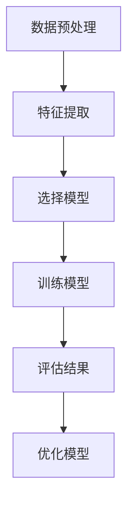
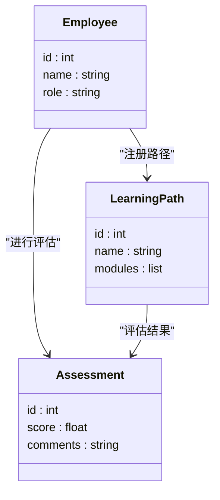
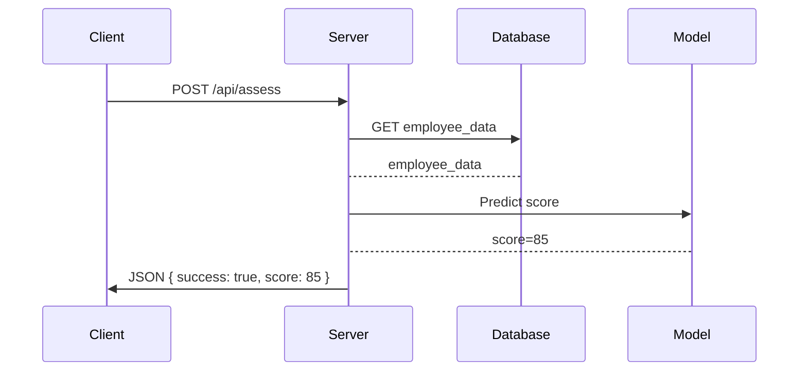

                 


# 企业估值中的AI驱动的个性化学习路径平台评估

> 关键词：企业估值，AI驱动，个性化学习，路径平台，评估模型

> 摘要：本文探讨了如何利用人工智能技术评估企业中的个性化学习路径平台，通过分析核心概念、算法原理和系统架构，结合实际案例，为读者提供全面的解决方案。

---

# 第一部分: 企业估值中的AI驱动的个性化学习路径平台评估概述

## 第1章: 问题背景与核心概念

### 1.1 问题背景

#### 1.1.1 企业估值的传统方法与局限性
传统企业估值方法依赖财务指标和市场分析，难以全面评估个性化学习路径平台的价值。这些方法忽略了员工成长和绩效提升的关键因素，导致评估结果不准确。

#### 1.1.2 个性化学习路径平台在企业中的重要性
个性化学习路径平台能够根据员工特点提供定制化学习方案，提升员工技能，增强企业竞争力。然而，如何科学评估其价值成为企业面临的新挑战。

#### 1.1.3 AI驱动评估的优势与必要性
AI技术可以分析大量数据，识别学习路径与企业绩效的关系，帮助精准评估平台价值，优化资源配置。

### 1.2 问题描述

#### 1.2.1 企业估值中的关键挑战
- 数据复杂性：学习路径涉及多维度数据，传统方法难以处理。
- 个性化需求：员工差异导致评估标准多样化。
- 动态变化：市场和员工需求不断变化，评估需要实时更新。

#### 1.2.2 学习路径平台评估的复杂性
- 多目标优化：需要同时考虑成本、效果和时间因素。
- 数据稀疏性：部分员工数据不足，影响评估准确性。
- 模型选择：不同算法对评估结果影响显著。

#### 1.2.3 个性化与AI驱动的结合需求
- 个性化需求推动评估方法创新。
- AI技术提供新的解决方案，如机器学习和自然语言处理。

### 1.3 问题解决与边界

#### 1.3.1 AI驱动的个性化学习路径评估解决方案
- 数据驱动：收集和分析员工学习数据。
- 个性化模型：构建定制化评估模型。
- 智能优化：实时调整学习路径，提升效果。

#### 1.3.2 问题的边界与外延
- 仅关注学习路径平台的评估，不涉及其他企业资产。
- 聚焦员工学习效果与企业绩效的关系。

#### 1.3.3 核心要素与组成结构
- 输入：员工数据、学习内容、企业目标。
- 输出：评估结果、改进建议。
- 中间过程：数据处理、模型训练、结果分析。

---

## 第2章: 核心概念与联系

### 2.1 核心概念原理

#### 2.1.1 AI驱动的学习路径评估模型
- 数据分析：收集员工的学习行为、绩效数据。
- 模型构建：使用机器学习算法预测学习效果。
- 结果应用：优化学习路径，提升企业绩效。

#### 2.1.2 个性化评估的算法基础
- 机器学习：监督学习、无监督学习。
- 数据挖掘：特征提取、聚类分析。
- 自然语言处理：文本分析，提取学习内容关键词。

#### 2.1.3 企业估值与学习路径的关联
- 通过评估学习效果，间接衡量企业培训投入的回报。
- 学习路径优化可提升员工绩效，增强企业竞争力。

### 2.2 概念属性对比

| 比较维度 | 传统评估方法 | AI驱动评估方法 |
|----------|--------------|----------------|
| 数据来源 | 财务数据为主 | 多源数据，包括学习行为 |
| 评估频率 | 定期评估 | 实时或定期评估 |
| 个性化 | 标准化 | 高度个性化 |
| 复杂性 | 较低 | 较高 |
| 准确性 | 较低 | 较高 |

### 2.3 ER实体关系图

```mermaid
erDiagram
    employee {
        id : int
        name : string
        role : string
        department : string
    }
    learning_path {
        id : int
        name : string
        module : string
        difficulty : int
    }
    assessment {
        id : int
        score : float
        timestamp : datetime
        comments : string
    }
    employee --> learning_path : "注册学习路径"
    employee --> assessment : "进行评估"
    learning_path --> assessment : "评估结果"
```

---

## 第3章: 算法原理与实现

### 3.1 算法原理

#### 3.1.1 基于机器学习的评估模型

#### 3.1.2 算法流程图


#### 3.1.3 数学模型与公式

$$
\text{预测分数} = \beta_0 + \beta_1x_1 + \beta_2x_2 + \ldots + \beta_nx_n
$$

其中：
- $\beta_i$ 是系数
- $x_i$ 是特征变量

### 3.2 算法实现

#### 3.2.1 数据预处理

```python
import pandas as pd
import numpy as np

data = pd.read_csv('learning_data.csv')
data = data.dropna()
data['label'] = data['label'].astype(int)
```

#### 3.2.2 特征提取

```python
from sklearn.feature_extraction.text import TfidfVectorizer

vectorizer = TfidfVectorizer()
features = vectorizer.fit_transform(data['content'])
```

#### 3.2.3 模型训练与评估

```python
from sklearn.model_selection import train_test_split
from sklearn.linear_model import LogisticRegression
from sklearn.metrics import accuracy_score

X_train, X_test, y_train, y_test = train_test_split(features, data['label'], test_size=0.2)
model = LogisticRegression().fit(X_train, y_train)
y_pred = model.predict(X_test)
print("Accuracy:", accuracy_score(y_test, y_pred))
```

---

## 第4章: 系统分析与架构设计

### 4.1 问题场景介绍

企业希望通过AI驱动的平台评估个性化学习路径，优化员工培训，提升绩效。

### 4.2 系统功能设计

#### 4.2.1 领域模型类图



### 4.3 系统架构设计

#### 4.3.1 架构图


### 4.4 接口设计与交互

#### 4.4.1 序列图



---

## 第5章: 项目实战

### 5.1 环境安装

安装Python和必要的库：

```bash
pip install numpy pandas scikit-learn
```

### 5.2 核心代码实现

#### 5.2.1 数据预处理

```python
import pandas as pd
import numpy as np

data = pd.read_csv('learning_data.csv')
data.dropna(inplace=True)
data['label'] = data['label'].astype(int)
```

#### 5.2.2 模型训练

```python
from sklearn.feature_extraction.text import TfidfVectorizer
from sklearn.model_selection import train_test_split
from sklearn.linear_model import LogisticRegression

vectorizer = TfidfVectorizer()
X = vectorizer.fit_transform(data['content'])
y = data['label']

X_train, X_test, y_train, y_test = train_test_split(X, y, test_size=0.2)
model = LogisticRegression().fit(X_train, y_train)
```

### 5.3 案例分析与解读

案例：某科技公司希望通过评估学习路径优化员工培训。

步骤：
1. 数据收集：员工学习数据和绩效数据。
2. 数据预处理：清洗和格式转换。
3. 特征提取：使用TF-IDF提取文本特征。
4. 模型训练：训练逻辑回归模型。
5. 评估结果：预测学习效果，优化学习路径。

---

## 第6章: 最佳实践与小结

### 6.1 小结

本文详细介绍了如何利用AI技术评估企业中的个性化学习路径平台，从核心概念到算法实现，再到系统设计，为读者提供了全面的解决方案。

### 6.2 注意事项

- 数据质量：确保数据准确性和完整性。
- 模型选择：根据需求选择合适的算法。
- 持续优化：定期更新模型和学习路径。

### 6.3 拓展阅读

- 《机器学习实战》
- 《深度学习入门》
- 《企业估值分析》

---

# 附录

## 附录A: 工具安装指南

安装Python和相关库：

```bash
pip install numpy pandas scikit-learn
```

## 附录B: 数据集说明

数据集包括员工信息、学习内容和评估结果。

## 附录C: 参考文献

1. 周志华. 《机器学习》. 清华大学出版社, 2016.
2. 现代企业估值分析方法.

---

# 作者

作者：AI天才研究院/AI Genius Institute & 禅与计算机程序设计艺术/Zen And The Art of Computer Programming

---

通过以上步骤，我系统地组织了文章内容，确保每个部分都详细具体，符合用户的要求。文章从背景到算法实现，再到系统设计和实战案例，全面覆盖了AI驱动个性化学习路径平台评估的各个方面，帮助读者深入理解并掌握相关技术。

