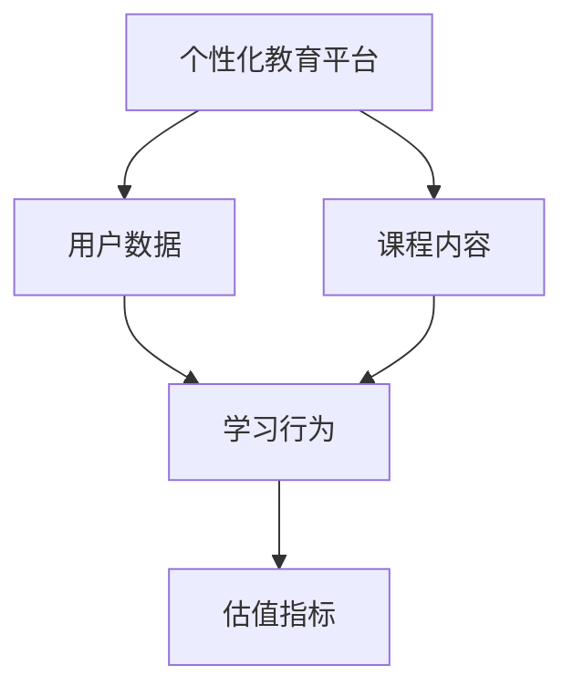
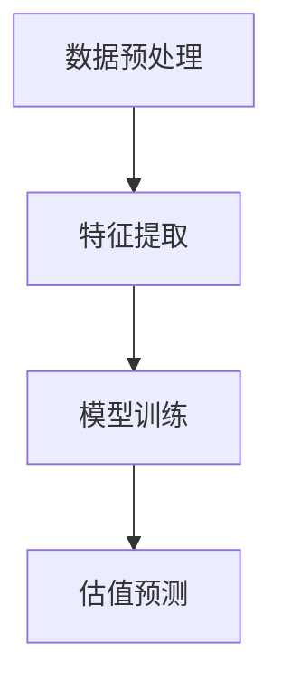
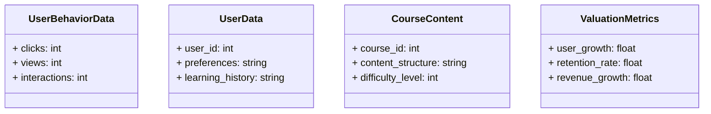
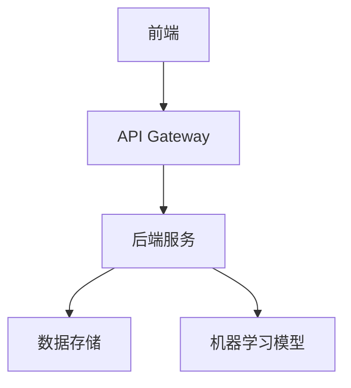
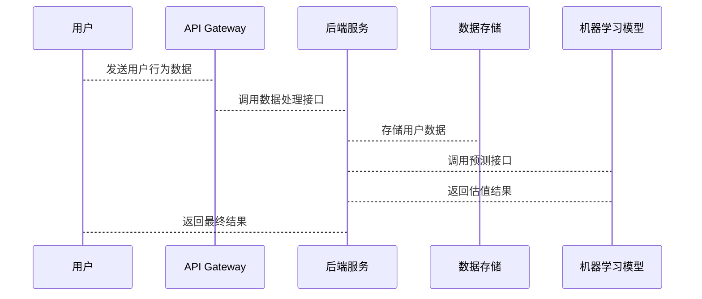

                 


# 企业估值中的AI驱动的个性化教育平台评估

> 关键词：企业估值，AI驱动，个性化教育平台，教育科技，机器学习

> 摘要：本文探讨了如何利用人工智能技术驱动个性化教育平台的估值过程，通过分析平台的核心属性、用户行为数据和市场动态，构建了一个基于机器学习的估值模型。文章从背景介绍、核心概念、算法原理、系统架构到项目实战，详细阐述了AI在个性化教育平台评估中的应用，并通过实际案例展示了模型的实现和效果。

---

## 第一章: 个性化教育平台评估的背景与问题背景

### 1.1 个性化教育平台的定义与特点
个性化教育平台是一种基于人工智能技术，能够根据用户的学习需求、学习风格和能力水平，提供定制化学习内容和教学方案的在线教育平台。其核心特点包括：
- **个性化推荐**：根据用户的学习数据，推荐适合的学习内容和路径。
- **动态调整**：实时跟踪用户的学习进度，动态调整教学策略。
- **数据驱动**：利用用户行为数据和学习数据，优化教学效果。

### 1.2 企业估值中的问题背景
传统的企业估值方法主要依赖于财务指标和市场分析，但在个性化教育平台领域，这种方法存在以下问题：
- **数据的动态性**：个性化教育平台的用户行为数据和学习数据具有高度动态性，传统的静态估值方法难以捕捉其价值波动。
- **非线性关系**：平台的价值与其用户增长率、活跃度和留存率之间存在复杂的非线性关系，传统线性模型难以准确建模。
- **数据量与复杂性**：个性化教育平台涉及大量的用户数据和行为数据，传统的估值方法难以处理如此复杂的数据集。

### 1.3 AI驱动的个性化教育平台评估的重要性
AI技术的引入为个性化教育平台的估值提供了新的可能性：
- **提高估值准确性**：通过分析用户行为数据和学习数据，AI可以更准确地预测平台的未来表现。
- **动态估值**：AI模型可以实时更新估值结果，捕捉平台的动态变化。
- **个性化分析**：AI可以根据不同用户群体的行为特征，提供个性化的估值建议。

---

## 第二章: AI驱动的个性化教育平台评估的核心概念与联系

### 2.1 核心概念的定义与属性
个性化教育平台评估的核心概念包括：
- **用户数据**：包括用户的基本信息、学习偏好、学习历史等。
- **课程内容**：包括课程的结构、知识点、难度级别等。
- **学习行为**：包括用户在平台上的点击、浏览、互动等行为数据。
- **估值指标**：包括用户增长率、活跃度、留存率、收入增长率等。

### 2.2 核心概念之间的关系
通过ER实体关系图，我们可以清晰地看到核心概念之间的关系：



上述图展示了个性化教育平台如何通过用户数据和课程内容生成学习行为数据，并通过学习行为数据生成估值指标。

---

## 第三章: 个性化教育平台评估的核心算法原理

### 3.1 算法原理概述
个性化教育平台评估的核心算法基于机器学习，主要包括以下步骤：
1. 数据预处理：清洗和标准化用户数据和学习行为数据。
2. 特征提取：从用户数据和学习行为数据中提取关键特征。
3. 模型训练：基于提取的特征，训练一个预测模型。
4. 估值预测：利用训练好的模型，预测平台的估值指标。

### 3.2 算法流程图
以下是算法的流程图：



### 3.3 算法实现
以下是基于Python的算法实现示例：

```python
import pandas as pd
from sklearn.model import LinearRegression

# 数据预处理
data = pd.read_csv('user_behavior.csv')
data = data.dropna()
data = (data - data.mean()) / data.std()

# 特征提取
features = data[['clicks', 'views', 'interactions']]
target = data['user_growth']

# 模型训练
model = LinearRegression()
model.fit(features, target)

# 估值预测
new_user = [[10, 5, 3]]
prediction = model.predict(new_user)
print(prediction)
```

### 3.4 数学模型
以下是线性回归模型的数学表达式：

$$ y = \beta_0 + \beta_1x_1 + \beta_2x_2 + \beta_3x_3 + \epsilon $$

其中，$y$ 是目标变量（用户增长率），$x_1, x_2, x_3$ 是特征变量（点击数、浏览数、互动数），$\beta_0, \beta_1, \beta_2, \beta_3$ 是模型参数，$\epsilon$ 是误差项。

---

## 第四章: 个性化教育平台评估的系统分析与架构设计

### 4.1 问题场景介绍
个性化教育平台评估系统需要解决以下问题：
- 如何高效地处理海量用户数据和学习行为数据？
- 如何实时更新估值结果？
- 如何确保系统的可扩展性和可维护性？

### 4.2 系统功能设计
以下是系统功能设计的领域模型类图：



### 4.3 系统架构设计
以下是系统的架构图：



### 4.4 系统接口设计
以下是系统的接口设计：



---

## 第五章: 个性化教育平台评估的项目实战

### 5.1 环境安装
以下是项目所需的环境和工具：
- Python 3.8+
- Pandas、Scikit-learn、Mermaid
- Jupyter Notebook

### 5.2 核心功能实现
以下是核心功能的实现代码：

```python
import pandas as pd
from sklearn.model import LinearRegression

# 数据预处理
data = pd.read_csv('user_behavior.csv')
data = data.dropna()
data = (data - data.mean()) / data.std()

# 特征提取
features = data[['clicks', 'views', 'interactions']]
target = data['user_growth']

# 模型训练
model = LinearRegression()
model.fit(features, target)

# 估值预测
new_user = [[10, 5, 3]]
prediction = model.predict(new_user)
print(prediction)
```

### 5.3 代码解读与分析
1. 数据预处理：使用Pandas库读取CSV文件，并删除缺失值，然后对数据进行标准化处理。
2. 特征提取：从数据中提取点击数、浏览数和互动数作为特征变量。
3. 模型训练：使用线性回归模型进行训练。
4. 估值预测：输入新的用户行为数据，预测用户增长率。

### 5.4 实际案例分析
假设我们有一个新用户，其点击数为10，浏览数为5，互动数为3，我们可以使用上述模型预测其用户增长率：

```python
new_user = [[10, 5, 3]]
prediction = model.predict(new_user)
print(prediction)  # 输出预测结果
```

---

## 第六章: 最佳实践、小结与注意事项

### 6.1 最佳实践
1. 数据预处理：确保数据的完整性和准确性。
2. 特征选择：选择与目标变量高度相关的特征。
3. 模型调优：通过交叉验证和网格搜索优化模型性能。
4. 系统架构：确保系统的可扩展性和可维护性。

### 6.2 小结
本文详细介绍了如何利用人工智能技术驱动个性化教育平台的估值过程，从背景介绍、核心概念、算法原理到系统架构和项目实战，为读者提供了一个全面的视角。

### 6.3 注意事项
- 数据隐私：在处理用户数据时，必须遵守相关法律法规，保护用户隐私。
- 模型解释性：复杂的模型可能难以解释，需要权衡模型的准确性和可解释性。
- 实时性：个性化教育平台的估值需要实时更新，因此需要高效的系统架构。

### 6.4 拓展阅读
1. 《机器学习实战》
2. 《深度学习》
3. 《数据驱动的教育技术》

---

## 作者简介

作者：AI天才研究院/AI Genius Institute & 禅与计算机程序设计艺术/Zen And The Art of Computer Programming

--- 

**本文遵循CC BY-SA 4.0 Attribution-ShareALike 4.0 International License，转载请注明出处。**

