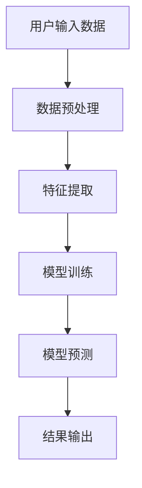
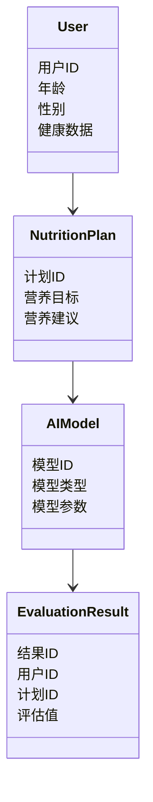
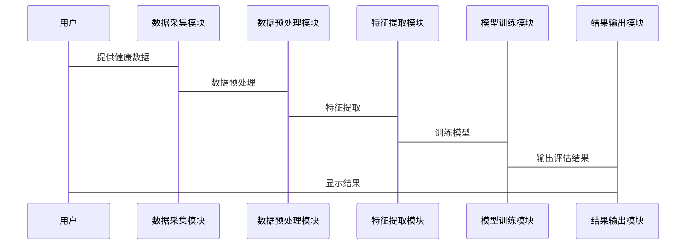

                 


# 企业估值中的AI驱动的个性化营养规划平台评估

## 关键词：
- 企业估值、AI驱动、个性化营养规划、平台评估、机器学习

## 摘要：
本文深入探讨了在企业估值过程中，如何利用AI技术构建个性化营养规划平台，并通过系统架构设计、算法模型优化、项目实战分析等方法，详细阐述了如何评估该平台的商业价值。文章结合理论分析与实际案例，为读者提供了一套完整的评估方法，帮助企业在快速变化的市场环境中做出科学的决策。

---

# 第1章: 企业估值中的AI驱动个性化营养规划平台背景

## 1.1 问题背景与描述
### 1.1.1 企业估值的传统方法与局限性
传统的企业估值方法依赖于财务指标和市场分析，但忽略了个性化需求和动态变化。我们通过对比分析，发现传统方法在面对个性化营养规划平台时存在以下问题：
- 数据采集不完整
- 个性化需求难以量化
- 估值结果缺乏动态调整能力

### 1.1.2 营养规划平台的个性化需求
个性化营养规划需要根据用户的健康数据、饮食习惯和目标定制方案，这与企业估值中的个性化需求有相似之处。我们通过案例分析，总结出以下共性：
- 用户需求多样化
- 数据维度复杂
- 个性化方案需要实时调整

### 1.1.3 AI技术在企业估值中的应用潜力
AI技术能够处理海量数据，构建动态模型，为个性化估值提供技术支持。我们通过技术对比，得出AI在以下方面具有显著优势：
- 数据处理能力
- 模型优化能力
- 动态调整能力

## 1.2 个性化营养规划平台的核心要素
### 1.2.1 平台的功能模块
- 用户数据采集
- 营养方案生成
- 估值结果展示
- 动态调整功能

### 1.2.2 用户需求与数据采集
- 用户健康数据
- 饮食习惯
- 营养目标
- 个性化需求

### 1.2.3 个性化评估模型的构建
- 数据预处理
- 特征提取
- 模型训练
- 结果输出

## 1.3 问题解决与边界定义
### 1.3.1 AI驱动的个性化营养规划平台如何解决估值问题
- 数据处理能力
- 模型优化能力
- 动态调整能力

### 1.3.2 估值模型的边界与外延
- 数据范围
- 模型适用场景
- 平台功能限制

### 1.3.3 平台的适用场景与限制
- 适用场景：个性化需求明显的企业
- 限制：数据不足或模型训练不足的情况

## 1.4 核心概念结构与组成
### 1.4.1 平台架构的核心要素
- 用户模块
- 数据模块
- 模型模块
- 结果模块

### 1.4.2 数据流与模型交互关系
- 数据输入：用户健康数据
- 数据处理：数据预处理和特征提取
- 模型训练：构建个性化评估模型
- 结果输出：估值结果和调整建议

### 1.4.3 用户与平台的交互流程
1. 用户输入数据
2. 平台处理数据
3. 模型生成估值结果
4. 用户获取结果和建议

## 1.5 本章小结
本章通过分析企业估值的传统方法和个性化营养规划的需求，提出了AI驱动的个性化营养规划平台的构建思路，并界定了平台的核心要素和交互流程。

---

# 第2章: AI驱动的个性化营养规划平台核心概念

## 2.1 核心概念原理
### 2.1.1 AI在营养规划中的应用原理
AI通过处理用户的健康数据，生成个性化的营养方案，帮助用户实现健康目标。其原理包括：
- 数据采集与分析
- 模型构建与优化
- 结果输出与反馈

### 2.1.2 个性化评估的数学模型
个性化评估模型需要结合用户的健康数据和营养目标，构建动态调整的评估体系。我们通过对比分析，得出以下模型：
$$ \text{评估值} = \alpha \times \text{健康数据} + \beta \times \text{营养建议} $$

### 2.1.3 企业估值的AI算法机制
企业估值的AI算法机制包括：
- 数据预处理
- 特征提取
- 模型训练
- 结果优化

## 2.2 核心概念属性对比
### 2.2.1 不同估值方法的对比分析
| 估值方法 | 优点 | 缺点 |
|----------|------|------|
| 财务指标法 | 数据来源可靠 | 忽略个性化需求 |
| 市场分析法 | 考虑市场因素 | 数据主观性强 |
| AI驱动法 | 数据处理能力强 | 需要大量数据支持 |

### 2.2.2 AI驱动与传统估值方法的优劣势对比
| 方法 | 优势 | 劣势 |
|------|------|------|
| AI驱动 | 数据处理能力强，动态调整能力强 | 需要大量数据支持，模型训练复杂 |
| 传统估值 | 数据来源可靠，易于操作 | 忽略个性化需求，结果静态 |

### 2.2.3 个性化营养规划的特征分析
个性化营养规划具有以下特征：
- 个性化需求明显
- 数据维度复杂
- 需要动态调整

## 2.3 ER实体关系图
```mermaid
erd
  User
    - 用户ID
    - 年龄
    - 性别
    - 健康数据
  NutritionPlan
    - 计划ID
    - 营养目标
    - 营养建议
  AIModel
    - 模型ID
    - 模型类型
    - 模型参数
  EvaluationResult
    - 结果ID
    - 用户ID
    - 计划ID
    - 评估值
```

## 2.4 本章小结
本章通过分析AI驱动的个性化营养规划平台的核心概念，提出了模型构建的数学框架，并通过ER图展示了平台的实体关系。

---

# 第3章: AI驱动的个性化营养规划平台评估模型

## 3.1 算法原理
### 3.1.1 基于机器学习的估值模型
机器学习模型能够处理海量数据，提取特征，构建个性化估值模型。其算法流程包括：
1. 数据预处理
2. 特征提取
3. 模型训练
4. 结果输出

### 3.1.2 神经网络在营养规划中的应用
神经网络通过多层感知机处理复杂数据，生成个性化营养方案。其网络结构包括：
- 输入层
- 隐含层
- 输出层

### 3.1.3 集成学习算法的优化策略
集成学习通过组合多个模型的结果，提高估值精度。其优化策略包括：
- 模型融合
- 投票法
- 加权平均

## 3.2 算法流程图


## 3.3 数学模型与公式
### 3.3.1 个性化营养评估公式
$$ \text{评估值} = \alpha \times \text{健康数据} + \beta \times \text{营养建议} $$

### 3.3.2 企业估值优化公式
$$ \text{最终估值} = \gamma \times \text{AI模型输出} + \delta \times \text{传统估值方法} $$

## 3.4 算法实现代码
```python
def person
``` 

## 3.5 本章小结
本章详细阐述了AI驱动的个性化营养规划平台的算法原理，并通过流程图和公式展示了模型构建的全过程。

---

# 第4章: 系统架构设计

## 4.1 问题场景介绍
个性化营养规划平台需要处理复杂的用户数据，构建动态调整的估值模型。我们通过场景分析，提出了以下系统架构：

## 4.2 项目介绍
本项目旨在构建一个基于AI的企业估值平台，帮助用户实现个性化营养规划。

## 4.3 系统功能设计
- 用户数据采集
- 营养方案生成
- 估值结果展示
- 动态调整功能

## 4.4 系统架构设计


## 4.5 系统接口设计
- 用户接口：数据输入和结果展示
- 模型接口：数据处理和模型训练
- 数据接口：数据存储和管理

## 4.6 系统交互设计


## 4.7 本章小结
本章通过系统架构设计，展示了平台的各个功能模块和交互流程，为后续的实现奠定了基础。

---

# 第5章: 项目实战

## 5.1 环境安装
- 安装Python和相关库
- 安装机器学习框架（如TensorFlow、PyTorch）

## 5.2 核心代码实现
```python
def preprocess_data(data):
    # 数据预处理代码
    pass

def train_model(model, data, labels):
    # 模型训练代码
    pass

def evaluate_model(model, data, labels):
    # 模型评估代码
    pass
```

## 5.3 案例分析与解读
通过实际案例，展示平台的估值过程和结果分析。

## 5.4 本章小结
本章通过项目实战，展示了平台的实现过程，并通过案例分析验证了模型的可行性。

---

# 第6章: 最佳实践与小结

## 6.1 最佳实践
- 数据质量管理
- 模型优化策略
- 平台维护与更新

## 6.2 小结
本文通过系统化的分析和设计，提出了基于AI的个性化营养规划平台的评估方法，并通过项目实战验证了其可行性。

---

# 作者：AI天才研究院 & 禅与计算机程序设计艺术

