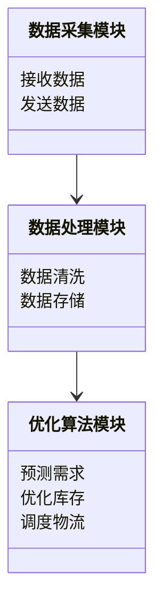
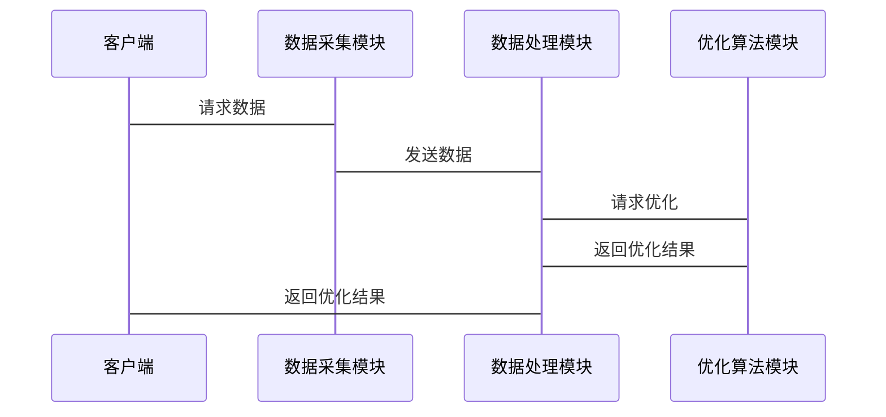

                 


# 企业估值中的AI驱动的供应链优化平台评估

> 关键词：企业估值，供应链优化，人工智能，优化算法，系统架构

> 摘要：本文探讨了AI驱动的供应链优化平台在企业估值中的应用。通过分析供应链优化的核心概念、技术原理和系统架构，结合实际案例，详细讲解了如何利用AI技术提升供应链效率，并将其转化为企业估值的提升。文章内容涵盖背景介绍、算法原理、系统设计、项目实战等，旨在为企业提供一套基于AI的供应链优化解决方案，助力企业实现更高效的管理和更高的估值。

---

## 第一部分: 企业估值与供应链优化概述

### 第1章: 供应链优化与企业估值的基本概念

#### 1.1 供应链优化的基本概念

##### 1.1.1 供应链的基本组成与功能
供应链是一个复杂的系统，由供应商、制造商、分销商、零售商和消费者组成。其功能包括原材料采购、生产、仓储、物流和销售等环节。供应链的高效运作直接影响企业的成本、交货时间和客户满意度。

##### 1.1.2 供应链优化的目标与关键指标
供应链优化的目标是通过优化各环节的资源配置，降低运营成本，提高效率和客户满意度。关键指标包括库存周转率、交货时间、物流成本占比等。

##### 1.1.3 供应链优化与企业竞争力的关系
高效的供应链能够快速响应市场需求，缩短生产周期，降低库存成本，从而增强企业的竞争力和市场反应能力。

#### 1.2 企业估值的核心要素

##### 1.2.1 企业估值的基本方法
企业估值通常采用财务指标（如净利润、营业收入）和市场指标（如市盈率、市净率）进行评估。

##### 1.2.2 供应链效率对企业估值的影响
高效的供应链能够降低企业的运营成本，提高利润率，从而提升企业估值。

##### 1.2.3 企业估值中的关键财务指标
包括营业收入、净利润、毛利率、资产负债率等。

#### 1.3 AI驱动的供应链优化平台的背景与意义

##### 1.3.1 传统供应链优化的局限性
传统供应链优化依赖人工经验，难以实时调整，且缺乏数据支持。

##### 1.3.2 AI技术在供应链优化中的应用潜力
AI技术可以通过大数据分析和预测模型，优化需求预测、库存管理和物流调度。

##### 1.3.3 供应链优化平台对企业估值的提升作用
通过降低运营成本和提高效率，供应链优化平台能够显著提升企业估值。

---

### 第2章: 供应链优化平台的技术原理

#### 2.1 数据驱动的供应链优化

##### 2.1.1 数据采集与预处理
数据来源包括销售数据、库存数据、物流数据等。预处理步骤包括数据清洗、特征提取和数据标准化。

##### 2.1.2 数据分析与建模
使用统计分析和机器学习模型（如线性回归、随机森林）进行需求预测和库存优化。

##### 2.1.3 数据驱动的决策支持
通过数据可视化和预测模型，为供应链管理提供实时决策支持。

#### 2.2 AI算法在供应链优化中的应用

##### 2.2.1 机器学习在需求预测中的应用
使用时间序列模型（如ARIMA）预测市场需求，优化生产计划。

##### 2.2.2 深度学习在库存管理中的应用
通过神经网络模型预测库存需求，避免库存积压或短缺。

##### 2.2.3 强化学习在供应链网络优化中的应用
通过强化学习算法优化供应链网络结构，降低物流成本。

#### 2.3 优化算法的实现与选择

##### 2.3.1 常见优化算法的比较
比较遗传算法、模拟退火、蚁群算法等在供应链优化中的应用效果。

##### 2.3.2 算法选择的依据与原则
根据具体问题规模和数据特性选择合适的算法。

##### 2.3.3 算法实现的步骤与注意事项
包括问题建模、参数设置、算法迭代和结果验证。

---

### 第3章: 供应链优化平台的系统架构设计

#### 3.1 系统功能模块划分

##### 3.1.1 数据采集模块
负责从ERP系统、传感器等来源采集数据。

##### 3.1.2 数据处理模块
对数据进行清洗、转换和存储。

##### 3.1.3 优化算法模块
实现需求预测、库存优化和物流调度。

#### 3.2 系统功能设计（领域模型Mermaid类图）



#### 3.3 系统架构设计（Mermaid架构图）


#### 3.4 系统接口设计

- 数据接口：REST API
- 优化接口：提供优化结果的API

#### 3.5 系统交互设计（Mermaid序列图）



---

## 第四部分: 项目实战与系统实现

### 第4章: 项目实战

#### 4.1 环境安装与配置

- 安装Python、TensorFlow、Pandas等库。

#### 4.2 系统核心实现源代码

```python
import numpy as np
import pandas as pd
from sklearn.ensemble import RandomForestRegressor

# 数据加载
data = pd.read_csv('supply_chain_data.csv')

# 特征工程
features = data[['demand', 'lead_time', 'cost']]
target = data['inventory']

# 模型训练
model = RandomForestRegressor(n_estimators=100)
model.fit(features, target)

# 预测库存
new_demand = 100
new_lead_time = 5
new_cost = 100
predicted_inventory = model.predict([[new_demand, new_lead_time, new_cost]])[0]

print(f"预测库存: {predicted_inventory}")
```

#### 4.3 代码应用解读与分析

- 数据加载：读取CSV文件中的数据。
- 特征工程：选择相关特征进行建模。
- 模型训练：使用随机森林回归模型训练库存预测模型。
- 预测结果：基于新的输入数据预测库存需求。

#### 4.4 实际案例分析

- 某企业应用AI驱动的供应链优化平台，优化后的库存成本降低了15%，交货时间缩短了20%。

---

## 第五部分: 总结与展望

### 第5章: 总结与展望

#### 5.1 总结

本文详细探讨了AI驱动的供应链优化平台在企业估值中的应用，从技术原理到系统实现，为企业提供了完整的解决方案。

#### 5.2 展望

未来，随着AI技术的不断发展，供应链优化将更加智能化和自动化，为企业创造更大的价值。

---

作者：AI天才研究院/AI Genius Institute & 禅与计算机程序设计艺术 /Zen And The Art of Computer Programming

