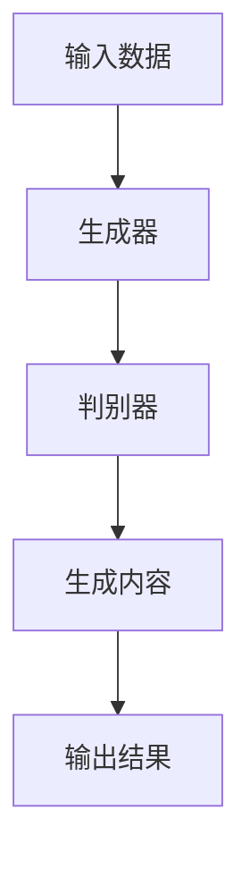
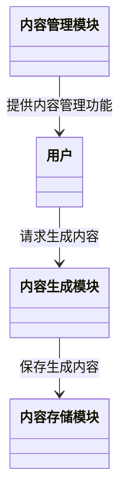
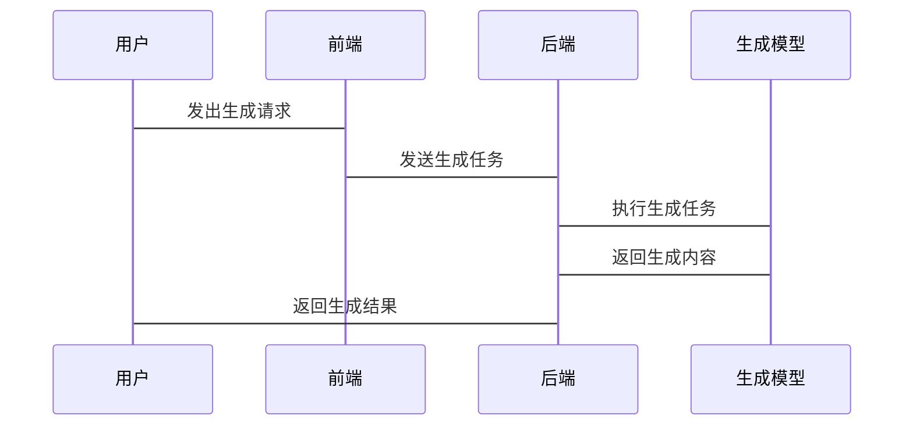

                 


# 企业估值中的AI驱动的创意内容生成平台评估

**关键词：** 创意内容生成平台, 企业估值, AI技术, 内容生成模型, 系统架构, 项目实战

**摘要：**  
随着人工智能技术的快速发展，创意内容生成平台在企业估值中的作用日益凸显。本文深入探讨了AI驱动的创意内容生成平台的核心概念、算法原理、系统架构，并结合实际案例进行项目实战分析，最后总结了最佳实践方法。通过本文，读者可以全面了解如何利用AI技术评估创意内容生成平台的企业价值。

---

## 第一章: 创意内容生成平台的背景与现状

### 1.1 创意内容生成平台的定义与特点
创意内容生成平台是一种利用AI技术生成高质量文本、图像、视频等创意内容的工具或系统。其核心特点包括自动化、智能化、高效率和多样化。

#### 1.1.1 创意内容的定义
创意内容指的是具有独特性、创新性和艺术性的内容，如文章、广告文案、图像设计、视频剪辑等。

#### 1.1.2 创意内容生成平台的核心特点
- **自动化**：通过AI算法自动生成创意内容，减少人工干预。
- **智能化**：能够根据用户需求调整生成内容的风格和质量。
- **高效率**：相比传统内容创作方式，效率显著提升。
- **多样化**：支持多种内容形式，如文本、图像、视频等。

#### 1.1.3 创意内容生成平台的分类
创意内容生成平台主要分为以下几类：
1. **文本生成平台**：如GPT系列模型，生成高质量文章、新闻报道等。
2. **图像生成平台**：如DALL-E、MidJourney，生成艺术图像和设计图。
3. **视频生成平台**：如Runway ML，生成短视频和动画。

### 1.2 AI技术在创意内容生成中的应用
AI技术在创意内容生成中的应用主要体现在生成模型和评估模型的结合使用。

#### 1.2.1 AI驱动的内容生成技术概述
AI驱动的内容生成技术主要包括生成对抗网络（GAN）和变压器模型（Transformer）。这些模型通过大量数据训练，能够生成与人类创作相似的内容。

#### 1.2.2 AI在创意内容生成中的优势
- **高效性**：AI可以在短时间内生成大量内容，满足企业的需求。
- **多样性**：AI能够生成多种风格和类型的内容，丰富企业的创意库。
- **可定制性**：企业可以根据自身需求调整生成内容的风格和主题。

#### 1.2.3 AI生成内容的挑战与局限性
- **质量不稳定**：部分生成内容可能缺乏深度和创意。
- **版权问题**：AI生成的内容可能存在版权争议。
- **技术门槛**：企业需要具备一定的技术能力才能有效利用AI生成内容。

### 1.3 企业估值的基本概念与方法
企业估值是通过对企业的财务状况、市场表现和未来潜力进行评估，确定其市场价值的过程。

#### 1.3.1 企业估值的定义与作用
企业估值是指对企业整体价值的评估，通常用于并购、融资等场景。

#### 1.3.2 传统企业估值方法概述
传统企业估值方法主要包括资产基础法、收益法和市场法。

#### 1.3.3 创意内容生成平台的特殊性与估值难点
创意内容生成平台的估值难点在于其无形资产的价值难以量化，且其市场表现受AI技术发展的影响较大。

---

## 第二章: AI驱动的创意内容生成平台的核心概念

### 2.1 创意内容生成平台的类型与应用场景
AI驱动的创意内容生成平台在多个领域都有广泛应用，包括市场营销、广告、教育等。

#### 2.1.1 文本生成平台
文本生成平台主要用于生成文章、新闻报道、营销文案等。

#### 2.1.2 图像生成平台
图像生成平台广泛应用于广告设计、艺术创作等领域。

#### 2.1.3 视频生成平台
视频生成平台用于制作短视频、广告片、宣传片等。

### 2.2 AI驱动的内容生成模型
AI驱动的内容生成模型是创意内容生成平台的核心技术。

#### 2.2.1 生成对抗网络（GAN）简介
生成对抗网络由生成器和判别器组成，通过对抗训练生成高质量内容。

#### 2.2.2 变压器模型（Transformer）在生成任务中的应用
变压器模型通过自注意力机制，能够生成长文本内容，如文章、故事等。

#### 2.2.3 增量式生成模型
增量式生成模型通过逐步生成内容，提高生成效率和质量。

### 2.3 创意内容生成平台的评估指标
创意内容生成平台的评估指标包括内容质量、生成效率和用户满意度。

#### 2.3.1 内容质量评估指标
- **原创性**：生成内容的独特性和创新性。
- **相关性**：内容与用户需求的匹配程度。
- **可读性**：内容的逻辑性和可读性。

#### 2.3.2 生成效率评估指标
- **生成速度**：单位时间内生成内容的数量。
- **资源消耗**：生成内容所需的计算资源。

#### 2.3.3 用户满意度评估指标
- **用户反馈**：用户的满意度评分。
- **使用频率**：用户的使用频率和活跃度。

---

## 第三章: 创意内容生成平台的AI驱动算法原理

### 3.1 生成模型的数学原理
生成模型的数学原理是理解AI驱动内容生成的基础。

#### 3.1.1 GAN的损失函数
生成对抗网络的损失函数用于衡量生成器和判别器的对抗程度。

$$ \text{损失函数} = \log(D(x)) + \log(1 - D(G(z))) $$

#### 3.1.2 Transformer模型的注意力机制
注意力机制通过自注意力计算，确定输入序列中每个位置的重要性。

$$ \text{注意力权重} = \text{softmax}\left(\frac{QK^T}{\sqrt{d_k}}\right) $$

#### 3.1.3 梯度下降法在生成中的应用
梯度下降法用于优化生成模型的参数，最小化损失函数。

$$ \theta = \theta - \eta \frac{\partial L}{\partial \theta} $$

### 3.2 算法流程图
以下是一个生成模型的流程图：



### 3.3 算法实现代码
以下是一个简单的生成模型实现代码：

```python
import tensorflow as tf
from tensorflow.keras.layers import Dense, Input

# 定义生成器
generator = tf.keras.Sequential([
    Input(shape=(100,)),
    Dense(256, activation='relu'),
    Dense(784, activation='sigmoid')
])

# 定义判别器
discriminator = tf.keras.Sequential([
    Input(shape=(784,)),
    Dense(256, activation='relu'),
    Dense(1, activation='sigmoid')
])

# 定义损失函数
cross_entropy = tf.keras.losses.BinaryCrossentropy()

# 定义生成器和判别器的优化器
generator_optimizer = tf.keras.optimizers.Adam(0.0002)
discriminator_optimizer = tf.keras.optimizers.Adam(0.0002)

# 定义训练步骤
def train_step(images):
    noise = tf.random.normal([batch_size, 100])
    generated_images = generator(noise)
    
    real_labels = tf.ones((batch_size, 1))
    generated_labels = tf.zeros((batch_size, 1))
    
    # 训练判别器
    with tf.GradientTape() as tape:
        real_output = discriminator(images)
        generated_output = discriminator(generated_images)
        disc_loss = cross_entropy(real_labels, real_output) + cross_entropy(generated_labels, generated_output)
    gradients_of_discriminator = tape.gradient(disc_loss, discriminator.trainable_weights)
    discriminator_optimizer.apply_gradients(zip(gradients_of_discriminator, discriminator.trainable_weights))
    
    # 训练生成器
    with tf.GradientTape() as tape:
        generated_output = discriminator(generated_images)
        gen_loss = cross_entropy(real_labels, generated_output)
    gradients_of_generator = tape.gradient(gen_loss, generator.trainable_weights)
    generator_optimizer.apply_gradients(zip(gradients_of_generator, generator.trainable_weights))

# 开始训练
for epoch in range(num_epochs):
    for batch in dataset:
        train_step(batch)
```

---

## 第四章: 创意内容生成平台的系统分析与架构设计

### 4.1 系统功能设计
创意内容生成平台的功能模块包括内容生成、内容存储、内容管理等。

#### 4.1.1 领域模型mermaid类图
以下是一个创意内容生成平台的类图：



### 4.2 系统架构设计
创意内容生成平台的系统架构包括前端、后端和数据库。

#### 4.2.1 系统架构mermaid架构图
以下是一个创意内容生成平台的架构图：


### 4.3 系统接口设计
系统接口设计包括生成接口、查询接口和管理接口。

#### 4.3.1 生成接口
生成接口用于接收用户的生成请求，并返回生成内容。

#### 4.3.2 查询接口
查询接口用于查询生成内容的历史记录和状态。

#### 4.3.3 管理接口
管理接口用于管理生成内容，包括删除、修改和导出。

### 4.4 系统交互mermaid序列图
以下是一个生成任务的交互流程图：



---

## 第五章: 创意内容生成平台的项目实战

### 5.1 环境搭建
项目实战需要搭建AI开发环境，安装必要的库和工具。

#### 5.1.1 安装依赖
```bash
pip install tensorflow==2.5.0 numpy==1.21.2 matplotlib==3.5.1
```

#### 5.1.2 配置GPU
确保安装了NVIDIA GPU驱动和CUDA，配置TensorFlow使用GPU加速。

### 5.2 系统核心实现
系统核心实现包括生成模型的训练和内容生成接口的开发。

#### 5.2.1 生成模型训练
以下是一个生成模型的训练代码：

```python
import tensorflow as tf
from tensorflow.keras.layers import Dense, Input

# 定义生成器和判别器
generator = tf.keras.Sequential([
    Input(shape=(100,)),
    Dense(256, activation='relu'),
    Dense(784, activation='sigmoid')
])

discriminator = tf.keras.Sequential([
    Input(shape=(784,)),
    Dense(256, activation='relu'),
    Dense(1, activation='sigmoid')
])

# 定义损失函数和优化器
cross_entropy = tf.keras.losses.BinaryCrossentropy()
generator_optimizer = tf.keras.optimizers.Adam(0.0002)
discriminator_optimizer = tf.keras.optimizers.Adam(0.0002)

# 定义训练步骤
def train_step(images):
    noise = tf.random.normal([batch_size, 100])
    real_labels = tf.ones((batch_size, 1))
    generated_labels = tf.zeros((batch_size, 1))
    
    # 训练判别器
    with tf.GradientTape() as tape:
        real_output = discriminator(images)
        generated_output = discriminator(generator(noise))
        disc_loss = cross_entropy(real_labels, real_output) + cross_entropy(generated_labels, generated_output)
    gradients_of_discriminator = tape.gradient(disc_loss, discriminator.trainable_weights)
    discriminator_optimizer.apply_gradients(zip(gradients_of_discriminator, discriminator.trainable_weights))
    
    # 训练生成器
    with tf.GradientTape() as tape:
        generated_output = discriminator(generator(noise))
        gen_loss = cross_entropy(real_labels, generated_output)
    gradients_of_generator = tape.gradient(gen_loss, generator.trainable_weights)
    generator_optimizer.apply_gradients(zip(gradients_of_generator, generator.trainable_weights))

# 开始训练
for epoch in range(num_epochs):
    for batch in dataset:
        train_step(batch)
```

#### 5.2.2 内容生成接口
以下是一个内容生成接口的代码示例：

```python
import requests

def generate_content(prompt):
    headers = {'Content-Type': 'application/json'}
    data = {
        'input': prompt
    }
    response = requests.post('http://localhost:5000/generate', headers=headers, json=data)
    return response.json()['output']
```

### 5.3 实际案例分析
以一个新闻标题生成为例，展示如何利用AI生成创意内容。

#### 5.3.1 案例描述
企业希望生成高质量的新闻标题，提升营销效果。

#### 5.3.2 数据准备
准备一批历史新闻标题数据，用于训练生成模型。

#### 5.3.3 模型训练
使用训练数据训练生成模型，调整超参数，优化生成效果。

#### 5.3.4 生成与评估
通过生成接口生成新闻标题，并评估其原创性和相关性。

---

## 第六章: 最佳实践与总结

### 6.1 小结
本文详细探讨了AI驱动的创意内容生成平台在企业估值中的应用，从算法原理到系统架构，再到项目实战，全面展示了如何利用AI技术评估创意内容生成平台的价值。

### 6.2 注意事项
企业在实际应用中，需要注意生成内容的质量、版权问题和模型的可解释性。

### 6.3 拓展阅读
建议读者进一步学习生成模型的优化方法、内容质量评估指标和企业估值的其他方法。

---

**作者：AI天才研究院 & 禅与计算机程序设计艺术**

