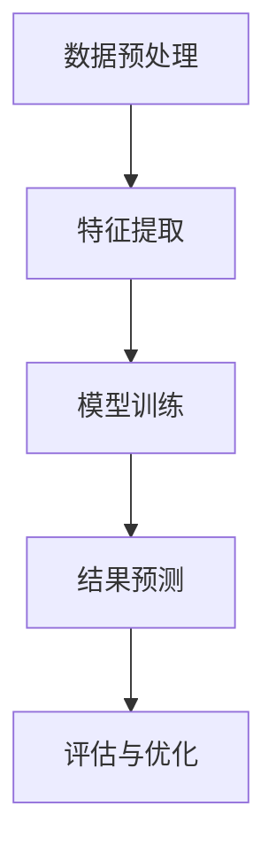
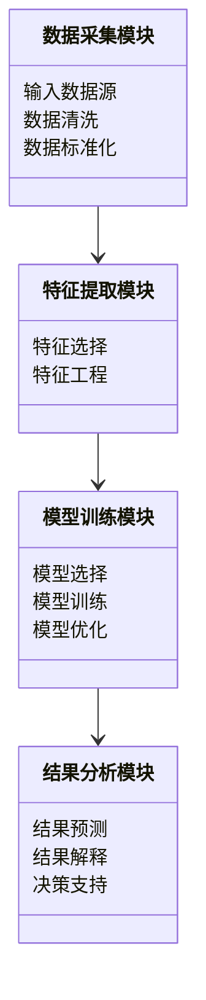
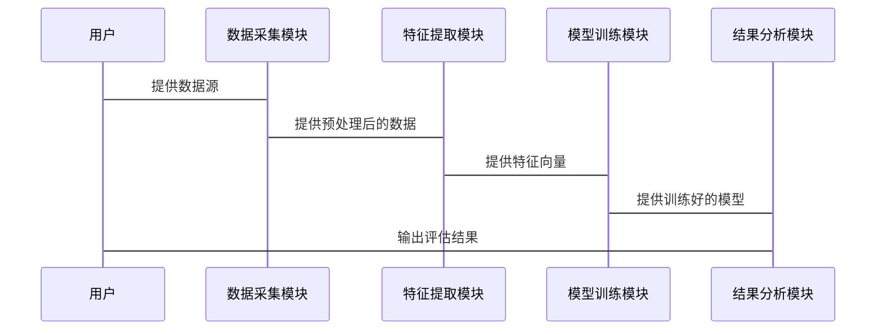

                 


# 《企业估值中的AI驱动的网络安全平台评估》

**关键词：** 企业估值, AI驱动, 网络安全, 平台评估, 机器学习, 深度学习

**摘要：** 本文探讨了在企业估值过程中，如何利用人工智能（AI）驱动的网络安全平台评估方法，分析网络安全在企业价值评估中的重要性，介绍AI在网络安全评估中的核心算法，系统架构设计，项目实战，并总结最佳实践。

---

# 第一部分: 企业估值中的AI驱动的网络安全平台评估背景与概念

## 第1章: 企业估值与网络安全平台评估概述

### 1.1 企业估值的核心问题

#### 1.1.1 企业估值的传统方法与局限性

企业估值是企业管理中的核心问题之一，传统方法包括DCF（ discounted cash flow）、相对估值法（如市盈率、市净率等）。然而，这些方法往往忽视了企业网络安全这一关键因素。企业网络安全问题不仅影响企业的运营成本，还可能影响企业的声誉和客户信任，进而影响企业价值。

#### 1.1.2 网络安全在企业估值中的重要性

网络安全是企业运营的重要组成部分，尤其是在数字化转型的今天。企业的网络安全状况直接影响其数据完整性、客户信任度和市场竞争力。通过AI驱动的网络安全平台评估，可以更准确地量化网络安全对企业发展的影响，从而更全面地评估企业价值。

#### 1.1.3 AI驱动的网络安全评估的新范式

AI技术的应用使得网络安全评估更加智能化、自动化。通过机器学习和深度学习算法，可以实时分析海量网络安全数据，发现潜在的安全威胁，并提供预测性安全评估。这种基于AI的评估方法弥补了传统方法的不足，为企业的估值提供了更全面的支持。

### 1.2 AI驱动的网络安全平台评估的核心概念

#### 1.2.1 AI在网络安全评估中的应用背景

随着企业数字化转型的深入，网络安全威胁日益复杂。传统的基于规则的网络安全评估方法难以应对新型威胁。AI技术的引入，使得网络安全评估可以从海量数据中提取特征，识别异常行为，从而更准确地评估企业的网络安全状况。

#### 1.2.2 网络安全平台评估的关键指标

网络安全平台评估的关键指标包括：

- **数据完整性**：数据的准确性和一致性。
- **安全性**：企业的安全策略和措施的有效性。
- **风险暴露程度**：企业面临的网络安全风险。
- **恢复能力**：企业在遭受攻击后的恢复能力。

#### 1.2.3 AI驱动的安全评估的独特优势

AI驱动的安全评估的独特优势包括：

- **实时性**：可以实时分析网络安全数据，快速识别潜在威胁。
- **准确性**：通过机器学习算法，提高安全评估的准确性。
- **预测性**：可以预测未来的安全风险，帮助企业提前做好准备。

### 1.3 本章小结

本章介绍了企业估值的核心问题，强调了网络安全在企业估值中的重要性，并提出了AI驱动的网络安全评估的新范式。通过AI技术，可以更全面、准确地评估企业的网络安全状况，从而更准确地评估企业价值。

---

## 第2章: 企业估值中的网络安全平台评估框架

### 2.1 网络安全平台评估的基本原理

#### 2.1.1 企业网络安全的多维度评估

企业网络安全的多维度评估包括：

- **网络层**：评估网络架构的安全性。
- **数据层**：评估数据的安全性和完整性。
- **应用层**：评估应用程序的安全性。
- **用户层**：评估用户行为的安全性。

#### 2.1.2 AI驱动的网络安全评估的核心要素

AI驱动的网络安全评估的核心要素包括：

- **数据采集**：收集企业的网络安全数据。
- **特征提取**：从数据中提取有用的特征。
- **模型训练**：训练机器学习模型。
- **结果分析**：分析模型输出的结果。

#### 2.1.3 评估框架的设计原则

评估框架的设计原则包括：

- **可扩展性**：框架能够适应不同规模的企业。
- **实时性**：框架能够实时处理数据。
- **可解释性**：模型的输出结果能够被解释。

### 2.2 网络安全平台评估的流程与方法

#### 2.2.1 数据采集与处理

数据采集与处理包括：

- **数据源**：包括日志文件、网络流量数据、应用程序日志等。
- **数据清洗**：清除噪声数据，确保数据质量。
- **数据标准化**：将数据标准化，以便后续处理。

#### 2.2.2 模型训练与优化

模型训练与优化包括：

- **特征选择**：选择对网络安全评估有重要影响的特征。
- **模型训练**：使用机器学习算法训练模型。
- **模型优化**：通过调整模型参数，提高模型性能。

#### 2.2.3 结果分析与决策支持

结果分析与决策支持包括：

- **结果解释**：解释模型输出结果，找出潜在的安全威胁。
- **决策支持**：根据模型输出结果，提供决策支持。

### 2.3 本章小结

本章介绍了企业网络安全平台评估的基本原理，提出了AI驱动的网络安全评估的核心要素，并设计了评估框架。通过数据采集、特征提取、模型训练和结果分析，可以更全面地评估企业的网络安全状况，从而为企业的估值提供支持。

---

## 第3章: AI驱动的网络安全评估的核心算法

### 3.1 机器学习在网络安全评估中的应用

#### 3.1.1 监督学习在安全评估中的应用

监督学习在安全评估中的应用包括：

- **分类问题**：将网络安全事件分类为正常或异常。
- **回归问题**：预测网络安全风险的严重程度。

#### 3.1.2 无监督学习在安全评估中的应用

无监督学习在安全评估中的应用包括：

- **聚类分析**：将相似的安全事件聚类，发现潜在的威胁。
- **异常检测**：通过聚类分析发现异常行为。

#### 3.1.3 强化学习在安全评估中的应用

强化学习在安全评估中的应用包括：

- **策略优化**：通过强化学习优化安全策略。
- **自适应安全防护**：通过强化学习实现自适应的安全防护。

### 3.2 深度学习模型在网络安全评估中的应用

#### 3.2.1 CNN在网络安全中的应用

卷积神经网络（CNN）在网络安全中的应用包括：

- **网络流量分类**：通过CNN对网络流量进行分类，识别异常流量。
- **恶意软件检测**：通过CNN检测恶意软件。

#### 3.2.2 RNN在网络安全中的应用

循环神经网络（RNN）在网络安全中的应用包括：

- **时间序列分析**：分析网络流量的时间序列数据，发现异常行为。
- **恶意代码检测**：通过RNN检测恶意代码。

#### 3.2.3 Transformer在网络安全中的应用

Transformer在网络安全中的应用包括：

- **自然语言处理**：通过Transformer对日志文件进行自然语言处理，识别异常行为。
- **网络安全预测**：通过Transformer预测未来的网络安全风险。

### 3.3 算法原理与实现

#### 3.3.1 算法流程图（Mermaid）



#### 3.3.2 算法实现代码示例

```python
import numpy as np
from sklearn.model_selection import train_test_split
from sklearn.metrics import accuracy_score

# 示例代码：使用机器学习模型进行网络安全评估
X = np.array([...])  # 特征向量
y = np.array([...])  # 标签

X_train, X_test, y_train, y_test = train_test_split(X, y, test_size=0.2)

# 训练模型
model = ...  # 初始化模型

model.fit(X_train, y_train)

# 预测结果
y_pred = model.predict(X_test)

# 评估准确率
accuracy = accuracy_score(y_test, y_pred)
print(f"模型准确率：{accuracy}")
```

#### 3.3.3 算法原理的数学模型和公式

- **分类问题**：使用逻辑回归模型，损失函数为交叉熵损失函数：
  $$ L = -\frac{1}{m}\sum_{i=1}^{m} [y^{(i)} \cdot \log(h(x^{(i)})) + (1 - y^{(i)}) \cdot \log(1 - h(x^{(i)}))] $$
  其中，$$ h(x) = \frac{1}{1 + e^{-\beta x}} $$

- **聚类分析**：使用K-means算法，目标是最小化聚类中心到样本点的距离：
  $$ \min \sum_{i=1}^{k} \sum_{j=1}^{n_i} \|x_j^{(i)} - c_i\|^2 $$
  其中，$$ c_i $$ 是第i个聚类中心，$$ x_j^{(i)} $$ 是属于第i个聚类的第j个样本点。

### 3.4 本章小结

本章介绍了机器学习和深度学习在网络安全评估中的应用，包括监督学习、无监督学习和强化学习。通过具体的算法流程图和代码示例，详细讲解了算法的实现过程，并通过数学公式解释了算法的原理。

---

## 第4章: 系统分析与架构设计方案

### 4.1 问题场景介绍

企业需要评估其网络安全平台的性能，以支持企业的估值。传统的网络安全评估方法难以应对复杂的网络安全威胁，因此需要引入AI驱动的网络安全评估系统。

### 4.2 系统功能设计

#### 4.2.1 领域模型类图（Mermaid）



### 4.3 系统架构设计

#### 4.3.1 系统架构图（Mermaid）

```mermaid
rect {
    label: 网络安全评估系统
    split
    网络流量数据 --> 数据采集模块
    应用程序日志 --> 数据采集模块
    用户行为数据 --> 数据采集模块
    数据采集模块 --> 数据预处理模块
    数据预处理模块 --> 特征提取模块
    特征提取模块 --> 模型训练模块
    模型训练模块 --> 结果分析模块
    结果分析模块 --> 决策支持模块
}
```

### 4.4 系统接口设计

系统接口设计包括：

- **数据接口**：与数据源对接，获取网络安全数据。
- **模型接口**：与机器学习模型对接，进行模型训练和预测。
- **结果接口**：与决策支持系统对接，输出评估结果。

### 4.5 系统交互流程（Mermaid）



### 4.6 本章小结

本章通过系统分析与架构设计，提出了一个基于AI的网络安全评估系统的整体架构。通过模块化设计，确保系统的可扩展性和可维护性。系统接口设计和交互流程图展示了系统的实现过程，为后续的项目实施提供了指导。

---

## 第5章: 项目实战

### 5.1 环境安装与配置

#### 5.1.1 安装Python环境

使用Anaconda安装Python环境：
```bash
conda create -n ai_security python=3.8
conda activate ai_security
```

#### 5.1.2 安装依赖库

安装所需的机器学习库：
```bash
pip install numpy pandas scikit-learn tensorflow keras
```

### 5.2 系统核心实现

#### 5.2.1 数据预处理模块

数据预处理模块实现：
```python
import pandas as pd
from sklearn.preprocessing import StandardScaler

def preprocess_data(data):
    # 数据清洗
    data = data.dropna()
    # 数据标准化
    scaler = StandardScaler()
    data_scaled = scaler.fit_transform(data)
    return data_scaled
```

#### 5.2.2 特征提取模块

特征提取模块实现：
```python
import numpy as np
from sklearn.feature_selection import SelectKBest

def extract_features(data, labels):
    selector = SelectKBest(k='sqrt')
    selector.fit_transform(data, labels)
    return selector.transform(data)
```

#### 5.2.3 模型训练模块

模型训练模块实现：
```python
from sklearn.svm import SVC

def train_model(features, labels):
    model = SVC()
    model.fit(features, labels)
    return model
```

#### 5.2.4 结果分析模块

结果分析模块实现：
```python
from sklearn.metrics import classification_report

def analyze_results(predicted_labels, true_labels):
    print(classification_report(predicted_labels, true_labels))
```

### 5.3 代码应用解读与分析

#### 5.3.1 数据预处理模块解读

数据预处理模块的主要功能是清洗和标准化数据，确保数据的质量和一致性。通过使用`StandardScaler`，可以将数据标准化，消除特征之间的尺度差异。

#### 5.3.2 特征提取模块解读

特征提取模块的主要功能是从数据中提取有用的特征，减少数据维度，提高模型的训练效率。通过使用`SelectKBest`，可以选择最重要的特征，提高模型的准确性。

#### 5.3.3 模型训练模块解读

模型训练模块的主要功能是训练机器学习模型，用于网络安全评估。通过使用支持向量机（SVC），可以实现高效的分类任务，提高模型的准确率。

#### 5.3.4 结果分析模块解读

结果分析模块的主要功能是分析模型的输出结果，评估模型的性能。通过使用`classification_report`，可以详细分析模型的分类结果，找出潜在的错误和改进方向。

### 5.4 实际案例分析

#### 5.4.1 案例背景

假设我们有一个网络安全数据集，包含企业的网络流量数据、应用程序日志和用户行为数据。我们的目标是通过AI驱动的网络安全评估系统，评估企业的网络安全状况。

#### 5.4.2 数据预处理

首先，我们对数据进行清洗和标准化：
```python
data = pd.read_csv('security_data.csv')
data_scaled = preprocess_data(data)
```

#### 5.4.3 特征提取

接下来，我们从数据中提取特征：
```python
features = extract_features(data_scaled, data['label'])
```

#### 5.4.4 模型训练

然后，我们训练机器学习模型：
```python
model = train_model(features, data['label'])
```

#### 5.4.5 模型预测与结果分析

最后，我们进行模型预测，并分析结果：
```python
predicted_labels = model.predict(features)
analyze_results(predicted_labels, data['label'])
```

### 5.5 本章小结

本章通过项目实战，详细讲解了AI驱动的网络安全评估系统的实现过程。通过数据预处理、特征提取、模型训练和结果分析，展示了如何利用AI技术进行网络安全评估。实际案例分析进一步验证了系统的有效性。

---

## 第6章: 最佳实践与注意事项

### 6.1 小结

AI驱动的网络安全评估系统为企业的估值提供了有力支持。通过机器学习和深度学习算法，可以更全面、准确地评估企业的网络安全状况，从而更准确地评估企业价值。

### 6.2 注意事项

在实际应用中，需要注意以下几点：

- **数据隐私**：确保数据的安全性和隐私性，避免数据泄露。
- **模型可解释性**：确保模型的输出结果能够被解释，便于决策支持。
- **模型更新**：定期更新模型，以应对新的网络安全威胁。

### 6.3 拓展阅读

- **《网络安全与人工智能》**：深入探讨AI在网络安全中的应用。
- **《机器学习实战》**：学习更多机器学习算法的实现和应用。
- **《深度学习》**：了解深度学习的基本原理和应用。

---

## 作者

作者：AI天才研究院/AI Genius Institute & 禅与计算机程序设计艺术 /Zen And The Art of Computer Programming

