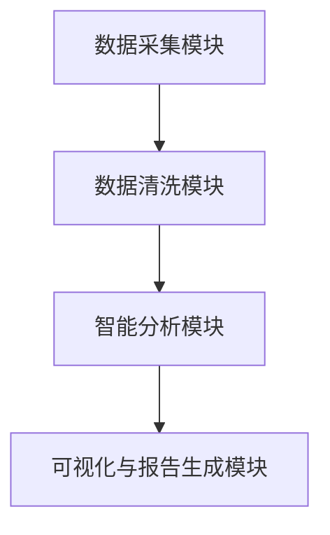
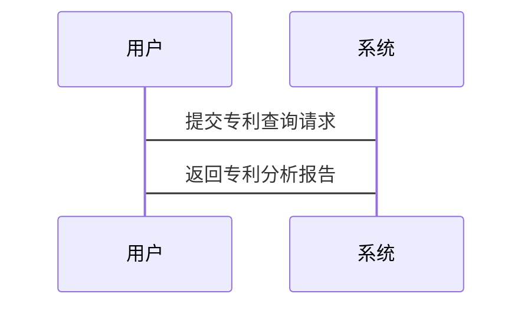

                 


# 企业估值中的AI驱动的自动化专利分析平台评估

> 关键词：企业估值, AI驱动, 专利分析, 自动化平台, 专利评估

> 摘要：在企业估值过程中，专利分析是评估企业技术实力和市场竞争力的重要组成部分。随着人工智能技术的快速发展，AI驱动的自动化专利分析平台在企业估值中的应用越来越广泛。本文将详细探讨AI驱动的自动化专利分析平台在企业估值中的作用，分析其核心概念、算法原理、系统架构，并通过实际案例展示其应用价值，为企业估值提供新的思路和方法。

---

# 第一部分: 企业估值中的AI驱动的自动化专利分析平台背景与概述

## 第1章: 专利分析与企业估值概述

### 1.1 专利的基本概念与重要性

#### 1.1.1 专利的基本定义与分类
专利是法律保护的创新成果，主要分为发明专利、实用新型专利和外观设计专利。发明专利是最重要的一种，涉及技术方案的核心创新。

#### 1.1.2 专利在企业估值中的作用
专利是企业的核心资产之一，反映了企业的技术创新能力。专利的数量、质量和技术领域的分布直接影响企业的市场竞争力和估值。

#### 1.1.3 专利分析的常见方法与挑战
传统的专利分析方法包括手动检索、分类和对比，但效率低、覆盖面有限，难以满足现代企业快速评估的需求。

---

### 1.2 企业估值中的专利分析需求

#### 1.2.1 企业估值的基本概念
企业估值是通过对财务数据、市场表现、技术实力等多方面因素的综合评估，确定企业的市场价值。

#### 1.2.2 专利分析在企业估值中的应用场景
专利分析用于评估企业的技术储备、市场竞争力和未来增长潜力，尤其是在高科技行业，专利是核心资产。

#### 1.2.3 传统专利分析方法的局限性
传统方法依赖人工检索和分类，效率低，且难以处理海量数据，容易遗漏关键信息。

---

### 1.3 AI驱动的自动化专利分析的优势

#### 1.3.1 AI技术在专利分析中的应用潜力
AI技术可以快速处理海量专利数据，提取关键信息，识别技术趋势，帮助企业更好地理解市场和技术动态。

#### 1.3.2 自动化专利分析平台的核心优势
自动化专利分析平台可以实现数据的自动采集、清洗、分类和分析，显著提高效率和准确性。

#### 1.3.3 企业估值中的AI驱动专利分析的未来趋势
随着AI技术的不断进步，专利分析将更加智能化，为企业估值提供更精准的支持。

---

## 第2章: AI驱动的自动化专利分析平台的核心概念

### 2.1 专利分析的关键要素

#### 2.1.1 专利数据的构成与特征
专利数据包括申请日期、申请人、技术领域、权利状态等信息，这些数据是分析的基础。

#### 2.1.2 专利技术领域的分类
技术领域分类是专利分析的重要步骤，通常基于国际专利分类（IPC）标准。

#### 2.1.3 专利权属与法律状态分析
专利的权属和法律状态直接影响其价值，包括是否存在无效宣告、是否被授权等。

---

### 2.2 AI驱动的专利分析模型

#### 2.2.1 自然语言处理在专利文本分析中的应用
NLP技术用于提取专利文本中的关键词、主题和情感倾向，帮助识别技术趋势和市场热点。

#### 2.2.2 机器学习在专利分类与聚类中的应用
机器学习算法可以自动对专利进行分类和聚类，识别技术领域的关联性。

#### 2.2.3 深度学习在专利价值评估中的应用
深度学习模型可以分析专利的多维特征，评估其市场价值和潜在风险。

---

### 2.3 自动化专利分析平台的架构

#### 2.3.1 数据采集模块
负责从专利数据库中抓取数据，支持多种数据格式的导入。

#### 2.3.2 数据处理与清洗模块
对采集到的数据进行预处理，包括去重、格式化和标准化。

#### 2.3.3 智能分析模块
利用AI算法对数据进行分类、聚类和预测，生成分析结果。

#### 2.3.4 可视化与报告生成模块
将分析结果以图表和报告的形式呈现，方便用户理解和使用。

---

## 第3章: 企业估值中的专利分析框架

### 3.1 企业估值的基本框架

#### 3.1.1 企业估值的主要方法
包括DCF模型、可比公司法、资产重置法等，专利分析是其中的重要补充。

#### 3.1.2 专利在企业估值中的权重分配
专利的价值在不同行业中权重不同，例如高科技行业专利权重较高。

#### 3.1.3 专利分析对企业估值的影响路径
通过技术实力、市场竞争力和未来收益能力影响企业的整体估值。

---

### 3.2 基于AI的专利分析框架

#### 3.2.1 数据采集与预处理流程
从专利数据库中获取数据，清洗和标注，为后续分析做准备。

#### 3.2.2 专利文本分析的特征提取
利用NLP技术提取关键词、主题和情感倾向，生成文本向量。

#### 3.2.3 专利价值评估的模型构建
基于机器学习或深度学习模型，结合专利的多维特征进行价值评估。

---

### 3.3 企业估值中的专利分析框架

#### 3.3.1 数据采集与清洗
从多个专利数据库中获取数据，清洗和标注，确保数据质量。

#### 3.3.2 专利分类与聚类
基于技术领域和法律状态对专利进行分类，识别技术趋势和核心专利。

#### 3.3.3 专利价值评估
结合专利的数量、质量、技术领域和法律状态，评估其市场价值。

---

## 第4章: 企业估值中的专利分析框架

### 4.1 企业估值中的专利分析框架

#### 4.1.1 数据采集与预处理
从专利数据库中获取数据，清洗和标注，确保数据质量。

#### 4.1.2 专利分类与聚类
基于技术领域和法律状态对专利进行分类，识别技术趋势和核心专利。

#### 4.1.3 专利价值评估
结合专利的数量、质量、技术领域和法律状态，评估其市场价值。

---

# 第二部分: 企业估值中的AI驱动的自动化专利分析平台实现

## 第4章: 企业估值中的专利分析框架

### 4.1 企业估值中的专利分析框架

#### 4.1.1 数据采集与预处理
从专利数据库中获取数据，清洗和标注，确保数据质量。

#### 4.1.2 专利分类与聚类
基于技术领域和法律状态对专利进行分类，识别技术趋势和核心专利。

#### 4.1.3 专利价值评估
结合专利的数量、质量、技术领域和法律状态，评估其市场价值。

---

## 第5章: AI驱动的自动化专利分析平台的系统实现

### 5.1 系统功能设计

#### 5.1.1 数据采集模块
从专利数据库中获取数据，支持多种数据格式的导入。

#### 5.1.2 数据清洗模块
对采集到的数据进行预处理，包括去重、格式化和标准化。

#### 5.1.3 智能分析模块
利用AI算法对数据进行分类、聚类和预测，生成分析结果。

#### 5.1.4 可视化与报告生成模块
将分析结果以图表和报告的形式呈现，方便用户理解和使用。

---

### 5.2 系统架构设计

#### 5.2.1 系统架构图
使用Mermaid绘制系统架构图，展示各模块之间的关系。



---

### 5.3 系统接口设计

#### 5.3.1 数据接口
支持与专利数据库的API接口对接，获取实时专利数据。

#### 5.3.2 用户接口
提供用户友好的界面，方便用户输入参数和查看结果。

---

### 5.4 系统交互设计

#### 5.4.1 交互流程图
使用Mermaid绘制系统交互流程图，展示用户与系统之间的交互过程。



---

## 第6章: 项目实战

### 6.1 环境配置

#### 6.1.1 安装Python环境
使用Anaconda安装Python 3.8及以上版本。

#### 6.1.2 安装依赖库
安装必要的库，如`numpy`, `pandas`, `scikit-learn`, `spacy`, `matplotlib`。

---

### 6.2 核心代码实现

#### 6.2.1 数据清洗与预处理
```python
import pandas as pd
import spacy

# 加载中文分词模型
nlp = spacy.load("zh_core_web_sm")

def preprocess_patent_data(data):
    # 数据清洗
    data.dropna(inplace=True)
    data = data[~data['text'].isin(['', ' ', '  '])]
    
    # 文本分词
    texts = data['text'].tolist()
    processed_texts = []
    for text in texts:
        doc = nlp(text)
        processed_texts.append(' '.join([token.text for token in doc]))
    
    return processed_texts

# 示例数据
data = pd.DataFrame({'text': ['发明专利申请', '实用新型专利', '外观设计专利']})
processed_texts = preprocess_patent_data(data)
print(processed_texts)
```

---

#### 6.2.2 专利分类与聚类
```python
from sklearn.feature_extraction.text import TfidfVectorizer
from sklearn.cluster import KMeans

def patent_clustering(texts):
    vectorizer = TfidfVectorizer()
    tfidf_matrix = vectorizer.fit_transform(texts)
    
    # K-means聚类
    num_clusters = 3
    kmeans = KMeans(n_clusters=num_clusters)
    kmeans.fit(tfidf_matrix)
    
    return kmeans, tfidf_matrix

# 使用示例文本进行聚类
texts = ["专利申请1：智能音箱", "专利申请2：智能音箱技术", "专利申请3：无线充电"]
kmeans, tfidf_matrix = patent_clustering(texts)
print("聚类完成，簇数为:", num_clusters)
```

---

## 第7章: 最佳实践与小结

### 7.1 最佳实践

#### 7.1.1 数据质量的重要性
确保数据的准确性和完整性，选择可靠的专利数据库。

#### 7.1.2 模型调优的技巧
根据实际需求调整模型参数，进行交叉验证，优化模型性能。

#### 7.1.3 结果的可视化与解释
通过图表和报告直观展示分析结果，确保用户能够理解和应用。

---

### 7.2 小结

本文详细探讨了AI驱动的自动化专利分析平台在企业估值中的应用，从背景、核心概念到系统实现，再到实际案例，全面分析了其价值和实现方法。通过本文的介绍，读者可以深入了解如何利用AI技术提升专利分析的效率和准确性，为企业估值提供有力支持。

---

### 7.3 注意事项

在实际应用中，需注意数据隐私和法律合规问题，确保专利分析过程符合相关法律法规。

---

### 7.4 拓展阅读

推荐阅读以下资料，深入了解相关技术：
1. 《专利分析与企业战略》
2. 《人工智能在金融领域的应用》
3. 《机器学习实战》

---

作者：AI天才研究院/AI Genius Institute & 禅与计算机程序设计艺术 /Zen And The Art of Computer Programming

