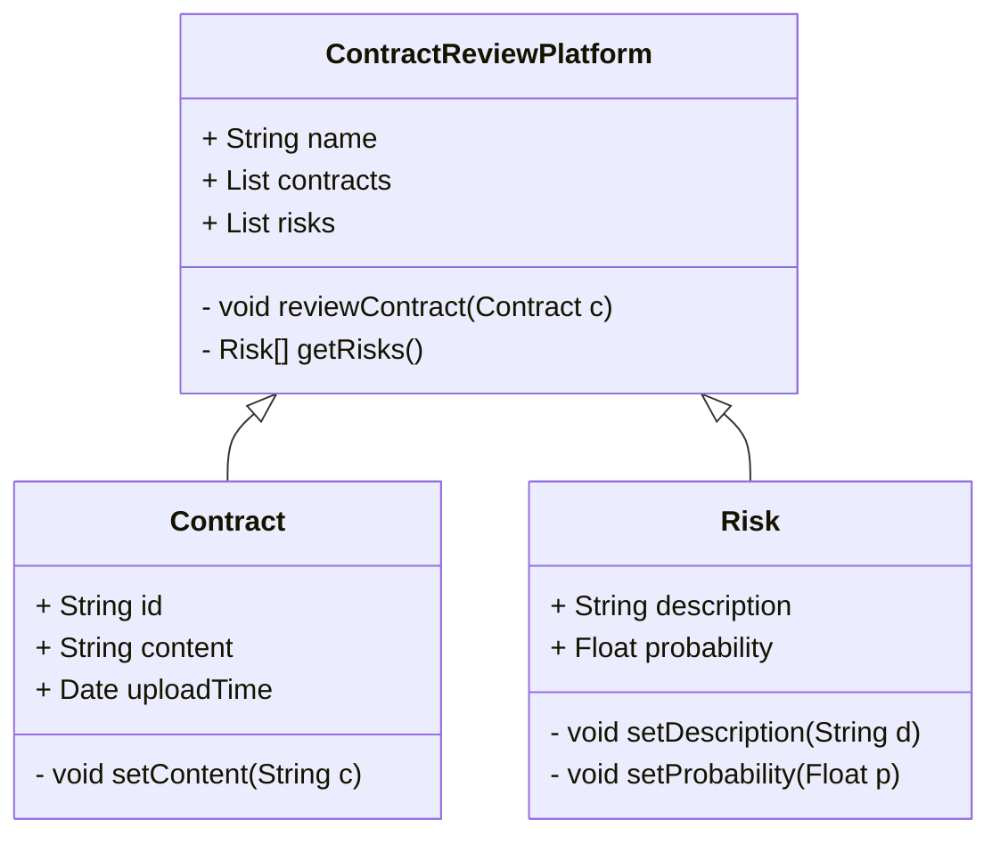
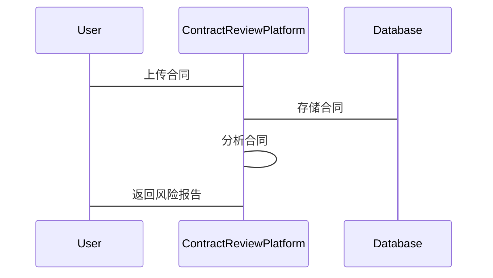

                 


# 企业估值中的AI驱动的自动化合同审查平台评估

> **关键词**: 企业估值, AI驱动, 合同审查, 自动化平台, 人工智能, 机器学习, 自然语言处理(NLP)

> **摘要**: 本文探讨了在企业估值过程中，如何利用AI驱动的自动化合同审查平台来提升效率和准确性。通过分析合同审查的核心要素、AI技术的应用原理、系统架构设计以及实际案例，本文为读者提供了一套系统化的解决方案，展示了AI在企业估值中的巨大潜力。

---

## 第一部分: 背景与概念

### 第1章: 合同审查与企业估值概述

#### 1.1 合同审查的基本概念

**合同审查**是指对合同的合法性、合规性、风险性和可操作性进行分析和评估的过程。它是企业日常运营和决策中的重要环节，尤其是在企业估值过程中，合同审查直接关系到企业的财务状况和未来价值。

- **合同审查的定义**：通过对合同内容的分析，识别潜在的法律风险和商业机会，确保合同的合法性和公平性。
- **企业估值的核心要素**：企业估值通常包括资产、负债、收入、利润、风险等多个方面，而合同作为企业的重要资产，其审查结果直接影响估值的准确性。

#### 1.2 传统合同审查方法的局限性

传统合同审查主要依赖人工操作，存在以下问题：

- **效率低下**：人工审查需要逐字逐句阅读合同，耗时长，且容易出错。
- **信息不对称**：不同部门或人员对合同的理解可能存在差异，导致审查结果不一致。
- **成本高**：人工审查需要大量时间和人力资源，增加了企业的运营成本。

#### 1.3 AI驱动的合同审查的优势

AI技术的应用解决了传统方法的诸多问题：

- **自动化处理**：AI可以快速扫描和分析大量合同，显著提高审查效率。
- **智能分析**：通过自然语言处理（NLP）和机器学习，AI能够识别合同中的关键条款和潜在风险。
- **全面性**：AI可以对海量合同进行统一分析，确保审查的全面性和一致性。

### 第2章: AI驱动的合同审查平台核心概念

#### 2.1 AI在合同审查中的应用原理

AI驱动的合同审查平台主要依赖以下技术：

- **自然语言处理（NLP）**：用于理解和分析合同文本，识别关键词和关键条款。
- **机器学习**：通过训练模型，平台能够自动分类合同并预测潜在风险。
- **深度学习**：利用神经网络模型，进一步提升合同理解和分析的准确性。

#### 2.2 合同审查平台的架构与功能

AI驱动的合同审查平台通常包括以下功能模块：

- **合同上传**：用户可以上传多种格式的合同文件。
- **智能分析**：利用NLP技术对合同内容进行分析，识别关键条款和潜在风险。
- **风险评估**：根据分析结果生成风险报告，帮助企业识别和规避潜在问题。

---

## 第二部分: 算法原理

### 第3章: 自然语言处理（NLP）技术原理

#### 3.1 NLP技术在合同审查中的应用

- **分词与实体识别**：将合同文本分割成词语，并识别合同中的关键实体（如人名、地名、机构名）。
- **语义理解**：通过上下文分析合同条款的含义，识别潜在的法律风险。
- **文本相似度计算**：利用余弦相似度等算法，比较合同条款与标准模板的相似性。

**余弦相似度计算公式**：
$$
\text{相似度} = \frac{\vec{A} \cdot \vec{B}}{\|\vec{A}\| \|\vec{B}\|}
$$

### 第4章: 机器学习模型

#### 4.1 机器学习在合同分类中的应用

- **监督学习**：使用标注的数据训练分类器，识别合同类型（如商业合同、融资协议）。
- **无监督学习**：通过聚类算法，自动发现合同中的相似模式。

**监督学习分类流程**：
1. 数据预处理：清洗和标注合同数据。
2. 特征提取：提取合同文本的特征向量。
3. 模型训练：使用训练数据训练分类器。
4. 预测与评估：对新合同进行分类，并评估模型性能。

---

## 第三部分: 系统设计

### 第5章: 系统功能设计

#### 5.1 功能模块划分

- **合同上传模块**：支持多种格式的合同上传。
- **智能分析模块**：利用NLP和机器学习技术对合同进行分析。
- **风险评估模块**：生成风险报告，提供改进建议。

#### 5.2 系统架构设计

**系统架构类图**：



### 第6章: 接口设计与交互流程

#### 6.1 系统接口设计

- **API接口**：提供RESTful API，供其他系统调用合同审查服务。
- **用户界面**：设计友好的Web界面，方便用户上传合同和查看结果。

#### 6.2 交互流程图



---

## 第四部分: 项目实战

### 第7章: 环境安装与系统实现

#### 7.1 环境安装

- **Python环境**：安装Python 3.8及以上版本。
- **依赖库安装**：安装NLP库（如spaCy、NLTK）和机器学习库（如Scikit-learn、TensorFlow）。

#### 7.2 核心代码实现

```python
import spacy
from sklearn.feature_extraction.text import TfidfVectorizer
from sklearn.svm import SVC

# 加载spaCy中文模型
nlp = spacy.load("zh_core_web_sm")

# 定义文本处理函数
def process_text(text):
    doc = nlp(text)
    return " ".join([token.text for token in doc])

# 初始化TF-IDF向量化
vectorizer = TfidfVectorizer(max_features=5000)
model = SVC()

# 训练模型
X = vectorizer.fit_transform(corpus)
model.fit(X, labels)
```

---

## 第五部分: 最佳实践与总结

### 第8章: 最佳实践

- **数据质量**：确保训练数据的多样性和代表性，避免过拟合。
- **模型更新**：定期更新模型，以应对新的合同类型和条款变化。
- **用户反馈**：收集用户反馈，持续优化平台功能。

### 第9章: 小结

AI驱动的合同审查平台通过自动化处理和智能分析，显著提升了企业估值的效率和准确性。随着技术的不断进步，未来的合同审查将更加智能化和个性化。

---

## 作者

**作者：AI天才研究院/AI Genius Institute & 禅与计算机程序设计艺术 /Zen And The Art of Computer Programming**

---

以上就是《企业估值中的AI驱动的自动化合同审查平台评估》的完整内容。通过理论分析和实际案例的结合，我们展示了AI技术如何助力企业估值中的合同审查工作。

