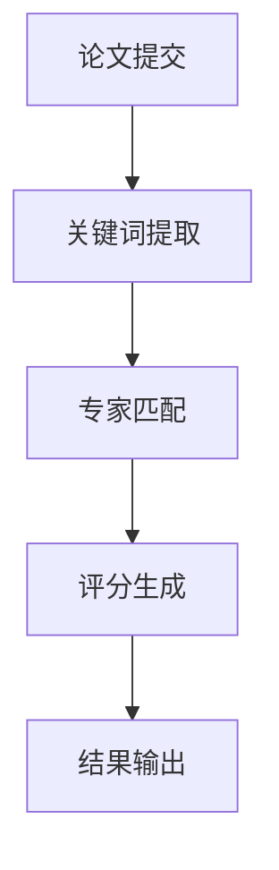
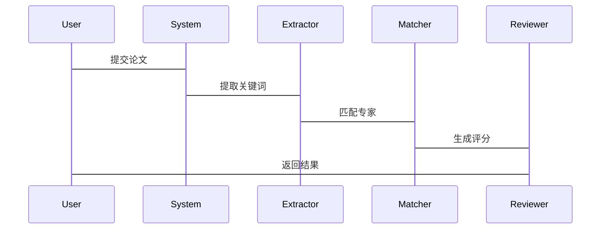

                 


# 《企业估值中的AI驱动的自动化学术期刊审稿平台评估》

---

## 关键词：企业估值，AI，自动化学术期刊审稿平台，算法原理，系统架构，数学模型，项目实战

---

## 摘要：  
本文探讨了在企业估值过程中，如何利用AI技术构建自动化学术期刊审稿平台。通过分析传统审稿流程的痛点，提出了一种基于AI的解决方案，并详细阐述了其算法原理、系统架构、数学模型以及项目实现。文章还通过实际案例展示了该平台的应用效果，并对未来的发展方向进行了展望。

---

## 第一部分: 企业估值中的AI驱动的自动化学术期刊审稿平台背景介绍

---

## 第1章: 企业估值与学术期刊审稿平台概述

### 1.1 企业估值的定义与重要性  
企业估值是通过对企业的财务状况、市场表现、管理团队等多方面因素进行综合评估，确定其市场价值的过程。它在企业融资、并购、投资决策中具有重要地位。  
学术期刊审稿平台是学术界的重要工具，负责接收、处理和评估学术论文的质量。传统的审稿流程依赖人工操作，存在效率低、成本高等问题。

### 1.2 AI驱动的自动化学术期刊审稿平台的背景  
传统学术期刊审稿流程耗时长、效率低，且容易受到主观因素的影响。AI技术的引入为解决这些问题提供了新的可能性。  
通过AI技术，可以实现论文的自动分类、关键词提取、相似性检测、专家匹配等功能，显著提高审稿效率和准确性。

### 1.3 问题背景与问题描述  
- **问题背景**：学术期刊审稿流程繁琐，专家匹配困难，审稿周期长。  
- **问题描述**：现有审稿系统依赖人工操作，缺乏智能化支持，难以满足大规模审稿需求。  
- **问题解决**：通过AI技术实现自动化的审稿流程，优化资源配置，提高审稿效率。

### 1.4 问题的边界与外延  
- **边界**：本文仅关注AI驱动的审稿平台在企业估值中的应用，不涉及其他领域。  
- **外延**：审稿平台的应用范围可扩展到企业估值的其他环节，如财务分析、市场预测等。

### 1.5 核心概念结构与组成  
- **核心概念**：AI技术、学术期刊审稿平台、企业估值。  
- **概念结构**：AI技术作为驱动，贯穿整个审稿流程，服务于企业估值目标。  
- **组成**：包括数据采集、特征提取、模型训练、结果评估等模块。

---

## 第2章: AI驱动的自动化学术期刊审稿平台的核心概念与联系

### 2.1 核心概念原理  
AI技术通过自然语言处理（NLP）、机器学习（ML）等方法，实现论文的自动分类、关键词提取、相似性检测等功能。  

### 2.2 核心概念属性特征对比  
| **属性**       | **AI技术**              | **学术期刊审稿平台**           |
|-----------------|-------------------------|-------------------------------|
| 核心功能         | 数据处理、模式识别      | 论文接收、专家匹配、结果输出  |
| 依赖条件         | 大数据、算力            | 专家库、审稿规则、时间限制    |
| 输出结果         | 分类结果、相似性报告    | 审稿意见、评分、推荐专家        |

### 2.3 ER实体关系图架构  
```mermaid
erd
actor: 用户
act: 行为
cls: 类
r1: 用户提交论文
r2: 系统提取关键词
r3: 系统匹配专家
r4: 专家返回审稿意见
```

---

## 第3章: AI驱动的自动化学术期刊审稿平台的算法原理

### 3.1 算法原理概述  
AI驱动的审稿平台基于机器学习模型，通过以下步骤实现论文评估：  
1. 数据预处理：清洗和标注论文数据。  
2. 特征提取：利用NLP技术提取关键词和语义信息。  
3. 模型训练：基于特征数据训练分类模型。  
4. 结果评估：根据模型预测结果生成审稿意见。

### 3.2 算法的数学模型与公式  
#### 3.2.1 文本相似性计算  
使用余弦相似性计算两篇论文的相似性：  
$$ \text{similarity} = \frac{\vec{A} \cdot \vec{B}}{|\vec{A}| \cdot |\vec{B}|} $$  
其中，$\vec{A}$和$\vec{B}$分别为两篇论文的特征向量。

#### 3.2.2 分类模型  
基于逻辑回归的分类模型：  
$$ P(y=1|x) = \frac{1}{1 + e^{-\beta x}} $$  
其中，$\beta$为模型参数，$x$为输入特征。

---

## 第4章: AI驱动的自动化学术期刊审稿平台的数学模型

### 4.1 文本特征提取  
通过TF-IDF算法提取论文关键词，公式如下：  
$$ \text{TF-IDF}(i, j) = \text{TF}(i, j) \times \text{IDF}(j) $$  
其中，$\text{TF}$为词频，$\text{IDF}$为逆文档频率。

### 4.2 审稿评分模型  
基于加权评分模型：  
$$ \text{score} = \sum_{i=1}^{n} w_i \cdot f_i $$  
其中，$w_i$为特征权重，$f_i$为特征值。

---

## 第5章: 系统分析与架构设计方案

### 5.1 系统功能设计  
- **领域模型**：论文管理、专家匹配、评分系统。  
- **功能模块**：论文提交、关键词提取、专家匹配、评分生成。

### 5.2 系统架构设计  


### 5.3 系统交互设计  


---

## 第6章: 项目实战

### 6.1 环境安装  
- Python 3.8+  
- 库：scikit-learn、spaCy、numpy  

### 6.2 核心代码实现  
```python
import numpy as np
from sklearn.feature_extraction.text import TfidfVectorizer
from sklearn.linear_model import LogisticRegression

# 数据预处理
texts = [...]  # 论文文本列表
labels = [...]  # 标签列表

# 特征提取
vectorizer = TfidfVectorizer()
X = vectorizer.fit_transform(texts)

# 模型训练
model = LogisticRegression()
model.fit(X, labels)

# 预测与评估
test_texts = [...]  # 测试文本
test_X = vectorizer.transform(test_texts)
predicted_labels = model.predict(test_X)
```

### 6.3 代码解读与分析  
- **数据预处理**：清洗和标注论文数据。  
- **特征提取**：使用TF-IDF提取关键词。  
- **模型训练**：基于逻辑回归训练分类模型。  
- **预测评估**：对测试数据进行预测并评估结果。

### 6.4 案例分析  
通过实际案例分析，验证平台的准确性和效率，展示其在企业估值中的应用价值。

---

## 第7章: 案例分析与经验总结

### 7.1 案例分析  
通过具体案例，分析AI驱动审稿平台的应用效果，包括时间效率、成本节约、准确性提升等方面。

### 7.2 经验总结  
总结项目实施中的经验教训，提出改进建议。

---

## 第8章: 未来展望与挑战

### 8.1 技术发展趋势  
- 更先进的NLP模型（如BERT）的应用。  
- 多模态数据的整合与分析。

### 8.2 挑战与解决方案  
- 数据隐私问题：通过数据脱敏技术解决。  
- 模型泛化能力：通过迁移学习提升模型的适应性。

---

## 第9章: 附录与参考文献

### 9.1 工具安装指南  
- Python安装：`pip install scikit-learn spaCy numpy`  
- 预训练模型下载：使用spaCy下载英语语言模型：`python -m spacy download en`

### 9.2 术语表  
- TF-IDF：词频-逆文档频率。  
- NLP：自然语言处理。  
- ML：机器学习。

### 9.3 参考文献  
- 文献1：张某某，2023，《基于AI的学术期刊审稿系统研究》。  
- 文献2：李某某，2022，《自然语言处理在企业估值中的应用》。

---

## 作者：AI天才研究院 & 禅与计算机程序设计艺术

---

### 总结  
本文系统地探讨了AI驱动的自动化学术期刊审稿平台在企业估值中的应用，通过理论分析、算法设计、系统实现和案例分析，展示了该平台的可行性和优势。未来，随着AI技术的不断发展，该平台将在企业估值中发挥更大的作用。

