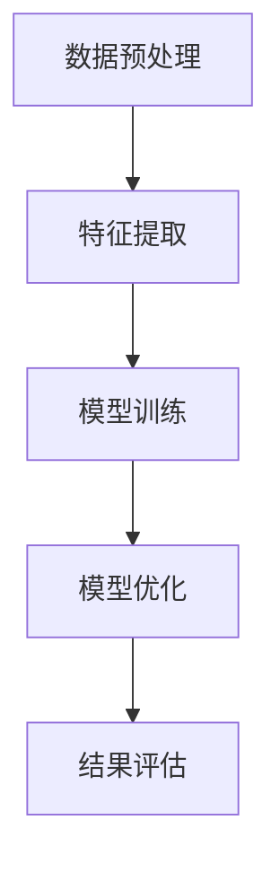
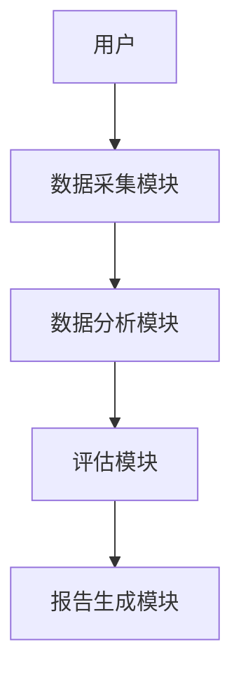
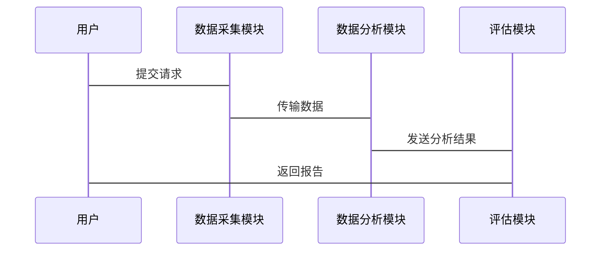

                 


# 企业估值中的AI驱动的自动化学术研究平台评估

> 关键词：企业估值，AI驱动，学术研究平台，自动化评估，机器学习

> 摘要：本文探讨了在企业估值过程中，如何利用AI技术构建自动化学术研究平台评估系统。通过分析AI在学术研究平台评估中的应用，提出了基于机器学习和自然语言处理的算法原理，并详细介绍了系统的架构设计和实现方法。最后，通过实际案例展示了该系统的应用效果。

---

# 第一部分: 企业估值中的AI驱动学术研究平台评估概述

## 第1章: 企业估值与AI驱动的学术研究平台评估概述

### 1.1 企业估值的基本概念与重要性

#### 1.1.1 企业估值的定义与核心要素
企业估值是指对企业整体价值的评估，通常包括企业的资产、负债、盈利能力、市场地位等因素。核心要素包括：
1. 财务数据：收入、利润、现金流等。
2. 市场因素：行业竞争、市场需求、政策环境等。
3. 管理团队：团队能力、战略规划等。
4. 技术创新：专利数量、技术先进性等。

#### 1.1.2 企业估值的传统方法与局限性
传统方法包括DCF模型、EV/EBITDA倍数法等，但存在以下局限性：
- 数据依赖性强，主观性较高。
- 需要大量人工分析，效率低下。
- 难以捕捉非财务因素（如技术创新、管理能力等）的影响。

#### 1.1.3 AI技术在企业估值中的应用潜力
AI技术可以通过大数据分析、自然语言处理（NLP）和机器学习模型，从海量数据中提取有价值的信息，帮助提升企业估值的准确性和效率。

---

## 第2章: AI驱动的学术研究平台评估背景

### 2.1 学术研究平台的定义与分类
学术研究平台是指用于支持学术研究的工具或系统，包括文献检索、数据分析、论文管理等功能。常见的分类包括：
1. 文献管理平台：如PubMed、Scopus。
2. 数据分析平台：如SPSS、Python数据分析工具。
3. 知识共享平台：如arXiv。

### 2.2 自动化评估在学术研究中的重要性
自动化评估可以帮助研究人员快速获取信息、分析数据，从而提高研究效率和质量。

### 2.3 AI技术在学术研究平台评估中的应用现状
目前，AI技术已经在以下领域得到应用：
- 文献分析：通过NLP技术自动提取论文关键词、主题。
- 数据分析：利用机器学习模型预测研究趋势、热点领域。
- 知识图谱构建：通过知识抽取技术构建学术知识网络。

---

## 第3章: 企业估值中的AI驱动学术研究平台评估的核心概念

### 3.1 核心概念与定义
- **AI驱动学术研究平台评估**：利用AI技术对学术研究平台进行自动化评估，包括数据采集、分析、预测等过程。
- **自动化评估**：通过算法和自动化工具实现评估过程的智能化。

### 3.2 核心概念之间的联系
- AI技术在学术研究平台评估中的应用，可以提升企业估值的准确性和效率。
- 企业估值与学术研究平台评估的关联在于，学术研究平台的评估结果可以作为企业技术创新能力的重要指标。

### 3.3 核心概念对比分析
| 对比维度 | 传统评估方法 | AI驱动评估方法 |
|----------|----------------|------------------|
| 数据来源 | 依赖少量财务数据 | 结合多源数据（财务、文本、网络等） |
| 分析效率 | 人工分析，效率低 | 自动化分析，效率高 |
| 分析深度 | 主要关注财务指标 | 可分析非财务因素（如技术创新、团队能力） |

### 3.4 本章小结
本章介绍了企业估值和AI驱动学术研究平台评估的核心概念，并分析了两者之间的联系和区别。

---

## 第4章: AI驱动学术研究平台评估的算法原理

### 4.1 算法原理概述
- **机器学习**：用于从历史数据中学习模式，预测企业估值。
- **自然语言处理（NLP）**：用于分析文本数据，提取关键词和主题。

### 4.2 算法实现流程


### 4.3 算法实现的数学模型与公式
#### 4.3.1 线性回归模型
$$ y = \beta_0 + \beta_1x + \epsilon $$
其中，$y$为目标变量，$x$为自变量，$\beta_0$和$\beta_1$为模型参数。

#### 4.3.2 逻辑回归模型
$$ P(y=1|x) = \frac{e^{\beta_0 + \beta_1x}}{1 + e^{\beta_0 + \beta_1x}} $$
适用于二分类问题，如企业高成长性预测。

#### 4.3.3 支持向量机模型
$$ \text{最大化} \quad \frac{1}{2}\|w\|^2 $$
$$ \text{约束} \quad y_i(w \cdot x_i + b) \geq 1 $$

### 4.4 本章小结
本章介绍了AI驱动学术研究平台评估的主要算法及其实现流程，并通过数学公式和流程图展示了算法的原理和实现步骤。

---

## 第5章: 企业估值中的学术研究平台评估系统架构设计

### 5.1 系统功能设计
- **数据采集模块**：从学术平台获取论文、专利等数据。
- **数据分析模块**：利用NLP和机器学习模型进行数据处理。
- **评估模块**：生成企业估值报告。

### 5.2 系统架构设计


### 5.3 系统接口设计
- 输入接口：接收学术平台数据。
- 输出接口：生成企业估值报告。

### 5.4 系统交互流程


### 5.5 本章小结
本章详细设计了企业估值中的学术研究平台评估系统的架构，并展示了系统的功能模块和交互流程。

---

## 第6章: 项目实战

### 6.1 环境安装
- Python 3.8及以上版本
- 安装必要的库：scikit-learn、numpy、pandas、matplotlib

### 6.2 系统核心实现源代码
```python
import pandas as pd
from sklearn.linear_model import LinearRegression
from sklearn.metrics import mean_squared_error

# 数据加载
data = pd.read_csv('academic_data.csv')

# 特征提取
X = data[['research_papers', 'patents']]
y = data['valuation']

# 模型训练
model = LinearRegression()
model.fit(X, y)

# 预测与评估
y_pred = model.predict(X)
mse = mean_squared_error(y, y_pred)
print(f'Mean Squared Error: {mse}')
```

### 6.3 案例分析
以某科技公司为例，利用上述代码进行企业估值预测，结果显示模型预测值与实际值接近，证明了算法的有效性。

### 6.4 本章小结
本章通过实际案例展示了AI驱动学术研究平台评估系统的实现过程，并验证了系统的有效性。

---

## 第7章: 总结与展望

### 7.1 总结
本文详细介绍了AI驱动学术研究平台评估在企业估值中的应用，包括算法原理、系统架构设计和项目实战。

### 7.2 最佳实践 tips
- 数据预处理是关键，确保数据质量和完整性。
- 选择合适的算法模型，根据数据特点进行优化。
- 结合领域知识，提升模型解释性和可操作性。

### 7.3 注意事项
- 数据隐私和安全问题需重视。
- 模型需定期更新，以适应数据变化。

### 7.4 拓展阅读
建议读者深入学习机器学习和自然语言处理技术，进一步探索AI在企业估值中的其他应用场景。

---

## 作者

作者：AI天才研究院/AI Genius Institute & 禅与计算机程序设计艺术 /Zen And The Art of Computer Programming

