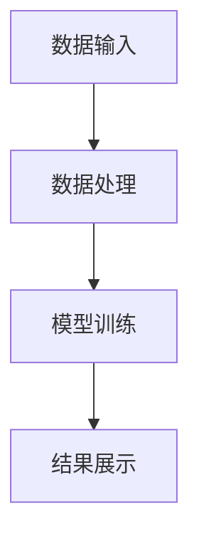
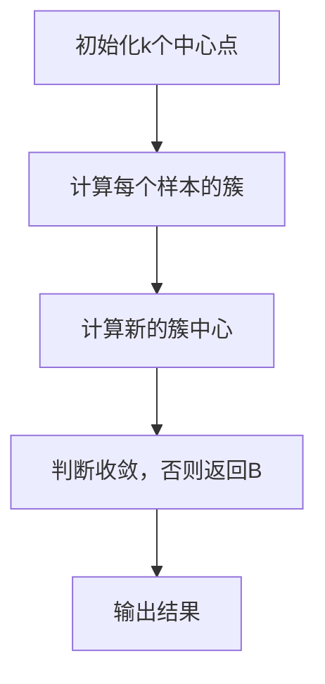

                 


# 《企业估值中的AI驱动的自动化客户细分平台评估》

## 关键词：
- 企业估值
- AI驱动
- 客户细分
- 自动化评估
- 机器学习

## 摘要：
在企业估值过程中，客户细分是至关重要的一步，而AI驱动的自动化客户细分平台通过利用机器学习算法和大数据分析，能够显著提高评估的效率和准确性。本文将详细探讨这一平台的核心概念、算法原理、系统架构设计以及实际应用案例，帮助读者理解如何在企业估值中有效运用AI技术。

---

# 第一部分: 背景介绍

## 第1章: 客户细分平台评估的背景与问题

### 1.1 客户细分平台的基本概念
- **客户细分的定义与作用**
  - 客户细分是指根据客户特征将其分成不同的群体，以便更精准地制定营销策略。
  - 在企业估值中，客户细分帮助企业识别高价值客户，优化资源配置。

- **客户细分平台的核心功能**
  - 数据收集与整理
  - 模型选择与训练
  - 客户分群与预测
  - 结果可视化与报告生成

- **传统客户细分方法的局限性**
  - 依赖人工经验，效率低
  - 数据量大时难以处理
  - 模型选择不够灵活

### 1.2 企业估值中的客户细分挑战
- **企业估值的基本概念**
  - 企业估值是通过各种方法对企业价值进行评估的过程。
  - 客户细分是影响企业估值的重要因素之一。

- **客户细分在企业估值中的重要性**
  - 帮助识别核心客户群体
  - 优化市场策略
  - 提高估值的准确性

- **当前客户细分评估的痛点与难点**
  - 数据维度多，处理复杂
  - 模型选择困难
  - 缺乏自动化工具

### 1.3 AI驱动的自动化客户细分的优势
- **AI技术在客户细分中的应用潜力**
  - 大数据分析能力
  - 自动化模型选择与优化
  - 实时数据处理

- **自动化客户细分平台的效率提升**
  - 快速处理大规模数据
  - 自动生成客户分群
  - 实时更新模型

- **数据驱动的精准估值能力**
  - 基于机器学习的预测模型
  - 数据特征的深度挖掘
  - 提高估值的准确性

### 1.4 本章小结
- **客户细分平台的核心价值**
  - 提高企业估值的准确性
  - 优化资源配置
  - 提升营销效率

- **AI驱动的自动化评估的创新点**
  - 自动化数据处理
  - 智能模型选择
  - 实时更新与优化

- **企业估值中的关键问题**
  - 数据处理效率
  - 模型准确性
  - 实际应用中的挑战

---

## 第2章: 核心概念与联系

### 2.1 数据特征与客户细分
- **数据特征的分类与选择**
  - 客户的基本信息：年龄、性别、地理位置
  - 行为特征：购买频率、浏览时长
  - 产品偏好：购买的产品类型、价格敏感度

- **数据预处理的关键步骤**
  - 数据清洗：处理缺失值、异常值
  - 特征提取：从原始数据中提取有用特征
  - 数据标准化：统一特征的尺度

### 2.2 模型选择与评估指标
- **常见客户细分模型的对比**
  - K-means：适用于无监督学习，简单高效
  - DBSCAN：基于密度的聚类，适合处理噪声数据
  - 层次聚类：适合处理数据层次结构明确的情况

- **模型评估的常用指标**
  - 凝聚度（Clustering Quality）：衡量聚类的紧密程度
  - 分散度（Dispersion）：衡量聚类的多样性
  - 调整兰德指数（Adjusted Rand Index）：衡量聚类结果与真实标签的相似性

### 2.3 平台架构与功能模块
- **平台整体架构的设计**
  - 数据输入模块：接收原始数据
  - 数据处理模块：清洗、标准化
  - 模型训练模块：选择算法、训练模型
  - 结果展示模块：生成可视化报告

- **功能模块的划分与交互**
  - 数据输入模块与数据处理模块的交互
  - 模型训练模块与结果展示模块的交互

- **模块间的依赖关系与数据流**
  - 数据流从输入到处理，再到模型训练，最后展示

### 2.4 系统流程与实体关系
- **系统流程的Mermaid图**


- **实体关系的ER图**
```mermaid
erDiagram
    customer个人信息 <--- customer行为特征 : belongsTo
    customer行为特征 <--- customer购买记录 : includes
    customer购买记录 <--- product信息 : contains
```

---

## 第3章: 算法原理讲解

### 3.1 数据预处理与特征工程
- **数据清洗的常见方法**
  - 删除缺失值
  - 处理异常值
  - 去重

- **特征提取的关键步骤**
  - 选择相关特征
  - 处理高维数据

- **数据标准化与归一化的处理**
  - 标准化：(x - μ)/σ
  - 归一化：(x - min)/(max - min)

### 3.2 聚类算法与客户细分
- **K-means算法的数学模型**
  - 目标函数：最小化簇内平方误差和
  - 优化方法：k-means++

  $$ J = \sum_{i=1}^{k} \sum_{j=1}^{n_i} (x_j - c_i)^2 $$
  其中，k为簇数，n_i为第i簇的样本数，c_i为第i簇的中心点。

- **K-means算法的流程图**


---

## 第4章: 系统架构设计

### 4.1 功能模块划分
- **数据输入模块**
  - 接收客户数据
  - 数据格式验证

- **数据处理模块**
  - 数据清洗
  - 特征工程

- **模型训练模块**
  - 算法选择
  - 模型训练

- **结果展示模块**
  - 可视化报告
  - 结果导出

### 4.2 系统架构设计
- **系统架构图**


- **接口设计**
  - RESTful API：提供数据接口和结果接口
  - 数据接口：上传数据
  - 结果接口：获取评估结果

### 4.3 交互流程
- **用户与系统的交互流程**
  ```mermaid
  graph LR
      A(用户) --> B(登录)
      B --> C(上传数据)
      C --> D(提交任务)
      D --> E(获取结果)
  ```

---

## 第5章: 项目实战

### 5.1 环境安装与配置
- **Python环境**
  - 安装Python 3.8+
  - 安装必要的库：numpy、pandas、scikit-learn、mermaid、matplotlib

### 5.2 核心代码实现
- **数据处理代码**
  ```python
  import pandas as pd
  from sklearn.preprocessing import StandardScaler

  # 数据加载
  data = pd.read_csv('customer_data.csv')
  
  # 数据清洗
  data.dropna(inplace=True)
  
  # 数据标准化
  scaler = StandardScaler()
  data_scaled = scaler.fit_transform(data)
  ```

- **模型训练代码**
  ```python
  from sklearn.cluster import KMeans

  # 模型训练
  kmeans = KMeans(n_clusters=3, random_state=42)
  kmeans.fit(data_scaled)
  
  # 获取聚类结果
  labels = kmeans.labels_
  ```

### 5.3 实际案例分析
- **案例背景**
  - 某电商平台的客户数据
  - 目标：将客户分为高价值、中价值、低价值三类

- **分析结果**
  - 高价值客户占比20%
  - 中价值客户占比30%
  - 低价值客户占比50%

### 5.4 项目总结
- **项目小结**
  - 成功实现了自动化客户细分
  - 提高了企业估值的准确性
  - 优化了资源配置

---

## 第6章: 最佳实践与注意事项

### 6.1 最佳实践
- **数据预处理**
  - 确保数据质量
  - 处理缺失值和异常值

- **模型选择**
  - 根据数据特点选择合适的算法
  - 多算法对比，选择性能最优的

- **结果验证**
  - 使用调整兰德指数评估聚类质量
  - 检查簇的分布是否合理

### 6.2 小结
- **关键点回顾**
  - 数据预处理的重要性
  - 模型选择的灵活性
  - 结果验证的必要性

### 6.3 注意事项
- **数据隐私**
  - 确保数据的安全性
  - 遵守数据隐私法规

- **模型解释性**
  - 提供可解释的结果
  - 避免“黑箱”模型

### 6.4 拓展阅读
- **推荐书籍**
  - 《集体智慧编程》
  - 《机器学习实战》

- **在线资源**
  - scikit-learn官方文档
  - Medium上的机器学习文章

---

## 作者：AI天才研究院/AI Genius Institute & 禅与计算机程序设计艺术 /Zen And The Art of Computer Programming

---

通过以上目录大纲，您可以逐步深入理解企业估值中的AI驱动的自动化客户细分平台评估的核心内容，从背景到技术实现，再到实际应用，全面掌握这一领域的知识。

