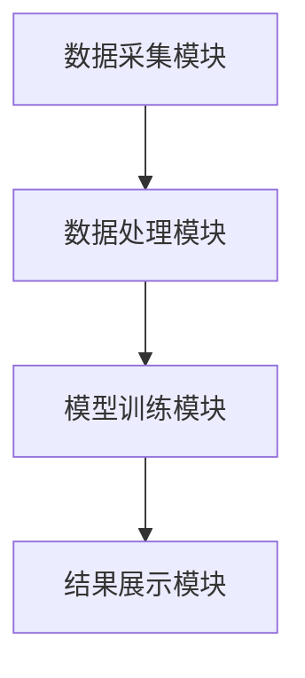
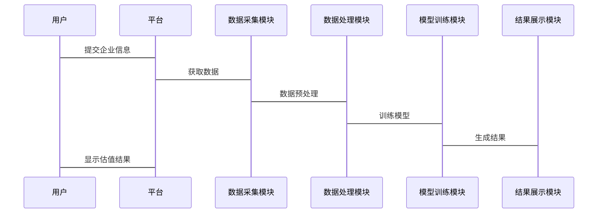

                 


# 企业估值中的AI驱动的自动化投资顾问平台评估

> 关键词：AI，投资顾问，企业估值，机器学习，自然语言处理

> 摘要：随着人工智能技术的快速发展，AI驱动的自动化投资顾问平台在企业估值领域展现出巨大潜力。本文详细探讨了AI技术在企业估值中的应用，分析了自动化投资顾问平台的核心概念、算法原理、系统架构，并通过实际案例展示了平台的实现过程。文章还总结了最佳实践和未来发展方向，为读者提供了全面的技术洞察。

---

# 第一部分: 企业估值与AI驱动的自动化投资顾问平台概述

---

## 第1章: 企业估值与AI驱动的自动化投资顾问平台背景

### 1.1 企业估值的基本概念

#### 1.1.1 企业估值的定义与意义
企业估值是指对企业整体价值的评估，通常用于投资决策、并购交易、融资等活动。传统的企业估值方法包括DCF模型、EV/EBITDA倍数法等，但这些方法依赖大量人工分析，耗时且易受主观因素影响。

#### 1.1.2 传统企业估值方法的局限性
- 数据依赖性强，人工分析效率低
- 方法单一，难以适应复杂市场环境
- 缺乏实时性和动态调整能力

#### 1.1.3 投资顾问服务的现状与挑战
传统投资顾问服务依赖人工经验，难以满足日益增长的个性化和定制化需求。此外，数据爆炸式增长和技术进步要求投资顾问服务更加智能化、自动化。

---

### 1.2 AI在投资顾问领域的应用背景

#### 1.2.1 AI技术在金融领域的应用现状
AI技术在金融领域的应用日益广泛，包括股票预测、风险管理、交易自动化等领域。AI的强大数据处理能力和深度学习算法为投资顾问服务提供了新的可能性。

#### 1.2.2 自动化投资顾问平台的兴起
自动化投资顾问（Robo-Advisor）通过算法和AI技术实现投资组合管理和个性化建议，显著降低了服务成本并提高了效率。企业估值作为投资决策的核心环节，亟需AI技术的支持。

#### 1.2.3 企业估值中的AI驱动模式
AI驱动的自动化投资顾问平台通过整合多源数据、实时分析和智能决策，为企业估值提供更精准、更高效的解决方案。

---

### 1.3 本章小结
本章从企业估值的基本概念和传统方法的局限性出发，分析了AI技术在投资顾问领域的应用背景，提出了AI驱动的自动化投资顾问平台的必要性和潜力。

---

## 第2章: 自动化投资顾问平台的核心概念

### 2.1 企业估值的关键要素

#### 2.1.1 企业财务指标分析
- 营业收入、净利润、EBITDA等财务指标是企业估值的重要依据
- 多维度数据的整合与分析需要强大的技术支撑

#### 2.1.2 市场环境与行业分析
- 宏观经济指标、行业发展趋势影响企业估值
- 数据挖掘和自然语言处理技术帮助提取市场信息

#### 2.1.3 企业战略与管理因素
- 企业战略、管理团队等非财务因素对估值有重要影响
- 需要结合定性分析和定量分析

---

### 2.2 AI在企业估值中的应用原理

#### 2.2.1 自然语言处理在企业信息分析中的应用
- 从新闻、财报等文本数据中提取关键信息
- 实体识别与关系抽取帮助分析企业间的关系

#### 2.2.2 机器学习模型在估值预测中的应用
- 回归模型预测企业价值
- 聚类模型帮助企业分类与估值区间划分

#### 2.2.3 数据驱动的决策支持系统
- 结合多源数据，构建动态估值模型
- 实时监控与调整，提高估值精度

---

### 2.3 本章小结
本章详细介绍了企业估值的关键要素，并探讨了AI技术在其中的应用原理，强调了数据整合与智能分析的重要性。

---

## 第3章: 自动化投资顾问平台的算法原理

### 3.1 自然语言处理技术

#### 3.1.1 文本预处理与特征提取
- 文本清洗、分词、去停用词等预处理步骤
- TF-IDF、Word2Vec等特征提取方法

#### 3.1.2 基于BERT的文本分析模型
- BERT模型在企业信息分析中的应用
- 示例：利用BERT分析企业新闻，提取财务指标和市场风险

#### 3.1.3 实体识别与关系抽取
- 使用Spacy或BERT进行实体识别
- 构建企业间的实体关系图谱

---

### 3.2 机器学习模型

#### 3.2.1 基于回归的估值预测模型
- 线性回归、随机森林、神经网络等回归算法
- 示例：利用财务数据训练回归模型，预测企业价值

#### 3.2.2 基于聚类的企业分类模型
- K-means、层次聚类等聚类算法
- 示例：根据财务指标对企业进行分类，确定估值区间

#### 3.2.3 深度学习模型在估值中的应用
- LSTM网络预测企业未来现金流
- 图神经网络分析企业间的关系和影响

---

### 3.3 算法实现与优化

#### 3.3.1 算法实现步骤
1. 数据清洗与特征提取
2. 模型训练与调参
3. 模型评估与优化

#### 3.3.2 算法优化策略
- 超参数优化（网格搜索、随机搜索）
- 模型集成（Bagging、Boosting）

#### 3.3.3 算法评估与对比
- 均方误差（MSE）、R平方值等评估指标
- 不同算法的性能对比

---

### 3.4 本章小结
本章详细介绍了自动化投资顾问平台中的算法原理，包括自然语言处理和机器学习模型的实现与优化。

---

## 第4章: 自动化投资顾问平台的系统架构与设计

### 4.1 系统功能模块划分

#### 4.1.1 数据采集模块
- 数据来源：财务报表、新闻、行业报告
- 数据清洗与预处理

#### 4.1.2 数据处理模块
- 特征提取与数据建模
- 数据存储与管理

#### 4.1.3 模型训练模块
- 算法实现与模型训练
- 模型部署与应用

#### 4.1.4 结果展示模块
- 估值结果可视化
- 投资建议生成

---

### 4.2 系统架构图

#### 4.2.1 模块间关系


#### 4.2.2 数据流方向


#### 4.2.3 系统扩展性设计
- 微服务架构便于功能扩展
- 支持多种数据源接入

---

### 4.3 接口设计与交互流程

#### 4.3.1 API接口定义
- 数据接口：获取企业数据
- 模型接口：进行估值计算
- 结果接口：展示估值结果

#### 4.3.2 用户交互流程


---

### 4.4 本章小结
本章详细描述了自动化投资顾问平台的系统架构设计，包括功能模块划分、系统架构图和接口设计。

---

## 第5章: 项目实战与案例分析

### 5.1 项目实战

#### 5.1.1 环境搭建与数据准备
- 安装Python、TensorFlow、Keras等工具
- 数据集获取与预处理

#### 5.1.2 系统核心代码实现
```python
import pandas as pd
from sklearn.model_selection import train_test_split
from sklearn.linear_model import LinearRegression

# 数据加载与预处理
data = pd.read_csv('企业数据.csv')
X = data[['营收', '净利润', '行业风险']]
y = data['企业价值']

# 数据分割
X_train, X_test, y_train, y_test = train_test_split(X, y, test_size=0.2)

# 模型训练
model = LinearRegression()
model.fit(X_train, y_train)

# 模型评估
score = model.score(X_test, y_test)
print(f'模型得分：{score}')
```

#### 5.1.3 代码解读与优化
- 数据预处理：使用标准Scaler归一化处理
- 模型优化：采用网格搜索调参

---

### 5.2 案例分析

#### 5.2.1 案例背景
某科技公司财务数据与行业趋势分析。

#### 5.2.2 数据分析与模型训练
使用LSTM网络预测企业未来现金流。

#### 5.2.3 结果解读
模型预测企业价值为10亿元，建议投资者关注行业趋势。

---

### 5.3 本章小结
本章通过实际案例展示了AI驱动的自动化投资顾问平台的实现过程，验证了其在企业估值中的应用价值。

---

## 第6章: 最佳实践与未来展望

### 6.1 最佳实践

#### 6.1.1 数据质量管理
- 数据清洗、去噪、标注
- 数据多样性和代表性

#### 6.1.2 模型选择与优化
- 根据场景选择合适算法
- 模型调优与持续优化

#### 6.1.3 系统安全与稳定性
- 数据安全保护
- 系统容错与备份

---

### 6.2 未来展望

#### 6.2.1 技术进步
- 更先进的AI算法（如GPT-3、Transformer）
- 多模态数据融合

#### 6.2.2 应用场景拓展
- 更多行业的应用
- 更精准的个性化投资建议

#### 6.2.3 市场接受度
- 投资者对AI的信任度
- 相关法律法规的完善

---

### 6.3 本章小结
本章总结了项目的最佳实践，并展望了AI驱动的自动化投资顾问平台的未来发展方向。

---

## 结语

AI驱动的自动化投资顾问平台正在改变企业估值的传统模式，通过深度学习、自然语言处理等技术，提高了估值的效率和准确性。本文从背景、核心概念、算法实现到系统架构，全面探讨了这一领域的关键技术与应用。未来，随着AI技术的不断进步，企业估值将更加智能化、个性化。

---

## 作者

作者：AI天才研究院/AI Genius Institute & 禅与计算机程序设计艺术 /Zen And The Art of Computer Programming

