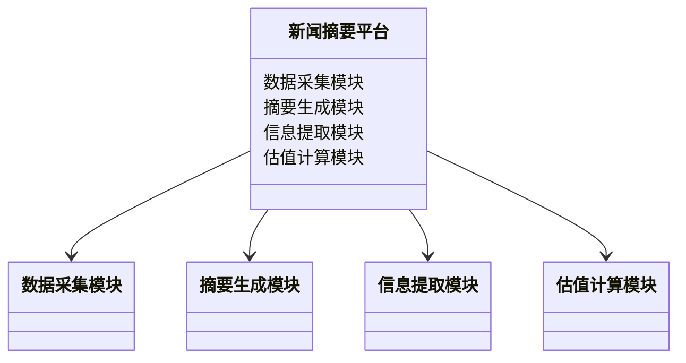
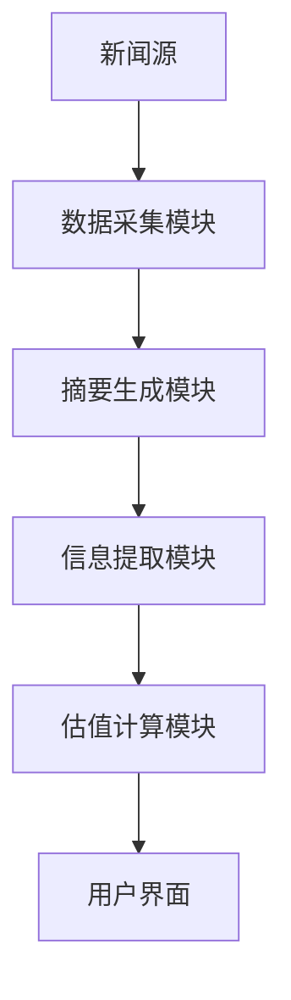
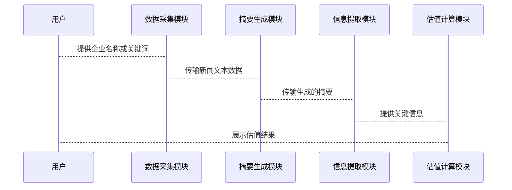

                 


# 《企业估值中的AI驱动的自动化新闻摘要平台评估》

## 关键词：企业估值，AI驱动，新闻摘要，自动化平台，自然语言处理，生成式AI

## 摘要：本文探讨了如何利用AI技术自动评估新闻摘要对企业估值的影响。通过分析新闻摘要的关键信息提取和生成过程，结合生成式AI模型，提出了一种自动化新闻摘要平台的构建方法，并详细讲解了其在企业估值中的应用和评估指标。

---

# 第1章: 企业估值与AI驱动新闻摘要平台的背景

## 1.1 企业估值的基本概念

### 1.1.1 企业估值的定义与作用
企业估值是通过对企业的财务状况、市场表现、行业地位等多方面因素进行综合评估，确定其市场价值的过程。新闻摘要作为企业信息的重要来源，为企业估值提供了关键数据支持。

### 1.1.2 新闻摘要在企业估值中的价值
新闻摘要能够快速提取企业相关的重大事件、财务数据和市场动态，帮助分析师和投资者做出更高效和准确的估值决策。

### 1.1.3 自动化新闻摘要平台的背景与意义
随着信息量的爆炸式增长，传统的人工新闻摘要效率低下，难以满足企业估值的需求。自动化新闻摘要平台通过AI技术，能够快速、准确地提取关键信息，显著提升企业估值的效率和准确性。

## 1.2 AI驱动的新闻摘要技术

### 1.2.1 自动化新闻摘要的定义
自动化新闻摘要是指利用自然语言处理（NLP）和生成式AI技术，从大量文本数据中自动提取关键信息并生成简洁摘要的过程。

### 1.2.2 AI在新闻摘要中的应用现状
目前，生成式AI模型（如GPT系列）已经在新闻摘要领域取得了显著进展，能够生成高质量的文本摘要。然而，如何将这些摘要应用于企业估值仍是一个需要深入研究的领域。

### 1.2.3 企业估值中的新闻摘要需求
企业估值需要大量实时的、相关的新闻信息，包括财务数据、市场动态、行业趋势等。自动化新闻摘要平台能够快速满足这一需求，为估值提供及时、准确的数据支持。

## 1.3 本章小结
本章介绍了企业估值的基本概念和新闻摘要在其中的重要性，分析了自动化新闻摘要平台的背景和意义，为后续内容奠定了基础。

---

# 第2章: 问题背景与需求分析

## 2.1 传统企业估值中的新闻摘要挑战

### 2.1.1 传统新闻摘要的局限性
传统新闻摘要依赖人工操作，效率低、成本高，且容易受到主观因素的影响，难以满足企业估值对实时性和准确性的要求。

### 2.1.2 人工摘要的效率与成本问题
人工摘要需要大量时间和人力资源，尤其是在处理海量信息时，效率问题尤为突出。

### 2.1.3 信息过载对企业估值的影响
随着信息量的增加，如何快速提取关键信息成为企业估值中的一个重大挑战。信息过载可能导致分析人员无法及时获取重要信息，从而影响估值的准确性。

## 2.2 AI驱动的自动化新闻摘要需求

### 2.2.1 自动化摘要的需求场景
企业估值需要实时获取大量新闻信息，自动化新闻摘要平台能够满足这一需求，帮助分析师快速获取关键信息。

### 2.2.2 企业估值中的关键信息提取需求
企业估值需要从新闻中提取与企业财务状况、市场表现相关的特定信息，自动化摘要平台能够精准提取这些关键数据。

### 2.2.3 自动化摘要的效率与准确性优势
自动化新闻摘要平台能够快速处理大量信息，并生成准确的摘要，显著提高了企业估值的效率和准确性。

## 2.3 本章小结
本章分析了传统新闻摘要的局限性以及AI驱动的自动化新闻摘要的需求和优势，为后续的技术实现提供了背景支持。

---

# 第3章: AI驱动新闻摘要的核心概念

## 3.1 AI驱动的新闻摘要技术原理

### 3.1.1 自然语言处理（NLP）在新闻摘要中的应用
NLP技术能够对新闻文本进行分词、句法分析和语义理解，为新闻摘要的生成提供基础支持。

### 3.1.2 生成式AI模型（如GPT）的工作原理
生成式AI模型通过大量的文本数据训练，能够生成与原始文本语义一致的摘要。其核心在于注意力机制和Transformer架构的设计。

### 3.1.3 自动化新闻摘要的实现流程
1. 数据预处理：清洗和标注新闻文本数据。
2. 模型训练：使用生成式AI模型对数据进行训练。
3. 摘要生成：根据输入文本生成摘要。
4. 摘要评估：通过评估指标（如ROUGE分数）对生成的摘要进行质量评估。

## 3.2 企业估值中的新闻摘要平台架构

### 3.2.1 平台的功能模块划分
1. 数据采集模块：从新闻源获取相关文本数据。
2. 摘要生成模块：利用AI模型生成新闻摘要。
3. 信息提取模块：从摘要中提取与企业估值相关的关键信息。
4. 估值计算模块：基于提取的信息进行企业估值。

### 3.2.2 数据流与信息处理流程
1. 数据采集模块将新闻文本传输给摘要生成模块。
2. 摘要生成模块生成摘要并将其传输给信息提取模块。
3. 信息提取模块提取关键信息并传输给估值计算模块。
4. 估值计算模块根据提取的信息计算出企业估值结果。

### 3.2.3 平台的用户交互设计
1. 用户输入：用户输入企业名称或相关新闻关键词。
2. 摘要生成：平台生成相关新闻摘要。
3. 信息提取：平台提取与企业估值相关的关键信息。
4. 估值展示：平台展示企业估值结果。

## 3.3 本章小结
本章详细介绍了AI驱动新闻摘要的核心技术原理和企业估值平台的架构设计，为后续的算法实现奠定了基础。

---

# 第4章: AI驱动新闻摘要的核心算法与模型

## 4.1 生成式AI模型的原理

### 4.1.1 Transformer模型的基本结构
Transformer模型由编码器和解码器组成，通过自注意力机制对输入文本进行编码，并生成相应的输出。

### 4.1.2 注意力机制（Attention）的实现原理
注意力机制通过计算输入文本中每个词与其他词的相关性，确定每个词在生成摘要中的重要性。

### 4.1.3 GPT系列模型的训练与推理过程
GPT模型通过监督学习对大量文本数据进行训练，并在生成摘要时采用生成式推理的方式生成文本。

## 4.2 新闻摘要的评估指标与算法

### 4.2.1 基于ROUGE的评估指标
ROUGE是一种常用的文本摘要评估指标，通过计算生成摘要与参考摘要之间的重叠程度来评估摘要质量。

### 4.2.2 摘要生成的算法实现
1. 数据预处理：清洗和标注新闻文本数据。
2. 模型训练：使用生成式AI模型对数据进行训练。
3. 摘要生成：根据输入文本生成摘要。
4. 摘要评估：通过ROUGE指标对生成的摘要进行质量评估。

## 4.3 本章小结
本章详细讲解了生成式AI模型的原理和新闻摘要的评估指标，为后续的系统实现提供了技术支持。

---

# 第5章: 企业估值中的新闻摘要平台系统架构

## 5.1 问题场景介绍
企业估值需要从大量新闻中提取关键信息，传统的手动摘要方式效率低下，难以满足实时性和准确性的要求。

## 5.2 项目介绍
本项目旨在构建一个基于AI的新闻摘要平台，帮助用户快速获取与企业估值相关的新闻信息。

## 5.3 系统功能设计

### 5.3.1 领域模型


### 5.3.2 系统架构设计


### 5.3.3 系统接口设计
1. 数据采集模块接口：从新闻源获取文本数据。
2. 摘要生成模块接口：生成新闻摘要。
3. 信息提取模块接口：提取与企业估值相关的关键信息。
4. 估值计算模块接口：根据提取的信息计算企业估值。

### 5.3.4 系统交互设计


## 5.4 本章小结
本章通过系统架构设计和交互流程图，详细描述了AI驱动新闻摘要平台的实现方案，为后续的代码实现提供了指导。

---

# 第6章: 项目实战

## 6.1 环境安装

### 6.1.1 安装Python
```bash
python --version
pip install --upgrade pip
```

### 6.1.2 安装必要的库
```bash
pip install numpy
pip install transformers
pip install rouge
```

## 6.2 系统核心实现源代码

### 6.2.1 数据预处理代码
```python
import numpy as np
import transformers
from transformers import GPT2Tokenizer, GPT2LMHeadModel
from rouge import Rouge

def preprocess_data(text):
    tokenizer = GPT2Tokenizer.from_pretrained('gpt2')
    inputs = tokenizer(text, return_tensors='np', max_length=512, truncation=True)
    return inputs
```

### 6.2.2 模型训练代码
```python
def train_model():
    model = GPT2LMHeadModel.from_pretrained('gpt2')
    model.trainable = False
    optimizer = transformers.AdamW(model.parameters(), lr=1e-5)
    criterion = transformers.CrossEntropyLoss()
    # 训练循环
    for epoch in range(10):
        for batch in dataloader:
            optimizer.zero_grad()
            outputs = model(**batch)
            loss = criterion(outputs.logits, batch.labels)
            loss.backward()
            optimizer.step()
    return model
```

### 6.2.3 摘要生成代码
```python
def generate_summary(text):
    inputs = preprocess_data(text)
    outputs = model.generate(**inputs, max_length=100, num_beams=5)
    summary = tokenizer.decode(outputs[0], skip_special_tokens=True)
    return summary
```

### 6.2.4 摘要评估代码
```python
def evaluate_summary(summary, reference):
    rouge = Rouge()
    scores = rouge.get_scores(summary, reference)
    return scores
```

## 6.3 实际案例分析与详细解读
1. 数据预处理：对新闻文本进行清洗和标注。
2. 模型训练：使用生成式AI模型对数据进行训练。
3. 摘要生成：根据输入新闻生成摘要。
4. 摘要评估：通过ROUGE指标评估生成摘要的质量。

## 6.4 项目小结
本章通过实际案例分析，详细讲解了AI驱动新闻摘要平台的实现过程，展示了如何利用Python代码和生成式AI模型构建一个高效的新闻摘要系统。

---

# 第7章: 最佳实践与总结

## 7.1 最佳实践
1. 数据质量：确保输入数据的多样性和相关性。
2. 模型选择：根据具体需求选择合适的生成式AI模型。
3. 摘要评估：使用多个评估指标综合评估摘要质量。

## 7.2 小结
本文详细介绍了AI驱动新闻摘要平台的构建过程和应用场景，展示了如何利用生成式AI技术提升企业估值的效率和准确性。

## 7.3 注意事项
1. 数据隐私：确保数据的合法性和隐私性。
2. 模型优化：根据实际需求不断优化模型性能。
3. 人机结合：结合人工审核提升摘要的准确性。

## 7.4 拓展阅读
1. 《The Anatomy of Deep Learning》
2. 《Effective Python》
3. 《Natural Language Processing with PyTorch》

---

# 作者：AI天才研究院/AI Genius Institute & 禅与计算机程序设计艺术/Zen And The Art of Computer Programming

