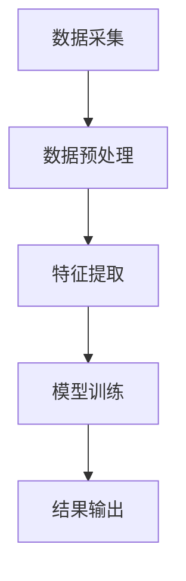
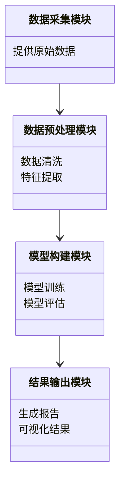
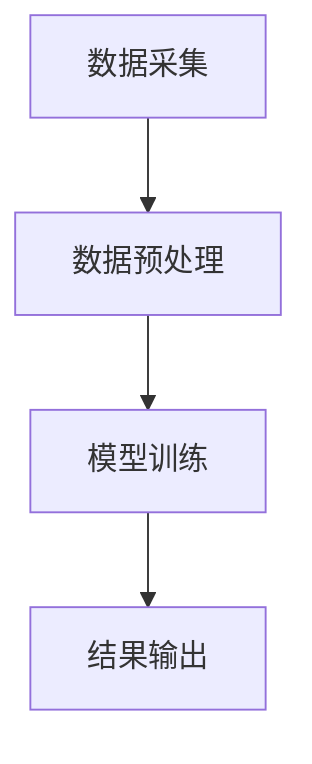

                 


# 企业估值中的AI驱动的自动化科学发现平台评估

> 关键词：企业估值, AI驱动, 自动化科学发现平台, 技术评估, 人工智能算法, 数据分析, 平台架构

> 摘要：本文详细探讨了在企业估值过程中，如何利用AI驱动的自动化科学发现平台进行评估。通过分析平台的核心概念、算法原理、系统架构以及实际项目案例，本文为读者提供了从理论到实践的全面指导，展示了AI技术在企业估值中的巨大潜力和实际应用价值。

---

## 第1章：背景介绍

### 1.1 问题背景

#### 1.1.1 传统企业估值方法的局限性
传统的企业估值方法依赖于财务数据和人工分析，存在以下问题：
- 数据维度有限，难以捕捉企业的全貌。
- 分析过程耗时长，且容易受到主观因素影响。
- 高度依赖经验丰富的分析师，成本较高。

#### 1.1.2 AI技术在企业估值中的潜力
AI技术的引入为企业估值带来了新的可能性：
- 通过机器学习模型，可以从海量数据中提取有价值的信息。
- 自动化分析能力能够显著提高估值效率。
- 大数据分析能力能够发现传统方法难以察觉的模式和趋势。

#### 1.1.3 自动化科学发现平台的定义与目标
自动化科学发现平台是一种基于AI的工具，旨在通过自动化数据分析和模型构建，帮助用户快速获取企业估值的关键信息。其目标是提供高效、精准的估值支持，同时降低人工成本。

### 1.2 问题描述

#### 1.2.1 企业估值中的关键挑战
- 数据复杂性：企业数据来源多样，包括财务数据、市场数据、文本数据等。
- 数据量大：需要处理海量数据，传统方法难以应对。
- 时间敏感性：企业估值需要快速响应，以抓住市场机会。

#### 1.2.2 自动化科学发现平台在企业估值中的应用场景
- 自动化数据清洗与预处理。
- 自动构建估值模型。
- 自动化报告生成与可视化。

#### 1.2.3 当前技术与实践中的主要问题
- 数据质量问题：数据清洗和预处理耗时且容易出错。
- 模型选择困难：如何选择合适的模型是估值的关键问题。
- 结果解释性差：复杂的模型难以被业务人员理解和信任。

### 1.3 问题解决

#### 1.3.1 AI驱动的自动化科学发现平台如何解决企业估值问题
- 通过自动化数据处理提高效率。
- 利用AI算法优化模型选择。
- 提供直观的结果解释和可视化。

#### 1.3.2 平台的核心功能与价值主张
- 核心功能：数据处理、模型构建、结果输出。
- 价值主张：提高估值效率、降低人工成本、提升估值准确性。

#### 1.3.3 平台的边界与外延
- 边界：仅限于企业估值相关的数据处理和模型构建。
- 外延：可以扩展到其他领域的数据分析与科学发现。

### 1.4 核心概念与组成

#### 1.4.1 平台的主要组成部分
- 数据采集模块：负责数据的获取与初步处理。
- 数据分析模块：包括数据清洗、特征提取等。
- 模型构建模块：基于机器学习算法构建估值模型。
- 结果输出模块：生成估值报告和可视化结果。

#### 1.4.2 各部分之间的关系与协作
数据采集模块向数据分析模块提供数据，数据分析模块对数据进行处理后传递给模型构建模块，模型构建模块完成模型训练后将结果传递给结果输出模块。

#### 1.4.3 平台的输入、输出与中间过程
- 输入：企业相关数据（财务数据、市场数据、文本数据）。
- 输出：企业估值结果、可视化报告。
- 中间过程：数据清洗、特征提取、模型训练、结果解释。

---

## 第2章：核心概念与联系

### 2.1 AI驱动的科学发现平台原理

#### 2.1.1 平台的工作流程
1. 数据采集与预处理。
2. 特征提取与数据增强。
3. 模型训练与优化。
4. 结果解释与可视化。

#### 2.1.2 关键技术与模块
- 数据处理技术：数据清洗、特征工程。
- 机器学习算法：回归、分类、聚类。
- 自然语言处理技术：文本数据分析。

#### 2.1.3 各模块之间的依赖关系


### 2.2 核心概念属性对比

| 概念       | 特征1：数据处理能力 | 特征2：模型多样性 | 特征3：结果解释性 |
|------------|---------------------|------------------|-------------------|
| 数据采集模块 | 强                 | 一般             | 低                |
| 数据分析模块 | 强                 | 中               | 中                |
| 模型构建模块 | 弱                 | 强               | 中                |
| 结果输出模块 | 弱                 | 弱               | 高                |

### 2.3 ER实体关系图

```mermaid
er
    actor: 用户
    data: 数据
    model: 模型
    result: 结果
    actor --> data: 提供数据
    actor --> model: 选择模型
    data --> model: 数据输入
    model --> result: 模型输出
    actor <-- result: 获取结果
```

---

## 第3章：算法原理

### 3.1 算法概述

#### 3.1.1 算法的主要类型
- 线性回归：用于预测连续型变量。
- 支持向量回归：适用于小样本数据。
- 随机森林：适合高维数据。

#### 3.1.2 各算法的适用场景
- 线性回归：适用于线性关系明显的数据。
- 支持向量回归：适用于数据样本较少的情况。
- 随机森林：适用于复杂数据和高维特征。

#### 3.1.3 算法选择的策略与依据
- 数据样本量：样本量小选择支持向量回归，样本量大选择随机森林。
- 数据特征维度：特征维度高选择随机森林，特征维度低选择线性回归。

### 3.2 算法实现细节

#### 3.2.1 线性回归算法
$$
y = \beta_0 + \beta_1x + \epsilon
$$
其中，$y$ 是目标变量，$\beta_0$ 是截距，$\beta_1$ 是回归系数，$\epsilon$ 是误差项。

#### 3.2.2 支持向量回归算法
支持向量回归通过寻找最优超平面来最小化预测误差。其目标函数为：
$$
\min \frac{1}{2}||\beta||^2 + C\sum_{i=1}^{n}\xi_i
$$
其中，$C$ 是惩罚参数，$\xi_i$ 是松弛变量。

#### 3.2.3 随机森林算法
随机森林通过构建多棵决策树并对结果进行投票或平均来提高模型的准确性和稳定性。

---

## 第4章：系统分析与架构设计

### 4.1 系统功能设计

#### 4.1.1 领域模型类图


### 4.2 系统架构设计

#### 4.2.1 系统架构图


#### 4.2.2 系统接口设计
- 数据输入接口：接受企业相关数据。
- 模型选择接口：允许用户选择不同的算法。
- 结果输出接口：提供估值结果和报告。

#### 4.2.3 系统交互流程
```mermaid
sequenceDiagram
    actor -> 数据采集模块: 提供数据
    数据采集模块 -> 数据预处理模块: 传输数据
    数据预处理模块 -> 模型训练模块: 提供处理后的数据
    模型训练模块 -> 结果输出模块: 输出估值结果
    结果输出模块 -> actor: 提供报告
```

---

## 第5章：项目实战

### 5.1 环境安装

#### 5.1.1 安装Python环境
```bash
python --version
pip install numpy pandas scikit-learn matplotlib
```

#### 5.1.2 安装其他依赖
```bash
pip install jupyter scikit-learn
```

### 5.2 系统核心实现

#### 5.2.1 数据预处理代码
```python
import pandas as pd
import numpy as np

# 数据加载
data = pd.read_csv('企业数据.csv')

# 数据清洗
data.dropna(inplace=True)
data = pd.get_dummies(data)
```

#### 5.2.2 模型训练代码
```python
from sklearn.ensemble import RandomForestRegressor
from sklearn.model_selection import train_test_split

# 数据分割
X = data.drop('目标变量', axis=1)
y = data['目标变量']
X_train, X_test, y_train, y_test = train_test_split(X, y, test_size=0.2)

# 模型训练
model = RandomForestRegressor(n_estimators=100)
model.fit(X_train, y_train)
```

#### 5.2.3 结果输出代码
```python
# 模型预测
y_pred = model.predict(X_test)

# 结果可视化
import matplotlib.pyplot as plt

plt.scatter(y_test, y_pred)
plt.xlabel('真实值')
plt.ylabel('预测值')
plt.show()
```

### 5.3 代码应用解读

#### 5.3.1 数据预处理
- 使用`pandas`进行数据加载和清洗。
- 使用`scikit-learn`的`preprocessing`模块进行特征工程。

#### 5.3.2 模型训练
- 使用随机森林回归模型进行训练。
- 通过`n_estimators`参数控制树的数量。

#### 5.3.3 结果输出
- 使用`matplotlib`进行结果可视化。
- 通过散点图展示真实值与预测值的关系。

### 5.4 实际案例分析

#### 5.4.1 数据来源
假设我们从企业公开财报和市场数据中获取数据。

#### 5.4.2 模型选择
选择随机森林回归模型进行训练。

#### 5.4.3 结果分析
通过模型预测结果与真实值的对比，验证模型的准确性。

---

## 第6章：最佳实践与小结

### 6.1 小结
通过本文的介绍，读者可以了解到如何利用AI驱动的自动化科学发现平台进行企业估值。从数据处理到模型训练，再到结果输出，整个过程都离不开AI技术的支持。

### 6.2 注意事项
- 数据质量是模型性能的关键因素。
- 模型选择需要根据具体场景进行调整。
- 结果解释性是用户信任的基础。

### 6.3 拓展阅读
建议读者深入学习机器学习算法和数据分析技术，进一步探索AI在企业估值中的更多应用。

---

## 作者信息

作者：AI天才研究院 & 禅与计算机程序设计艺术

---

通过本文的详细讲解，读者可以系统地了解AI驱动的自动化科学发现平台在企业估值中的应用，并能够根据实际需求进行相应的开发和优化。

