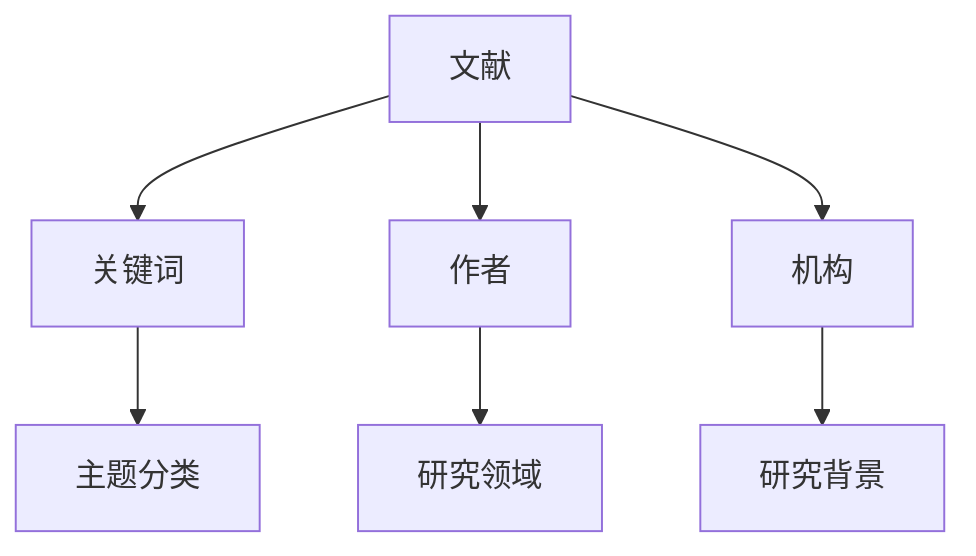
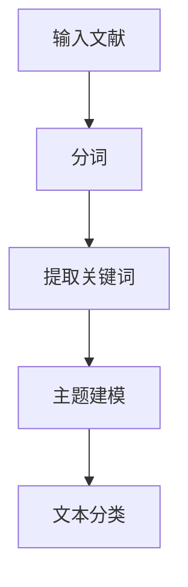
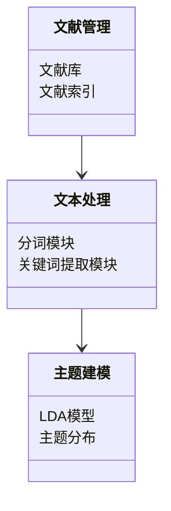
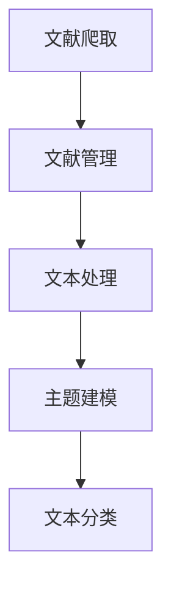
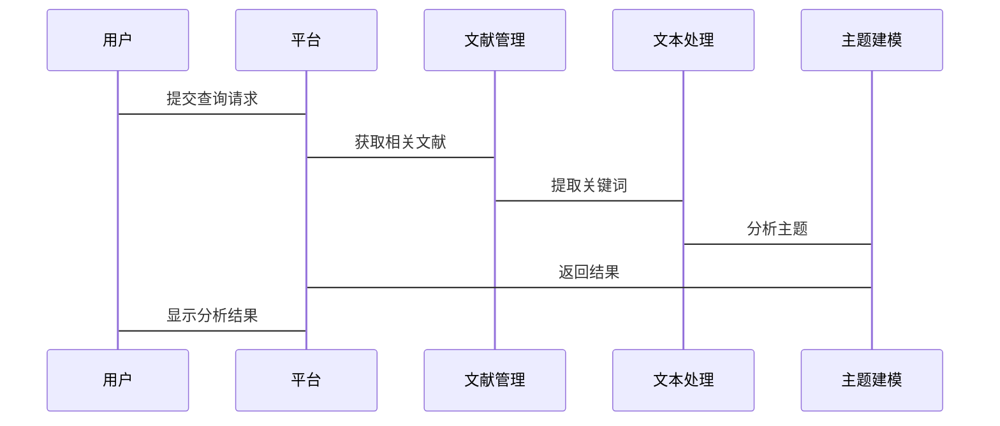
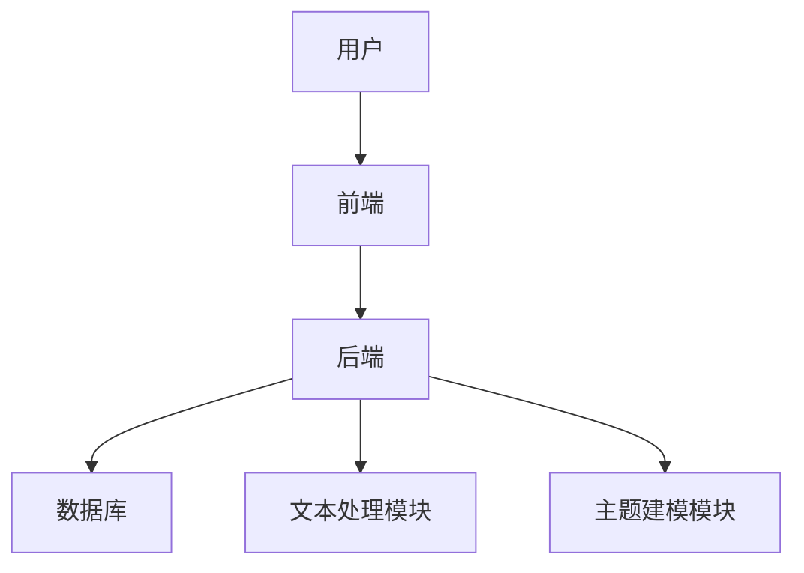

                 


# 《企业估值中的AI驱动的自动化科学文献综述平台评估》

> 关键词：企业估值，AI驱动，自动化科学文献综述，平台评估，文本挖掘，自然语言处理，机器学习

> 摘要：本文系统性地探讨了AI驱动的自动化科学文献综述平台在企业估值中的应用。通过分析文献综述的重要性，结合AI技术的核心算法和系统架构设计，提出了一种基于文本挖掘和自然语言处理的自动化评估方法。本文不仅详细阐述了相关技术原理，还通过实际案例展示了如何构建和优化这样的平台，为企业的科学估值提供了新的思路和解决方案。

---

## 第1章：企业估值与AI驱动的文献综述平台概述

### 1.1 问题背景与挑战

#### 1.1.1 传统企业估值方法的局限性
传统的企业估值方法依赖于财务指标和市场分析，但这种方法往往忽视了非结构化数据（如学术论文、技术报告）对企业价值的影响。此外，随着企业创新速度的加快，如何快速获取和分析相关领域的最新研究成果，成为企业估值中的一个关键挑战。

#### 1.1.2 科学文献综述的必要性
科学文献综述是企业估值的重要组成部分，特别是在高科技企业中。通过分析相关领域的学术研究和技术创新，可以更好地评估企业的技术优势和市场潜力。然而，传统的文献综述方法效率低下，难以应对海量数据的挑战。

#### 1.1.3 AI驱动自动化评估的必要性
随着AI技术的快速发展，利用自动化方法进行文献综述成为可能。通过AI驱动的文本挖掘和自然语言处理技术，可以快速提取文献中的关键信息，显著提高评估效率和准确性。

### 1.2 问题描述与目标

#### 1.2.1 企业估值中的关键问题
企业在估值过程中需要考虑技术、市场、法律等多个方面的信息。如何快速获取和分析这些信息，是企业估值中的核心问题。

#### 1.2.2 自动化科学文献综述平台的核心目标
构建一个AI驱动的自动化科学文献综述平台，能够自动收集、分析和评估相关领域的文献，为企业估值提供数据支持。

#### 1.2.3 平台的边界与外延
该平台专注于企业估值中的文献分析部分，不涉及其他外部数据（如财务数据）。其外延包括文献的收集、清洗、分析和评估四个主要环节。

### 1.3 问题解决与方法

#### 1.3.1 文献综述的自动化方法
通过爬虫技术收集相关文献，利用自然语言处理技术提取关键词和主题，构建文献知识图谱。

#### 1.3.2 AI技术在文献综述中的应用
利用深度学习模型（如BERT）进行文本分类和主题建模，自动识别文献中的关键信息。

#### 1.3.3 平台评估的科学性与实用性
通过对比传统方法和AI驱动方法的评估结果，验证平台的科学性和实用性。

### 1.4 本章小结

---

## 第2章：AI驱动的自动化科学文献综述平台核心概念

### 2.1 核心概念与原理

#### 2.1.1 文献综述的定义与特征
文献综述是对某一领域内的研究成果进行系统性总结的过程。其特征包括全面性、系统性和科学性。

#### 2.1.2 AI驱动平台的核心原理
AI驱动平台通过文本挖掘、自然语言处理和机器学习技术，实现文献的自动化分析和评估。

#### 2.1.3 自动化评估的关键技术
包括文献爬取、文本分词、关键词提取、主题建模和文本相似度计算等技术。

### 2.2 核心概念属性对比

#### 2.2.1 传统文献综述与AI驱动平台的对比分析
| 特性 | 传统方法 | AI驱动平台 |
|------|-----------|-------------|
| 效率 | 低效       | 高效         |
| 精度 | 受主观影响 | 客观准确       |
| 范围 | 有限       | 广泛         |

#### 2.2.2 平台功能与企业估值需求的匹配
平台功能包括文献收集、清洗、分析和评估，能够满足企业估值中的多种需求。

#### 2.2.3 AI技术在文献综述中的应用优势
AI技术能够处理海量数据，快速提取关键信息，显著提高评估效率。

### 2.3 ER实体关系图



### 2.4 本章小结

---

## 第3章：文本挖掘与自然语言处理算法

### 3.1 文本挖掘算法

#### 3.1.1 分词算法
分词算法用于将文本分割成词语或短语。常见的分词算法包括基于规则的分词和基于统计的分词。

#### 3.1.2 主题模型（如LDA）
主题模型（如LDA）用于发现文献中的主题分布。

#### 3.1.3 关键词提取
关键词提取算法用于从文献中提取具有代表性的关键词。

### 3.2 自然语言处理技术

#### 3.2.1 词嵌入（如Word2Vec）
词嵌入技术用于将词语映射到低维向量空间。

#### 3.2.2 文本相似度计算
通过余弦相似度或欧氏距离计算文本相似度。

#### 3.2.3 文本分类
文本分类用于将文献分为不同的类别，如技术类、市场类等。

### 3.3 机器学习模型

#### 3.3.1 监督学习模型（如SVM）
监督学习模型用于分类任务，如文献的主题分类。

#### 3.3.2 无监督学习模型（如聚类）
无监督学习模型用于发现文献中的潜在主题。

#### 3.3.3 深度学习模型（如BERT）
深度学习模型用于更复杂的文本理解和生成任务。

### 3.4 算法流程图



### 3.5 本章小结

---

## 第4章：系统分析与架构设计方案

### 4.1 系统功能设计

#### 4.1.1 领域模型


#### 4.1.2 系统架构设计


#### 4.1.3 接口设计
API接口用于与其他系统的集成，如企业估值系统。

#### 4.1.4 交互流程


### 4.2 系统架构设计

#### 4.2.1 系统架构图


### 4.3 本章小结

---

## 第5章：项目实战

### 5.1 环境安装

#### 5.1.1 Python环境配置
安装Python 3.8及以上版本，安装必要的库（如numpy、pandas、scikit-learn）。

#### 5.1.2 文献爬取工具
使用BeautifulSoup或Scrapy进行文献爬取。

### 5.2 系统核心实现

#### 5.2.1 文本处理模块
```python
import nltk
from sklearn.feature_extraction.text import TfidfVectorizer

# 分词
nltk.download('punkt')
text = "This is a sample text."
tokens = nltk.word_tokenize(text)

# 关键词提取
vectorizer = TfidfVectorizer()
tfidf = vectorizer.fit_transform([text])
```

#### 5.2.2 主题建模模块
```python
from sklearn.decomposition import LatentDirichletAllocation

# LDA模型
lda = LatentDirichletAllocation(n_components=5)
lda.fit(tfidf)
```

### 5.3 案例分析

#### 5.3.1 案例背景
以一家高科技企业为例，分析其相关领域的文献。

#### 5.3.2 实施步骤
1. 确定研究领域
2. 收集相关文献
3. 提取关键词和主题
4. 分析文献与企业估值的关系

### 5.4 项目小结

---

## 第6章：最佳实践与总结

### 6.1 小结

### 6.2 注意事项

#### 6.2.1 数据质量
确保文献数据的准确性和完整性。

#### 6.2.2 模型调优
根据实际需求调整模型参数。

#### 6.2.3 可扩展性
平台设计应具有良好的可扩展性。

### 6.3 拓展阅读

---

## 附录

### 附录A：术语表

### 附录B：参考文献

---

作者：AI天才研究院/AI Genius Institute & 禅与计算机程序设计艺术 /Zen And The Art of Computer Programming

