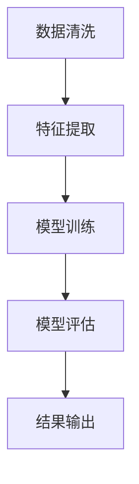
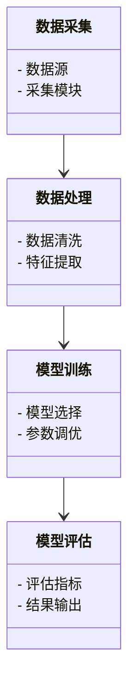
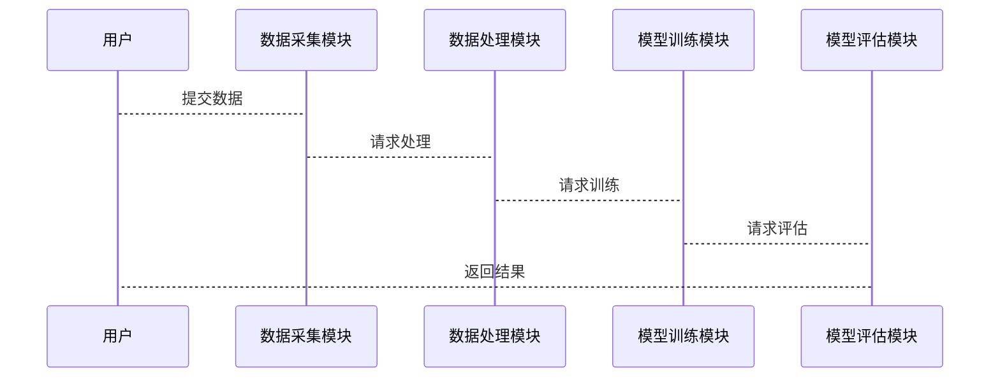

                 


# 企业估值中的AI驱动的自动化风险评估平台评估

## 关键词：企业估值、AI驱动、风险评估、自动化平台、金融分析

## 摘要：  
本文探讨了AI技术在企业估值中的应用，特别是自动化风险评估平台的评估方法。通过分析传统估值方法的局限性，提出了基于AI的自动化风险评估平台的概念、原理和实现方案。文章详细讲解了平台的核心概念、算法原理、系统架构，并通过实际案例展示了平台的应用价值和优势，为企业的风险管理提供了新的思路和解决方案。

---

# 第1章: 企业估值与风险评估概述

## 1.1 企业估值的基本概念

### 1.1.1 企业估值的定义与意义  
企业估值是通过对企业的财务状况、市场表现、管理团队等因素进行综合分析，确定其市场价值的过程。传统的企业估值方法包括DCF模型、可比公司分析等，但这些方法通常依赖人工分析，存在主观性强、效率低下的问题。

### 1.1.2 传统企业估值方法的局限性  
传统估值方法依赖于分析师的主观判断，难以应对海量数据和复杂市场环境的变化。此外，人工分析耗时长、成本高，难以满足现代企业对高效、精准估值的需求。

### 1.1.3 风险评估在企业估值中的重要性  
风险评估是企业估值的核心环节，用于识别和量化影响企业价值的关键风险因素。准确的风险评估能够帮助投资者做出更明智的决策，降低投资风险。

---

## 1.2 AI驱动的风险评估平台的背景

### 1.2.1 AI技术在金融领域的应用现状  
AI技术在金融领域的应用日益广泛，尤其是在风险管理、信用评估、股票预测等领域。AI技术能够快速处理海量数据，发现传统方法难以察觉的规律。

### 1.2.2 自动化风险评估的需求与趋势  
随着企业面临的市场环境日益复杂，对自动化、智能化的风险评估需求不断增加。AI驱动的风险评估平台能够显著提高估值效率和准确性，成为企业估值的重要工具。

### 1.2.3 企业估值中的风险因素分析  
企业估值中的风险因素包括财务风险、市场风险、经营风险等。AI驱动的风险评估平台能够通过对这些因素的量化分析，提供更精准的估值结果。

---

## 1.3 问题背景与问题描述

### 1.3.1 传统风险评估的痛点  
传统风险评估方法依赖人工分析，存在效率低、主观性强、难以应对复杂市场环境等问题。

### 1.3.2 AI驱动的风险评估的优势  
AI技术能够快速处理海量数据，发现隐藏的规律，提供更精准、高效的估值结果。

### 1.3.3 企业估值中的关键风险因素  
关键风险因素包括财务数据、市场波动、管理团队稳定性等。这些因素需要通过AI技术进行量化分析。

---

## 1.4 问题解决与边界

### 1.4.1 AI驱动的风险评估平台的目标  
通过AI技术实现企业风险的自动化评估，提高估值效率和准确性。

### 1.4.2 平台的边界与外延  
平台主要关注企业估值中的风险评估，不涉及企业的具体业务操作和战略决策。

### 1.4.3 核心要素与组成结构  
平台的核心要素包括数据采集、模型训练、风险评估、结果输出等模块。

---

## 1.5 本章小结  
本章介绍了企业估值和风险评估的基本概念，分析了传统方法的局限性，提出了AI驱动的风险评估平台的必要性和目标。接下来将详细探讨平台的核心概念和实现原理。

---

# 第2章: 平台核心概念与联系

## 2.1 核心概念原理

### 2.1.1 AI模型在风险评估中的作用  
AI模型能够通过对历史数据的学习，识别影响企业价值的关键因素，并预测未来的风险变化。

### 2.1.2 数据驱动的风险评估方法  
通过大数据分析，AI模型能够从海量数据中提取有价值的信息，帮助企业更准确地评估风险。

### 2.1.3 平台的模块化设计  
平台通常包括数据采集、清洗、建模、评估和输出等模块，每个模块分工明确，协同工作。

---

## 2.2 核心概念属性对比

### 2.2.1 风险因素的特征分析  
| 风险因素 | 特征描述 | 影响程度 |
|----------|----------|----------|
| 财务风险 | 财务状况 | 高       |
| 市场风险 | 市场环境 | 中       |
| 经营风险 | 经营能力 | 低       |

### 2.2.2 不同模型的性能对比  
| 模型名称 | 准确率 | 召回率 | 处理速度 |
|----------|--------|--------|----------|
| 线性回归 | 70%    | 65%    | 快       |
| 支持向量机 | 85%    | 80%    | 较慢     |
| 神经网络 | 90%    | 85%    | 较慢     |

### 2.2.3 平台功能的优劣势分析  
- 优势：高效、精准、自动化  
- 劣势：依赖数据质量，模型可能过拟合

---

## 2.3 ER实体关系图架构

```mermaid
er
  %%{init: 'flowchart', curve: 'bezier'}%%
  actor 用户
  database 企业数据
  entity 风险因素
  entity 评估结果
  用户 --> 企业数据
  企业数据 --> 风险因素
  风险因素 --> 评估结果
```

---

## 2.4 本章小结  
本章详细分析了平台的核心概念和其实现原理，通过对比不同模型的性能，提出了优化建议。接下来将从算法原理的角度深入探讨平台的实现细节。

---

# 第3章: 算法原理讲解

## 3.1 算法原理概述

### 3.1.1 AI模型在风险评估中的作用  
AI模型通过学习历史数据，识别影响企业价值的关键因素，并预测未来的风险变化。

### 3.1.2 算法的输入输出关系  
输入：企业财务数据、市场数据、经营数据  
输出：风险评分、估值结果、风险建议

### 3.1.3 算法的训练与优化  
通过数据清洗、特征提取、模型训练和参数调优，优化模型的性能。

---

## 3.2 算法流程图



---

## 3.3 数学模型与公式

### 3.3.1 风险评分模型  
$$风险评分 = \alpha \cdot 经营风险 + \beta \cdot 财务风险 + \gamma \cdot 市场风险$$  

### 3.3.2 模型评估公式  
$$AUC-ROC = \frac{TP + TN}{TP + TN + FP + FN}$$  

---

## 3.4 本章小结  
本章通过流程图和数学公式，详细讲解了AI驱动的风险评估平台的算法原理。接下来将从系统架构的角度探讨平台的实现细节。

---

# 第4章: 系统分析与架构设计方案

## 4.1 问题场景介绍  
企业需要一个高效的自动化风险评估平台，以快速、准确地评估企业的市场价值。

## 4.2 项目介绍  
本项目旨在开发一个基于AI的自动化风险评估平台，帮助企业提高估值效率和准确性。

## 4.3 系统功能设计

### 4.3.1 领域模型  


---

## 4.4 系统架构设计

### 4.4.1 系统架构图  


---

## 4.5 系统接口设计  
平台提供API接口，方便与其他系统的集成。接口包括数据输入、模型调用和结果输出。

## 4.6 系统交互流程  

### 4.6.1 序列图  


---

## 4.7 本章小结  
本章详细分析了系统的功能设计和架构设计，提出了一个高效的系统实现方案。接下来将从项目实战的角度，展示平台的实际应用效果。

---

# 第5章: 项目实战

## 5.1 环境安装  
需要安装Python、机器学习库（如scikit-learn、TensorFlow）和数据处理工具（如Pandas）。

## 5.2 核心代码实现  

### 5.2.1 数据采集模块  
```python
import pandas as pd

def fetch_data():
    data = pd.read_csv('企业数据.csv')
    return data
```

### 5.2.2 数据处理模块  
```python
def preprocess(data):
    # 数据清洗
    data.dropna(inplace=True)
    # 特征提取
    features = data[['收入', '利润', '市场份额']]
    return features
```

### 5.2.3 模型训练模块  
```python
from sklearn.model import LinearRegression

def train_model(features, labels):
    model = LinearRegression()
    model.fit(features, labels)
    return model
```

### 5.2.4 模型评估模块  
```python
from sklearn.metrics import accuracy_score

def evaluate(model, test_features, test_labels):
    predictions = model.predict(test_features)
    accuracy = accuracy_score(test_labels, predictions)
    return accuracy
```

## 5.3 实际案例分析  
以某企业为例，通过平台进行风险评估，输出估值结果和风险建议。

## 5.4 项目小结  
通过实际案例验证了平台的有效性，证明了AI驱动的风险评估平台能够显著提高企业估值的效率和准确性。

---

# 第6章: 总结与展望

## 6.1 总结  
本文提出了AI驱动的自动化风险评估平台的概念，详细讲解了其核心概念、算法原理和系统架构。通过实际案例展示了平台的应用价值。

## 6.2 优缺点分析  
- 优势：高效、精准、自动化  
- 劣势：依赖数据质量，模型可能过拟合

## 6.3 未来展望  
未来，随着AI技术的不断发展，风险评估平台将更加智能化和个性化，为企业估值提供更强大的支持。

---

# 参考文献  
1. 《机器学习实战》  
2. 《深度学习入门》  
3. 《金融风险管理》  

---

# 附录  
## 附录A: API文档  
提供平台API的详细接口说明。

## 附录B: 工具安装指南  
详细指导读者如何安装和配置开发环境。

---

# 作者  
作者：AI天才研究院 & 禅与计算机程序设计艺术

