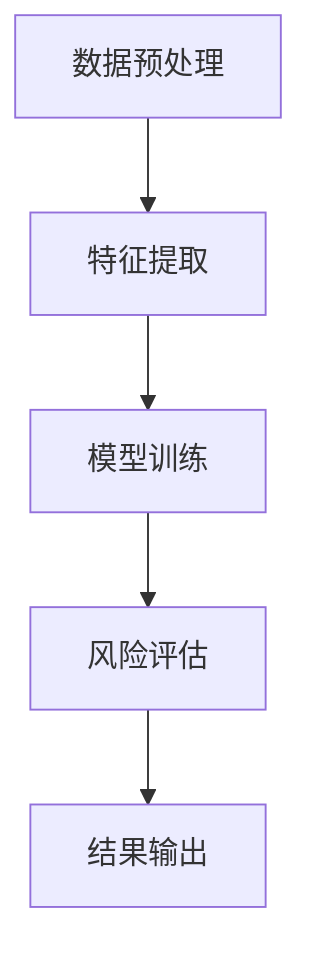
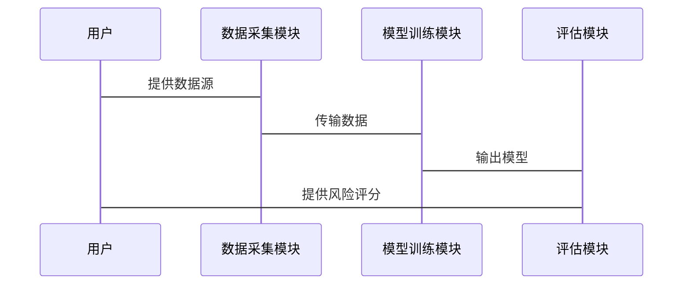

                 


# 企业估值中的AI驱动的自动化风险评估平台评估

> 关键词：企业估值，AI驱动，风险评估，自动化平台，机器学习，金融技术

> 摘要：本文详细探讨了在企业估值过程中，如何利用人工智能技术构建自动化风险评估平台。通过分析传统估值方法的局限性，提出了一种基于AI的解决方案，涵盖数据采集、模型训练、风险评估等核心环节，并通过实际案例展示了平台的应用价值。

---

# 第一部分: 企业估值中的AI驱动的自动化风险评估平台背景介绍

# 第1章: 问题背景与描述

## 1.1 问题背景

企业估值是金融领域的重要任务，传统方法依赖于财务数据和人为判断，存在以下问题：

- **数据维度不足**：传统方法主要依赖财务报表，忽略了市场、行业和技术等多方面因素。
- **人为误差**：人为判断容易受到主观因素影响，导致估值结果不准确。
- **效率低下**：手动分析耗时长，难以应对海量数据和复杂场景。

## 1.2 问题描述

AI驱动的自动化风险评估平台旨在解决以下问题：

- **多维度数据整合**：整合财务、市场、行业和技术数据，提供全面的风险评估。
- **自动化分析**：通过机器学习模型自动分析数据，减少人为误差。
- **实时更新**：实时获取数据，动态调整估值模型。

## 1.3 问题解决思路

- **引入AI技术**：利用机器学习算法对多维度数据进行建模和分析。
- **自动化评估流程**：构建自动化数据处理和模型训练流程。
- **平台化解决方案**：搭建一个集数据采集、模型训练和结果输出于一体的平台。

## 1.4 边界与外延

- **适用范围**：适用于企业估值中的风险因素分析，不包括企业战略和市场推广。
- **局限性**：依赖于数据质量和模型训练，数据缺失或偏差可能影响结果。

---

# 第2章: 核心概念与联系

## 2.1 核心概念原理

AI驱动的自动化风险评估平台包括以下核心模块：

- **数据采集模块**：从多种数据源获取企业数据。
- **模型训练模块**：利用机器学习算法训练风险评估模型。
- **评估模块**：基于训练好的模型进行风险评分。

## 2.2 核心概念属性对比

| 属性 | 传统方法 | AI驱动方法 |
|------|----------|------------|
| 数据来源 | 财务报表为主 | 多维度数据（财务、市场、技术） |
| 模型复杂度 | 线性回归为主 | 非线性模型（随机森林、神经网络） |
| 评估效率 | 低效 | 高效 |

## 2.3 ER实体关系图

```mermaid
er
    title 实体关系图
    企业
    风险因素
    AI模型
    评估结果
    企业-风险因素: 包含关系
    风险因素-AI模型: 输入关系
    AI模型-评估结果: 输出关系
```

---

# 第3章: 算法原理讲解

## 3.1 算法流程图



## 3.2 算法实现代码

```python
import pandas as pd
from sklearn.ensemble import RandomForestClassifier

# 数据加载与预处理
data = pd.read_csv('risk_factors.csv')
data = data.dropna()

# 特征提取
features = data.drop(columns=['target'])
target = data['target']

# 模型训练
model = RandomForestClassifier()
model.fit(features, target)

# 风险评估
new_data = pd.read_csv('new_enterprise.csv')
new_features = new_data.drop(columns=['target'])
predicted_risk = model.predict(new_features)
```

## 3.3 数学模型

随机森林模型的数学公式如下：

$$
\text{预测风险} = \sum_{i=1}^{n} \text{特征权重} \times \text{特征值}
$$

其中，特征权重由模型训练确定。

---

# 第4章: 系统分析与架构设计方案

## 4.1 系统架构设计


## 4.2 系统接口设计

- **输入接口**：数据采集模块接收多源数据。
- **输出接口**：评估模块输出风险评分。

## 4.3 系统交互



---

# 第5章: 项目实战

## 5.1 环境安装

- **Python版本**：3.8以上
- **依赖库**：pandas、scikit-learn

## 5.2 核心代码实现

```python
import pandas as pd
from sklearn.ensemble import RandomForestClassifier

# 数据加载与预处理
data = pd.read_csv('risk_factors.csv')
data = data.dropna()

# 特征提取
features = data.drop(columns=['target'])
target = data['target']

# 模型训练
model = RandomForestClassifier()
model.fit(features, target)

# 风险评估
new_data = pd.read_csv('new_enterprise.csv')
new_features = new_data.drop(columns=['target'])
predicted_risk = model.predict(new_features)
```

## 5.3 案例分析

假设有一家新企业数据，通过平台评估其风险，结果为中等风险。

---

# 第6章: 最佳实践

## 6.1 小结

- AI驱动的自动化风险评估平台能够显著提升企业估值的准确性和效率。

## 6.2 注意事项

- 数据质量直接影响模型性能，需确保数据来源可靠。
- 模型需定期更新，以适应市场变化。

## 6.3 拓展阅读

- 《机器学习实战》
- 《金融风险管理》

---

# 作者：AI天才研究院 & 禅与计算机程序设计艺术

---

通过以上内容，您可以构建一个完整的AI驱动的自动化风险评估平台，并应用于企业估值中。

