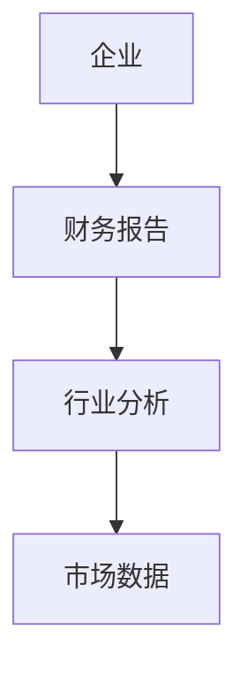
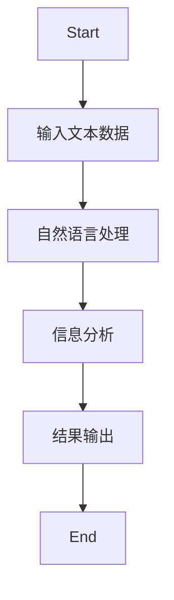
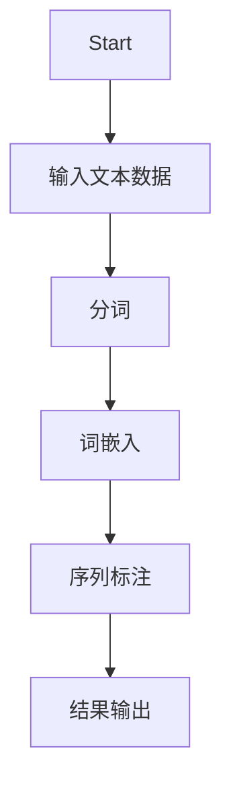
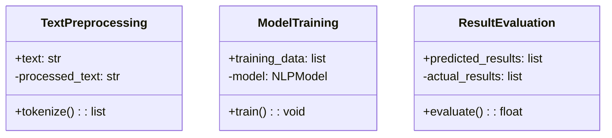
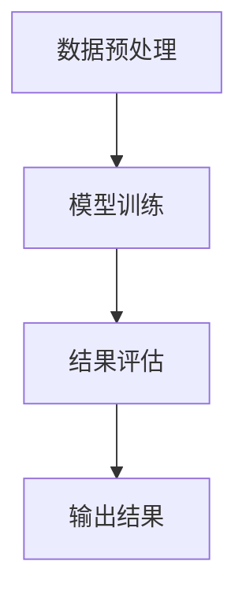
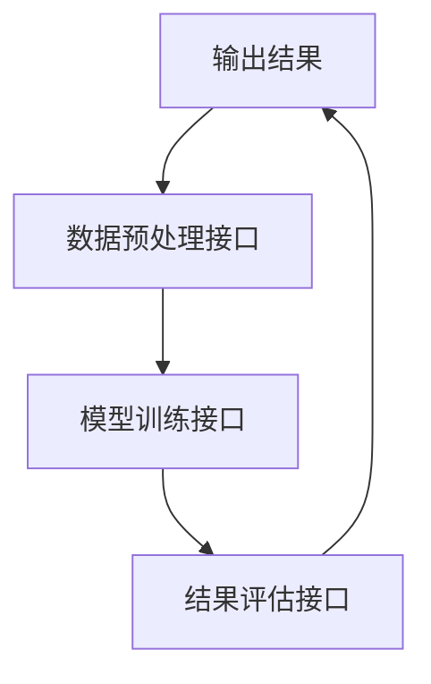

                 


# 企业估值中的AI驱动的自然语言理解平台评估

## 关键词：
企业估值, 自然语言理解, AI驱动, 信息提取, 评估模型

## 摘要：
本文探讨了在企业估值过程中，如何利用AI驱动的自然语言理解技术提取和分析文本信息。通过构建一个基于NLP的企业估值模型，本文详细分析了从数据预处理、模型训练到结果评估的全过程，展示了AI技术在金融领域的广泛应用和潜在价值。

---

## 第一章：企业估值中的AI驱动自然语言理解平台背景介绍

### 1.1 问题背景
传统的企业估值方法主要依赖于财务报表分析和市场数据，但这种方法往往忽视了非结构化数据（如公司报告、新闻公告）中的潜在价值。这些文本数据通常包含影响企业估值的关键信息，例如管理层的战略规划、市场动态以及行业趋势。

### 1.2 问题描述
在企业估值过程中，分析师需要处理大量的文本数据，包括财务报告、新闻、行业分析和市场数据。这些数据中隐含的信息通常需要人工提取和分析，耗时且效率低下。AI驱动的自然语言理解技术可以自动提取这些信息，显著提高估值的效率和准确性。

### 1.3 问题解决与边界
自然语言理解技术在企业估值中的应用包括信息提取、情感分析和实体识别。这些技术可以帮助分析师快速提取关键信息，例如财务数据、市场趋势和竞争分析。

### 1.4 概念结构与核心要素
自然语言理解平台的核心要素包括文本预处理、模型训练和结果评估。这些要素共同构成了一个完整的NLP系统，能够处理各种文本数据并生成可操作的输出。

---

## 第二章：核心概念与联系

### 2.1 自然语言理解平台评估的原理
自然语言理解平台通过文本预处理、特征提取和模型训练来提取信息。这些信息可以用于企业估值模型的输入，帮助分析师做出更准确的估值。

### 2.2 核心概念对比分析
通过对比分析，我们发现自然语言理解技术在企业估值中的应用具有独特的优势，尤其是在处理非结构化数据方面。

### 2.3 ER实体关系图
以下是一个简单的ER图，展示了企业、财务报告、行业分析和市场数据之间的关系。



### 2.4 系统流程图
以下是系统流程图，展示了自然语言理解平台的处理流程。



---

## 第三章：算法原理讲解

### 3.1 算法原理概述
自然语言理解平台的核心算法包括词嵌入、序列标注和注意力机制。这些算法共同作用，帮助模型理解和提取文本信息。

### 3.2 算法流程图
以下是一个简单的算法流程图。



### 3.3 算法实现
以下是一个简单的Python代码示例，展示了如何使用词嵌入模型来处理文本数据。

```python
import numpy as np

def text_preprocessing(text):
    # 分词
    tokens = text.split()
    return tokens

def get_word_embeddings(tokens):
    # 假设word_embeddings是一个预训练的词嵌入模型
    embeddings = [word_embeddings[t] for t in tokens]
    return np.array(embeddings)

text = "This is a sample text."
tokens = text_preprocessing(text)
embeddings = get_word_embeddings(tokens)
print(embeddings)
```

### 3.4 数学模型与公式
以下是自然语言理解模型中常用的数学公式。

$$
\text{embeddings} = \text{word\_embeddings}[\text{tokens}]
$$

---

## 第四章：系统分析与架构设计方案

### 4.1 问题场景介绍
系统需要处理大量的文本数据，包括财务报告、新闻公告和市场数据。这些数据需要经过预处理、特征提取和模型训练，最终生成可操作的输出。

### 4.2 系统功能设计
系统功能模块包括数据预处理、模型训练和结果评估。以下是功能模块的类图。



### 4.3 系统架构设计
以下是系统的架构图。



### 4.4 系统接口设计
系统接口设计包括文本预处理接口和模型训练接口。以下是接口的交互图。



---

## 第五章：项目实战

### 5.1 环境安装
需要安装以下Python库：numpy、pandas、spacy和scikit-learn。

```bash
pip install numpy pandas spacy scikit-learn
```

### 5.2 核心代码实现
以下是自然语言理解平台的核心代码示例。

```python
import spacy

nlp = spacy.load("en_core_web_sm")
text = "The company's revenue increased by 10% last quarter."
doc = nlp(text)
tokens = [token.text for token in doc]
print(tokens)
```

### 5.3 代码解读与分析
代码首先加载预训练的Spacy模型，然后对输入文本进行分词和实体识别，最后输出处理结果。

### 5.4 实际案例分析
通过分析一家公司的财务报告，我们可以提取出关键的财务数据，例如收入、利润和成本。这些数据可以帮助分析师做出更准确的企业估值。

### 5.5 项目小结
通过本项目，我们展示了如何利用自然语言理解技术提取企业估值中的关键信息。这种方法可以显著提高估值的效率和准确性。

---

## 第六章：总结与展望

### 6.1 最佳实践 tips
在实际应用中，建议使用预训练的NLP模型，并结合企业的具体需求进行定制化开发。

### 6.2 小结
本文详细探讨了自然语言理解技术在企业估值中的应用，展示了如何利用AI技术提高估值的效率和准确性。

### 6.3 注意事项
在实际应用中，需要注意数据质量和模型的可解释性。同时，还需要考虑模型的训练时间和计算资源。

### 6.4 拓展阅读
推荐阅读《自然语言处理入门》和《深度学习与自然语言处理》等书籍，以进一步了解NLP技术的应用。

---

## 作者：
AI天才研究院/AI Genius Institute  
禅与计算机程序设计艺术 / Zen And The Art of Computer Programming

