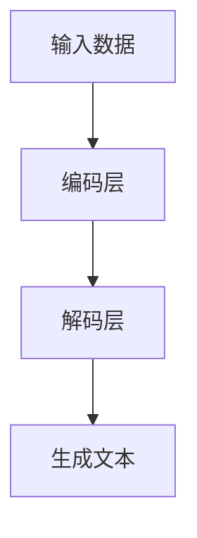
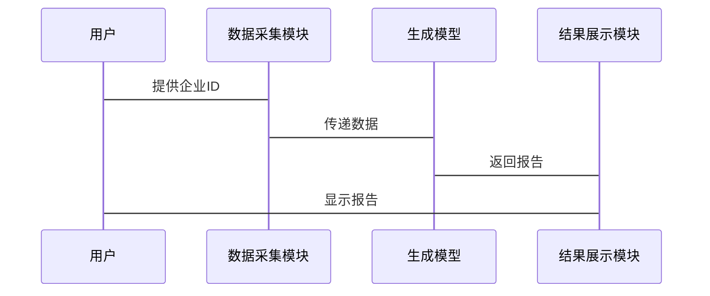

                 


# 企业估值中的AI驱动的自然语言生成平台评估

> 关键词：企业估值，自然语言生成，AI驱动，平台评估，文本分析

> 摘要：本文探讨了AI驱动的自然语言生成平台在企业估值中的应用，分析了其核心技术、算法原理及系统架构，通过实际案例展示了如何利用这些技术提升企业估值的效率和准确性。

---

## 引言

在现代企业环境中，估值是一项复杂而关键的任务，涉及大量数据的收集、分析和决策。传统的估值方法依赖于财务报表分析、市场分析和专家判断，然而这些方法往往耗时且不够精确。随着自然语言生成（Natural Language Generation, NLG）技术的快速发展，AI驱动的自然语言生成平台在企业估值中的应用越来越广泛。本文将深入探讨这一技术的核心原理、应用场景及实际案例，为企业估值提供新的视角和解决方案。

---

## 第一部分：企业估值与自然语言生成平台的背景

### 第1章：企业估值的基本概念

#### 1.1 企业估值的定义
企业估值是指对企业的整体价值进行评估的过程，通常用于企业并购、融资、上市等场景。传统估值方法包括DCF模型、可比公司分析等，但这些方法依赖于大量假设和人工判断，存在主观性和局限性。

#### 1.2 自然语言生成平台的定义与特点
自然语言生成（NLG）是人工智能技术的一个分支，旨在将结构化数据转化为自然语言文本。NLG平台具有高效性、可扩展性和智能化的特点，能够处理大量非结构化数据，生成高质量的文本内容。

#### 1.3 AI驱动的自然语言生成平台在企业估值中的作用
AI驱动的NLG平台通过分析企业报告、市场动态等文本数据，生成辅助估值的分析报告，提高估值的准确性和效率。同时，这些平台能够快速处理大量数据，减少人工操作的时间和成本。

---

## 第二部分：自然语言生成平台的核心技术与算法原理

### 第2章：自然语言生成的核心算法

#### 2.1 生成式模型
- **Transformer模型**：基于自注意力机制，能够捕捉文本中的长距离依赖关系。
- **GPT系列模型**：通过预训练生成式模型，生成连贯且自然的文本。
- **BERT模型**：通过双向Transformer结构，实现更精准的文本理解和生成。

#### 2.2 文本分析与理解算法
- **词袋模型**：将文本表示为词频向量，用于分类和聚类任务。
- **TF-IDF**：计算关键词的重要性，用于文本摘要和信息提取。
- **情感分析算法**：识别文本情感倾向，辅助评估市场情绪。

#### 2.3 自然语言生成的数学模型
- **概率论基础**：生成模型基于概率分布，预测下一个词的概率。
- **生成模型的数学公式**：例如，基于Transformer的生成模型公式如下：
  $$ P(y|x) = \prod_{i=1}^{n} P(y_i | y_{<i}, x) $$
  其中，$y$为生成的文本，$x$为输入数据。

#### 2.4 算法流程图


---

## 第三部分：企业估值中的自然语言生成平台架构设计

### 第3章：系统架构与功能设计

#### 3.1 系统功能模块划分
- **数据采集模块**：收集企业财务报表、市场报告等数据。
- **模型训练模块**：训练生成式模型，优化文本生成效果。
- **估值计算模块**：结合生成的文本数据，计算企业估值。
- **结果展示模块**：以可视化方式呈现估值结果和分析报告。

#### 3.2 系统架构设计
- **分层架构**：将系统划分为数据层、业务逻辑层和表现层，确保各层功能独立。
- **微服务架构**：通过微服务实现模块化设计，提高系统的可扩展性和维护性。

#### 3.3 系统接口设计
- **API接口定义**：例如，提供`/api/generate_report`接口，接收企业ID并返回生成的报告。
- **系统交互流程**：
  1. 用户输入企业ID。
  2. 系统调用数据采集模块获取数据。
  3. 调用生成模型生成分析报告。
  4. 返回报告至用户界面。

#### 3.4 系统交互图


---

## 第四部分：项目实战

### 第4章：基于Python的自然语言生成平台实现

#### 4.1 环境安装
- 安装必要的Python库，如`transformers`、`pandas`和`numpy`：
  ```bash
  pip install transformers pandas numpy
  ```

#### 4.2 核心代码实现

##### 数据预处理
```python
import pandas as pd
import numpy as np

def preprocess_data(dataframe):
    # 假设dataframe包含企业财务数据
    dataframe['text'] = dataframe['text'].apply(lambda x: x.lower())
    return dataframe
```

##### 模型训练
```python
from transformers import AutoModelForCausalLM, AutoTokenizer

def train_model(train_texts):
    tokenizer = AutoTokenizer.from_pretrained('gpt2')
    model = AutoModelForCausalLM.from_pretrained('gpt2')
    # 自定义训练逻辑
    return model, tokenizer
```

##### 生成报告
```python
def generate_report(model, tokenizer, input_text):
    inputs = tokenizer(input_text, return_tensors='np')
    outputs = model.generate(inputs.input_ids, max_length=500)
    return tokenizer.decode(outputs[0].tolist(), skip_special_tokens=True)
```

#### 4.3 实际案例分析
- **案例背景**：某科技公司需要进行估值，利用自然语言生成平台分析财务报告和市场动态。
- **数据输入**：财务报表、行业报告。
- **生成输出**：生成包含财务分析、市场趋势和估值建议的报告。
- **结果分析**：通过对比传统方法和AI生成的报告，验证AI驱动平台的有效性和准确性。

---

## 第五部分：最佳实践与总结

### 第5章：总结与展望

#### 5.1 最佳实践
- **数据质量**：确保输入数据的准确性和完整性。
- **模型优化**：定期更新模型，提升生成文本的质量。
- **用户反馈**：收集用户反馈，优化平台功能。

#### 5.2 小结
本文详细探讨了AI驱动的自然语言生成平台在企业估值中的应用，从技术原理到系统架构，再到实际案例，全面展示了其在提升估值效率和准确性方面的优势。

#### 5.3 注意事项
- 注意数据隐私和安全问题。
- 定期监控模型性能，防止过时。
- 提供用户友好的界面，降低使用门槛。

#### 5.4 拓展阅读
建议进一步阅读相关领域的最新研究，如结合强化学习优化自然语言生成模型，或探索与其他AI技术的集成应用。

---

## 结语

AI驱动的自然语言生成平台为企业估值提供了全新的思路和技术支持。通过结合生成式模型和文本分析算法，这些平台能够高效地处理大量非结构化数据，生成精准的分析报告，显著提升企业的估值效率和准确性。未来，随着AI技术的不断进步，自然语言生成在企业估值中的应用将更加广泛和深入。

---

## 作者

作者：AI天才研究院 & 禅与计算机程序设计艺术

