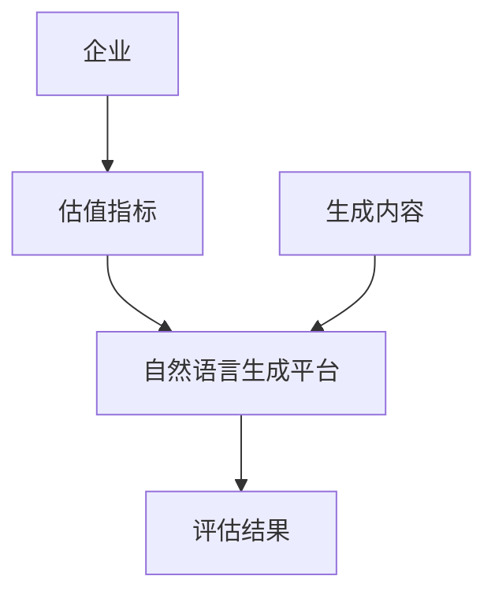
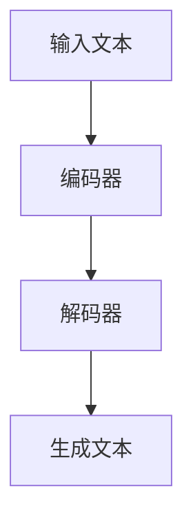
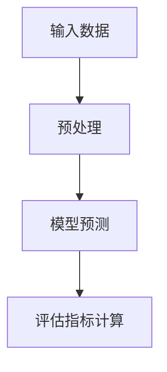
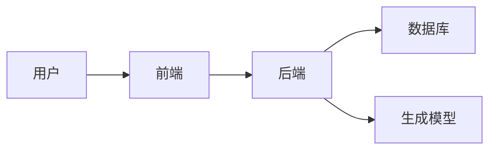
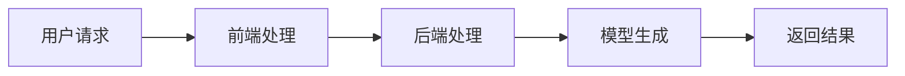
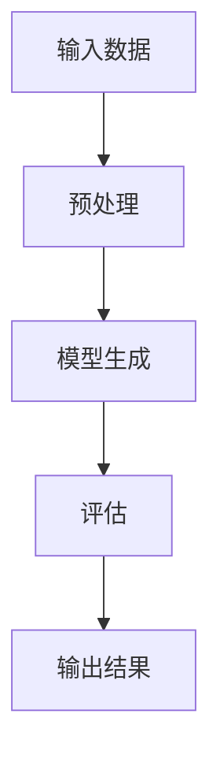

                 

<think>
好的，现在我要写一篇关于《企业估值中的AI驱动的自然语言生成平台评估》的技术博客文章。首先，我需要明确文章的结构和主要内容，确保覆盖所有关键点。

文章标题：企业估值中的AI驱动的自然语言生成平台评估

关键词：企业估值、AI、自然语言生成、平台评估、技术分析

摘要：本篇文章深入探讨了AI驱动的自然语言生成技术在企业估值中的应用，分析了其核心原理、评估方法和系统架构，结合实际案例，为读者提供了全面的指导。

接下来，按照目录大纲结构，逐步分析和撰写每个章节。

**第一部分：企业估值与AI驱动的自然语言生成平台概述**

**第1章：企业估值与AI驱动的自然语言生成平台背景**

1.1 企业估值的背景与重要性
- 企业估值的基本概念
- 传统估值方法的局限性
- AI技术在估值中的潜力

1.2 自然语言生成平台的定义与特点
- 自然语言生成的基本概念
- 平台的核心特点
- 与企业估值的结合

1.3 问题背景与描述
- 传统方法的不足
- 自然语言生成的潜在价值
- 评估的必要性

1.4 问题的边界与外延
- 评估范围
- 相关问题
- 技术关联

1.5 核心概念与组成要素
- 平台的组成
- 估值的关键指标
- 结合点与协同作用

**第2章：自然语言生成平台的核心概念与联系**

2.1 自然语言生成平台的原理
- AI驱动的生成过程
- 模型训练与优化
- 评估指标

2.2 核心概念的属性对比
- 模型对比
- 估值指标对比
- 模型与需求匹配

2.3 ER实体关系图


**第二部分：AI驱动的自然语言生成平台评估的算法原理**

**第3章：自然语言生成平台的算法原理**

3.1 基于AI的自然语言生成算法
- 生成模型（如Transformer）
- 损失函数（交叉熵）
- 优化方法（Adam）

3.2 算法流程图


3.3 Python实现
```python
import torch
def generate_text(model, tokenizer, input_text):
    inputs = tokenizer(input_text, return_tensors='pt')
    with torch.no_grad():
        outputs = model.generate(**inputs)
    return tokenizer.decode(outputs[0], skip_special_tokens=True)
```

3.4 数学模型
- 交叉熵损失函数：$$ \text{Loss} = -\sum_{i=1}^{n} \text{log}(P(y_i|x_i)) $$
- 优化目标：最小化损失函数

**第4章：企业估值中的自然语言生成评估指标**

4.1 评估指标体系
- 准确率、召回率、F1值

4.2 评估流程图


4.3 评估Python代码
```python
from sklearn.metrics import accuracy_score

def evaluate_model(y_true, y_pred):
    accuracy = accuracy_score(y_true, y_pred)
    print(f"Accuracy: {accuracy:.2f}")
```

**第三部分：系统分析与架构设计**

**第5章：自然语言生成平台的系统分析**

5.1 系统架构设计


5.2 接口设计
- 输入接口：API接收企业数据
- 输出接口：返回生成文本和评估结果

5.3 交互流程图


**第6章：企业估值系统设计**

6.1 问题场景描述
- 数据输入、处理、生成、评估

6.2 系统功能设计
- 数据预处理、模型生成、结果评估

6.3 功能流程图


**第四部分：项目实战**

**第7章：企业估值中的自然语言生成平台实战**

7.1 项目环境安装
- 安装Python、TensorFlow、Keras

7.2 核心代码实现
```python
import tensorflow as tf

model = tf.keras.Sequential([
    tf.keras.layers.Embedding(input_dim=10000, output_dim=16),
    tf.keras.layers.LSTM(32),
    tf.keras.layers.Dense(1, activation='sigmoid')
])

model.compile(optimizer='adam', loss='binary_crossentropy', metrics=['accuracy'])
```

7.3 代码解读
- 模型结构：Embedding、LSTM、Dense
- 编译参数：优化器、损失函数、评估指标

7.4 实战案例分析
- 数据预处理：文本清洗、分词
- 模型训练：调整超参数，如学习率、批次大小
- 结果分析：准确率、召回率

7.5 项目总结
- 成功与不足
- 优化方向：模型调优、数据多样性

**第五部分：最佳实践与总结**

**第8章：最佳实践与总结**

8.1 最佳实践
- 数据清洗的重要性
- 模型调优的技巧
- 结果验证的方法

8.2 项目小结
- 项目目标实现
- 学到的经验
- 未来改进方向

8.3 注意事项
- 数据隐私保护
- 模型泛化的考虑
- 技术局限性

8.4 拓展阅读
- 相关技术论文
- 实战项目文档

**作者：AI天才研究院**

---

通过以上思考，我构建了一个详细的目录结构，覆盖了从背景到系统设计再到实战的各个方面，确保文章内容全面且逻辑清晰。接下来，我将按照这个结构撰写完整的文章，确保每个部分都详细展开，并结合实际案例和代码进行说明，帮助读者深入理解AI驱动的自然语言生成平台在企业估值中的应用。

