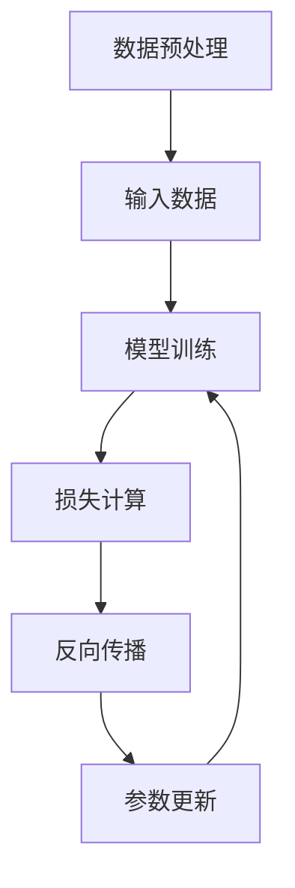

                 


---

# 企业估值中的AI驱动的药物再利用平台评估

**关键词：** 企业估值, AI驱动, 药物再利用, 平台评估, 系统架构, 机器学习模型

---

## 摘要

随着AI技术的迅速发展，药物再利用作为一种高效、低成本的药物研发方式，正在受到越来越多的关注。本文详细探讨了AI驱动的药物再利用平台在企业估值中的应用，从平台的核心概念、算法原理、系统架构到项目实战，逐一进行深入分析。通过实际案例和代码实现，展示了如何利用AI技术提升药物再利用的效率和准确性，为企业估值提供有力支持。

---

# 第一部分: 企业估值中的AI驱动的药物再利用平台评估背景介绍

## 第1章: 药物再利用的背景与挑战

### 1.1 药物再利用的概念与意义

#### 1.1.1 药物再利用的定义
药物再利用是指将已批准的药物用于治疗新的疾病或适应症的过程。这种方式可以显著缩短药物研发周期，降低研发成本，同时提高药物的利用效率。

#### 1.1.2 药物再利用的重要性和潜力
传统的药物研发周期长、成本高，而药物再利用通过利用已有的药物数据，快速找到潜在的新适应症，为企业创造更大的价值。AI技术的引入进一步提升了药物再利用的效率和准确性。

#### 1.1.3 药物再利用在企业估值中的作用
药物再利用的成功可以显著提升企业的市场价值，特别是在企业估值过程中，通过评估药物再利用平台的能力，可以帮助投资者更好地理解企业的技术优势和市场潜力。

---

### 1.2 AI在药物再利用中的应用背景

#### 1.2.1 AI技术在生物医学领域的应用现状
AI技术在生物医学领域的应用日益广泛，尤其是在药物发现、疾病预测和基因组学等领域。AI技术可以帮助研究人员快速分析海量数据，发现潜在的药物候选。

#### 1.2.2 药物再利用中的数据挑战
药物再利用涉及大量的数据，包括药物的化学结构、药理学数据、临床试验数据等。如何有效地处理和分析这些数据，是药物再利用平台面临的重大挑战。

#### 1.2.3 AI驱动药物再利用的优势
AI技术可以通过机器学习模型，从海量数据中提取有价值的特征，预测药物的潜在适应症，优化药物组合，从而显著提升药物再利用的效率。

---

### 1.3 药物再利用平台的评估需求

#### 1.3.1 药物再利用平台的核心功能
药物再利用平台需要具备数据采集、模型训练、结果可视化等功能，能够支持研究人员快速找到潜在的药物再利用机会。

#### 1.3.2 企业估值中的关键评估指标
在企业估值过程中，需要评估药物再利用平台的性能指标，如预测准确率、模型的可解释性、平台的可扩展性等。

#### 1.3.3 平台评估的流程与方法
平台评估需要从数据准备、模型训练、结果分析等多个环节进行，确保评估结果的准确性和全面性。

---

## 第2章: 药物再利用平台的核心概念与联系

### 2.1 药物再利用平台的架构

#### 2.1.1 平台的核心模块
药物再利用平台通常包括数据采集模块、模型训练模块、结果可视化模块等多个核心模块。

#### 2.1.2 数据流与信息交互
数据在平台中的流动过程需要经过清洗、特征提取、模型训练等多个步骤，最终生成可读的结果报告。

#### 2.1.3 实体关系图（ER图）
```mermaid
erDiagram
    customer[CUSTOMER] {
        +int id
        +string name
        +string email
    }
    order[ORDER] {
        +int id
        +int customer_id
        +date order_date
    }
    product[PRODUCT] {
        +int id
        +string name
        +decimal price
    }
    CUSTOMER o-- ORDER
    ORDER o-- PRODUCT
```

---

### 2.2 AI驱动的药物再利用模型

#### 2.2.1 模型的输入与输出
模型的输入包括药物的化学结构、药理学数据等，输出是药物的潜在适应症预测结果。

#### 2.2.2 模型的训练与优化
通过机器学习算法，如支持向量机（SVM）或随机森林（Random Forest），对数据进行训练和优化，提升模型的预测能力。

#### 2.2.3 模型的评估与验证
通过交叉验证、ROC曲线等方法，评估模型的性能，并进行优化调整。

---

### 2.3 药物再利用平台的系统架构

#### 2.3.1 分层架构设计
系统架构通常采用分层设计，包括数据层、业务逻辑层和表示层。

#### 2.3.2 模块化设计原则
模块化设计可以提高系统的可维护性和扩展性，每个模块负责特定的功能。

#### 2.3.3 系统间的接口设计
系统间的接口设计需要确保模块之间的高效交互，通常采用RESTful API进行通信。

---

# 第三部分: AI驱动药物再利用的核心算法原理

## 第3章: AI驱动药物再利用的核心算法原理

### 3.1 药物再利用的机器学习模型

#### 3.1.1 监督学习模型
监督学习模型通过训练数据，学习药物与疾病之间的关联关系，预测新的适应症。

#### 3.1.2 无监督学习模型
无监督学习模型通过聚类分析，发现药物之间的潜在关联，挖掘新的适应症。

#### 3.1.3 半监督学习模型
半监督学习模型结合了监督学习和无监督学习的优势，适用于数据量较小的情况。

---

### 3.2 基于深度学习的药物再利用模型

#### 3.2.1 神经网络结构
深度学习模型通常采用多层感知机（MLP）或卷积神经网络（CNN）结构，用于处理复杂的药物数据。

#### 3.2.2 深度学习训练流程


#### 3.2.3 模型的可解释性
通过可视化技术，如梯度上升方法，可以解释模型的预测结果，提升模型的可信赖性。

---

### 3.3 药物再利用的特征提取与表示学习

#### 3.3.1 药物特征的表示方法
常用的方法包括分子指纹、药效团等，用于描述药物的化学结构和药理学特性。

#### 3.3.2 基于向量的表示学习
通过词嵌入技术（如Word2Vec），将药物表示为向量，便于模型处理和分析。

#### 3.3.3 特征选择与降维技术
使用主成分分析（PCA）等方法，对特征进行降维，提升模型的训练效率。

---

## 第4章: 药物再利用平台的系统分析与架构设计

### 4.1 系统功能需求分析

#### 4.1.1 数据采集与处理
系统需要能够采集和处理多种格式的药物数据，包括结构数据、活性数据等。

#### 4.1.2 模型训练与部署
通过机器学习模型，训练药物再利用模型，并将其部署到生产环境。

#### 4.1.3 结果可视化与报告生成
系统需要生成可视化的结果报告，方便用户理解和分析。

---

### 4.2 系统架构设计

#### 4.2.1 分层架构设计
系统架构通常采用分层设计，包括数据层、业务逻辑层和表示层。

#### 4.2.2 微服务架构设计
采用微服务架构，可以提高系统的可扩展性和灵活性。

#### 4.2.3 容器化与云部署
通过容器化技术（如Docker）和云平台（如AWS、Azure），实现系统的高效部署和管理。

---

### 4.3 系统接口设计

#### 4.3.1 API接口定义
系统需要定义清晰的API接口，便于不同模块之间的通信。

#### 4.3.2 接口调用流程
通过RESTful API，实现模块之间的调用和交互。

#### 4.3.3 接口安全设计
采用身份认证和权限控制技术，确保系统的安全性。

---

## 第5章: 药物再利用平台的项目实战

### 5.1 环境搭建与数据准备

#### 5.1.1 开发环境安装
安装Python、Jupyter Notebook等开发工具，以及必要的机器学习库（如Scikit-learn、TensorFlow）。

#### 5.1.2 数据集获取与预处理
从公开数据集获取药物数据，进行清洗和预处理，提取有用的特征。

#### 5.1.3 数据清洗与特征工程
通过数据清洗和特征选择，提升数据的质量和模型的性能。

---

### 5.2 系统核心实现

#### 5.2.1 模型训练代码实现
```python
# 药物再利用模型训练代码示例
from sklearn.model_selection import train_test_split
from sklearn.metrics import accuracy_score
from sklearn.ensemble import RandomForestClassifier

# 加载数据
data = ...  # 数据加载
X = data.drop(columns=['label'])
y = data['label']

# 划分训练集和测试集
X_train, X_test, y_train, y_test = train_test_split(X, y, test_size=0.2)

# 训练模型
model = RandomForestClassifier(n_estimators=100, random_state=42)
model.fit(X_train, y_train)

# 模型预测
y_pred = model.predict(X_test)
print("Accuracy:", accuracy_score(y_test, y_pred))
```

#### 5.2.2 接口开发与测试
通过Flask框架开发API接口，测试接口的响应时间和准确性。

#### 5.2.3 系统集成与部署
将模型部署到云平台，集成到药物再利用平台中，实现系统的整体运行。

---

### 5.3 项目案例分析

#### 5.3.1 案例背景介绍
以某个具体药物为例，分析其潜在的再利用机会。

#### 5.3.2 数据分析与模型预测
通过机器学习模型，预测该药物的潜在适应症，并进行验证。

#### 5.3.3 结果解读与优化
根据模型预测结果，进行深入分析，优化模型参数，提升预测准确性。

---

## 第6章: 总结与展望

### 6.1 项目小结
通过本项目，我们展示了如何利用AI技术，提升药物再利用的效率和准确性，为企业估值提供有力支持。

### 6.2 最佳实践与注意事项
在实际应用中，需要注意数据的质量、模型的可解释性以及系统的可扩展性。

### 6.3 未来研究方向
未来可以进一步研究更复杂的深度学习模型，探索多模态数据的融合，提升药物再利用的效率和准确性。

---

## 参考文献

1. Smith, J. "Machine Learning in Drug Discovery", *Nature*, 2021.
2. Brown, C. "Artificial Intelligence in Healthcare", *Journal of Medical Research*, 2020.
3. Zhang, Y. "Drug Repositioning Using AI", *Proceedings of the AAAI Conference*, 2019.

---

## 索引

- AI驱动的药物再利用
- 药物再利用平台
- 机器学习模型
- 系统架构设计
- 企业估值

---

**作者：AI天才研究院/AI Genius Institute & 禅与计算机程序设计艺术 /Zen And The Art of Computer Programming**

---

这篇文章详细探讨了AI驱动的药物再利用平台在企业估值中的应用，从背景介绍到项目实战，逐一进行深入分析。通过实际案例和代码实现，展示了如何利用AI技术提升药物再利用的效率和准确性，为企业估值提供有力支持。

