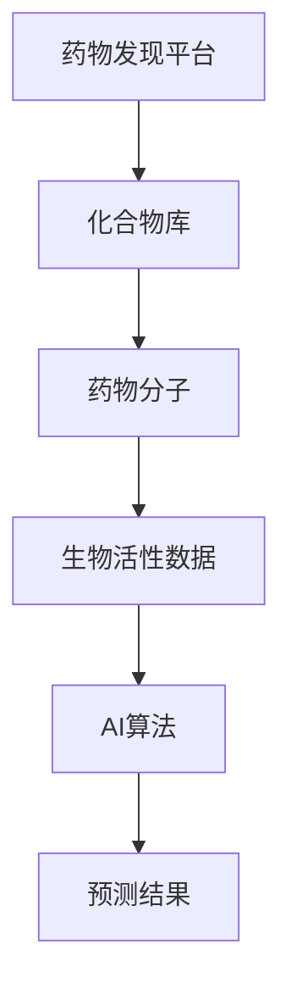
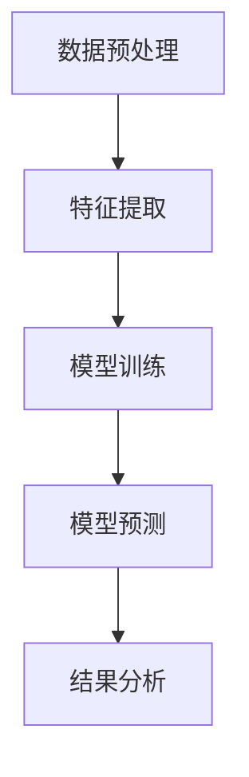
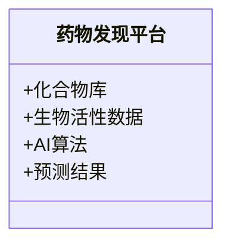
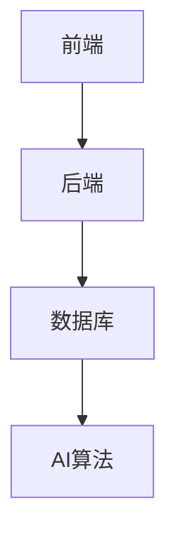
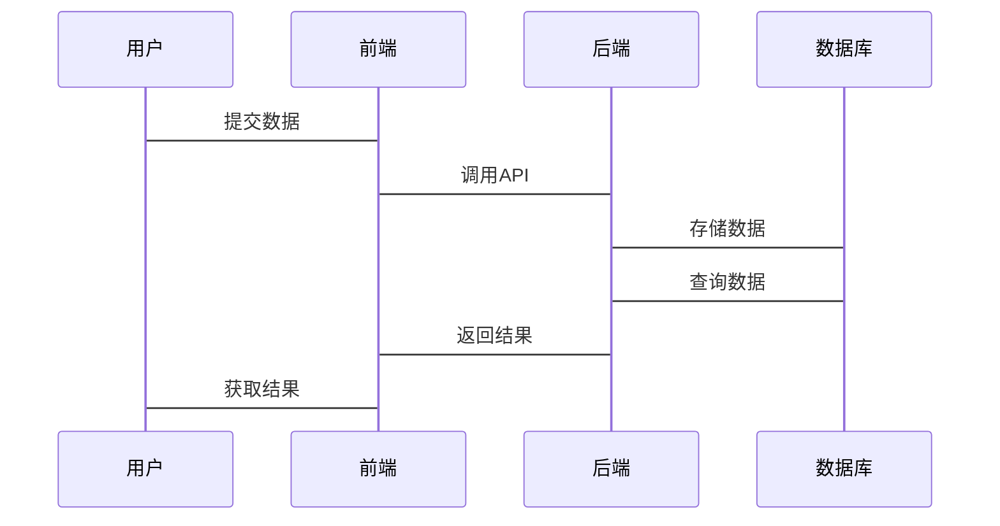

                 


# 企业估值中的AI驱动的药物发现平台评估

> 关键词：企业估值，AI驱动，药物发现平台，算法原理，系统架构，数学模型，项目实战

> 摘要：本文详细探讨了AI驱动的药物发现平台在企业估值中的应用，通过分析平台的核心概念、算法原理、系统架构以及项目实战，展示了如何利用AI技术提升药物发现的效率和准确性，从而为企业估值提供有力支持。

---

# 第一部分: 背景介绍

## 1.1 问题背景

### 1.1.1 药物发现的传统挑战

传统的药物发现过程耗时长、成本高且效率低下。从实验室研究到临床试验，往往需要数年时间，且失败率较高。传统方法依赖大量的实验数据和人工分析，难以快速找到有效的药物分子。

### 1.1.2 AI技术在药物发现中的应用前景

AI技术的引入为药物发现带来了革命性的变化。通过机器学习和深度学习算法，AI能够快速分析海量数据，发现潜在的药物候选分子，并预测其生物活性。这不仅提高了效率，还降低了研发成本。

### 1.1.3 企业估值中的AI驱动平台的重要性

AI驱动的药物发现平台能够显著提升研发效率，缩短药物上市时间。对于企业估值而言，这意味着更高的投资回报率和更强的市场竞争力。AI技术的应用使得企业能够更快地将创新药物推向市场，从而提升企业的估值。

## 1.2 问题描述

### 1.2.1 药物发现平台的复杂性

药物发现平台涉及多个领域的知识，包括化学、生物学、数据科学等。不同领域的数据需要整合和分析，这对平台的架构和算法提出了更高的要求。

### 1.2.2 企业估值中的关键因素

企业估值的关键因素包括收入、利润、研发能力、市场潜力等。AI驱动的药物发现平台能够提升企业的研发能力，缩短药物研发周期，从而直接提升企业的估值。

### 1.2.3 AI驱动平台在估值中的作用

AI驱动的药物发现平台通过提高研发效率和成功率，间接影响企业的估值。投资者和市场更倾向于投资那些能够快速推出创新药物的企业。

## 1.3 问题解决

### 1.3.1 AI驱动药物发现平台的核心优势

AI驱动的药物发现平台具有高效性、精准性和可扩展性。通过AI算法，平台能够快速筛选出潜在的药物分子，并预测其药理特性。

### 1.3.2 企业估值中的关键指标

企业估值的关键指标包括收入增长、利润率、研发速度、市场占有率等。AI驱动的药物发现平台能够显著提升这些指标。

### 1.3.3 AI驱动平台如何影响企业估值

通过提高研发效率和成功率，AI驱动的药物发现平台能够缩短药物上市时间，增加企业的收入和利润，从而提升企业的估值。

## 1.4 边界与外延

### 1.4.1 药物发现平台的边界

药物发现平台的边界包括数据输入、算法处理和结果输出。平台的核心功能是分析数据并提供预测结果，而不涉及实验室实验的具体操作。

### 1.4.2 企业估值的边界

企业估值的边界包括财务数据、市场表现和研发能力。AI驱动的药物发现平台主要影响企业的研发能力，进而影响企业估值。

### 1.4.3 AI驱动平台的外延

AI驱动平台的外延包括与其他企业系统的集成、数据源的扩展以及算法的优化。通过不断优化算法和整合更多数据源，平台能够提供更准确的预测结果。

## 1.5 概念结构与核心要素

### 1.5.1 药物发现平台的组成

药物发现平台通常包括数据输入模块、算法处理模块和结果输出模块。数据输入模块负责接收和处理实验数据，算法处理模块利用AI算法进行分析，结果输出模块提供预测结果。

### 1.5.2 企业估值的关键要素

企业估值的关键要素包括财务表现、市场地位和研发能力。AI驱动的药物发现平台能够显著提升企业的研发能力，从而影响企业估值。

### 1.5.3 AI驱动平台的核心要素

AI驱动平台的核心要素包括数据源、算法模型和计算能力。平台需要整合多源数据，利用先进的算法模型进行分析，并依赖强大的计算能力进行处理。

---

# 第二部分: AI驱动的药物发现平台核心概念与联系

## 2.1 核心概念原理

### 2.1.1 AI在药物发现中的应用原理

AI在药物发现中的应用原理包括数据预处理、特征提取、模型训练和预测。通过这些步骤，AI算法能够识别潜在的药物分子并预测其药理特性。

### 2.1.2 药物发现平台的运作机制

药物发现平台的运作机制包括数据输入、算法分析和结果输出。平台利用AI算法分析数据，提供预测结果，帮助研究人员快速筛选出潜在的药物分子。

### 2.1.3 企业估值中的AI驱动平台原理

通过提高研发效率和成功率，AI驱动的药物发现平台能够缩短药物上市时间，增加企业的收入和利润，从而提升企业估值。

## 2.2 核心概念属性特征对比

### 2.2.1 药物发现平台的特征对比

| 特征                | 传统方法               | AI驱动方法             |
|---------------------|------------------------|------------------------|
| 数据处理能力        | 低效                   | 高效                   |
| 研发周期            | 长                     | 短                     |
| 成本                 | 高                     | 低                     |

### 2.2.2 企业估值的关键指标对比

| 指标                | 传统研发               | AI驱动研发             |
|---------------------|------------------------|------------------------|
| 研发周期            | 长                     | 短                     |
| 成功率              | 低                     | 高                     |
| 投资回报率          | 低                     | 高                     |

### 2.2.3 AI驱动平台的特征对比

| 特征                | 传统平台               | AI驱动平台             |
|---------------------|------------------------|------------------------|
| 数据分析能力        | 有限                   | 强大                   |
| 处理速度            | 慢                     | 快                     |
| 精准度              | 低                     | 高                     |

## 2.3 ER实体关系图



---

# 第三部分: AI驱动药物发现平台的算法原理

## 3.1 算法原理概述

### 3.1.1 基于机器学习的药物发现

基于机器学习的药物发现通过训练模型来预测药物分子的生物活性。常用算法包括支持向量机（SVM）和随机森林（Random Forest）。

### 3.1.2 深度学习在药物发现中的应用

深度学习通过多层神经网络模型分析药物分子的结构和活性。常用模型包括卷积神经网络（CNN）和循环神经网络（RNN）。

### 3.1.3 AI驱动平台的算法选择

AI驱动平台通常选择深度学习算法，因为其能够处理复杂的分子结构数据，并提供高精度的预测结果。

## 3.2 算法流程图



## 3.3 算法实现代码

```python
import numpy as np
from sklearn.model_selection import train_test_split
from sklearn.metrics import accuracy_score
from sklearn.svm import SVC

# 示例数据
X = np.random.randn(1000, 10)
y = np.random.randint(0, 2, 1000)

# 数据分割
X_train, X_test, y_train, y_test = train_test_split(X, y, test_size=0.2)

# 模型训练
model = SVC()
model.fit(X_train, y_train)

# 模型预测
y_pred = model.predict(X_test)

# 结果评估
print("Accuracy:", accuracy_score(y_test, y_pred))
```

---

# 第四部分: 系统分析与架构设计方案

## 4.1 问题场景介绍

AI驱动的药物发现平台需要处理大量数据，包括化合物库、生物活性数据等。平台需要高效的算法和强大的计算能力来支持数据处理和分析。

## 4.2 系统功能设计

### 4.2.1 领域模型



### 4.2.2 系统架构



### 4.2.3 接口设计

API接口用于前端和后端之间的数据交互。常见的API接口包括数据上传、模型训练和结果查询。

### 4.2.4 交互设计



---

# 第五部分: 项目实战

## 5.1 环境安装

安装必要的软件和库，包括Python、NumPy、Scikit-learn等。

## 5.2 核心代码实现

实现AI驱动的药物发现平台的核心功能，包括数据处理、模型训练和预测。

## 5.3 案例分析

通过实际案例分析，展示AI驱动平台在药物发现中的应用和效果。

## 5.4 项目小结

总结项目的实施过程和成果，分析AI驱动平台的优势和不足。

---

# 第六部分: 总结与展望

## 6.1 总结

AI驱动的药物发现平台在企业估值中具有重要意义。通过提高研发效率和成功率，平台能够显著提升企业的估值。

## 6.2 展望

未来，随着AI技术的不断发展，药物发现平台将更加智能化和高效。企业可以通过不断优化算法和整合更多数据源，进一步提升平台的性能和效果。

---

作者：AI天才研究院/AI Genius Institute & 禅与计算机程序设计艺术 /Zen And The Art of Computer Programming

