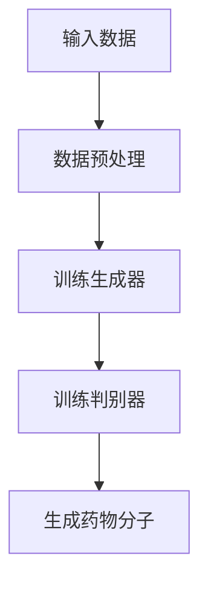
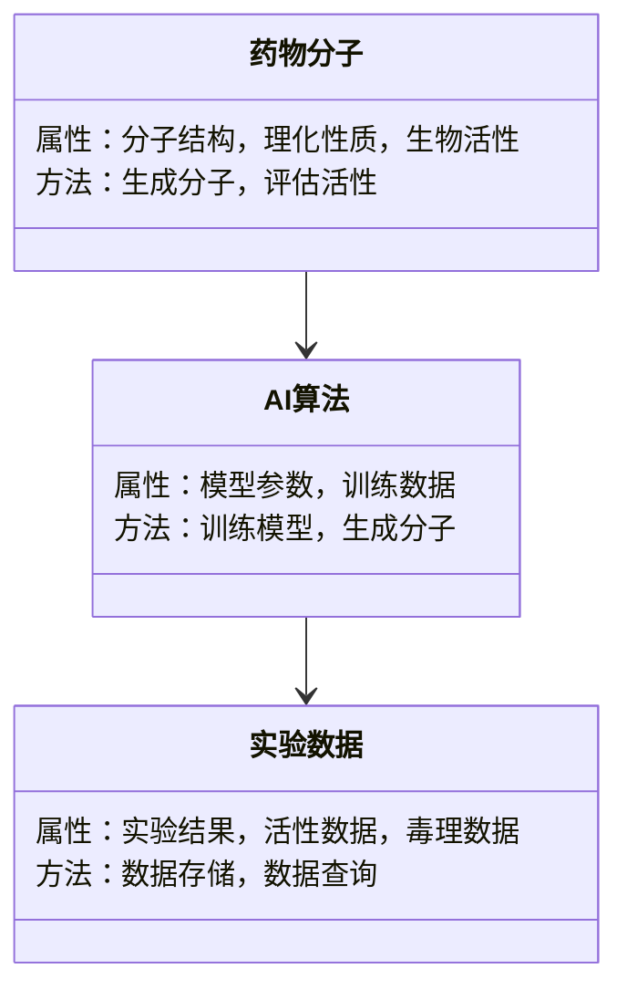
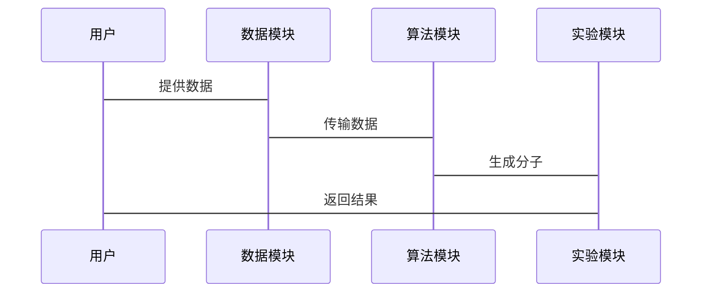

                 


# 企业估值中的AI驱动的药物设计平台评估

## 关键词：AI，药物设计，企业估值，平台评估，生成对抗网络，药物分子，深度学习

## 摘要：本篇文章详细探讨了在企业估值过程中，AI驱动的药物设计平台的评估方法。文章从药物设计的基本概念出发，分析了AI技术在药物设计中的应用背景，详细讲解了AI驱动的药物设计平台的核心要素，包括数据输入模块、AI算法模块和实验数据模块。接着，文章重点介绍了AI算法在药物设计中的应用，尤其是生成对抗网络（GAN）的原理和其在药物分子生成中的应用。通过构建ER实体关系图和领域模型类图，文章深入剖析了AI驱动药物设计的核心概念与联系。最后，文章详细讲解了AI驱动的药物设计平台的系统架构设计，包括功能模块设计和架构优化策略，为企业估值提供了重要的参考。

---

# 第1章: AI在药物设计中的应用背景

## 1.1 药物设计的基本概念

### 1.1.1 药物设计的定义
药物设计是指通过科学的方法和技术手段，设计和优化具有特定生理活性的化合物，以达到治疗疾病的目的。

### 1.1.2 药物设计的基本流程
药物设计的基本流程包括：目标确定、分子设计、活性测试、优化和临床试验。

### 1.1.3 药物设计的目标与挑战
药物设计的目标是开发出高效、安全、稳定的药物。其主要挑战包括：分子的多样性和复杂性、药物作用机制的不确定性、研发周期长、成本高等。

## 1.2 AI技术在药物设计中的应用背景

### 1.2.1 AI技术的发展与药物设计的结合
随着AI技术的发展，深度学习、生成对抗网络等技术被广泛应用于药物设计领域。

### 1.2.2 AI驱动药物设计的优势与劣势
优势：提高药物设计效率、降低研发成本、发现新药的可能性增加。劣势：数据依赖性强、模型的可解释性较差、算法的鲁棒性有待提高。

### 1.2.3 当前AI在药物设计中的应用现状
目前，AI技术在药物设计中的应用主要集中在分子生成、活性预测、优化等方面。

---

# 第2章: AI驱动的药物设计平台的核心要素

## 2.1 药物设计平台的基本结构

### 2.1.1 数据输入模块
数据输入模块包括药物分子数据、疾病靶点数据、生物活性数据等。

### 2.1.2 AI算法模块
AI算法模块包括生成对抗网络、强化学习、监督学习等算法。

### 2.1.3 实验数据模块
实验数据模块包括实验结果、活性数据、毒理数据等。

## 2.2 AI驱动药物设计的核心要素

### 2.2.1 数据质量的重要性
数据质量直接影响模型的性能和药物设计的结果。

### 2.2.2 算法的可解释性
算法的可解释性是AI驱动药物设计的重要因素，有助于理解模型的决策过程。

### 2.2.3 平台的可扩展性
平台的可扩展性决定了其在实际应用中的适应能力和灵活性。

---

# 第3章: AI驱动的药物设计平台评估的核心概念

## 3.1 药物分子的生成

### 3.1.1 药物分子的基本属性
药物分子的基本属性包括分子结构、理化性质、生物活性等。

### 3.1.2 药物分子的生成方法
药物分子的生成方法包括基于规则的生成、随机生成、AI生成等。

### 3.1.3 药物分子的评估标准
药物分子的评估标准包括活性、选择性、稳定性、药代动力学性质等。

## 3.2 AI算法在药物设计中的应用

### 3.2.1 常见AI算法概述
常见AI算法包括生成对抗网络、强化学习、监督学习等。

### 3.2.2 算法选择的影响因素
算法选择的影响因素包括数据类型、任务需求、计算资源等。

### 3.2.3 算法优化的策略
算法优化的策略包括数据增强、超参数调优、模型融合等。

---

# 第4章: AI驱动的药物设计平台的评估指标

## 4.1 平台性能评估

### 4.1.1 数据处理能力
数据处理能力包括数据清洗、数据预处理、数据存储等。

### 4.1.2 算法准确率
算法准确率是评估模型性能的重要指标。

### 4.1.3 平台运行效率
平台运行效率包括计算速度、资源消耗、运行稳定性等。

## 4.2 平台的可扩展性评估

### 4.2.1 数据扩展能力
数据扩展能力是指平台能否处理更大规模的数据。

### 4.2.2 算法扩展能力
算法扩展能力是指算法能否处理更复杂的任务。

### 4.2.3 平台扩展能力
平台扩展能力是指平台能否适应更多的应用场景。

---

# 第5章: AI驱动的药物设计平台的算法原理

## 5.1 生成对抗网络（GAN）在药物设计中的应用

### 5.1.1 GAN的基本原理
生成对抗网络由生成器和判别器组成，通过对抗训练生成逼真的数据。

### 5.1.2 GAN在药物分子生成中的应用
GAN可以用于生成具有特定性质的药物分子，提高药物设计的效率。

### 5.1.3 GAN的优缺点
优点：生成多样性高、模型自动学习数据特征。缺点：训练不稳定、模型的可解释性较差。

## 5.2 算法流程图

### 5.2.1 GAN的流程图


## 5.3 算法代码实现

### 5.3.1 GAN的Python代码实现
```python
import numpy as np
import tensorflow as tf

# 定义生成器
def generator():
    model = tf.keras.Sequential()
    model.add(tf.keras.layers.Dense(256, activation='relu', input_dim=100))
    model.add(tf.keras.layers.Dense(128, activation='relu'))
    model.add(tf.keras.layers.Dense(32, activation='relu'))
    model.add(tf.keras.layers.Dense(8, activation='sigmoid'))
    return model

# 定义判别器
def discriminator():
    model = tf.keras.Sequential()
    model.add(tf.keras.layers.Dense(128, activation='relu', input_dim=8))
    model.add(tf.keras.layers.Dense(64, activation='relu'))
    model.add(tf.keras.layers.Dense(1, activation='sigmoid'))
    return model

# 定义GAN模型
generator_model = generator()
discriminator_model = discriminator()

# 编译模型
generator_model.compile(optimizer='adam', loss='binary_crossentropy')
discriminator_model.compile(optimizer='adam', loss='binary_crossentropy')

# 训练GAN模型
for epoch in range(100):
    # 生成假数据
    noise = np.random.random((100, 100))
    generated = generator_model.predict(noise)
    
    # 训练判别器
    valid = np.ones((100, 1))
    fake = np.zeros((100, 1))
    discriminator_model.trainable = True
    d_loss_real = discriminator_model.train_on_batch(generated, fake)
    
    # 训练生成器
    discriminator_model.trainable = False
    g_loss = generator_model.train_on_batch(noise, fake)
```

---

# 第6章: AI驱动的药物设计平台的系统分析与架构设计

## 6.1 系统功能设计

### 6.1.1 功能模块划分
功能模块包括数据输入模块、AI算法模块、实验数据模块等。

### 6.1.2 领域模型类图


## 6.2 系统架构设计

### 6.2.1 微服务架构设计
采用微服务架构，将系统划分为多个独立的服务模块，如数据服务、算法服务、结果服务等。

### 6.2.2 架构优化策略
优化策略包括模块化设计、异步通信、负载均衡等。

## 6.3 系统交互设计

### 6.3.1 系统交互流程


---

# 第7章: 项目实战

## 7.1 环境安装

### 7.1.1 安装Python
安装Python 3.8或更高版本。

### 7.1.2 安装深度学习库
安装TensorFlow、Keras、PyTorch等深度学习库。

## 7.2 核心代码实现

### 7.2.1 数据预处理
```python
import pandas as pd
data = pd.read_csv('drug_data.csv')
data = data.dropna()
```

### 7.2.2 模型训练
```python
model = tf.keras.Sequential()
model.add(tf.keras.layers.Dense(64, activation='relu', input_dim=32))
model.add(tf.keras.layers.Dense(1, activation='sigmoid'))
model.compile(optimizer='adam', loss='binary_crossentropy')
model.fit(x_train, y_train, epochs=100, batch_size=32)
```

## 7.3 案例分析

### 7.3.1 数据集选择
选择公开的药物分子数据集，如ZINC数据库。

### 7.3.2 模型评估
通过实验数据验证模型的生成能力，评估模型的准确率和稳定性。

---

# 第8章: 总结与展望

## 8.1 项目总结

### 8.1.1 核心发现
AI驱动的药物设计平台在提高药物设计效率和降低成本方面具有显著优势。

### 8.1.2 项目经验
项目实施过程中，数据质量对模型性能的影响至关重要，模型的可解释性和算法的鲁棒性需要进一步优化。

## 8.2 未来展望

### 8.2.1 技术发展趋势
随着AI技术的不断发展，深度学习、强化学习等技术将进一步应用于药物设计领域。

### 8.2.2 企业估值的影响
AI驱动的药物设计平台将为企业估值提供更准确、更高效的评估方法。

---

作者：AI天才研究院/AI Genius Institute & 禅与计算机程序设计艺术 /Zen And The Art of Computer Programming

