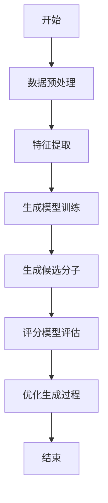
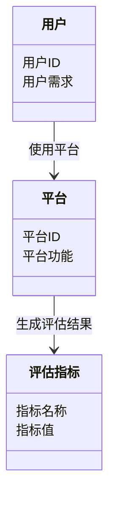
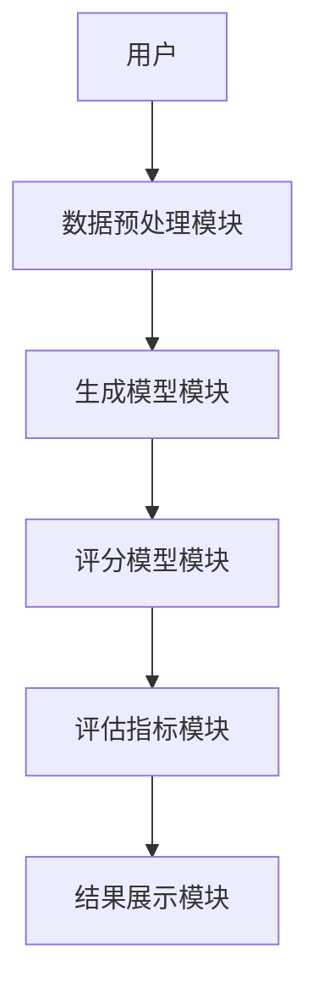
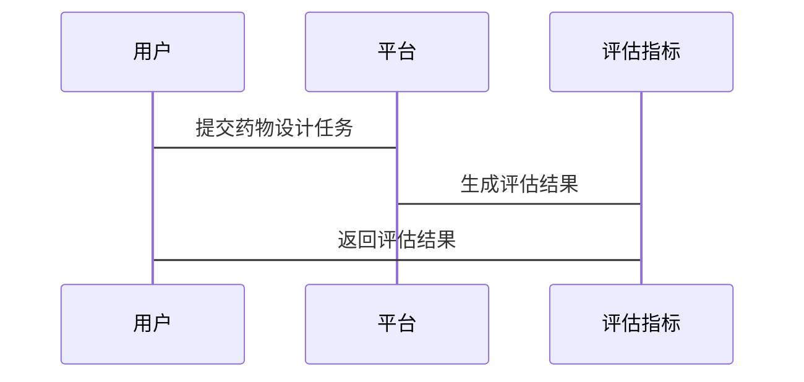

                 


# 《企业估值中的AI驱动的药物设计平台评估》

---

## 关键词：
AI技术、药物设计、企业估值、平台评估、算法原理

---

## 摘要：
随着AI技术的快速发展，AI驱动的药物设计平台在现代药物研发中发挥着越来越重要的作用。本文将从企业估值的角度，详细探讨AI驱动的药物设计平台的评估方法。通过对平台的核心技术、评估指标和算法原理的深入分析，结合实际案例，为读者提供一个全面理解AI驱动的药物设计平台评估的框架。本文还提供了详细的代码实现和系统架构设计，帮助读者更好地掌握相关技术。

---

# 第1章: 药物设计与企业估值的背景介绍

## 1.1 药物设计的挑战与传统方法

### 1.1.1 药物设计的基本概念与流程

药物设计是通过科学方法设计具有特定生物活性的分子，以达到治疗疾病的目的。传统药物设计流程通常包括以下几个步骤：

1. **目标识别**：确定疾病相关的靶点。
2. **分子库构建**：基于靶点筛选潜在的候选药物。
3. **活性测试**：通过实验验证候选药物的活性。
4. **优化与合成**：优化候选药物的物理化学性质，进行化学合成。

### 1.1.2 传统药物设计的局限性

传统药物设计方法存在以下问题：

1. **耗时长**：传统药物设计需要大量的实验和人工干预，周期较长。
2. **成本高**：药物研发的投入巨大，失败率高。
3. **效率低**：筛选候选药物的过程繁琐且效率低下。

### 1.1.3 药物设计与企业估值的关系

药物设计的效率和质量直接影响企业的研发成本和市场竞争力。高效的药物设计能力可以显著降低研发成本，提高企业的估值。

---

## 1.2 AI技术在药物设计中的应用

### 1.2.1 AI技术如何提升药物设计效率

AI技术可以通过以下方式提升药物设计效率：

1. **分子生成**：利用生成模型（如GAN、VAE）生成潜在的候选药物分子。
2. **活性预测**：通过机器学习模型预测分子的生物活性。
3. **优化与筛选**：利用强化学习优化分子的物理化学性质，提高筛选效率。

### 1.2.2 AI驱动的药物设计平台的优势

AI驱动的药物设计平台具有以下优势：

1. **高效性**：可以快速生成大量候选分子，显著缩短研发周期。
2. **精准性**：通过算法优化候选分子的活性和选择性。
3. **可扩展性**：可以处理大量的数据，支持大规模的药物筛选。

### 1.2.3 AI在药物设计中的具体应用场景

AI技术在药物设计中的具体应用场景包括：

1. **虚拟筛选**：利用AI模型对化合物库进行虚拟筛选，快速找到潜在的候选药物。
2. **分子生成**：通过生成模型生成具有特定性质的候选分子。
3. **毒性预测**：预测候选药物的毒性和安全性。

---

## 1.3 药物设计平台评估的重要性

### 1.3.1 为什么需要评估药物设计平台

药物设计平台的评估可以帮助企业确定平台的性能和价值，从而做出更明智的投资决策。

### 1.3.2 评估指标与企业估值的关系

评估指标（如生成模型的精准度、计算效率）直接影响企业的估值。高性能的平台可以提高企业的市场竞争力和估值。

### 1.3.3 平台评估对企业的战略意义

通过评估药物设计平台，企业可以优化资源配置，提高研发效率，降低研发成本，从而增强企业的核心竞争力。

---

## 1.4 本章小结

本章介绍了药物设计的传统方法及其局限性，探讨了AI技术在药物设计中的应用，分析了药物设计平台评估的重要性及其对企业估值的影响。

---

# 第2章: AI驱动的药物设计平台核心概念

## 2.1 AI驱动的药物设计平台定义

### 2.1.1 平台的组成与功能

AI驱动的药物设计平台通常由以下几个模块组成：

1. **数据预处理模块**：对输入数据进行清洗和特征提取。
2. **生成模型模块**：生成候选药物分子。
3. **评分模型模块**：评估候选药物的活性和选择性。
4. **用户界面模块**：方便用户交互和结果展示。

### 2.1.2 平台的核心技术与模块

平台的核心技术包括生成模型（如GAN、VAE）和评分模型（如随机森林、神经网络）。这些技术共同实现了分子的生成和优化。

### 2.1.3 平台的输入输出关系

平台的输入包括靶点信息、化合物库等，输出包括候选药物分子及其活性预测结果。

---

## 2.2 平台评估的关键指标

### 2.2.1 精准度与召回率的定义

- **精准度**：生成的候选药物中实际有效的比例。
- **召回率**：实际有效的候选药物中被正确识别的比例。

### 2.2.2 平台的计算效率与资源消耗

计算效率是衡量平台性能的重要指标，包括生成模型的运行时间、内存消耗等。

### 2.2.3 用户友好性与可扩展性

用户友好性是指平台界面的易用性，可扩展性是指平台能否处理大规模数据。

---

## 2.3 平台评估的边界与外延

### 2.3.1 评估的适用范围

平台评估主要适用于药物设计的早期阶段，如分子生成和优化。

### 2.3.2 评估的局限性与挑战

评估的局限性包括数据质量和模型的泛化能力。

### 2.3.3 与其他技术的协同关系

AI驱动的药物设计平台需要与实验验证、临床试验等技术协同工作，才能完成完整的药物研发流程。

---

## 2.4 核心概念的ER实体关系图

```mermaid
erDiagram
    actor 用户角色 {
        <属性> 用户ID
        <属性> 用户类型
        <属性> 用户需求
    }
    actor 平台提供方 {
        <属性> 平台ID
        <属性> 平台功能
        <属性> 平台性能指标
    }
    actor 评估指标 {
        <属性> 指标名称
        <属性> 指标值
        <属性> 指标权重
    }
    用户角色 --> 平台提供方 : 使用平台
    平台提供方 --> 评估指标 : 生成评估结果
```

---

# 第3章: AI驱动的药物设计平台评估算法原理

## 3.1 生成模型与评分模型

### 3.1.1 生成模型的概述

生成模型（如GAN、VAE）通过生成潜在的候选药物分子，帮助研究人员快速筛选出具有特定性质的分子。

### 3.1.2 评分模型的概述

评分模型（如随机森林、神经网络）通过对候选药物分子的活性进行预测，评估分子的潜在药效。

### 3.1.3 生成模型与评分模型的协同关系

生成模型和评分模型协同工作，生成模型负责生成候选分子，评分模型负责评估分子的活性，从而优化生成过程。

---

## 3.2 算法流程图



---

## 3.3 生成模型的数学模型

生成模型的数学模型可以表示为：

$$
\text{生成模型} = \text{生成器} + \text{判别器}
$$

其中，生成器的目标是最小化判别器的损失函数：

$$
\min_{G} \max_{D} \mathbb{E}_{x \sim p_{\text{data}}}[ \log D(x)] + \mathbb{E}_{z \sim p_{z}}[ \log (1 - D(G(z)))]
$$

---

## 3.4 评分模型的数学模型

评分模型的数学模型可以表示为：

$$
\text{评分模型} = \text{分类器}
$$

其中，分类器的目标是最小化分类错误率：

$$
\min_{\theta} \mathbb{E}_{x \sim p_{\text{data}}}[ \mathbb{I}(y \neq \text{预测值})]
$$

---

## 3.5 生成模型与评分模型的协同优化

生成模型和评分模型需要协同优化，生成模型不断优化生成的分子，评分模型不断优化评估的准确性，最终实现高效的药物设计。

---

# 第4章: AI驱动的药物设计平台评估系统架构设计

## 4.1 系统功能设计

### 4.1.1 领域模型设计



### 4.1.2 系统架构设计



---

## 4.2 系统接口设计

### 4.2.1 API接口设计

1. **生成分子API**：`POST /generate/molecules`
2. **评估分子API**：`POST /assess/molecules`

---

## 4.3 系统交互设计

### 4.3.1 交互流程



---

## 4.4 本章小结

本章详细介绍了AI驱动的药物设计平台的系统架构设计，包括功能模块、接口设计和系统交互流程。

---

# 第5章: 项目实战

## 5.1 环境安装

### 5.1.1 安装Python环境

```bash
pip install python3
pip install numpy
pip install tensorflow
pip install scikit-learn
```

---

## 5.2 系统核心实现源代码

### 5.2.1 生成模型代码

```python
import numpy as np
import tensorflow as tf

# 定义生成器模型
def generator_model():
    model = tf.keras.Sequential([
        tf.keras.layers.Dense(256, activation='relu'),
        tf.keras.layers.Dense(128, activation='relu'),
        tf.keras.layers.Dense(10, activation='sigmoid')
    ])
    return model

# 定义判别器模型
def discriminator_model():
    model = tf.keras.Sequential([
        tf.keras.layers.Dense(128, activation='relu'),
        tf.keras.layers.Dense(64, activation='relu'),
        tf.keras.layers.Dense(1, activation='sigmoid')
    ])
    return model
```

### 5.2.2 评分模型代码

```python
from sklearn.ensemble import RandomForestClassifier

# 定义评分模型
def score_model(X_train, y_train):
    model = RandomForestClassifier(n_estimators=100)
    model.fit(X_train, y_train)
    return model
```

---

## 5.3 代码应用解读与分析

### 5.3.1 生成模型的应用

生成模型用于生成候选药物分子，生成器通过反向传播优化生成的分子，使其更接近真实的药物分子。

### 5.3.2 评分模型的应用

评分模型用于评估生成的分子的活性，随机森林模型通过特征提取和投票机制，预测分子的活性。

---

## 5.4 实际案例分析

### 5.4.1 案例背景

假设我们有一个靶点为蛋白质的药物设计任务，目标是生成具有高活性的候选药物分子。

### 5.4.2 实施步骤

1. **数据预处理**：清洗和特征提取。
2. **生成模型训练**：训练生成器和判别器。
3. **生成分子**：生成候选药物分子。
4. **评分模型评估**：评估分子的活性。
5. **优化生成过程**：根据评分结果优化生成模型。

---

## 5.5 项目小结

通过实际案例分析，展示了AI驱动的药物设计平台的评估过程，包括数据预处理、模型训练和评估结果的分析。

---

# 第6章: 最佳实践与注意事项

## 6.1 小结

本章总结了AI驱动的药物设计平台评估的核心内容，包括算法原理、系统架构和项目实战。

## 6.2 注意事项

1. **数据质量**：确保数据的准确性和完整性。
2. **模型优化**：不断优化生成模型和评分模型，提高评估的准确性。
3. **实验验证**：AI生成的候选分子需要通过实验验证，确保其药效和安全性。

## 6.3 拓展阅读

1. 《Deep Learning for Drug Discovery》
2. 《AI in Pharmaceutical Research and Development》

---

# 作者：AI天才研究院/AI Genius Institute & 禅与计算机程序设计艺术 /Zen And The Art of Computer Programming

