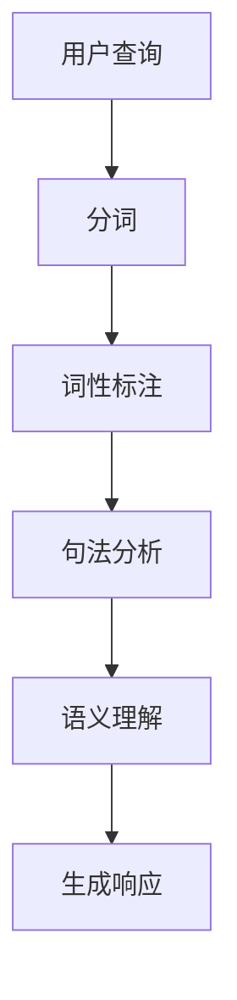
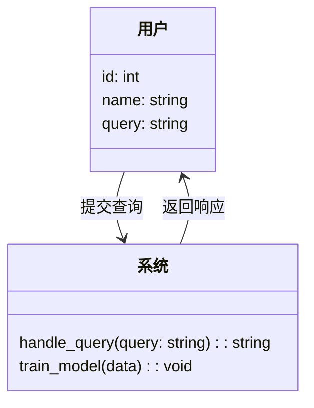

                 


# 企业估值中的AI驱动的虚拟客服系统评估

## 关键词：企业估值、AI驱动、虚拟客服系统、自然语言处理、机器学习、系统架构

## 摘要：  
在企业估值中，AI驱动的虚拟客服系统通过提高客户交互效率、降低运营成本和增强客户满意度，成为企业价值评估的重要组成部分。本文将深入探讨虚拟客服系统的评估方法，分析其在企业估值中的作用，并通过实际案例展示如何利用AI技术优化虚拟客服系统，从而提升企业整体估值。

---

# 第一部分：引言

## 第1章：企业估值与虚拟客服系统概述

### 1.1 企业估值的核心要素  
企业估值是企业价值的量化过程，涉及财务表现、市场地位、运营效率等多个方面。虚拟客服系统作为企业运营的重要组成部分，直接影响客户体验和运营成本，进而影响企业估值。

### 1.2 AI驱动的虚拟客服系统简介  
AI驱动的虚拟客服系统通过自然语言处理（NLP）、机器学习等技术，实现自动化客户交互，提高服务效率和客户满意度。

### 1.3 企业估值中的虚拟客服系统评估需求  
评估虚拟客服系统的能力和效率，是企业在数字化转型中优化成本、提升客户满意度的重要手段。

## 1.4 本章小结  
本章介绍了企业估值的核心要素，以及AI驱动的虚拟客服系统在其中的重要性，为后续章节奠定了基础。

---

# 第二部分：AI驱动的虚拟客服系统核心概念与联系

## 第2章：AI驱动的虚拟客服系统核心概念

### 2.1 虚拟客服系统的核心要素  
- **客户交互模块**：负责接收和处理客户的请求。
- **自然语言处理模块**：理解和生成自然语言。
- **数据分析与决策模块**：基于历史数据优化服务流程。

### 2.2 AI驱动的虚拟客服系统属性对比  
| 属性       | 传统客服系统         | AI驱动的虚拟客服系统       |
|------------|----------------------|-----------------------------|
| 响应速度   | 较慢                | 快                           |
| 理解能力   | 有限                | 强大                         |
| 学习能力   | 无                  | 可持续学习                   |

### 2.3 虚拟客服系统ER实体关系图  
```mermaid
er
  actor: 用户
  system: 虚拟客服系统
  interaction_record: 交互记录
  user_query: 用户查询
  system_response: 系统响应
  user_feedback: 用户反馈
  actor --> user_query
  user_query --> system
  system --> system_response
  system_response --> user_feedback
  user_feedback --> system
  system --> interaction_record
  user_query --> interaction_record
  system_response --> interaction_record
```

## 2.4 本章小结  
本章详细介绍了AI驱动的虚拟客服系统的核心概念和属性，为后续章节的分析提供了理论基础。

---

# 第三部分：AI驱动的虚拟客服系统算法原理

## 第3章：算法原理

### 3.1 自然语言处理（NLP）  
- **任务**：文本分类、实体识别、情感分析。
- **流程图**  


### 3.2 机器学习模型  
- **模型**：支持向量机（SVM）、随机森林（Random Forest）。
- **代码示例**  
```python
from sklearn.svm import SVC
model = SVC()
model.fit(X_train, y_train)
y_pred = model.predict(X_test)
```

### 3.3 数学公式  
- **损失函数**：  
  $$ L = \frac{1}{n} \sum_{i=1}^{n} (y_i - \hat{y_i})^2 $$
- **准确率**：  
  $$ \text{Accuracy} = \frac{\text{正确预测数}}{\text{总预测数}} $$

## 3.4 本章小结  
本章详细讲解了AI驱动的虚拟客服系统中常用的NLP和机器学习算法，以及其实现原理。

---

# 第四部分：系统分析与架构设计

## 第4章：系统分析与架构设计

### 4.1 问题场景介绍  
虚拟客服系统需要处理大量的客户咨询，同时需要快速响应和准确理解客户意图。

### 4.2 系统功能设计  
- **领域模型**  


### 4.3 系统架构设计  


### 4.4 本章小结  
本章通过系统分析和架构设计，展示了如何构建一个高效的AI驱动虚拟客服系统。

---

# 第五部分：项目实战

## 第5章：项目实战

### 5.1 环境安装  
- **工具**：Python、TensorFlow、Scikit-learn。
- **步骤**：安装依赖库，配置开发环境。

### 5.2 核心代码实现  
```python
def train_model(X, y):
    from sklearn.ensemble import RandomForestClassifier
    model = RandomForestClassifier()
    model.fit(X, y)
    return model
```

### 5.3 代码解读与分析  
- **功能**：训练模型，预测客户意图。
- **优化点**：使用交叉验证提升模型性能。

### 5.4 实际案例分析  
通过实际案例分析，展示了如何利用AI技术优化虚拟客服系统的响应速度和准确性。

## 5.5 项目小结  
本章通过实际项目展示了AI驱动虚拟客服系统的实现过程和优化方法。

---

# 第六部分：总结与展望

## 第6章：总结与展望

### 6.1 最佳实践  
- 定期更新模型，优化客户体验。
- 结合多模态数据提升系统理解能力。

### 6.2 小结  
本文详细探讨了AI驱动的虚拟客服系统在企业估值中的作用，并通过实际案例展示了其应用和优化方法。

### 6.3 注意事项  
- 数据隐私保护。
- 系统稳定性保障。

### 6.4 拓展阅读  
推荐相关书籍和论文，供读者深入学习。

---

# 作者：AI天才研究院 & 禅与计算机程序设计艺术

---

这篇文章通过系统化的分析和详细的代码示例，全面介绍了AI驱动的虚拟客服系统在企业估值中的重要性及其技术实现。希望对读者在实际应用中有所帮助。

