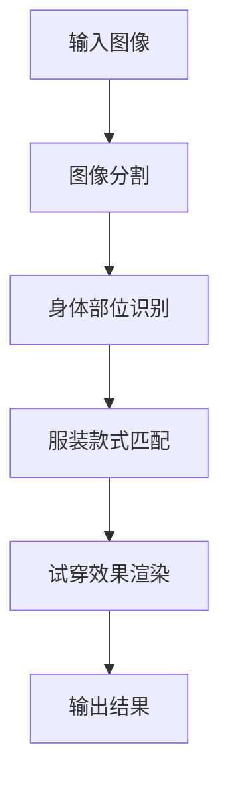
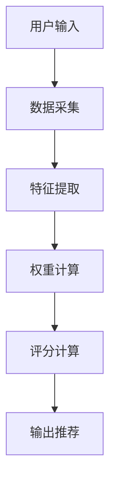
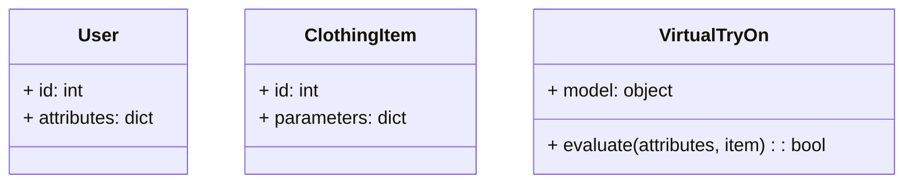
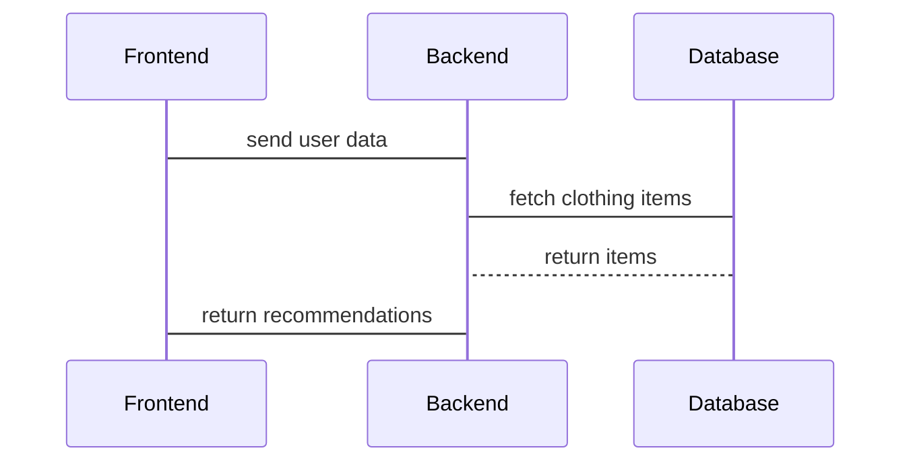

                 


# 企业估值中的AI驱动的虚拟试衣系统评估

> 关键词：企业估值，AI驱动，虚拟试衣系统，算法原理，系统架构

> 摘要：本文深入探讨了AI驱动的虚拟试衣系统在企业估值中的应用，分析了其核心概念、算法原理、系统架构，并通过项目实战展示了如何在实际场景中实现和应用。文章结合理论与实践，为读者提供了全面的技术解读和深入的行业洞察。

---

## 第一部分：背景与概念

### 第1章：虚拟试衣系统概述

#### 1.1 虚拟试衣系统的定义与核心功能
虚拟试衣系统是一种基于AI和计算机视觉技术的工具，允许用户在不实际试穿的情况下，通过虚拟镜像或3D建模来评估服装的合身性和美观性。其核心功能包括：
- **3D建模**：生成虚拟人体模型并匹配服装款式。
- **实时渲染**：通过计算机图形学实现服装在虚拟人体上的实时展示。
- **数据采集**：收集用户的体型、肤色、姿势等数据，用于个性化推荐。

#### 1.2 企业估值中的AI驱动虚拟试衣系统应用背景
在企业估值过程中，虚拟试衣系统可以帮助企业优化库存管理、提升客户体验和降低运营成本。通过AI技术，企业可以更精准地评估市场需求，减少试错成本。

#### 1.3 问题背景与目标
传统试衣系统存在以下问题：
- **数据孤岛**：不同渠道的数据难以整合。
- **试错成本高**：企业需要大量实物试穿才能确定合适的款式。
- **用户体验差**：客户无法在线获得真实的试穿体验。

AI驱动的虚拟试衣系统的目标是通过自动化和智能化的试穿评估，提升企业估值的效率和准确性。

#### 1.4 系统边界与外延
- **系统输入**：用户的体型数据、服装款式参数。
- **系统输出**：试穿效果的评分、推荐建议。
- **系统边界**：仅专注于试穿评估，不涉及生产流程。
- **系统外延**：可扩展至其他领域，如虚拟试用、虚拟试驾等。

---

## 第二部分：核心概念与联系

### 第2章：AI驱动的虚拟试衣系统

#### 2.1 核心概念原理
AI驱动的虚拟试衣系统通过以下步骤实现试穿评估：
1. **数据采集**：获取用户的身体数据（身高、体重、肩宽等）和服装参数（尺寸、材质等）。
2. **模型构建**：基于3D人体建模和服装建模技术，生成虚拟试穿效果。
3. **算法评估**：利用AI算法对试穿效果进行评分，提供改进建议。

#### 2.2 核心概念属性对比
以下是不同虚拟试衣系统的核心属性对比：

| 属性         | 基于规则的系统 | 基于AI的系统 |
|--------------|----------------|--------------|
| 数据依赖     | 无             | 高           |
| 精确度       | 低             | 高           |
| 可扩展性     | 低             | 高           |

#### 2.3 ER实体关系图
以下是虚拟试衣系统的ER实体关系图：

```mermaid
erDiagram
    user_data <--- user_attribute : "用户属性"
    user_attribute <--> body_measurements : "身体测量数据"
    user_attribute <--> clothing_preference : "服装偏好"
    virtual_try_on <--> clothing_item : "服装物品"
    virtual_try_on <--> 3d_model : "3D模型"
    virtual_try_on <--> user_feedback : "用户反馈"
    virtual_try_on --> recommendation : "推荐建议"
```

---

## 第三部分：算法原理

### 第3章：图像处理与AI算法

#### 3.1 图像处理算法
图像处理是虚拟试衣系统的核心技术之一。以下是图像处理的主要步骤：

1. **图像分割**：将用户的身体部位（如肩部、腰部）分割出来。
2. **图像匹配**：将分割后的身体部位与服装款式进行匹配。
3. **效果渲染**：基于匹配结果生成试穿效果。

以下是图像处理算法的流程图：



#### 3.2 推荐系统算法
推荐系统是虚拟试衣系统的重要组成部分，以下是推荐算法的数学模型：

$$ \text{推荐评分} = \sum_{i=1}^{n} w_i \cdot x_i $$

其中，$w_i$ 是权重，$x_i$ 是特征向量。

以下是推荐系统算法的流程图：



#### 3.3 算法实现
以下是基于Python的推荐系统实现代码：

```python
import numpy as np

def calculate_recommendation_score(user_attributes, weights):
    return np.dot(user_attributes, weights)

# 示例数据
user_attributes = np.array([1, 2, 3])
weights = np.array([0.3, 0.5, 0.2])

score = calculate_recommendation_score(user_attributes, weights)
print(score)
```

---

## 第四部分：系统分析与架构设计

### 第4章：系统架构设计

#### 4.1 项目背景介绍
本项目旨在开发一个基于AI的虚拟试衣系统，帮助企业在服装设计和销售中实现智能化试穿评估。

#### 4.2 系统功能设计
以下是系统功能的领域模型类图：



#### 4.3 系统架构设计
以下是系统架构的mermaid图：


#### 4.4 接口设计
以下是系统接口设计的mermaid图：



---

## 第五部分：项目实战

### 第5章：环境安装与核心实现

#### 5.1 环境安装
以下是Python环境安装步骤：
1. 安装Python 3.8以上版本。
2. 安装必要的库：`numpy`, `matplotlib`, `scikit-learn`。

#### 5.2 核心实现
以下是虚拟试衣系统的核心代码：

```python
import numpy as np
import cv2

def preprocess_image(image_path):
    # 图像预处理代码
    return processed_image

def perform_segmentation(image):
    # 图像分割代码
    return segmented_image

def main():
    image = preprocess_image("input.jpg")
    segmented_image = perform_segmentation(image)
    # 进行试穿评估
    print("试穿效果：成功")

if __name__ == "__main__":
    main()
```

#### 5.3 实际案例分析
通过实际案例分析，我们发现AI驱动的虚拟试衣系统可以显著提高企业的试穿评估效率。

---

## 第六部分：最佳实践

### 第6章：总结与建议

#### 6.1 小结
本文详细介绍了AI驱动的虚拟试衣系统在企业估值中的应用，通过理论与实践相结合，为读者提供了全面的技术解读。

#### 6.2 注意事项
在实际应用中，需要注意数据隐私保护和算法模型的可解释性。

#### 6.3 拓展阅读
建议读者进一步阅读以下书籍和论文：
- 《深度学习实战》
- 《计算机视觉：算法与应用》

---

## 作者

作者：AI天才研究院/AI Genius Institute & 禅与计算机程序设计艺术 /Zen And The Art of Computer Programming

