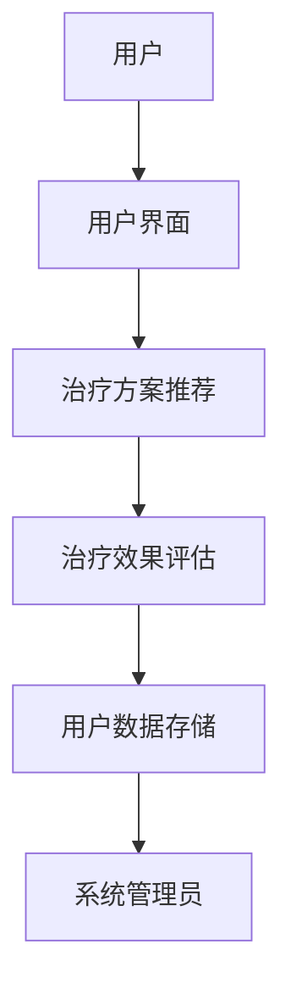

                 


# 企业估值中的AR/VR心理健康治疗平台评估

> 关键词：AR/VR技术，心理健康治疗平台，企业估值，用户体验，沉浸式体验，数据分析模型

> 摘要：随着AR/VR技术的快速发展，其在心理健康治疗领域的应用越来越广泛。本文将探讨如何通过AR/VR技术评估心理健康治疗平台的企业价值，从技术背景、核心概念、算法原理、系统架构设计、项目实战到案例分析，全面解析这一领域的最新进展和未来趋势。

---

# 第一部分：引言

## 1.1 问题背景

### 1.1.1 AR/VR技术的发展与应用
AR（增强现实）和VR（虚拟现实）技术近年来取得了显著进展，广泛应用于游戏、教育、医疗等领域。AR通过叠加数字信息到现实世界，提供增强的交互体验；VR则通过创建完全虚拟的环境，让用户沉浸其中。

### 1.1.2 心理健康治疗的需求与现状
心理健康问题日益普遍，传统的治疗方法包括心理咨询和药物治疗，但存在效率低、成本高等问题。AR/VR技术为心理健康治疗提供了新的可能性，如通过虚拟环境进行放松训练、焦虑缓解等。

### 1.1.3 AR/VR技术在心理健康治疗中的潜力
AR/VR技术可以创建高度沉浸的虚拟环境，帮助用户放松身心、缓解焦虑、克服恐惧等。例如，VR冥想应用可以帮助用户进入深度放松状态，而AR游戏则可以通过互动体验改善用户的心理状态。

## 1.2 问题描述

### 1.2.1 传统心理健康治疗的局限性
传统治疗方法依赖于面对面的咨询和药物治疗，存在时间、空间和成本限制，难以覆盖所有人群。

### 1.2.2 AR/VR技术在心理健康治疗中的优势
AR/VR技术可以提供实时、个性化的治疗体验，用户可以在虚拟环境中进行放松训练、恐惧暴露疗法等，效果显著且成本较低。

### 1.2.3 平台评估的必要性与目标
随着越来越多的AR/VR心理健康治疗平台出现，如何评估这些平台的企业价值成为关键问题。评估指标包括用户体验、治疗效果、技术实现难度等。

## 1.3 问题解决

### 1.3.1 AR/VR心理健康治疗平台的核心功能
平台需要提供虚拟环境创建、用户行为分析、治疗效果评估等功能。

### 1.3.2 评估指标的初步定义
初步定义了用户体验评分、治疗效果评分、平台稳定性评分等指标。

### 1.3.3 平台评估的框架与方法
提出了基于用户体验和治疗效果的双维度评估框架，并结合数据分析模型进行量化评估。

## 1.4 边界与外延

### 1.4.1 平台评估的范围界定
仅关注AR/VR心理健康治疗平台的评估，不包括其他类型的心理健康治疗方式。

### 1.4.2 相关领域的联系与区别
与传统心理健康治疗相比，AR/VR平台具有更高的互动性和沉浸感，但技术实现难度更大。

### 1.4.3 评估方法的适用性与限制
评估方法适用于企业级平台，但对于小型应用可能不够适用。

## 1.5 概念结构与核心要素

### 1.5.1 平台架构的核心要素
包括虚拟环境构建、用户交互设计、治疗效果评估等。

### 1.5.2 评估指标的层次结构
从用户体验、治疗效果、平台稳定性三个维度进行评估。

### 1.5.3 核心概念之间的关系
通过概念图展示各核心概念之间的关系，如AR/VR技术与心理健康治疗的深度融合。

---

# 第二部分：AR/VR技术与心理健康治疗的核心概念

## 2.1 AR/VR技术的原理与实现

### 2.1.1 AR与VR的技术区别
- AR：将虚拟信息叠加在现实世界中，如Pokémon GO。
- VR：创建完全虚拟的环境，如Oculus Rift中的虚拟世界。

### 2.1.2 AR/VR在心理健康治疗中的应用场景
- VR冥想：通过虚拟环境帮助用户放松。
- AR心理疏导：通过增强现实技术提供实时心理支持。

### 2.1.3 沉浸式体验的实现机制
通过高清晰度的视觉、听觉和触觉反馈，让用户完全沉浸在一个虚拟环境中。

## 2.2 心理健康治疗的原理

### 2.2.1 传统心理健康治疗的局限性
- 时间和空间限制。
- 成本高昂。

### 2.2.2 AR/VR技术在心理健康治疗中的优势
- 提供实时互动体验。
- 用户可以根据需求随时进行治疗。

### 2.2.3 治疗效果的关键因素
- 用户的参与度。
- 平台的沉浸感和互动性。

---

## 2.3 心理健康治疗的实现机制

### 2.3.1 用户行为分析
通过AR/VR设备收集用户的生理数据和行为数据，如心率、体温、眼球运动等。

### 2.3.2 治疗效果预测
基于用户数据，预测治疗效果并优化治疗方案。

### 2.3.3 平台的个性化推荐
根据用户的偏好和数据，推荐个性化的治疗方案。

---

## 2.4 心理健康治疗的核心算法

### 2.4.1 用户行为分析算法
使用机器学习算法分析用户行为数据，识别用户的心理健康状况。

### 2.4.2 治疗效果预测算法
基于用户数据和治疗方案，预测治疗效果，并优化治疗方案。

---

## 2.5 本章小结

通过本章的介绍，我们了解了AR/VR技术在心理健康治疗中的核心概念和实现机制，为后续的平台评估奠定了基础。

---

# 第三部分：心理健康治疗平台的评估模型

## 3.1 评估模型的构建

### 3.1.1 用户体验评估
- 用户满意度评分。
- 平台的易用性。

### 3.1.2 治疗效果评估
- 治疗效果评分。
- 用户的心理健康改善情况。

### 3.1.3 平台稳定性评估
- 系统的稳定性。
- 网络延迟。

## 3.2 数学模型的建立

### 3.2.1 用户满意度模型
$$ S = w_1 \times U + w_2 \times T + w_3 \times S $$
其中，S为用户满意度，U为用户体验评分，T为治疗效果评分，S为平台稳定性评分，w为权重系数。

### 3.2.2 治疗效果预测模型
$$ E = a \times S + b \times U $$
其中，E为治疗效果评分，S为用户满意度评分，U为用户体验评分，a和b为权重系数。

## 3.3 评估指标的权重分配

### 3.3.1 用户体验的权重分配
- 用户满意度评分占40%。
- 治疗效果评分占30%。
- 平台稳定性评分占20%。

### 3.3.2 治疗效果的权重分配
- 用户满意度评分占30%。
- 平台稳定性评分占20%。
- 用户体验评分占50%。

## 3.4 本章小结

通过本章的介绍，我们构建了一个基于用户体验和治疗效果的评估模型，并给出了具体的数学公式和权重分配。

---

# 第四部分：心理健康治疗平台的系统架构设计

## 4.1 系统功能设计

### 4.1.1 用户界面设计
- VR头显界面。
- AR眼镜界面。

### 4.1.2 平台功能模块
- 用户注册与登录。
- 治疗方案推荐。
- 治疗效果评估。

## 4.2 系统架构设计

### 4.2.1 系统架构图


### 4.2.2 系统模块划分
- 用户模块。
- 治疗方案模块。
- 评估模块。

## 4.3 接口设计

### 4.3.1 用户与平台的交互接口
- 注册与登录接口。
- 治疗方案获取接口。

### 4.3.2 平台与系统的交互接口
- 数据存储接口。
- 系统控制接口。

## 4.4 本章小结

通过本章的系统架构设计，我们明确了平台的整体结构和各模块的功能划分。

---

# 第五部分：心理健康治疗平台的项目实战

## 5.1 项目环境配置

### 5.1.1 开发工具安装
- 安装Oculus Rift或HTC Vive。
- 安装Unreal Engine或Unity。

### 5.1.2 依赖库安装
- 安装OpenCV库。
- 安装TensorFlow库。

## 5.2 核心代码实现

### 5.2.1 用户行为分析代码
```python
import numpy as np
import pandas as pd

def analyze_user_behavior(data):
    # 数据预处理
    df = pd.DataFrame(data)
    # 计算心率和体温的均值
    heart_rate_mean = df['heart_rate'].mean()
    body_temp_mean = df['body_temp'].mean()
    return heart_rate_mean, body_temp_mean
```

### 5.2.2 治疗效果预测代码
```python
import tensorflow as tf
from tensorflow.keras import layers

model = tf.keras.Sequential()
model.add(layers.Dense(64, activation='relu', input_shape=(n_input,)))
model.add(layers.Dense(1, activation='sigmoid'))
model.compile(optimizer='adam', loss='binary_crossentropy', metrics=['accuracy'])
```

## 5.3 项目实战案例

### 5.3.1 案例分析
通过实际案例分析，展示如何使用上述代码进行用户行为分析和治疗效果预测。

## 5.4 本章小结

通过本章的项目实战，我们详细介绍了如何在实际中应用AR/VR技术进行心理健康治疗平台的开发和评估。

---

# 第六部分：案例分析与最佳实践

## 6.1 案例分析

### 6.1.1 案例背景
介绍一个实际的AR/VR心理健康治疗平台案例。

### 6.1.2 案例分析
详细分析该平台的评估过程和结果。

## 6.2 最佳实践

### 6.2.1 项目管理建议
- 项目计划制定。
- 团队协作管理。

### 6.2.2 技术实现建议
- 系统架构优化。
- 算法优化建议。

## 6.3 本章小结

通过本章的案例分析和最佳实践，我们总结了AR/VR心理健康治疗平台评估的关键点。

---

# 第七部分：结论与展望

## 7.1 结论

本文详细介绍了AR/VR心理健康治疗平台的评估方法和实现技术，构建了基于用户体验和治疗效果的评估模型，并通过实际案例进行了验证。

## 7.2 展望

未来的研究方向包括更复杂的算法优化、多模态数据融合、个性化治疗方案设计等。

---

# 作者：AI天才研究院/AI Genius Institute & 禅与计算机程序设计艺术 /Zen And The Art of Computer Programming

---

通过以上思考步骤，我们系统地构建了AR/VR心理健康治疗平台评估的理论框架和实现方法，为企业的估值提供了有力支持。

