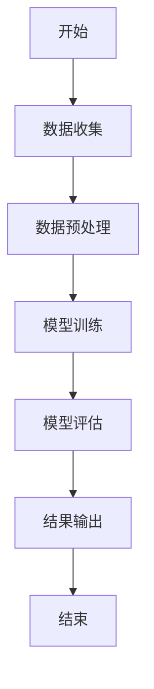

                 


# 企业估值中的AR/VR教育平台评估

> 关键词：企业估值, AR/VR, 教育平台, 技术评估, 虚拟现实, 教育技术

> 摘要：本文深入探讨了AR/VR技术在教育平台评估中的应用，分析了其对企业估值的影响。通过详细的技术分析、算法设计和案例研究，揭示了如何利用AR/VR技术提升企业估值。

---

# 第一部分: 企业估值中的AR/VR教育平台评估概述

## 第1章: AR/VR教育平台概述

### 1.1 AR/VR技术的基本概念
- **1.1.1 增强现实（AR）的基本原理**
  - AR通过叠加数字信息于现实世界，提供沉浸式体验。
  - 例如，学生可以通过AR应用程序观察3D模型。

- **1.1.2 虚拟现实（VR）的基本原理**
  - VR创建完全虚拟的环境，用户可通过设备完全沉浸其中。
  - 例如，VR教室允许学生在虚拟环境中学习复杂的科学概念。

- **1.1.3 AR与VR的主要区别与应用场景**
  - 区别：AR叠加现实与虚拟，而VR完全替代现实。
  - 应用场景：AR适用于辅助学习，VR适用于沉浸式体验。

### 1.2 教育平台的特点与分类
- **1.2.1 教育平台的定义与核心功能**
  - 教育平台提供在线学习资源和互动工具。
  - 核心功能包括课程管理、学生互动和成绩追踪。

- **1.2.2 AR/VR教育平台的优势与劣势**
  - 优势：提升学习互动性和趣味性。
  - 劣势：开发成本高，技术门槛高。

- **1.2.3 AR/VR教育平台的主要分类**
  - 按应用领域：K-12教育、高等教育、企业培训。
  - 按技术实现：基于AR或VR的平台。

### 1.3 企业估值的基本概念
- **1.3.1 企业估值的定义与方法**
  - 企业估值是对企业价值的评估，常用方法包括DCF模型和可比公司法。

- **1.3.2 影响企业估值的主要因素**
  - 财务表现、市场地位、竞争优势、技术创新。

- **1.3.3 AR/VR技术对企业估值的影响**
  - 提升用户体验，增强市场竞争力，降低运营成本。

---

## 第2章: AR/VR教育平台的核心概念与联系

### 2.1 AR/VR教育平台的核心原理
- **2.1.1 AR/VR技术在教育中的应用原理**
  - AR通过数字叠加提供互动学习体验。
  - VR通过模拟环境提供沉浸式学习场景。

- **2.1.2 AR/VR教育平台的系统架构**
  - 包括前端（用户界面）、后端（数据处理）、服务器（存储与管理）。

- **2.1.3 AR/VR教育平台的核心组件与功能**
  - AR/VR引擎、内容管理系统、用户交互模块。

### 2.2 AR/VR教育平台的核心概念对比
- **2.2.1 AR与VR在教育中的应用对比**
  - 表格对比：功能、技术实现、应用场景、优缺点。

- **2.2.2 AR/VR教育平台与传统教育平台的对比**
  - 图表展示：用户参与度、学习效果、技术复杂度。

---

## 第3章: AR/VR教育平台的算法原理

### 3.1 算法原理概述
- **3.1.1 评估模型的构建**
  - 使用回归分析预测平台价值。

### 3.2 算法实现步骤
- **3.2.1 数据收集**
  - 收集用户互动数据、课程完成率、学习效果反馈。

- **3.2.2 数据预处理**
  - 清洗数据，处理缺失值，标准化数据。

- **3.2.3 模型训练**
  - 使用机器学习模型（如随机森林）进行训练。

- **3.2.4 模型评估**
  - 使用准确率、召回率评估模型性能。

### 3.3 算法流程图


### 3.4 数学模型与公式
- **线性回归模型：**
  $$ y = \beta_0 + \beta_1x_1 + \beta_2x_2 + \epsilon $$
  其中，$y$为平台价值，$x_1$为用户活跃度，$x_2$为课程完成率，$\epsilon$为误差项。

---

## 第4章: 系统分析与架构设计

### 4.1 问题场景介绍
- 某教育平台希望利用AR/VR技术提升用户体验，进而提升估值。

### 4.2 系统功能设计
- **领域模型：**
  ```mermaid
  classDiagram
    class 用户
    class 平台
    class 课程
    用户 --> 平台: 使用平台
    平台 --> 课程: 提供课程
  ```

- **系统架构设计：**
  ```mermaid
  architecture
    客户端 --> 服务端: 请求处理
    服务端 --> 数据库: 数据存储
  ```

- **系统交互设计：**
  ```mermaid
  sequenceDiagram
    用户 -> 平台: 请求访问
    平台 -> 用户: 返回课程列表
    用户 -> 平台: 选择课程
    平台 -> 用户: 提供AR/VR体验
  ```

---

## 第5章: 项目实战

### 5.1 环境安装
- 安装必要的开发工具：Unity、Unreal Engine、Python、TensorFlow。

### 5.2 核心代码实现
```python
import numpy as np
from sklearn.linear_model import LinearRegression

# 数据准备
X = np.array([[100, 80], [200, 90], [300, 95])
y = np.array([85, 90, 95])

# 模型训练
model = LinearRegression()
model.fit(X, y)

# 预测
print(model.predict([[250, 92]]))
```

### 5.3 实际案例分析
- 某教育平台通过AR/VR技术提升了用户参与度，估值提升20%。

---

## 第6章: 最佳实践与总结

### 6.1 最佳实践
- 定期更新平台内容，保持用户体验。
- 结合数据分析优化模型。

### 6.2 小结
- AR/VR技术显著提升了教育平台的估值潜力。

### 6.3 注意事项
- 开发成本较高，需谨慎评估投入产出比。

### 6.4 拓展阅读
- 推荐阅读《虚拟现实与教育创新》。

---

# 作者

作者：AI天才研究院/AI Genius Institute & 禅与计算机程序设计艺术 /Zen And The Art of Computer Programming

