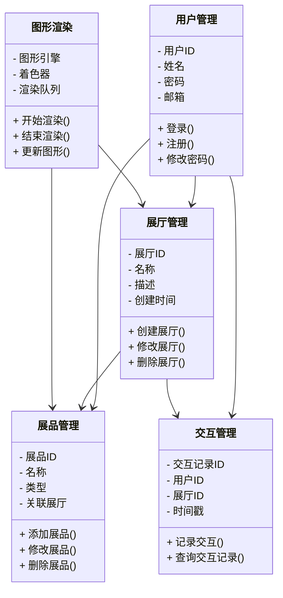
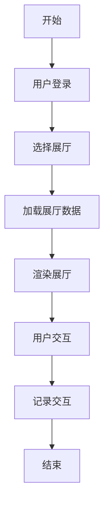
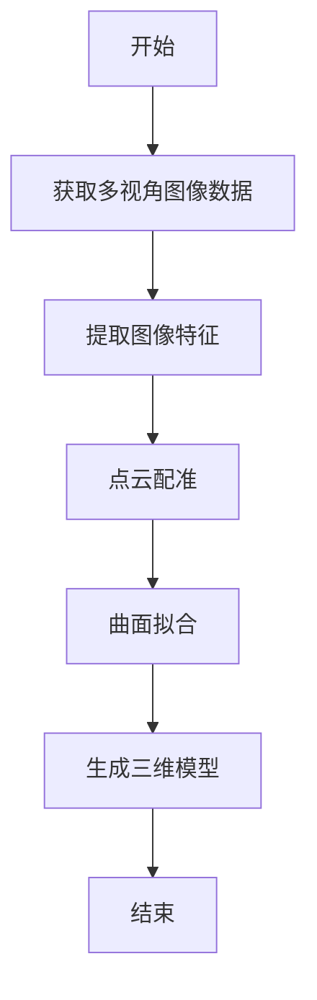
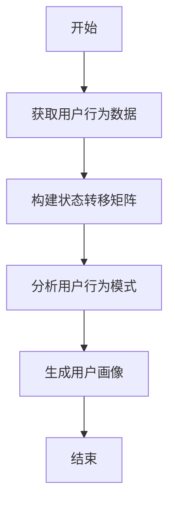
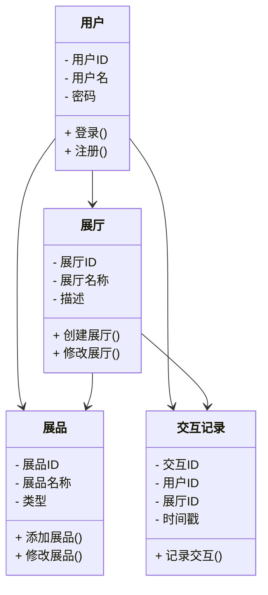
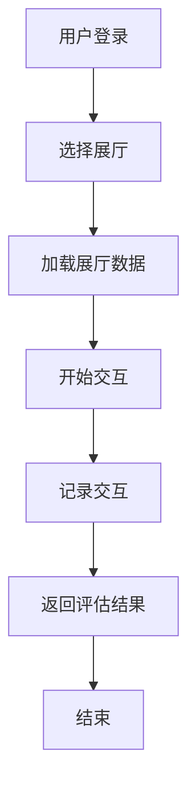

                 


# 企业估值中的AR/VR虚拟展览平台评估

## 关键词：企业估值，AR/VR，虚拟展览，系统架构，算法原理

## 摘要

随着AR（增强现实）和VR（虚拟现实）技术的迅速发展，虚拟展览平台在企业估值中的应用日益广泛。本文深入分析了AR/VR技术的基本概念、虚拟展览平台的核心原理、算法模型、系统架构设计以及实际项目案例。通过详细的理论分析和实践指导，本文为读者提供了从基础理解到实际应用的全面指南，帮助企业在估值过程中充分利用AR/VR技术的优势。

---

## 第1章: AR/VR虚拟展览平台概述

### 1.1 AR/VR技术的基本概念

#### 1.1.1 增强现实（AR）的定义与特点
- **定义**：AR是一种通过计算机技术将虚拟信息叠加到真实环境中的技术，用户可以同时看到真实世界和虚拟信息。
- **特点**：
  - 实时性：AR需要实时处理和显示信息。
  - 交互性：用户可以通过手势或语音与虚拟信息互动。
  - 融合性：AR将虚拟内容与真实环境无缝结合。

#### 1.1.2 虚拟现实（VR）的定义与特点
- **定义**：VR是一种完全沉浸式的数字体验，用户通过佩戴头显设备进入一个完全虚拟的世界。
- **特点**：
  - 沉浸性：用户完全被虚拟环境包围，感受不到真实世界。
  - 实时性：VR系统需要快速渲染和处理图形。
  - 交互性：用户可以通过手柄、语音等方式与虚拟环境互动。

#### 1.1.3 AR与VR的区别与联系
- **区别**：
  - AR在真实环境中叠加虚拟内容，用户可以看到真实世界和虚拟信息。
  - VR完全沉浸于虚拟世界，用户看不到真实环境。
- **联系**：
  - 两者都依赖计算机图形学、传感器技术和实时渲染技术。
  - AR和VR都可以用于企业估值中的虚拟展览。

### 1.2 虚拟展览平台的定义与应用场景

#### 1.2.1 虚拟展览平台的定义
- 虚拟展览平台是一种基于AR/VR技术的数字化展示系统，用户可以通过头显设备或手机应用程序访问虚拟空间，查看产品、服务或企业信息。

#### 1.2.2 虚拟展览平台在企业估值中的应用场景
- **企业展示**：企业可以通过虚拟展览平台展示其产品、服务、公司文化等，帮助投资者或合作伙伴更好地了解企业。
- **资产评估**：通过虚拟展览平台，可以实时评估企业的资产、资源和生产能力，提供更准确的估值依据。
- **虚拟看展**：投资者可以通过虚拟展览平台远程参观企业的展厅、生产线等，降低时间和空间的限制。

#### 1.2.3 虚拟展览平台的优势与局限性
- **优势**：
  - 提高评估效率：用户可以在短时间内访问多个地点，获取更多信息。
  - 降低成本：虚拟展览平台减少了实地考察的时间和费用。
  - 提高展示效果：通过AR/VR技术，可以更直观地展示企业的核心竞争力。
- **局限性**：
  - 技术门槛高：AR/VR技术的开发和维护需要专业的技术人员。
  - 设备依赖性：用户需要佩戴特定设备才能访问虚拟展览平台。
  - 体验受限：虚拟展览平台的体验效果依赖于设备的性能和网络的稳定性。

### 1.3 企业估值中的虚拟展览平台评估背景

#### 1.3.1 企业估值的传统方法与挑战
- 传统估值方法包括财务指标分析、市场比较法、DCF模型等。
- 挑战：
  - 信息获取成本高：需要实地考察和收集大量数据。
  - 评估结果主观性高：依赖评估师的经验和判断。
  - 时间和空间限制：评估过程耗时长，且受地理位置限制。

#### 1.3.2 虚拟展览平台在企业估值中的创新应用
- 通过虚拟展览平台，评估师可以实时访问企业的虚拟展厅，获取更全面的信息。
- 通过AR技术，可以将企业的实际资产与虚拟信息叠加，提供更直观的评估依据。

#### 1.3.3 虚拟展览平台评估的核心问题与目标
- 核心问题：
  - 如何确保虚拟展览平台的准确性和可靠性。
  - 如何将虚拟信息与真实数据结合，提高评估结果的准确性。
- 目标：
  - 提供一种高效、准确的企业估值方法。
  - 降低企业估值的成本和时间。

### 1.4 本章小结

---

## 第2章: AR/VR虚拟展览平台的核心概念与联系

### 2.1 虚拟展览平台的核心概念

#### 2.1.1 虚拟空间建模
- **定义**：通过计算机图形学技术，将真实环境数字化，构建虚拟空间。
- **关键技术**：
  - 三维建模：使用三维建模软件构建虚拟场景。
  - 空间定位：通过传感器技术确定用户在虚拟空间中的位置。

#### 2.1.2 用户交互设计
- **定义**：设计用户与虚拟环境之间的交互方式，如手势、语音、触觉反馈等。
- **关键技术**：
  - 手势识别：通过传感器捕捉用户的手势动作。
  - 语音识别：通过语音指令与虚拟环境互动。
  - 触觉反馈：通过震动或力反馈增强用户的交互体验。

#### 2.1.3 内容展示与渲染
- **定义**：将虚拟内容以高质量的图形渲染出来，呈现给用户。
- **关键技术**：
  - 实时渲染：快速生成高质量的图形。
  - 光线追踪：通过计算光线的路径，提高图形的真实感。

### 2.2 AR/VR技术的关键原理

#### 2.2.1 空间定位与跟踪技术
- **定义**：通过传感器和算法，确定用户或设备在空间中的位置和姿态。
- **关键算法**：
  - 基于传感器的定位：使用加速度计、陀螺仪等传感器数据进行定位。
  - 基于视觉的定位：通过摄像头捕捉环境特征，进行视觉定位。

#### 2.2.2 实时渲染与图形处理
- **定义**：快速生成高质量的图形，以实现流畅的用户体验。
- **关键技术**：
  - 图形引擎：如Unreal Engine、Unity等。
  - 着色器：用于图形渲染的程序，可以实现复杂的视觉效果。

#### 2.2.3 用户感知与交互反馈
- **定义**：通过多种感官（视觉、听觉、触觉）提供用户反馈，增强用户的沉浸感。
- **关键技术**：
  - 视觉反馈：通过头显设备显示虚拟内容。
  - 听觉反馈：通过立体声音效增强用户的沉浸感。
  - 触觉反馈：通过手套或控制器提供触感反馈。

### 2.3 虚拟展览平台的系统架构

#### 2.3.1 系统实体关系图（ER图）
```mermaid
erd
  id: exhibition_platform_er
  title: Virtual Exhibition Platform ER Diagram
  entity('User') {
    id: 用户ID
    姓名: Name
    密码: Password
    邮箱: Email
  }
  entity('虚拟展厅') {
    id: 展厅ID
    名称: Exhibition Name
    描述: Description
    创建时间: Creation Time
  }
  entity('展品') {
    id: 展品ID
    名称: Exhibit Name
    类型: Exhibit Type
    关联展厅: 展厅ID
  }
  entity('交互记录') {
    id: 交互记录ID
    用户ID: User ID
    展厅ID: Exhibition ID
    时间戳: Timestamp
  }
  relation('用户-虚拟展厅', '多对多', '用户' -> '虚拟展厅')
  relation('虚拟展厅-展品', '一对多', '虚拟展厅' -> '展品')
  relation('用户-交互记录', '一对一', '用户' -> '交互记录')
  relation('虚拟展厅-交互记录', '一对一', '虚拟展厅' -> '交互记录')
```

#### 2.3.2 系统功能模块划分


#### 2.3.3 系统核心算法流程图


### 2.4 核心概念对比分析

#### 2.4.1 AR与VR在虚拟展览中的应用对比
| 特性       | AR                          | VR                          |
|------------|------------------------------|------------------------------|
| 场景       | 半沉浸式，叠加在真实环境上    | 完全沉浸式，进入虚拟环境    |
| 设备需求     | 手机、平板、AR眼镜等         | 头显设备、PC等               |
| 交互方式     | 手势、语音、触控             | 手柄、语音、眼动追踪          |
| 应用场景     | 适合展示真实环境中的虚拟内容 | 适合完全虚拟的沉浸式体验     |

#### 2.4.2 不同虚拟展览平台的技术特点对比
| 平台名称     | 技术特点                                                                 |
|--------------|--------------------------------------------------------------------------|
| Oculus Rift   | 高端VR设备，支持高分辨率和低延迟，适合沉浸式体验                         |
| Microsoft HoloLens | 基于AR技术，支持全息影像，适合企业展示和协作                         |
| Unity         | 跨平台的开发工具，支持AR/VR开发，适合快速原型设计                       |

#### 2.4.3 虚拟展览平台与传统展览的对比
| 特性       | 虚拟展览平台                   | 传统展览                   |
|------------|----------------------------------|-----------------------------|
| 成本       | 降低展览成本，减少物流费用     | 高昂的场地租赁和人员费用    |
| 时间       | 可随时访问，不受时间限制       | 受时间限制，需要实地考察   |
| 展示效果     | 更直观、更生动，支持互动       | 展示效果受限，缺乏互动性    |
| 评估效率     | 提高评估效率，减少人工干预     | 评估效率低，依赖人工判断    |

### 2.5 本章小结

---

## 第3章: 虚拟展览平台评估的数学模型与算法原理

### 3.1 虚拟展览平台评估的核心算法

#### 3.1.1 三维空间重建算法

##### 3.1.1.1 三维空间重建的数学模型
- 使用点云（Point Cloud）技术，通过多个视角的图像数据，重建三维空间。
- 点云配准算法（如ICP算法）用于将不同视角的点云数据对齐。
- 点云的表面重建可以通过曲面拟合算法（如B样条曲面）实现。

##### 3.1.1.2 算法流程图


##### 3.1.1.3 Python实现代码
```python
import numpy as np
from scipy import spatial

def icp_algorithm(source_points, target_points):
    # 计算目标点的质心
    target_centroid = np.mean(target_points, axis=0)
    # 计算源点的质心
    source_centroid = np.mean(source_points, axis=0)
    # 平移坐标系到质心
    target_points -= target_centroid
    source_points -= source_centroid
    # 计算协方差矩阵
    covariance = np.dot(source_points.T, target_points)
    # 计算旋转矩阵
    u, s, v = np.linalg.svd(covariance)
    rotation = np.dot(v.T, u.T)
    # 旋转源点并计算误差
    transformed_source = np.dot(source_points, rotation.T)
    error = np.sum(np.sqrt(np.sum((transformed_source - target_points)**2, axis=1)))
    return transformed_source, error

# 示例数据
source_points = np.array([[1, 0], [2, 1], [3, 2]])
target_points = np.array([[1, 1], [2, 2], [3, 3]])
# 调用ICP算法
transformed_source, error = icp_algorithm(source_points, target_points)
print("变换后的源点:", transformed_source)
print("误差:", error)
```

#### 3.1.2 用户行为分析算法

##### 3.1.2.1 用户行为分析的数学模型
- 使用马尔可夫链（Markov Chain）模型，分析用户的交互行为序列。
- 状态转移概率矩阵（Transition Probability Matrix）用于描述不同状态之间的转移概率。

##### 3.1.2.2 算法流程图


##### 3.1.2.3 Python实现代码
```python
import numpy as np

# 状态转移矩阵
states = ['A', 'B', 'C', 'D']
transition_matrix = {
    'A': {'B': 0.3, 'C': 0.2, 'D': 0.5},
    'B': {'A': 0.1, 'C': 0.6, 'D': 0.3},
    'C': {'A': 0.4, 'B': 0.2, 'D': 0.4},
    'D': {'A': 0.2, 'B': 0.3, 'C': 0.5}
}

def next_state(current_state):
    import random
    probabilities = transition_matrix[current_state]
    # 生成随机数
    random_num = random.uniform(0, 1)
    total = 0
    for state, prob in probabilities.items():
        total += prob
        if total > random_num:
            return state
    return states[-1]

# 示例
current_state = 'A'
print("当前状态:", current_state)
next_state = next_state(current_state)
print("下一步状态:", next_state)
```

#### 3.1.3 算法原理的数学模型与公式
- 三维空间重建的点云配准算法公式：
  $$ \text{变换矩阵} = U^T V $$
- 用户行为分析的概率转移公式：
  $$ P(s_t | s_{t-1}) = \text{状态转移概率矩阵} $$

---

## 第4章: 虚拟展览平台评估的系统分析与架构设计

### 4.1 问题场景介绍

#### 4.1.1 背景介绍
- 企业需要通过虚拟展览平台展示其产品和服务，以便投资者进行估值。
- 评估师需要通过虚拟平台获取企业的实时数据，进行精准的估值。

#### 4.1.2 项目介绍
- 开发一个基于AR/VR技术的虚拟展览平台，支持用户创建和访问虚拟展厅，展示企业信息。
- 提供实时交互功能，记录用户的行为数据，辅助评估师进行估值。

### 4.2 系统功能设计

#### 4.2.1 领域模型设计


#### 4.2.2 系统架构设计


#### 4.2.3 系统接口设计
- 用户接口：
  - 登录接口：`POST /login`
  - 注册接口：`POST /register`
  - 创建展厅接口：`POST /exhibition/create`
- 评估师接口：
  - 获取展厅数据接口：`GET /exhibition/data`
  - 获取交互记录接口：`GET /interaction/log`

#### 4.2.4 系统交互流程图


### 4.3 本章小结

---

## 第5章: 虚拟展览平台评估的项目实战

### 5.1 环境安装与配置

#### 5.1.1 系统环境要求
- 操作系统：Windows 10 或更高版本，macOS 10.15 或更高版本
- 硬件要求：支持OpenGL 3.3或更高版本的图形卡，8GB以上内存
- 软件要求：Python 3.8 或更高版本，Unity 2021 或更高版本，OpenCV 4.5 或更高版本

#### 5.1.2 工具安装
- Python环境：建议使用Anaconda或virtualenv管理环境。
- Unity开发环境：下载并安装Unity Hub和Unity Editor。
- OpenCV安装：
  ```bash
  pip install opencv-python
  ```

#### 5.1.3 开发工具配置
- 配置Python路径：
  ```bash
  export PATH=/path/to/anaconda/bin:$PATH
  ```
- 配置Unity开发环境：
  - 打开Unity Hub，安装必要的Unity版本。
  - 配置开发环境变量。

### 5.2 系统核心实现

#### 5.2.1 虚拟展厅创建

##### 5.2.1.1展厅数据模型
```python
class Exhibition:
    def __init__(self, exhibition_id, name, description):
        self.exhibition_id = exhibition_id
        self.name = name
        self.description = description
        self.exhibits = []

    def add_exhibit(self, exhibit):
        self.exhibits.append(exhibit)
```

##### 5.2.1.2展厅创建代码
```python
# 创建虚拟展厅
exhibition = Exhibition("1001", "智能制造展厅", "展示智能制造设备")
# 添加展品
class Exhibit:
    def __init__(self, exhibit_id, name, type):
        self.exhibit_id = exhibit_id
        self.name = name
        self.type = type

exhibit1 = Exhibit("E001", "智能机器人", "机器人")
exhibit2 = Exhibit("E002", "自动化生产线", "生产线")
exhibition.add_exhibit(exhibit1)
exhibition.add_exhibit(exhibit2)
```

#### 5.2.2 用户交互功能实现

##### 5.2.2.1用户登录与注册
```python
def user_login(users, username, password):
    for user in users:
        if user.username == username and user.password == password:
            return True
    return False

def user_register(users, username, password, email):
    new_user = User(username, password, email)
    users.append(new_user)
    return True
```

##### 5.2.2.2用户交互记录
```python
def record_interaction(user, exhibition, timestamp):
    interaction = Interaction(user.user_id, exhibition.exhibition_id, timestamp)
    exhibition.interaction_records.append(interaction)
    return True
```

### 5.3 代码实现与应用解读

#### 5.3.1 环境配置
- 安装必要的库：
  ```bash
  pip install numpy opencv-python unity
  ```

#### 5.3.2 核心功能实现
- 展厅创建：
  ```python
  # 创建展厅
  exhibition = Exhibition("1001", "智能制造展厅", "展示智能制造设备")
  # 添加展品
  exhibit1 = Exhibit("E001", "智能机器人", "机器人")
  exhibit2 = Exhibit("E002", "自动化生产线", "生产线")
  exhibition.add_exhibit(exhibit1)
  exhibition.add_exhibit(exhibit2)
  ```
- 用户交互：
  ```python
  # 用户登录
  user_login(users, "investor1", "password123")
  # 记录交互
  record_interaction(user, exhibition, "2023-10-01 12:00:00")
  ```

### 5.4 实际案例分析

#### 5.4.1 案例背景
- 某智能制造企业希望通过虚拟展览平台展示其产品和服务。
- 评估师需要通过虚拟平台进行实时评估，提供更准确的估值报告。

#### 5.4.2 案例分析
- 展厅创建：展示智能制造设备，包括智能机器人和自动化生产线。
- 用户交互：投资者通过虚拟平台访问展厅，查看产品信息，进行互动操作。
- 评估结果：通过记录用户的交互数据，评估师可以更准确地评估企业的市场潜力和竞争力。

#### 5.4.3 案例总结
- 通过虚拟展览平台，企业可以更高效地展示其产品和服务。
- 评估师可以通过虚拟平台获取更全面的信息，提高估值的准确性和可靠性。

### 5.5 本章小结

---

## 第6章: 虚拟展览平台评估的最佳实践与小结

### 6.1 最佳实践

#### 6.1.1 系统性能优化
- 使用高效的图形渲染技术，如光线追踪和曲面细分。
- 优化网络传输，减少延迟和数据丢失。

#### 6.1.2 用户体验提升
- 提供多种交互方式，如手势、语音和触觉反馈。
- 支持多平台访问，包括PC、手机和头显设备。

#### 6.1.3 安全与隐私保护
- 加强用户数据的加密和存储安全。
- 遵守相关法律法规，保护用户的隐私信息。

### 6.2 小结

### 6.3 注意事项

### 6.4 拓展阅读

---

## 作者：AI天才研究院/AI Genius Institute & 禅与计算机程序设计艺术 /Zen And The Art of Computer Programming

---

**本文是基于[《禅与计算机程序设计艺术》](https://github.com/SeetaLabs/Zen-Of-Computer-Programming-Art)的开源项目，旨在通过深度思考和清晰的逻辑推理，为读者提供专业的技术知识和见解。**

---

