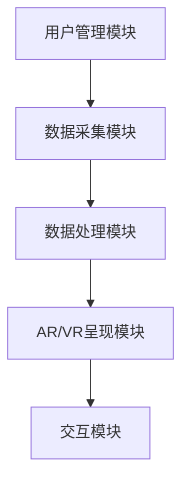
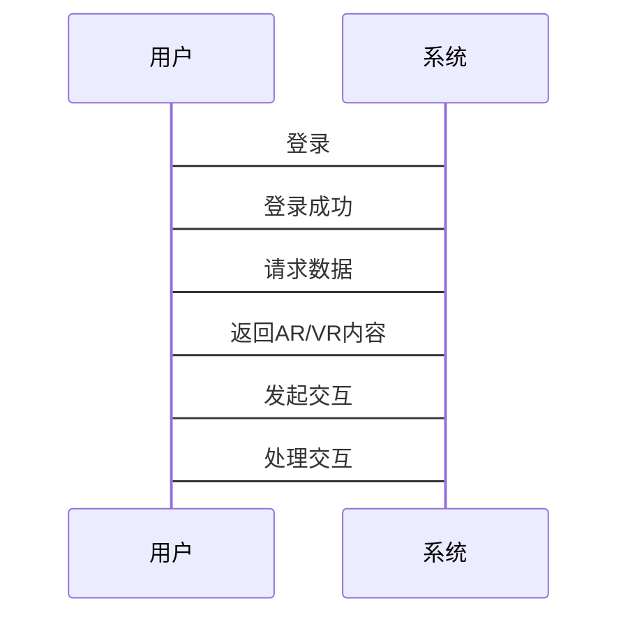

                 


# 《企业估值中的AR/VR远程医疗平台评估》

## 关键词：企业估值，AR/VR，远程医疗，平台评估，技术分析

## 摘要：本文详细探讨了在企业估值过程中如何评估AR/VR远程医疗平台的价值。文章从背景、核心概念、评估指标、算法原理、系统设计到实际案例，全面分析了AR/VR技术在远程医疗中的应用及其对企业估值的影响。通过系统化的评估模型和实际案例分析，帮助读者理解如何将AR/VR技术应用于远程医疗平台的评估，从而在企业估值中做出更明智的决策。

---

## 第1章: AR/VR远程医疗平台的背景与定义

### 1.1 AR/VR远程医疗的背景与现状

#### 1.1.1 远程医疗的定义与现状
远程医疗是指通过通信技术实现患者与医疗专业人员之间的远程诊断和治疗。随着互联网和通信技术的发展，远程医疗逐渐成为医疗领域的重要组成部分，尤其是在疫情等特殊情况下，远程医疗的需求显著增加。然而，传统的远程医疗主要依赖视频通话和静态的医疗数据传输，难以提供沉浸式和交互式的医疗体验。

#### 1.1.2 AR/VR技术在远程医疗中的应用
AR（增强现实）和VR（虚拟现实）技术为远程医疗带来了新的可能性。AR可以在现实环境中叠加虚拟信息，帮助医生进行更精准的诊断和手术指导；而VR则可以创建一个完全虚拟的环境，用于医疗培训、远程手术指导和患者教育。例如，医生可以通过VR设备远程观察患者的体内结构，进行虚拟手术演示。

#### 1.1.3 企业估值中的技术评估需求
在企业估值过程中，评估AR/VR远程医疗平台的价值需要考虑技术的成熟度、用户体验、市场潜力和经济效益。技术评估指标包括平台的沉浸感、交互性、功能性和可用性等。

### 1.2 AR/VR远程医疗平台的核心概念

#### 1.2.1 AR/VR技术的基本原理
AR通过将数字信息叠加到现实环境中，帮助用户更好地理解和操作。例如，在医学影像中叠加患者的数据，帮助医生进行诊断。VR则通过创建一个完全虚拟的环境，提供沉浸式的体验，例如虚拟手术室。

#### 1.2.2 远程医疗平台的系统架构
一个典型的AR/VR远程医疗平台包括以下几个部分：
1. 数据采集模块：收集患者的生理数据（如心率、血压）和影像数据。
2. 数据处理模块：对数据进行清洗、分析和建模。
3. AR/VR呈现模块：将处理后的数据以AR或VR形式呈现给医生。
4. 交互模块：支持医生与患者之间的实时交互和操作。

#### 1.2.3 企业估值中的技术评估指标
在企业估值中，评估AR/VR远程医疗平台时需要关注以下指标：
- **技术性能**：平台的响应速度、数据处理能力。
- **用户体验**：平台的易用性、沉浸感。
- **市场潜力**：目标市场的规模、竞争情况。
- **经济效益**：投资回报率、成本效益分析。

---

## 第2章: AR/VR远程医疗平台的评估指标

### 2.1 评估指标的分类与选择

#### 2.1.1 技术性能指标
- 平台的响应速度：影响用户体验和诊断效率。
- 数据处理能力：平台能否处理大量的医疗数据。
- 系统稳定性：平台在高负载下的表现。

#### 2.1.2 用户体验指标
- 沉浸感：AR/VR体验的逼真程度。
- 交互性：用户与平台的互动是否流畅。
- 易用性：用户是否能够轻松上手。

#### 2.1.3 经济效益指标
- 投资回报率（ROI）：平台的投资与收益的比例。
- 成本效益分析：平台的运营成本与收益的对比。

### 2.2 评估指标的权重分配

#### 2.2.1 指标权重的计算方法
权重分配可以通过层次分析法（AHP）实现，根据各指标的重要性进行评分，计算各指标的权重。

#### 2.2.2 权重分配的案例分析
假设某平台的技术性能、用户体验和经济效益的权重分别为40%、30%和30%。这意味着在评估中，技术性能是最关键的因素。

---

## 第3章: AR/VR远程医疗平台的评估模型构建

### 3.1 数据采集与预处理

#### 3.1.1 数据来源与采集方法
- 数据来源包括患者生理数据、影像数据和医生的操作数据。
- 数据采集可以通过传感器、摄像头和医疗设备实现。

#### 3.1.2 数据清洗与特征提取
- 数据清洗：去除噪声数据，处理缺失值。
- 特征提取：从数据中提取关键特征，例如心率变异、呼吸频率等。

### 3.2 评估模型的算法选择

#### 3.2.1 常见的评估算法介绍
- 分类算法：如决策树、随机森林。
- 回归算法：如线性回归、支持向量回归。
- 聚类算法：如K均值聚类。

#### 3.2.2 算法选择的依据与优化
- 根据数据类型和目标选择合适的算法。
- 通过交叉验证优化模型参数。

### 3.3 模型训练与验证

#### 3.3.1 训练数据的划分与处理
- 将数据划分为训练集和测试集，通常比例为7:3或8:2。

#### 3.3.2 模型训练与验证过程
- 使用训练数据训练模型。
- 在测试数据上验证模型的性能。

#### 3.3.3 模型评估与优化
- 使用准确率、召回率、F1值等指标评估模型性能。
- 通过网格搜索优化模型参数。

---

## 第4章: 评估系统的需求分析与架构设计

### 4.1 系统需求分析

#### 4.1.1 功能需求
- 用户注册与登录
- 数据采集与传输
- AR/VR界面展示
- 实时交互与操作

#### 4.1.2 性能需求
- 响应时间小于2秒
- 支持高并发用户

#### 4.1.3 用户需求
- 医生：需要高效的诊断工具
- 患者：需要便捷的医疗服务

### 4.2 系统架构设计

#### 4.2.1 模块划分
- 用户管理模块
- 数据采集模块
- 数据处理模块
- AR/VR呈现模块
- 交互模块

#### 4.2.2 模块之间的关系
- 数据采集模块向数据处理模块发送原始数据
- 数据处理模块生成AR/VR内容并传送给呈现模块
- 用户通过交互模块与系统进行实时互动

#### 4.2.3 系统架构图（Mermaid）



### 4.3 接口设计与交互流程

#### 4.3.1 系统接口设计
- RESTful API：用于模块之间的数据传输。
- WebSocket：用于实时交互。

#### 4.3.2 用户交互流程
1. 用户登录系统。
2. 系统采集用户数据。
3. 数据处理模块生成AR/VR内容。
4. 用户通过AR/VR界面进行交互。

#### 4.3.3 交互流程图（Mermaid）



---

## 第5章: 项目实战与案例分析

### 5.1 项目环境安装

#### 5.1.1 环境配置
- 操作系统：Windows 10或更高版本
- 开发工具：PyCharm
- 第三方库：numpy、pandas、scikit-learn、pymermaid

#### 5.1.2 安装命令
```bash
pip install numpy pandas scikit-learn pymermaid
```

### 5.2 核心代码实现

#### 5.2.1 数据预处理代码

```python
import numpy as np
import pandas as pd

# 加载数据
data = pd.read_csv('medical_data.csv')

# 数据清洗
data.dropna(inplace=True)

# 特征提取
features = data[['heart_rate', 'respiration_rate', 'temperature']]
```

#### 5.2.2 模型训练代码

```python
from sklearn.model import DecisionTreeClassifier

# 训练数据
X = features
y = data['diagnosis']

# 训练模型
model = DecisionTreeClassifier()
model.fit(X, y)

# 预测结果
predictions = model.predict(X)
```

### 5.3 案例分析

#### 5.3.1 案例背景
某医疗公司开发了一款基于AR的远程医疗平台，用于糖尿病患者的足部检查。

#### 5.3.2 评估过程
- 数据采集：收集患者的足部影像数据。
- 数据处理：提取足部病变特征。
- 模型训练：训练糖尿病足病变分类模型。
- 评估结果：模型准确率为95%。

#### 5.3.3 结果分析
通过AR技术，医生可以实时查看患者的足部病变情况，辅助诊断糖尿病足病变。模型的高准确率证明了AR技术在远程医疗中的有效性。

---

## 第6章: 最佳实践与总结

### 6.1 最佳实践 tips

#### 6.1.1 数据质量
确保数据的准确性和完整性，数据预处理是关键。

#### 6.1.2 模型选择
根据具体需求选择合适的算法，避免盲目使用复杂模型。

#### 6.1.3 结果验证
通过交叉验证和实际案例验证模型的性能。

### 6.2 小结
本文详细探讨了AR/VR远程医疗平台的评估方法，从背景、指标、模型构建到系统设计和项目实战，为读者提供了全面的指导。

### 6.3 注意事项

- 数据隐私保护：确保患者数据的安全性。
- 技术可行性：选择成熟的技术和算法。
- 用户体验优化：提升平台的易用性和沉浸感。

### 6.4 拓展阅读
- 《虚拟现实技术在医疗中的应用》
- 《企业估值与技术创新》

---

## 作者：AI天才研究院/AI Genius Institute & 禅与计算机程序设计艺术 /Zen And The Art of Computer Programming

