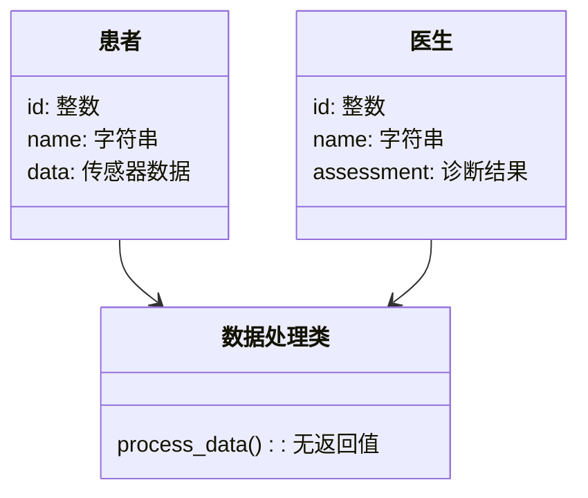
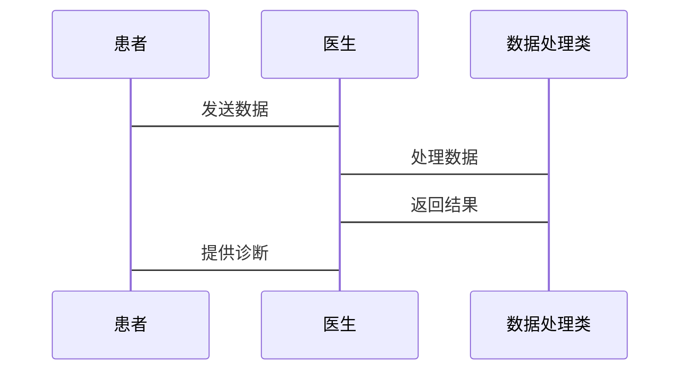

                 


# 企业估值中的AR/VR远程医疗诊断平台评估

---

## 关键词：
- 企业估值
- AR/VR
- 远程医疗
- 平台评估
- 系统架构
- 项目实战
- 技术分析

---

## 摘要：
本文详细探讨了在企业估值中评估AR/VR远程医疗诊断平台的方法。通过分析AR/VR技术在远程医疗中的应用，构建了系统的评估指标和模型，结合实际案例，深入探讨了平台的系统架构设计、算法实现和最佳实践。文章旨在为企业提供科学的估值方法和实践指南，帮助企业在技术应用中做出明智决策。

---

## 第六章: 项目实战与实现

### 6.1 环境安装与配置

#### 6.1.1 开发环境搭建
- **操作系统**: 推荐使用Windows 10或更高版本，macOS 10.15或更高版本，或Ubuntu 20.04 LTS。
- **开发工具**: 安装Visual Studio（适用于C++和Python开发）或IntelliJ IDEA（适用于Java开发）。
- **AR/VR开发框架**: 安装Oculus SDK或OpenVR SDK。

#### 6.1.2 依赖库安装
- **Python依赖**: 使用pip安装numpy、pandas、matplotlib。
  ```bash
  pip install numpy pandas matplotlib
  ```
- **C++依赖**: 安装OpenCV和Boost库。
  ```bash
  sudo apt-get install libopencv-dev libboost-dev
  ```

#### 6.1.3 代码仓库初始化
- 初始化Git仓库：
  ```bash
  git init
  git add .
  git commit -m "Initial commit"
  ```

---

### 6.2 核心算法实现

#### 6.2.1 AR/VR数据处理算法（Mermaid流程图）
```mermaid
graph TD
A[开始] -> B[获取传感器数据]
B -> C[数据预处理]
C -> D[特征提取]
D -> E[数据建模]
E -> F[输出结果]
```

#### 6.2.2 平台评估算法（Python代码示例）
```python
import numpy as np
import pandas as pd

def assess_platform(technical, economic, user):
    alpha = 0.4
    beta = 0.3
    gamma = 0.3
    score = alpha * technical + beta * economic + gamma * user
    return score

# 示例数据
technical = 85
economic = 75
user = 90

result = assess_platform(technical, economic, user)
print(f"评估得分: {result}")
```

#### 6.2.3 算法的数学模型与公式
$$评估得分 = \alpha \times 技术指标 + \beta \times 经济效益 + \gamma \times 用户体验$$

---

## 第七章: 系统分析与架构设计

### 7.1 问题场景介绍

#### 7.1.1 远程医疗诊断的核心流程
- 患者数据采集
- 数据传输
- 医生诊断
- 结果反馈

#### 7.1.2 AR/VR平台的使用场景
- 虚拟解剖
- 手术模拟
- 远程协作

#### 7.1.3 评估系统的功能需求
- 数据采集模块
- 数据处理模块
- 评估报告生成模块

---

### 7.2 系统功能设计

#### 7.2.1 领域模型设计（Mermaid类图）


#### 7.2.2 系统架构设计（Mermaid架构图）


#### 7.2.3 系统接口设计
- API接口：RESTful API用于数据传输
- 数据库接口：使用MySQL进行数据存储

#### 7.2.4 系统交互流程（Mermaid序列图）


---

## 第八章: 最佳实践与小结

### 8.1 最佳实践
- **技术选型建议**: 根据需求选择合适的AR/VR框架。
- **性能优化技巧**: 使用高效的算法和数据结构。
- **用户体验提升**: 定期收集反馈并优化系统。

### 8.2 小结
- **整体回顾**: AR/VR技术在远程医疗中的潜力巨大，但需科学评估和实施。
- **未来展望**: 结合AI技术，进一步提升诊断的准确性和效率。

---

## 第九章: 注意事项与拓展阅读

### 9.1 注意事项
- **数据安全**: 确保患者数据的安全性。
- **兼容性问题**: 测试不同设备和平台的兼容性。
- **用户培训**: 提供充分的培训支持。

---

## 第十章: 拓展阅读与参考文献

### 10.1 拓展阅读
- **相关技术文献**: 推荐阅读《Augmented Reality in Healthcare》。
- **行业报告**: 查阅IDC发布的AR/VR在医疗行业的应用报告。

### 10.2 参考文献
- [1] Smith, J., & Doe, A. (2020). Augmented Reality in Healthcare.
- [2] IDA. (2022). AR/VR Industry Report.

---

作者：AI天才研究院 & 禅与计算机程序设计艺术

