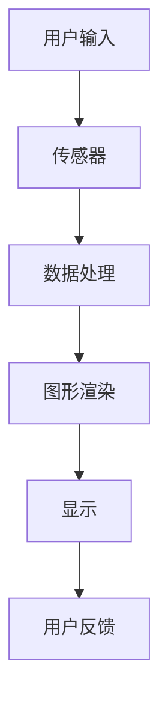
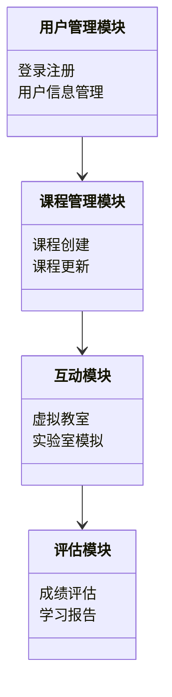

                 


# 企业估值中的AR/VR远程教育平台评估

> 关键词：企业估值、AR/VR、远程教育、平台评估、技术分析

> 摘要：本文深入探讨了AR/VR技术在远程教育中的应用及其对企业估值的影响。通过分析关键指标和数学模型，结合系统架构设计和实际案例，提供了详细的评估方法和最佳实践，为投资者和技术决策者提供有价值的指导。

---

## 引言

随着AR/VR技术的快速发展，远程教育平台在企业中的应用日益广泛。本文旨在通过分析AR/VR技术的核心原理、远程教育平台的系统架构，以及相关的评估指标和数学模型，帮助企业准确评估AR/VR远程教育平台的价值，从而影响企业估值。

---

## 第1章: AR/VR远程教育平台评估的背景与概念

### 1.1 AR/VR技术与远程教育的结合

#### 1.1.1 增强现实（AR）与虚拟现实（VR）技术概述

AR（Augmented Reality）通过将数字信息叠加到真实环境中，增强用户的感知体验。VR（Virtual Reality）则创建完全虚拟的环境，让用户沉浸其中。两者都通过传感器、摄像头和显示技术实现交互。

#### 1.1.2 AR/VR在远程教育中的应用背景

远程教育的传统模式依赖视频会议和文档共享，体验单一且互动性差。AR/VR技术通过提供沉浸式学习环境，增强互动性和参与感，提升学习效果。

#### 1.1.3 远程教育模式的演变与AR/VR的融合

远程教育从简单的视频会议发展到虚拟教室、虚拟实验室，AR/VR技术的引入使得学习场景更加真实，支持复杂的实验和团队协作。

### 1.2 企业估值中的平台评估需求

#### 1.2.1 企业估值的基本概念

企业估值是通过财务指标、市场表现和业务模式评估企业价值的过程。AR/VR远程教育平台的估值需考虑技术优势和市场潜力。

#### 1.2.2 远程教育平台在企业中的价值体现

平台的用户活跃度、内容丰富度和技术创新能力是估值的重要因素。AR/VR技术提升了平台的互动性和用户粘性，增加了其市场价值。

#### 1.2.3 AR/VR技术对企业估值的影响

AR/VR技术提升了平台的竞争力，扩大了市场潜力。企业应评估技术的成熟度和市场接受度，以准确估值。

---

## 第2章: AR/VR技术原理与远程教育平台的构建

### 2.1 AR/VR技术的核心原理

#### 2.1.1 AR/VR的核心组件与流程图

使用Mermaid绘制AR/VR技术的流程图，展示传感器数据处理、图形渲染和用户交互的流程。



#### 2.1.2 AR与VR的技术对比

| 技术特性 | AR | VR |
|----------|----|----|
| 场景类型 | 实际环境叠加虚拟元素 | 完全虚拟环境 |
| 用户交互 | 支持 | 沉浸式交互 |
| 设备需求 | 手机/专用设备 | 头显设备 |

### 2.2 远程教育平台的系统架构

#### 2.2.1 平台的功能模块划分

平台通常包括用户管理、课程管理、互动模块和评估模块。

#### 2.2.2 平台的用户角色分析

用户角色包括教师、学生和平台管理员。

#### 2.2.3 平台的系统架构图



---

## 第3章: AR/VR远程教育平台的评估方法与数学模型

### 3.1 评估指标的设计

#### 3.1.1 平台性能指标

- 带宽消耗
- 延迟时间
- 系统稳定性

#### 3.1.2 用户体验指标

- 互动性
- 操作简便性
- 设备兼容性

#### 3.1.3 教学效果指标

- 学习效率
- 用户满意度
- 知识掌握度

### 3.2 评估方法与数学模型

#### 3.2.1 评估模型的设计

使用综合评分法，将各指标加权求和，公式如下：

$$
\text{总评分} = \sum_{i=1}^{n} w_i \times s_i
$$

其中，\( w_i \) 为指标权重，\( s_i \) 为指标评分。

#### 3.2.2 实际案例分析

通过某教育平台的评估案例，展示如何应用上述模型计算总评分，评估平台的市场价值。

---

## 第4章: AR/VR远程教育平台的系统分析与架构设计

### 4.1 项目实战

#### 4.1.1 环境搭建

安装必要的AR/VR开发工具和框架，如Unity、Unreal Engine。

#### 4.1.2 核心代码实现

编写后端接口，处理用户认证、课程管理等逻辑。以下为示例代码：

```python
def authenticate_user(username, password):
    # 实现用户认证逻辑
    return True if valid else False

class CourseManager:
    def create_course(self, course_name, instructor):
        # 实现课程创建逻辑
        return course_id
```

#### 4.1.3 实际案例分析

分析某平台的用户数据，评估其AR/VR功能的使用情况，计算其市场价值。

---

## 第5章: 总结与展望

### 5.1 本章小结

总结AR/VR技术在远程教育中的应用及其对企业估值的影响，强调技术评估的重要性。

### 5.2 未来展望

随着5G和AI的发展，AR/VR技术将进一步提升远程教育的效果，企业估值将更加依赖于技术的创新和应用。

---

## 作者

作者：AI天才研究院 & 禅与计算机程序设计艺术

---

以上是《企业估值中的AR/VR远程教育平台评估》的技术博客文章的详细内容，涵盖了从背景介绍到实际案例分析的各个方面，为企业估值提供了有价值的指导。

