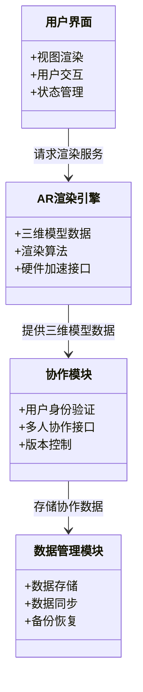
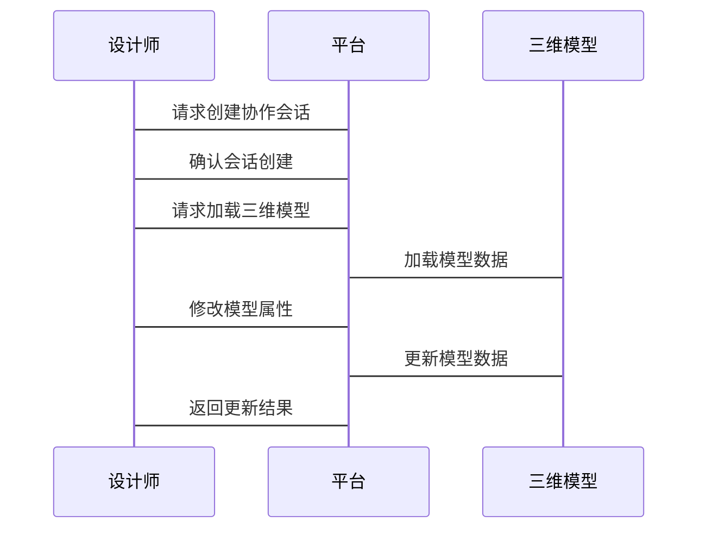

                 


# 企业估值中的AR工业设计协作平台评估

> 关键词：企业估值, AR技术, 工业设计协作, 平台评估, 层次分析法, 数学模型, 系统架构

> 摘要：本文探讨了AR技术在工业设计协作中的应用，通过构建评估模型和方法，分析其对企业估值的影响。文章从背景、核心概念、算法原理、系统架构到项目实战，详细阐述了AR工业设计协作平台的评估过程，并提供了实际案例分析和未来展望。

---

## 第一部分：背景介绍

### 1.1 AR技术的基本概念与发展历程

#### 1.1.1 增强现实（AR）的定义与技术原理
- AR（Augmented Reality）通过将数字信息叠加在物理世界中，提供沉浸式的交互体验。
- 技术原理包括计算机视觉、三维建模、实时渲染和传感器融合。

#### 1.1.2 AR技术在工业设计中的应用场景
- 实时协作设计：设计师可以通过AR技术进行实时三维模型查看和编辑。
- 沉浸式体验：提供更直观的设计和模拟环境，提升设计效率。

#### 1.1.3 AR技术对企业估值的影响
- 提高设计效率和准确性，降低协作成本。
- 通过实时协作和沉浸式体验，提升企业竞争力和市场价值。

### 1.2 工业设计协作平台的现状与挑战

#### 1.2.1 工业设计协作的传统模式与痛点
- 传统协作模式依赖于二维图纸和面对面沟通，效率低且容易出错。
- 需要频繁的沟通和多次修改，导致时间和资源浪费。

#### 1.2.2 AR技术如何解决协作中的问题
- 提供实时三维可视化，减少沟通误差。
- 支持多人异地协作，降低时间和空间成本。

#### 1.2.3 AR工业设计协作平台的市场前景
- 随着AR技术的成熟，市场对高效协作工具的需求增加。
- 平台可以应用于汽车、建筑、电子等领域，市场潜力巨大。

### 1.3 AR工业设计协作平台的核心价值

#### 1.3.1 提高设计效率与准确性
- 通过实时渲染和三维模型，设计师可以快速验证和修改设计。
- 减少设计错误，提高产品质量。

#### 1.3.2 降低沟通成本与协作障碍
- 支持多人异地协作，减少面对面会议的需求。
- 提供统一的协作平台，避免信息不对称。

#### 1.3.3 增强设计的可视化与沉浸式体验
- AR技术提供更直观的设计和模拟环境，帮助设计师更好地理解设计。
- 提供沉浸式体验，提升设计灵感和创意。

---

## 第二部分：核心概念与联系

### 2.1 AR工业设计协作平台的核心要素

| 核心要素       | 属性特征             | 作用               |
|----------------|----------------------|--------------------|
| AR渲染引擎     | 实时渲染、高精度     | 提供沉浸式设计体验 |
| 协作模块       | 多人协作、异地支持   | 提高协作效率       |
| 数据管理模块   | 数据存储、版本控制   | 确保数据安全与一致 |
| 用户界面       | 直观、易用           | 提高用户体验       |

### 2.2 AR工业设计协作平台的实体关系图

```mermaid
erDiagram
    actor 设计师
    actor 管理员
    class 平台
    class 三维模型
    class 用户数据
    class 操作记录
    
    设计师 --> 平台: 使用平台进行设计协作
    设计师 --> 三维模型: 创建或编辑三维模型
    设计师 --> 操作记录: 记录协作过程
    管理员 --> 平台: 管理平台运行
    平台 --> 用户数据: 存储用户信息
```

---

## 第三部分：算法原理

### 3.1 层次分析法（AHP）的应用

#### 3.1.1 评估指标的权重分配

| 评估指标         | 权重 |
|------------------|------|
| 技术性能         | 0.4  |
| 用户体验         | 0.3  |
| 安全性与数据保护 | 0.3  |

#### 3.1.2 评估模型的构建与验证

使用层次分析法（AHP）构建评估模型，通过案例分析验证模型的有效性。

#### 3.1.3 通过案例分析验证评估模型的有效性

案例分析：某汽车制造企业的AR设计协作平台评估，结果显示技术性能对平台价值的贡献最大，其次是用户体验，最后是安全性。

---

## 第四部分：系统分析与架构设计方案

### 4.1 系统功能设计

#### 4.1.1 领域模型设计



#### 4.1.2 系统架构设计


#### 4.1.3 系统接口设计

API接口：
- `/api/render`: 调用AR渲染引擎。
- `/api/collaborate`: 初始化协作会话。
- `/api/save`: 保存协作数据。

#### 4.1.4 系统交互设计



---

## 第五部分：项目实战

### 5.1 环境安装

#### 5.1.1 安装Python环境
- 使用Anaconda或虚拟环境安装Python 3.8及以上版本。

#### 5.1.2 安装依赖库
- 安装numpy、pandas、scipy等科学计算库。

#### 5.1.3 安装AR开发框架
- 使用OpenCV、ARKit、或ARCore等框架。

### 5.2 核心代码实现

#### 5.2.1 层次分析法的实现

```python
import numpy as np

def calculate_weights(criteria_matrix):
    eig, vec = np.linalg.eig(criteria_matrix)
    weights = eig / np.sum(eig)
    return weights

criteria_matrix = np.array([
    [1, 0.5, 0.8],
    [0.5, 1, 0.6],
    [0.8, 0.6, 1]
])

weights = calculate_weights(criteria_matrix)
print(weights)
```

#### 5.2.2 协作模块的实现

```python
class Collaborator:
    def __init__(self, user_id):
        self.user_id = user_id
        self.active = False

    def join_session(self, session_id):
        self.session_id = session_id
        self.active = True

    def leave_session(self):
        self.session_id = None
        self.active = False

collaborator = Collaborator(1)
collaborator.join_session(123)
print(collaborator.active)  # 输出: True
```

#### 5.2.3 系统功能实现

```python
import os

class ARModel:
    def __init__(self, model_path):
        self.model_path = model_path
        self.loaded = False

    def load_model(self):
        # 加载三维模型数据
        pass

    def render_model(self):
        # 调用渲染引擎
        pass

model = ARModel("model.obj")
model.load_model()
model.render_model()
```

### 5.3 案例分析与实际应用

#### 5.3.1 案例分析

案例：某汽车制造企业使用AR工业设计协作平台进行新车设计。

- 技术性能评估：渲染引擎性能稳定，支持多人协作。
- 用户体验评估：界面友好，协作过程流畅。
- 安全性评估：数据加密传输，权限管理完善。

#### 5.3.2 项目小结

通过实际案例分析，验证了评估模型的有效性和平台的实际应用价值。企业通过引入AR工业设计协作平台，显著提升了设计效率和协作体验，从而提高了企业估值。

---

## 第六部分：总结与展望

### 6.1 总结

本文详细探讨了AR技术在工业设计协作中的应用，构建了基于层次分析法的评估模型，并通过实际案例验证了模型的有效性。通过系统架构设计和项目实战，展示了AR工业设计协作平台的实际应用价值。

### 6.2 未来展望

未来，随着AR技术的不断发展，工业设计协作平台将更加智能化和高效化。可以通过引入人工智能技术，进一步提升设计效率和协作体验。同时，安全性与数据保护也将成为未来发展的重要方向。

### 6.3 注意事项与最佳实践

- 在选择AR工业设计协作平台时，需综合考虑技术性能、用户体验和安全性。
- 定期更新平台软件，确保系统安全和性能优化。
- 培训相关人员，提高平台使用的熟练度和效率。

### 6.4 拓展阅读

- 查阅更多关于层次分析法（AHP）的文献，了解其在其他领域的应用。
- 关注最新的AR技术和工具，了解行业发展趋势。

---

作者：AI天才研究院/AI Genius Institute & 禅与计算机程序设计艺术/Zen And The Art of Computer Programming

